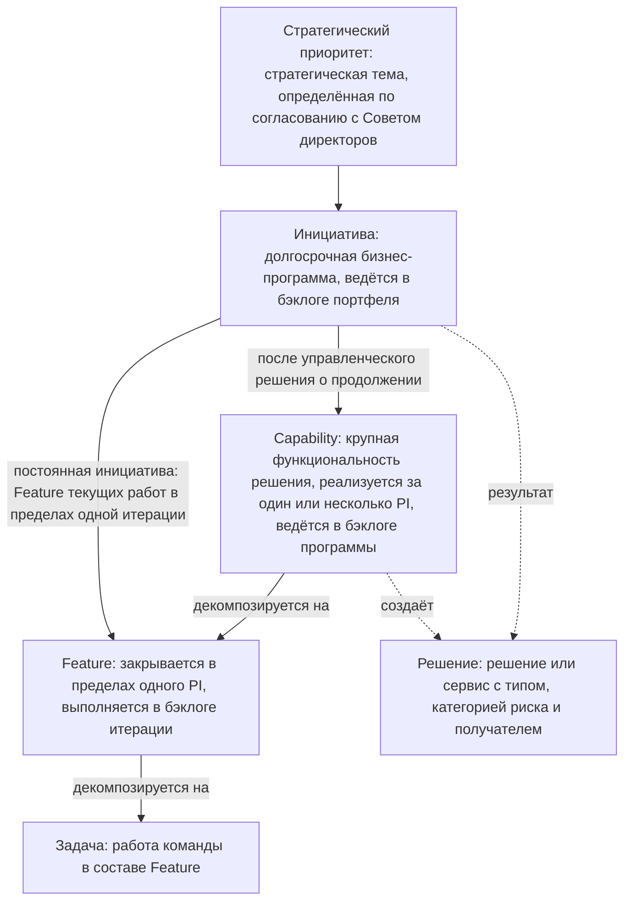
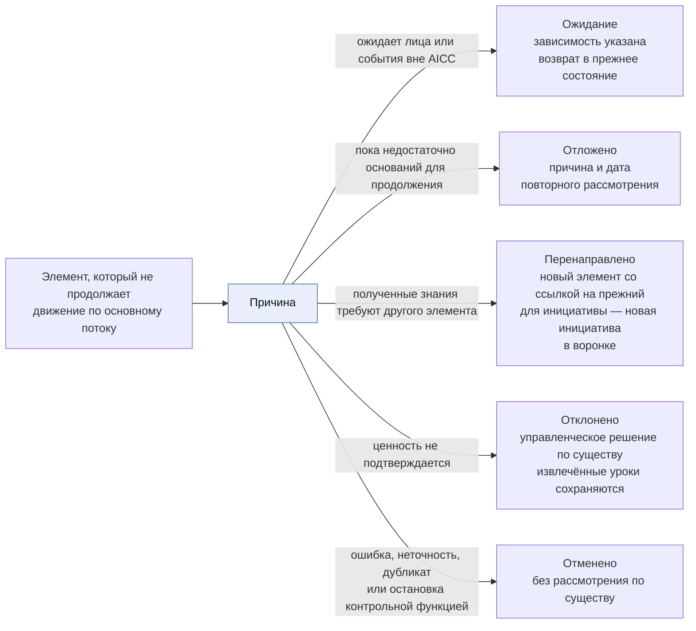
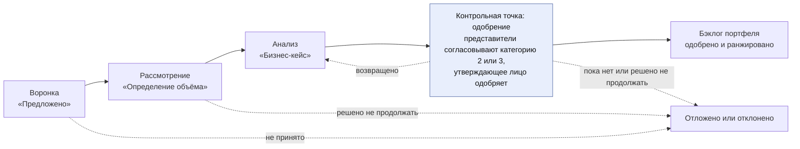
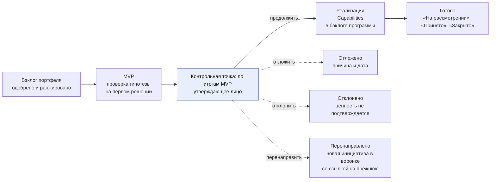
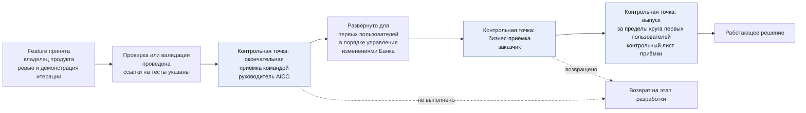
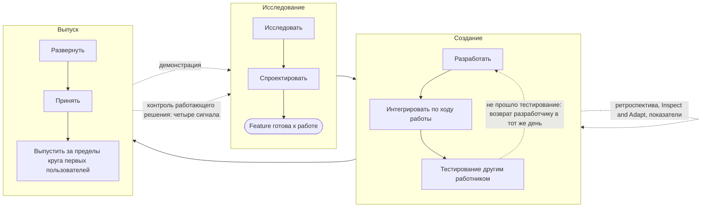
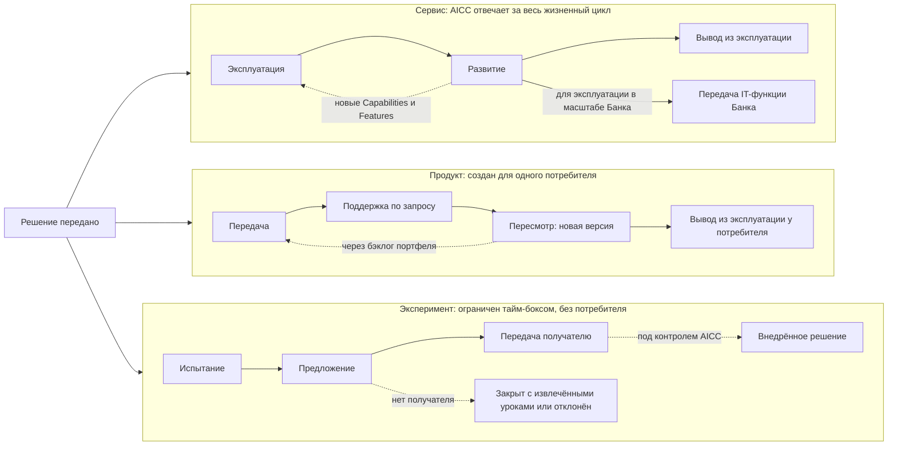
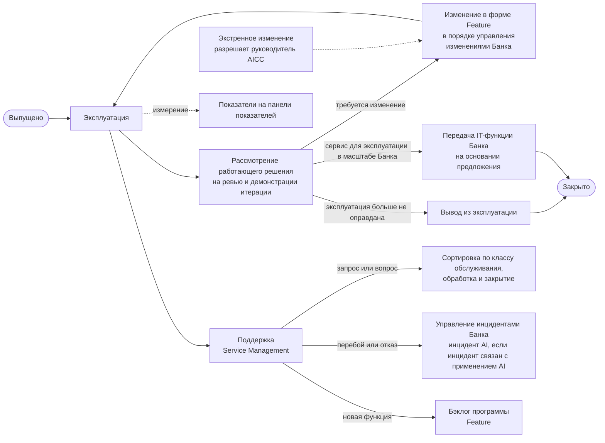
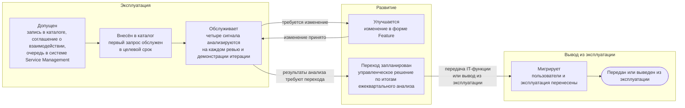

```yaml
source: charter/en/workflows/service-delivery.md
source_sha256: 05cd0e12b81c6f2b1c058d39c0abac5ef8e3cf9274fc61d3dc01dc83275714aa
translation_status: reviewed
```

# Workflow «Портфель и оказание услуг»

## 1. Назначение и область применения

Настоящий workflow описывает value stream AICC (сквозная последовательность действий, в ходе которой потребность превращается в ценный для клиента результат) — от бизнес-потребности до вывода решения из эксплуатации. Он начинается на канбане портфеля — от воронки до ранжированного бэклога и минимально жизнеспособного продукта (далее — MVP), продолжается декомпозицией на Capabilities и Features и выполнением работ в программных инкрементах и завершается развёртыванием и жизненным циклом решения. Портфельную часть потока регулирует Модель управления портфелем, выполнение работ и жизненный цикл — Модель жизненного цикла решений. Настоящий workflow показывает весь поток целиком.

AICC работает как лаборатория. Он определяет и испытывает решения совместно с подразделениями, чтобы Банк мог решить, внедрять ли их в масштабе Банка. Часть решений становится сервисами, которые эксплуатирует AICC. Часть — продуктами, созданными для одного потребителя. Часть — экспериментами, которые завершаются предложением; такое предложение может принять к внедрению другой владелец. Кроме того, AICC контролирует внедрение решений, которые создают другие участники.

Над настоящим workflow стоит workflow «Взаимодействие с заказчиком»: в нём фиксируется обязательство перед подразделением, а в настоящем workflow выполняется работа. Правила установлены Операционной моделью, Моделью управления портфелем, Моделью жизненного цикла решений, Политикой применения AI и документом «Терминология и стиль». Настоящий workflow показывает последовательность и назначение действий и собственных правил не устанавливает. Мероприятия проводятся в соответствии с workflow «Рабочий цикл».

## 2. Уровни

Работа ведётся на шести уровнях. У каждого уровня свой бэклог или свой борд, свои стадии и свой горизонт планирования.

Уровни и декомпозиция каждого уровня на следующий показаны на рисунке 1.



Рисунок 1 — Уровни работы

Решение не является звеном этой цепочки: оно — результат инициативы, а создают его Capabilities этой инициативы. В обеспечивающих работах может быть Capability, которая решения не создаёт. Текущие работы оформляются как Feature непосредственно в составе постоянной инициативы, без Capability. После одобрения паспорта постоянной инициативы руководитель AICC принимает Feature в работу на еженедельном обзоре; при этом фиксируются заказчик, одобрение использования данных, если применяется AI, критерии приёмки и зависимости. Feature включается в текущий бэклог итерации в пределах установленных лимитов, а её результат принимает владелец продукта (пп. 3.1, 5.2 и 7.3 Модели жизненного цикла решений).

Бэклоги и борды каждого уровня, горизонт планирования и условия завершения приведены в следующей таблице.

| Уровень | Бэклог или борд | Горизонт | Завершение |
| --- | --- | --- | --- |
| Стратегический приоритет | Список приоритетов | Годы; пересматривается ежегодно | Закрывается или отменяется куратором AICC |
| Инициатива | Бэклог портфеля и канбан портфеля | Долгосрочный | После рассмотрения и приёмки её результата |
| Решение | Портфель | Зависит от типа | По завершении жизненного цикла, предусмотренного его типом |
| Capability | Бэклог программы и канбан программы | Один или несколько PI | Когда закрыты все её Features |
| Feature | Бэклог программы, затем бэклог итерации | В пределах одного PI | В пределах своего PI либо разделяется |
| Задача | Борд команды | В пределах итерации | Вместе со своей Feature |

## 3. Состояния

Каждая инициатива, каждое решение, каждая Capability и Feature находятся в одном из тринадцати состояний, установленных документом «Терминология и стиль». У стратегического приоритета четыре состояния (п. 5.1 Модели жизненного цикла решений). Стадия — этап работы внутри состояния «Проработка» или «В работе».

Основной поток элемента показан на рисунке 2. «Ожидание» — состояние, которое отображается флагом на элементе: оно устанавливается, когда зависимость вне AICC блокирует работу в состоянии «Проработка», «Одобрено» или «В работе», а после устранения зависимости элемент возвращается в то состояние, из которого перешёл в ожидание. Только решение может перейти из состояния «В работе» в состояние «Закрыто» — при выводе из эксплуатации, передаче или завершении — и вернуться из состояния «В работе» в состояние «Проработка», если изменение повышает его категорию риска. Пока в команде не более трёх человек, состояние «Выполнено» пропускается, а «Принято» и «Закрыто» объединяются в один шаг (п. 6.6 Модели жизненного цикла решений).


Рисунок 2 — Основной поток элемента

Элемент может выйти из основного потока на любой контрольной точке; пути выхода показаны на рисунке 3. Переходы между состояниями установлены пунктом 5.1 Модели жизненного цикла решений; другого источника переходов нет.



Рисунок 3 — Пути выхода из основного потока

Если контрольная функция останавливает решение в порядке, описанном в workflow [«Риски и контроль AI»](ai-risk-control.md), решение переводится в состояние «Отменено».

## 4. Поток портфеля: от потребности через инициативу к Capabilities

Поток портфеля проводит потребность по канбану портфеля, описанному в разделе 5 Модели управления портфелем, — от воронки до Capabilities в бэклоге программы. Каждая контрольная точка завершается управленческим решением: одобрить, вернуть, отложить или отклонить. На канбане портфеля ведутся инициативы. Канбан с контрольными точками и выходами показан на рисунках 4 и 5. Категория риска, согласование представителями контрольных функций и остановка описаны в workflow [«Риски и контроль AI»](ai-risk-control.md).



Рисунок 4 — Канбан портфеля от воронки до бэклога портфеля



Рисунок 5 — Канбан портфеля от бэклога портфеля до колонки «Готово»

Шаги потока портфеля приведены в следующей таблице.

| Шаг | Состояние и стадия | Назначение | Участники | Результат |
| --- | --- | --- | --- | --- |
| Воронка | Инициатива, «Предложено» | Зафиксировать каждую идею или потребность, поступившую от подразделения, выявленную в ходе исследовательской работы или предложенную AICC | Предлагает подразделение, исследовательская работа или AICC; руководитель AICC принимает в проработку, откладывает или отклоняет | Запись в бэклоге портфеля |
| Рассмотрение | Инициатива, «Проработка»: «Определение объёма» | Совместно с подразделением разобраться в потребности и требованиях; сверить соответствие стратегическим приоритетам, лимиту инициатив в работе и каталогу решений | Руководитель AICC совместно с владельцем направления | Объём работ в паспорте инициативы |
| Анализ | Инициатива, «Проработка»: «Бизнес-кейс» | Сформулировать гипотезу, результаты с опережающими индикаторами, MVP, затраты и ценность, риски; если ожидается категория риска 2 или 3, получить согласование представителей контрольных функций. Если присвоенная категория риска выше согласованной, бизнес-кейс возвращается представителям контрольных функций (п. 6.4 Модели управления портфелем) | Владелец направления совместно с руководителем AICC; куратор AICC — при превышении инвестиционного ограничения, если инициатива затрагивает несколько направлений, и для обеспечивающих работ; представители контрольных функций согласовывают | Паспорт инициативы и протокол решения; инициатива одобрена |
| Бэклог портфеля | Инициатива, «Одобрено» | Ранжировать одобренные инициативы и принять в работу инициативу с наивысшим рангом из тех, для которых есть место | Руководитель AICC | Ранг в бэклоге портфеля |
| MVP | Инициатива, «В работе»: «MVP» | Определить архитектуру и описание первого решения и проверить на нём гипотезу по опережающим индикаторам | Инженер решений совместно с экспертом направления; владелец направления одобряет описание решения, руководитель AICC присваивает категорию риска; если решение создал руководитель AICC, описание одобряет и категорию риска присваивает куратор AICC (п. 4.4(d) Операционной модели) | Описание решения в портфеле и запись в реестре AI-решений; результат проверки гипотезы |
| Управленческое решение по итогам MVP | Инициатива, «В работе» | Продолжить, перенаправить, отложить или отклонить | Лицо, одобрившее бизнес-кейс | Запись в журнале решений и протокол решения |
| Реализация | Инициатива, «В работе»: «Реализация» | Определить Capabilities и декомпозировать их на Features, указав для каждой критерии приёмки и зависимости | Руководитель AICC совместно с владельцем направления | Capabilities и Features в бэклоге программы в составе инициативы; борд программы |
| Готово | Инициатива, «На рассмотрении», «Принято», «Закрыто» | Рассмотреть результат в сопоставлении с опережающими индикаторами и принять его | Владелец направления, а для обеспечивающих работ — куратор AICC, после окончательной приёмки командой | Приёмка с указанием лица и даты |

## 5. Выполнение работ в программном инкременте

Одобренные Features создаются в циклах, из которых складывается рабочий цикл. Программный инкремент задаёт намерения и направление работы, а состав работ итерации определяется в ходе самой итерации.

Шаги выполнения работ приведены в следующей таблице.

| Шаг | Мероприятие рабочего цикла | Назначение | Участники | Результат |
| --- | --- | --- | --- | --- |
| Определить намерения | PI-планирование | Выбрать Capabilities и Features, на которые нацелен PI, и определить их зависимости | Команды и владельцы направлений | Цели PI; борд программы; проект дорожной карты, который подтверждается на ежеквартальном управляющем совещании |
| Отобрать Features | Планирование итерации | Отобрать Features на месяц в бэклог итерации | Команда совместно с владельцем продукта | Бэклог итерации |
| Принять текущие работы | Еженедельный обзор | Принять Feature, относящуюся непосредственно к одобренной постоянной инициативе, в текущий бэклог итерации в пределах WIP-лимитов (пп. 3.1 и 5.2 Модели жизненного цикла решений) | Руководитель AICC | Feature, управленческое решение о её приёме, заказчик, критерии приёмки и зависимости |
| Разработать | Еженедельные циклы | Создать минимальное решение совместно с подразделением | Инженер решений совместно с экспертом направления | Работающие инкременты |
| Верифицировать | Перед каждым развёртыванием | Интегрировать работу по мере её выполнения; каждую Feature и MVP тестирует вне промышленной среды лицо, не участвовавшее в их разработке, а ссылка на результат тестирования указывается в Feature; работа, не прошедшая тестирование, возвращается разработчику в тот же день (п. 7.1 Модели жизненного цикла решений). До первого развёртывания для реальных пользователей или на реальных данных проводится проверка (для категории риска 1) либо валидация представителями контрольных функций (для категорий риска 2 и 3), включающая тестирование защищённости от атак на AI (п. 7.2 Модели жизненного цикла решений) | Лицо, не участвовавшее в разработке; проверяющий; представители контрольных функций | Результат тестирования в Feature; проверка или заключение контрольной функции |
| Развернуть | Еженедельные циклы | Feature развёртывается в среде использования после тестирования и проверки. Развёртывание решения для первых пользователей и развёртывание каждого существенного изменения выполняются после окончательной приёмки командой. Развёртывание в промышленной среде выполняется в порядке управления изменениями Банка: регистрируется change request, номер заявки на изменение и результат тестирования вносятся в Feature, а доступ предоставляется в порядке, установленном Банком (п. 8.3 Модели жизненного цикла решений). Первые пользователи проходят обучение до начала использования (п. 7.1 Модели жизненного цикла решений, п. 2.1 Политики применения AI) | Инженер решений; одобрение — в порядке управления изменениями Банка; для платформы — владелец платформы | Развёрнутая Feature с номером заявки на изменение и результатом тестирования |
| Продемонстрировать и принять | Ревью и демонстрация итерации | Показать работающий результат и провести приёмку каждой Feature и каждой Capability (п. 7.3(a) Модели жизненного цикла решений) | Владелец продукта (руководитель AICC, пока в команде не более трёх человек) | Приёмка с указанием лица и даты |
| Провести окончательную приёмку командой | До первого развёртывания решения для первых пользователей и до развёртывания существенного изменения | Убедиться, что решение соответствует критериям приёмки из описания решения, ссылки на тесты указаны, а проверка или валидация проведена (п. 7.3(b) Модели жизненного цикла решений) | Руководитель AICC | Отметка об окончательной приёмке командой в разделе о выпуске описания решения с указанием лица и даты |
| Оценить решение и провести его приёмку | Когда решение работает у первых пользователей | Оценить решение по критериям приёмки и принять его, вернуть на доработку или отклонить (п. 7.3(c) Модели жизненного цикла решений) | Владелец направления; куратор AICC — для элемента, затрагивающего несколько направлений, для обеспечивающих работ, для эксперимента без направления, а также если владельцем направления является руководитель AICC | Бизнес-приёмка в разделе о выпуске описания решения; для взаимодействия с заказчиком — отчёт о результатах |
| Выпустить | До использования за пределами круга первых пользователей | Принять управленческое решение о допуске решения к использованию за пределами круга первых пользователей; если AICC передаёт решение направлению, подписывается контрольный лист приёмки (пп. 7.1 и 7.4 Модели жизненного цикла решений) | Владелец направления (куратор AICC, если владельцем направления является руководитель AICC); для категории риска 3 — куратор AICC | Раздел о выпуске описания решения и контрольный лист приёмки |
| Контролировать поток | Еженедельный обзор | Держать под контролем борды, WIP-лимиты и зависимости | Руководитель AICC | Панель показателей |

Руководитель AICC не проводит проверку или валидацию, не выпускает и не проводит бизнес-приёмку решения, которое создал сам (п. 4.4(d) Операционной модели). Разработчик не тестирует, не проверяет и не валидирует свою работу; заказчик, принимающий результат, не является работником AICC; лицо, выпускающее решение, отвечает за его результаты (п. 7.5 Модели жизненного цикла решений).

Если результатом Feature является документ, обучение или иной результат, не требующий развёртывания, в Feature фиксируются переданный результат и подтверждающие материалы его соответствия критериям приёмки. Владелец продукта принимает такую Feature в соответствии с пп. 4.5 и 7.3(a) Модели жизненного цикла решений. Контрольные точки, установленные для решений и для развёртывания в промышленной среде, применяются, если работа включает решение или развёртывание в промышленной среде.

Порядок приёмки, проверки и выпуска Feature и решения показан на рисунке 6.



Рисунок 6 — Приёмка, проверка, развёртывание и выпуск

Работа выполняется в трёх циклах — исследование, создание и выпуск, а фактические данные возвращаются по четырём циклам обратной связи: демонстрация, ретроспектива вместе с Inspect and Adapt, контроль работающего решения и показатели (п. 6.9 Модели жизненного цикла решений). Циклы показаны на рисунке 7.



Рисунок 7 — Три цикла работы и циклы обратной связи

## 6. Пост-внедрение: три типа решения

Тип решения, указанный в его описании, определяет жизненный цикл решения на этапе пост-внедрения и то, кто за него отвечает. Получатель указывается в описании решения до одобрения решения.

Три варианта жизненного цикла показаны на рисунке 8.



Рисунок 8 — Жизненный цикл решения в зависимости от типа

Ответственный, жизненный цикл и завершение для решения каждого типа приведены в следующей таблице.

| Тип | Ответственный на этапе пост-внедрения | Жизненный цикл | Завершение |
| --- | --- | --- | --- |
| Сервис | AICC; бизнес-кейс устанавливает эксплуатационные затраты и правило вывода из эксплуатации | Эксплуатация, развитие, вывод из эксплуатации через шаги обслуживания (п. 8.8 Модели жизненного цикла решений) | Выведен из эксплуатации, передан IT-функции Банка или отменён |
| Продукт | За версию отвечает потребитель; AICC оказывает поддержку по запросу | Передача, поддержка, пересмотр, вывод из эксплуатации у потребителя; если у продукта или пакета появляется второй потребитель, это служит основанием для создания сервиса (п. 8.12 Модели жизненного цикла решений) | Выведен из эксплуатации у потребителя |
| Эксперимент | Пока не определён; эксперимент принимает куратор AICC, если у эксперимента нет направления, в остальных случаях — владелец направления (п. 8.1 Модели жизненного цикла решений) | Испытание, предложение; передача, когда получатель принимает решение | Передан; закрыт с извлечёнными уроками без получателя; оформлено предложение; отклонён |

### Эксперимент в лабораторной среде

Эксперимент проводится в лабораторной среде по правилам п. 8.13 Модели жизненного цикла решений; работа над ним проходит шесть шагов. Это шаги работы внутри стадий, а не состояния. Шаги приведены в следующей таблице.

| Шаг | Стадия | Назначение | Участники | Результат |
| --- | --- | --- | --- | --- |
| Описать | «Определение» (проработка) | Указать в описании решения гипотезу, опережающие индикаторы, базовые значения для сравнения и тайм-бокс | Инженер решений совместно с экспертом направления; одобряет владелец направления, а если направления нет — куратор AICC | Описание решения и запись в реестре AI-решений |
| Подготовить среду | «Испытание» | Развернуть лабораторную среду с ролевым доступом и регистрацией событий; облачную или внешнюю среду проверить как поставщика | Инженер решений; поставщика проверяют представители контрольных функций | Сведения о среде в описании решения; заключение контрольной функции по итогам проверки поставщика |
| Подготовить данные | «Испытание» | Получить выгрузки только для чтения в соответствии с классификацией Банка, указав владельца каждой выгрузки; свести к минимуму персональные данные и оценить их совместно с представителем контрольной функции по защите данных | Инженер решений совместно с владельцем каждого источника | Выгрузки данных в описании решения |
| Создать | «Испытание» | Создать решение с защитными механизмами, обеспечивающими опору на источники и контроль дрейфа и предвзятости, и оценочный набор | Инженер решений | Работающий опытный образец; оценочный набор |
| Оценить | «Испытание» | Сравнить результат с базовыми значениями текущего способа работы и его затратами, убедиться в корректности данных и провести проверку или валидацию, если она требуется (п. 7.1 Модели жизненного цикла решений) | Инженер решений; проверяющий или представители контрольных функций | Результаты в сопоставлении с опережающими индикаторами и базовыми значениями |
| Принять управленческое решение | «Предложение» | По истечении тайм-бокса рассмотреть эксперимент: принять его с извлечёнными уроками и закрыть, подготовить предложение или отклонить (п. 8.1 Модели жизненного цикла решений) | Владелец направления, а если направления нет — куратор AICC | Управленческое решение; предложение, если оно подготовлено; для взаимодействия с заказчиком — отчёт о результатах |

### Жизненный цикл работающего решения

Эксплуатация и поддержка охватывают обработку запросов пользователей и инцидентов. AICC повторно оценивает категорию риска при изменении решения, а также ежегодно — для категории риска 2 и раз в шесть месяцев — для категории риска 3 (п. 3.3 Политики применения AI). Пункты, которые регулируют жизненный цикл работающего решения, указаны в следующей таблице, а последовательность шагов показана на рисунке 9.

| Шаг | Назначение | Участники | Результат | Источник правила |
| --- | --- | --- | --- | --- |
| Эксплуатация и поддержка | Эксплуатировать решение, сортировать запросы по классу обслуживания и отвечать на них, обрабатывать инциденты, передавать повторные инциденты в управление проблемами и рассматривать четыре сигнала работающего решения на каждом ревью и демонстрации итерации | IT-функция, которая эксплуатирует решение, а для сервиса, который эксплуатирует AICC, — инженер решений; инженер решений сортирует запросы, а в спорных случаях класс определяет руководитель AICC; сигналы рассматривает владелец направления, а для сервиса, затрагивающего несколько направлений, — куратор AICC | Заявка в системе Service Management; отметка о рассмотрении в описании решения | Пп. 8.4, 8.5 и 8.10 Модели жизненного цикла решений |
| Переход сервиса | По результатам анализа четырёх сигналов на ежеквартальном управляющем совещании решить, передаётся ли сервис IT-функции Банка или выводится из эксплуатации | Владелец направления, а для сервиса, затрагивающего несколько направлений, — куратор AICC; получатель принимает передачу | Запись в журнале решений; предложение; описание решения | П. 8.11 Модели жизненного цикла решений |
| Изменение | Обрабатывать изменение выпущенного решения как Feature и решать, требуется ли при существенном изменении новая проверка или валидация. Экстренное изменение вносится по экстренной процедуре управления изменениями Банка: его разрешает руководитель AICC, а куратор AICC рассматривает его не позднее пяти рабочих дней с даты изменения | Инженер решений; одобрение — в порядке управления изменениями Банка; руководитель AICC решает вопрос о новой проверке и разрешает экстренное изменение | Feature с номером заявки на изменение; запись в журнале решений | П. 8.6 Модели жизненного цикла решений |
| Вывод из эксплуатации | До закрытия решения отозвать права доступа, обработать данные и сделать отметку в записи реестра AI-решений | Инженер решений; одобряет владелец направления или куратор AICC | Одобрение и даты в описании решения | П. 8.7 Модели жизненного цикла решений |
| Показатели | Анализировать поток, качество и состояние эксплуатации для контроля и улучшения, а не для оценки сотрудников | Руководитель AICC совместно с командой | Панель показателей | Раздел 10 Модели жизненного цикла решений |



Рисунок 9 — Жизненный цикл работающего решения

Сервис проходит шаги обслуживания, установленные п. 8.8 Модели жизненного цикла решений. Они детализируют эксплуатацию, развитие и вывод из эксплуатации, показанные на рисунке 8, и не выходят за пределы состояния «В работе». Шаги обслуживания показаны на рисунке 10.



Рисунок 10 — Шаги обслуживания сервиса

## 7. Контроль внедрённых решений

AICC контролирует внедрённые решения, которые создают другие участники: ведёт их в портфеле с указанием состояния и отчитывается о том, что внедрено и что работает. Стратегия внедрения AI складывается из предложений, которые AICC формирует на основе полученного опыта; по ним решает Банк. Руководитель AICC рассматривает внедрённые решения на каждом ежеквартальном управляющем совещании, и результаты рассмотрения отражаются в квартальном отчёте (п. 8.2 Модели жизненного цикла решений). По предложению о решении решают владельцы и куратор AICC. Руководитель AICC готовит ежегодное предложение по стратегии внедрения AI, куратор AICC представляет его на ежегодном управляющем совещании, а решает по нему Банк (п. 6.5 Операционной модели). В этом состоит часть миссии AICC как лаборатории.

## 8. Управленческие решения в потоке

Управленческие решения, принимаемые в потоке, перечислены в разделе 4 [Руководства по оказанию услуг](../guides/service-delivery-guide.md), а порядок прохождения управленческого решения показан в workflow «Контроль работы подразделения».

## 9. Системы, в которых ведётся процесс

После перехода рабочего состояния в Jira и Confluence (п. 7.1 Операционной модели) поток ведётся в этих системах; до перехода рабочее состояние ведётся в папке AICC. Настоящая схема содержится в корпусе, а подтверждающие документы хранятся в папке и портфеле. Структура Jira остаётся простой: несколько статусов и один флаг, а точное бизнес-состояние указывается в отдельном поле.

Соответствие бизнес-состояний статусам Jira приведено в следующей таблице.

| Бизнес-состояние | Статус Jira |
| --- | --- |
| «Предложено», «Проработка» | Backlog |
| «Одобрено» | Ready |
| «В работе», «Выполнено»; стадия указывается в отдельном поле | Active |
| «На рассмотрении» | Review |
| «Принято», «Закрыто» | Done; лицо и дата приёмки указываются в отдельном поле |
| «Отложено», «Перенаправлено», «Отклонено», «Отменено» | Вне потока борда; отображается полем состояния или резолюцией |
| «Ожидание» | Флаг на задаче в статусе того состояния, из которого элемент перешёл в ожидание |
