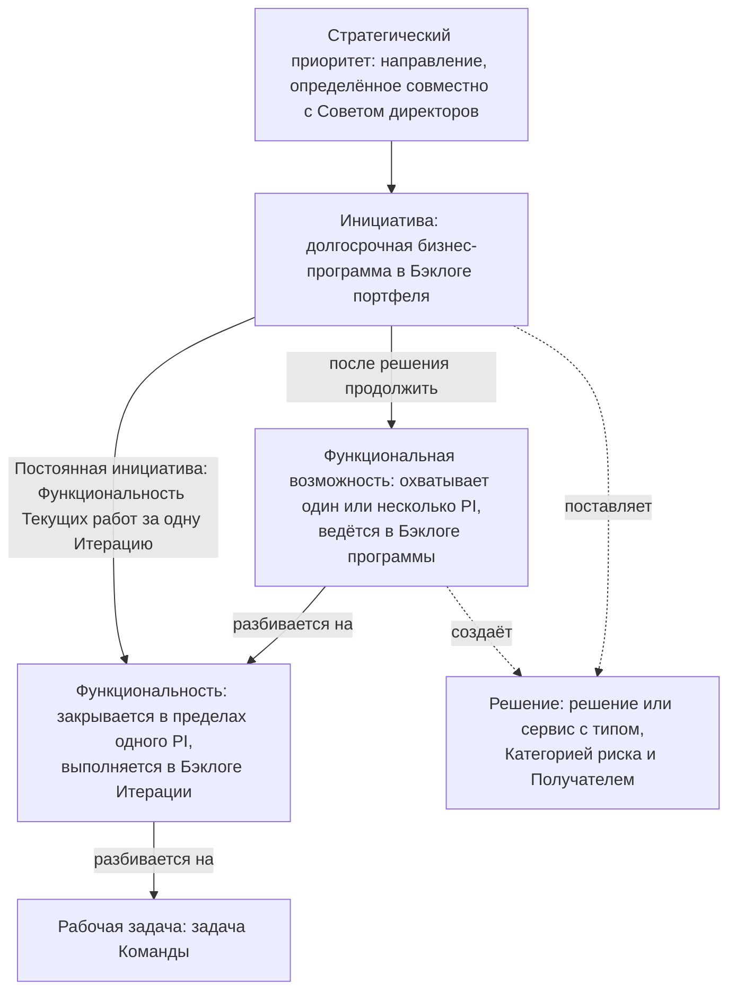
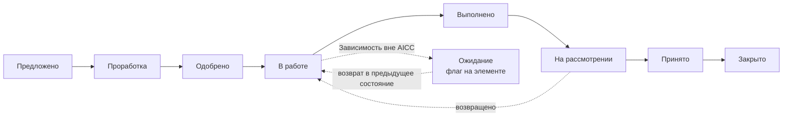
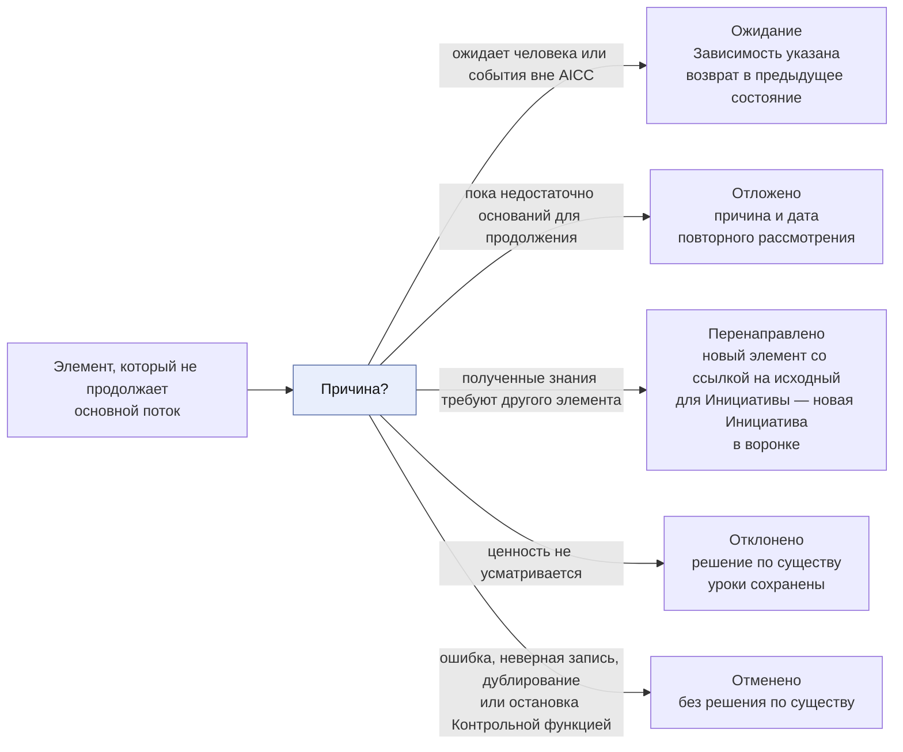
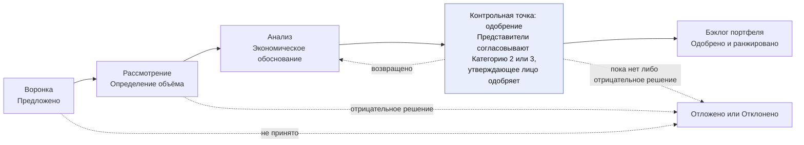
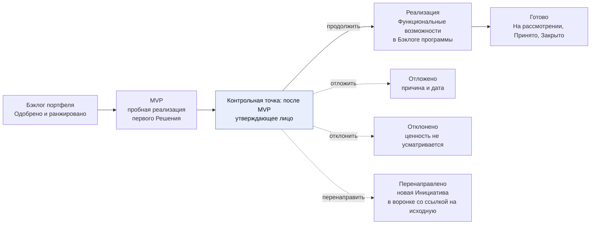
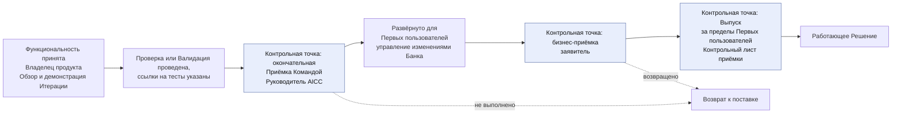
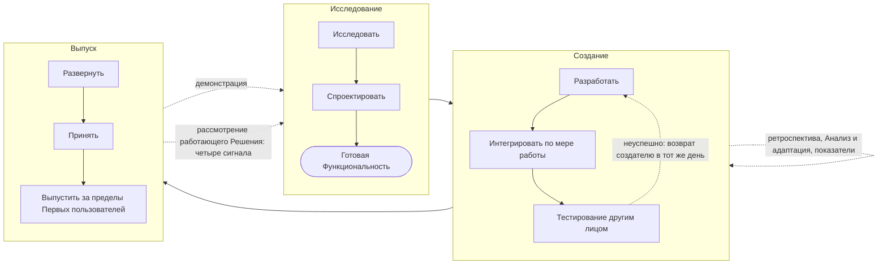
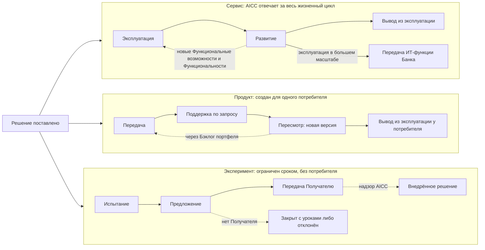
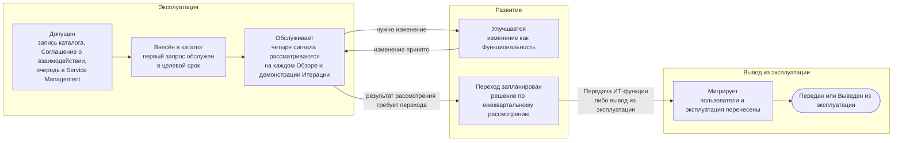

```yaml
source: charter/en/workflows/service-delivery.md
source_sha256: 7bf2cc0940fa4681cb3390b34142a273a1649ad120639769ee0d8794d1fb1a49
translation_status: reviewed
```

# Рабочий процесс: Портфель и поставка услуг

## 1. Назначение и область применения

Рабочий процесс представляет поток создания ценности AICC от бизнес-потребности до вывода Решения из эксплуатации. Он охватывает Канбан-доску портфеля — от воронки до ранжированного бэклога и Минимально жизнеспособного продукта, — декомпозицию на Функциональные возможности и Функциональности, выполнение в Программных инкрементах, развёртывание и жизненный цикл Решения. Портфельная часть определяется Моделью управления портфелем, выполнение и жизненный цикл — Моделью жизненного цикла решений. Здесь весь поток представлен в одном месте.

AICC — лаборатория. Он описывает и испытывает решения совместно с функциями, чтобы Банк мог принять решение о внедрении в большем масштабе. Часть решений становится Сервисами, эксплуатируемыми AICC. Часть — Продуктами для одного потребителя. Часть — Экспериментами, завершающимися Предложением, которое может принять другой владелец. AICC также осуществляет надзор за внедрением решений, поставляемых другими.

Рабочий процесс «Взаимодействие с заказчиком» располагается над этим процессом: он устанавливает обязательства перед функцией, а этот процесс обеспечивает выполнение работы. Правила содержатся в Операционной модели, Модели управления портфелем, Модели жизненного цикла решений, Политике применения искусственного интеллекта и Терминологии и стиле. Этот рабочий процесс показывает порядок и назначение действий и не устанавливает собственных правил. Используются события Ритма работы.

## 2. Уровни

Работа имеет шесть уровней. У каждого — собственный бэклог или доска, свои Стадии и горизонт.

Рисунок 1 показывает уровни и декомпозицию каждого на следующий.



Рисунок 1: уровни работы.

Решение не является звеном цепочки: Инициатива поставляет его, а её Функциональные возможности создают его. Обеспечивающие работы могут иметь Функциональную возможность, не создающую Решения. Текущие работы — Функциональность непосредственно под Постоянной инициативой, без Функциональной возможности. После одобрения Паспорта постоянной инициативы Руководитель AICC принимает Функциональность на Еженедельном обзоре; фиксируются её заказчик, одобрение применения данных при использовании ИИ, Критерии приёмки и Зависимости. Функциональность включается в текущий Бэклог Итерации в пределах его лимитов, а Владелец продукта принимает результат (Модель жизненного цикла решений 3.1, 5.2 и 7.3).

| Уровень | Бэклог или доска | Горизонт | Закрытие |
| --- | --- | --- | --- |
| Стратегический приоритет | Запись о приоритетах | Годы, ежегодный пересмотр | Закрывается или отменяется Куратором AICC |
| Инициатива | Бэклог портфеля и Канбан-доска портфеля | Долгосрочный | После рассмотрения и Приёмки результата |
| Решение | Портфель | В зависимости от типа | При завершении жизненного цикла соответствующего типа |
| Функциональная возможность | Бэклог программы и Канбан-доска программы | Один или несколько PI | Когда закрыты её Функциональности |
| Функциональность | Бэклог программы, затем Бэклог Итерации | В пределах одного PI | В своём PI либо разделяется |
| Рабочая задача | Доска Команды | В пределах Итерации | Вместе со своей Функциональностью |

## 3. Состояния

Каждая Инициатива, Решение, Функциональная возможность и Функциональность находится в одном из тринадцати состояний, определённых в Терминологии и стиле. У Стратегического приоритета четыре состояния (Модель жизненного цикла решений 5.1). Стадия — фаза работы внутри состояния «Проработка» или «В работе».

Рисунок 2 показывает основной поток элемента. «Ожидание» — состояние, отображаемое флагом: оно устанавливается, когда Зависимость вне AICC блокирует работу в состояниях «Проработка», «Одобрено» или «В работе»; после устранения Зависимости элемент возвращается в предыдущее состояние. Только Решение может перейти из «В работе» непосредственно в «Закрыто» при выводе из эксплуатации, Передаче или завершении, а также из «В работе» обратно в «Проработку», если изменение повышает Категорию риска. Пока в Команде не более трёх человек, состояние «Выполнено» пропускается, а «Принято» и «Закрыто» объединяются в один шаг (Модель жизненного цикла решений 6.6).



Рисунок 2: основной поток элемента.

Элемент может выйти из основного потока на любой контрольной точке. Рисунок 3 показывает пути выхода. Переходы установлены Моделью жизненного цикла решений 5.1, являющейся их единственным источником.



Рисунок 3: пути выхода из основного потока.

Контрольная функция останавливает Решение по рабочему процессу [«Риски и контроль ИИ»](ai-risk-control.md); Решение получает состояние «Отменено».

## 4. Поток портфеля: от потребности через Инициативу к Функциональным возможностям

Поток проводит потребность по Канбан-доске портфеля Модели управления портфелем 5 — от воронки до Функциональных возможностей в Бэклоге программы. Каждая контрольная точка завершается решением одобрить, вернуть, отложить или отклонить. Канбан-доска портфеля содержит Инициативы. Рисунки 4 и 5 показывают доску с контрольными точками и выходами. Категория риска, согласование Представителей контрольных функций и остановка описаны в рабочем процессе [«Риски и контроль ИИ»](ai-risk-control.md).



Рисунок 4: Канбан-доска портфеля от воронки до Бэклога портфеля.



Рисунок 5: Канбан-доска портфеля от Бэклога портфеля до шага «Готово».

| Шаг | Состояние и Стадия | Назначение | Кто | Результат |
| --- | --- | --- | --- | --- |
| Воронка | Инициатива, «Предложено» | Зафиксировать каждую идею или потребность функции, исследовательской работы либо AICC | Предлагает функция, исследовательская работа или AICC; Руководитель AICC принимает к рассмотрению, откладывает или отклоняет | Запись в Бэклоге портфеля |
| Рассмотрение | Инициатива, «Проработка»: Определение объёма | Понять потребность и требования совместно с функцией; проверить соответствие Стратегическим приоритетам, лимит Инициатив в работе и каталог Решений | Руководитель AICC совместно с Владельцем Домена | Объём в Паспорте инициативы |
| Анализ | Инициатива, «Проработка»: Экономическое обоснование | Определить гипотезу, результаты с Опережающими индикаторами, MVP, затраты, ценность и риски; получить согласование Представителей контрольных функций, если ожидается Категория риска 2 или 3. Присвоение Категории риска выше согласованной возвращает экономическое обоснование Представителям контрольных функций (Модель управления портфелем 6.4) | Владелец Домена совместно с Руководителем AICC; Куратор AICC — при превышении Инвестиционного ограничения, охвате нескольких Доменов или для Обеспечивающих работ; Представители контрольных функций согласовывают | Паспорт инициативы и Запись о решении; Инициатива одобрена |
| Бэклог портфеля | Инициатива, «Одобрено» | Ранжировать одобренные Инициативы и принять в работу наиболее высокую по рангу из подходящих | Руководитель AICC | Ранг в Бэклоге портфеля |
| MVP | Инициатива, «В работе»: MVP | Определить архитектуру и Описание первого Решения и испытать его как пробную реализацию для проверки Опережающих индикаторов | Инженер решений совместно с Экспертом Домена; Владелец Домена одобряет Описание решения, Руководитель AICC присваивает Категорию риска; если Решение создал Руководитель AICC, Куратор AICC одобряет Описание и присваивает Категорию (Операционная модель 4.4(d)) | Описание решения в Портфеле, запись в Реестре ИИ, результат пробной реализации |
| Решение после MVP | Инициатива, «В работе» | Продолжить, перенаправить, отложить или отклонить | Лицо, одобрившее экономическое обоснование | Запись в Журнале решений и Запись о решении |
| Реализация | Инициатива, «В работе»: Реализация | Определить Функциональные возможности и разбить на Функциональности с Критериями приёмки и Зависимостями для каждой | Руководитель AICC совместно с Владельцем Домена | Функциональные возможности и Функциональности в Бэклоге программы под Инициативой; Доска программы |
| Готово | Инициатива, «На рассмотрении», «Принято», «Закрыто» | Рассмотреть результат относительно Опережающих индикаторов и принять его | Владелец Домена, а для Обеспечивающих работ — Куратор AICC, после окончательной Приёмки Командой | Приёмка с указанием лица и даты |

## 5. Выполнение в Программном инкременте

Выполнение охватывает создание одобренных Функциональностей в циклах Ритма работы. Программный инкремент определяет замысел и направление; состав работы Итерации определяется в самой Итерации.

| Шаг | Событие Ритма работы | Назначение | Кто | Результат |
| --- | --- | --- | --- | --- |
| Определить замысел | Планирование PI | Выбрать Функциональные возможности и Функциональности, на которые нацелен PI, с их Зависимостями | Команды и Владельцы Доменов | Цели PI; Доска программы; проект Дорожной карты, подтверждаемый на Ежеквартальном управляющем совещании |
| Выбрать Функциональности | Планирование Итерации | Выбрать Функциональности месяца в Бэклог Итерации | Команда с Владельцем продукта | Бэклог Итерации |
| Принять Текущие работы | Еженедельный обзор | Принять Функциональность непосредственно под одобренной Постоянной инициативой в текущий Бэклог Итерации в пределах его Лимитов незавершённой работы (Модель жизненного цикла решений 3.1, 5.2) | Руководитель AICC | Функциональность, решение о её приёме, заказчик, Критерии приёмки и Зависимости |
| Разработать | Недельные циклы | Создать минимальное решение совместно с функцией | Инженер решений совместно с Экспертом Домена | Работающие приращения |
| Проверить | Перед каждым развёртыванием | Интегрировать работу по мере выполнения; тестировать каждую Функциональность и MVP вне промышленной среды силами лица, не являющегося создателем, со ссылкой на результат в Функциональности; неуспешный тест возвращается создателю в тот же день (Модель жизненного цикла решений 7.1). До первого развёртывания для реальных пользователей или данных проводится Проверка для Категории риска 1 либо Валидация Представителями контрольных функций для Категорий риска 2 и 3 с тестированием безопасности против атак на ИИ (Модель жизненного цикла решений 7.2) | Лицо, не являющееся создателем; Проверяющий; Представители контрольных функций | Результат теста в Функциональности; Проверка либо Заключение контрольной функции |
| Развернуть | Недельные циклы | Функциональность развёртывается в Среде использования после тестирования и Проверки. Развёртывание Решения для Первых пользователей и каждого существенного изменения следует за окончательной Приёмкой Командой. Развёртывание в промышленной среде проходит управление изменениями Банка: заявить изменение, внести заявку на изменение и результат теста в Функциональность, использовать процесс доступа Банка (Модель жизненного цикла решений 8.3). Первые пользователи проходят обучение до применения (Модель жизненного цикла решений 7.1, Политика применения искусственного интеллекта 2.1) | Инженер решений; одобрение в рамках управления изменениями Банка; Владелец платформы — для платформы | Развёрнутая Функциональность с заявкой на изменение и результатом теста |
| Продемонстрировать и принять | Обзор и демонстрация Итерации | Показать работающий результат и провести Приёмку каждой Функциональности и Функциональной возможности (Модель жизненного цикла решений 7.3(a)) | Владелец продукта (Руководитель AICC, пока в Команде не более трёх человек) | Приёмка с указанием лица и даты |
| Провести окончательную Приёмку Командой | До первого развёртывания Решения для Первых пользователей и до развёртывания существенного изменения | Подтвердить соответствие Решения Критериям приёмки Описания решения, наличие ссылок на тесты и проведённой Проверки или Валидации (Модель жизненного цикла решений 7.3(b)) | Руководитель AICC | Окончательная Приёмка Командой в Разделе о Выпуске Описания решения с указанием лица и даты |
| Оценить и принять Решение | Когда Решение работает для Первых пользователей | Оценить Решение по Критериям приёмки и принять, вернуть или отклонить (Модель жизненного цикла решений 7.3(c)) | Владелец Домена; Куратор AICC — для элемента нескольких Доменов, Обеспечивающих работ, Эксперимента без Домена, а также если Руководитель AICC является Владельцем Домена | Бизнес-приёмка в Разделе о Выпуске Описания решения; для Взаимодействия с заказчиком — Отчёт о результатах |
| Выпустить | До применения за пределами Первых пользователей | Разрешить выход Решения за пределы Первых пользователей; при Передаче Решения Домену со стороны AICC подписывается Контрольный лист приёмки (Модель жизненного цикла решений 7.1, 7.4) | Владелец Домена (Куратор AICC, если Руководитель AICC является Владельцем Домена); Куратор AICC — для Категории риска 3 | Раздел о Выпуске Описания решения и Контрольный лист приёмки |
| Контролировать поток | Еженедельный обзор | Поддерживать контроль досок, Лимитов и Зависимостей | Руководитель AICC | Панель показателей |

Руководитель AICC не проводит Проверку, Валидацию, Выпуск или бизнес-приёмку Решения, которое он создал (Операционная модель 4.4(d)). Создатель не проводит тестирование, Проверку или Валидацию; принимающий заявитель не является сотрудником AICC; разрешающее Выпуск лицо отвечает за результаты (Модель жизненного цикла решений 7.5).

Функциональность, результатом которой является документ, обучение или иной результат без развёртывания, фиксирует поставленный результат и подтверждения соответствия Критериям приёмки. Владелец продукта принимает её по Модели жизненного цикла решений 4.5 и 7.3(a). Контрольные точки Решения и развёртывания в промышленной среде применяются, когда работа включает Решение или такое развёртывание.

Рисунок 6 показывает порядок Приёмки, Проверки и Выпуска Функциональности и Решения.



Рисунок 6: Приёмка, Проверка, развёртывание и Выпуск.

Работа выполняется в трёх циклах — исследование, создание и Выпуск; подтверждающие материалы возвращаются по четырём циклам обратной связи: демонстрация, ретроспектива с Анализом и адаптацией, рассмотрение работающего Решения и показатели (Модель жизненного цикла решений 6.9). Рисунок 7 показывает их.



Рисунок 7: три цикла работы и циклы обратной связи.

## 6. После поставки: три типа Решения

Тип предложения Решения, установленный в его Описании, определяет жизненный цикл после поставки и ответственного за него. Получатель указывается в Описании решения до одобрения Решения.

Рисунок 8 показывает три жизненных цикла.



Рисунок 8: жизненный цикл Решения по типу.

| Тип | Ответственный после поставки | Жизненный цикл | Завершение |
| --- | --- | --- | --- |
| Сервис | AICC; экономическое обоснование содержит Эксплуатационные затраты и Правило вывода из эксплуатации | Эксплуатация, Развитие, Вывод из эксплуатации через Шаги обслуживания (Модель жизненного цикла решений 8.8) | Выведен из эксплуатации, передан ИТ-функции Банка либо отменён |
| Продукт | Потребитель отвечает за версию; AICC поддерживает по запросу | Передача, Поддержка, Пересмотр, Вывод из эксплуатации у потребителя; Продукт или Пакет со вторым потребителем даёт основание для создания Сервиса (Модель жизненного цикла решений 8.12) | Выведен из эксплуатации у потребителя |
| Эксперимент | Пока не определён; при отсутствии Домена принимает Куратор AICC, в остальных случаях — Владелец Домена (Модель жизненного цикла решений 8.1) | Испытание, Предложение, Передача при принятии Получателем | Передан, закрыт с уроками без Получателя, Предложение либо отклонён |

### Эксперимент в Лабораторной среде

Эксперимент выполняется в Лабораторной среде по Модели жизненного цикла решений 8.13; работа проходит шесть шагов. Это шаги работы внутри Стадий, а не состояния. Они приведены в таблице.

| Шаг | Стадия | Назначение | Кто | Результат |
| --- | --- | --- | --- | --- |
| Описать | Определение («Проработка») | Указать гипотезу, Опережающие индикаторы, базу сравнения и предельный срок в Описании решения | Инженер решений совместно с Экспертом Домена; одобряет Владелец Домена, а при отсутствии Домена — Куратор AICC | Описание решения и запись в Реестре ИИ |
| Подготовить среду | Испытание | Подготовить Лабораторную среду с ролевым доступом и журналированием; проверить облачную или внешнюю среду как Поставщика | Инженер решений; Представители контрольных функций проверяют Поставщика | Запись о среде в Описании решения; Заключение контрольной функции по проверке Поставщика |
| Подготовить данные | Испытание | Получить выгрузки только для чтения по классификации Банка с указанием владельца каждой; минимизировать персональные данные и оценить их с Представителем функции защиты данных | Инженер решений совместно с владельцем каждого источника | Выгрузки данных в Описании решения |
| Создать | Испытание | Создать Решение с защитными механизмами для опоры на источники, дрейфа и предвзятости, а также Оценочным набором | Инженер решений | Работающая пробная реализация; Оценочный набор |
| Оценить | Испытание | Сравнить результат с базой сравнения текущего способа работы и его затратами, подтвердить корректность данных, провести Проверку или Валидацию, где применимо (Модель жизненного цикла решений 7.1) | Инженер решений; Проверяющий либо Представители контрольных функций | Результаты относительно Опережающих индикаторов и базы сравнения |
| Принять решение | Предложение | По окончании установленного срока рассмотреть Эксперимент: принять с уроками и закрыть, подготовить Предложение либо отклонить (Модель жизненного цикла решений 8.1) | Владелец Домена, а при отсутствии Домена — Куратор AICC | Решение; Предложение, если подготовлено; для Взаимодействия с заказчиком — Отчёт о результатах |

### Жизненный цикл работающего Решения

Эксплуатация и поддержка охватывают запросы пользователей и инциденты. AICC повторно оценивает Категорию риска при изменении, ежегодно для Категории риска 2 и каждые шесть месяцев для Категории риска 3 (Политика применения искусственного интеллекта 3.3). Таблица указывает пункты, регулирующие жизненный цикл работающего Решения; рисунок 9 показывает последовательность шагов.

| Шаг | Назначение | Кто | Результат | Источник правила |
| --- | --- | --- | --- | --- |
| Эксплуатация и поддержка | Эксплуатировать Решение, проводить первичный разбор запросов и отвечать по Классу обслуживания, обрабатывать инциденты, передавать повторяющиеся случаи в управление проблемами и рассматривать четыре сигнала работающего Решения на каждом Обзоре и демонстрации Итерации | Эксплуатирующая ИТ-функция; Инженер решений — для Сервиса AICC; Инженер решений выполняет первичный разбор, при сомнении Класс определяет Руководитель AICC; рассматривает Владелец Домена, а для Сервиса нескольких Доменов — Куратор AICC | Заявка в Service Management; отметка о рассмотрении в Описании решения | Модель жизненного цикла решений 8.4, 8.5, 8.10 |
| Переход Сервиса | По результатам рассмотрения четырёх сигналов на Ежеквартальном управляющем совещании решить, передаётся ли Сервис ИТ-функции Банка или выводится из эксплуатации | Владелец Домена, а для Сервиса нескольких Доменов — Куратор AICC; Получатель принимает Передачу | Запись в Журнале решений; Предложение; Описание решения | Модель жизненного цикла решений 8.11 |
| Изменение | Обрабатывать изменение выпущенного Решения как Функциональность и решать, требует ли существенное изменение новой Проверки или Валидации. Экстренное изменение проходит экстренную процедуру управления изменениями Банка: Руководитель AICC разрешает его, Куратор AICC рассматривает в течение пяти рабочих дней | Инженер решений; одобрение в рамках управления изменениями Банка; Руководитель AICC решает вопрос новой Проверки и разрешает экстренное изменение | Функциональность с заявкой на изменение; запись в Журнале решений | Модель жизненного цикла решений 8.6 |
| Вывод из эксплуатации | Отозвать доступ, обработать данные и отметить запись в Реестре ИИ до закрытия Решения | Инженер решений; одобряет Владелец Домена либо Куратор AICC | Одобрение и даты в Описании решения | Модель жизненного цикла решений 8.7 |
| Показатели | Рассматривать поток, качество и состояние эксплуатации для контроля и улучшения, а не ранжирования людей | Руководитель AICC совместно с Командой | Панель показателей | Модель жизненного цикла решений 10 |


Рисунок 9: жизненный цикл работающего Решения.

Сервис проходит Шаги обслуживания Модели жизненного цикла решений 8.8, уточняющие Стадии «Эксплуатация», «Развитие» и «Вывод из эксплуатации» рисунка 8 и остающиеся внутри состояния «В работе». Они показаны на рисунке 10.



Рисунок 10: Шаги обслуживания Сервиса.

## 7. Надзор за Внедрёнными решениями

AICC осуществляет надзор за Внедрёнными решениями, поставляемыми другими, ведёт их в Портфеле с состоянием и сообщает, что внедрено и что работает. Стратегия внедрения ИИ — последовательность Предложений, которые AICC формирует на основе полученных знаний, а Банк принимает по ним решения. Руководитель AICC рассматривает Внедрённые решения на каждом Ежеквартальном управляющем совещании; рассмотрение фиксируется в Квартальном отчёте (Модель жизненного цикла решений 8.2). Владельцы и Куратор AICC принимают решение по Предложению о Решении. Руководитель AICC готовит ежегодное Предложение по стратегии внедрения ИИ, Куратор AICC представляет его на Ежегодном управляющем совещании, а Банк принимает решение (Операционная модель 6.5). Это часть миссии лаборатории.

## 8. Решения в потоке

Раздел 4 [Руководства по поставке услуг](../guides/service-delivery-guide.md) перечисляет решения в потоке; рабочий процесс «Управление подразделением» показывает порядок прохождения решения.

## 9. Где выполняется процесс

Со дня Перехода Рабочего состояния (Операционная модель 7.1) поток ведётся в Jira и Confluence; до этого Рабочее состояние ведётся в Реестре. Корпус Положения содержит эту схему, а Реестр и Портфель — Подтверждающие записи. Jira сохраняет простую структуру: несколько статусов и один флаг; точное бизнес-состояние ведётся в отдельном поле.

| Бизнес-состояние | Статус Jira |
| --- | --- |
| Предложено, Проработка | Backlog |
| Одобрено | Ready |
| В работе, Выполнено; Стадия — в отдельном поле | Active |
| На рассмотрении | Review |
| Принято, Закрыто | Done; лицо и дата Приёмки — в отдельном поле |
| Отложено, Перенаправлено, Отклонено, Отменено | Вне потока доски; отображается полем состояния либо резолюцией |
| Ожидание | Флаг на задаче в статусе, соответствующем предыдущему состоянию |
