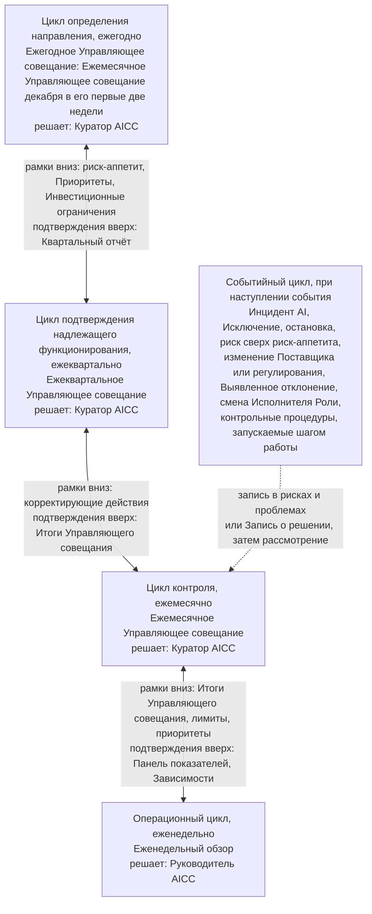
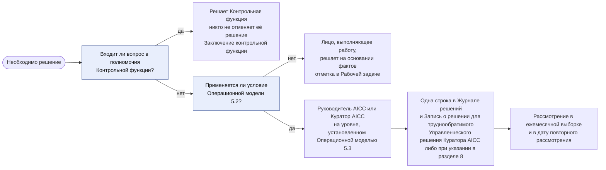
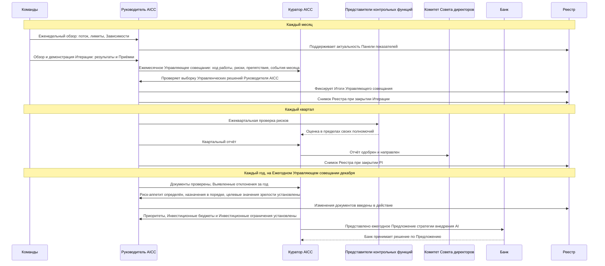
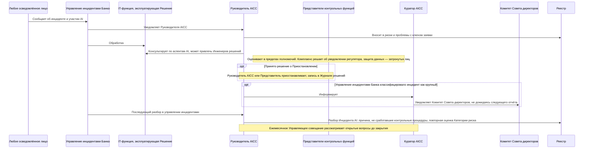
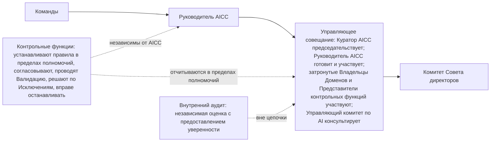
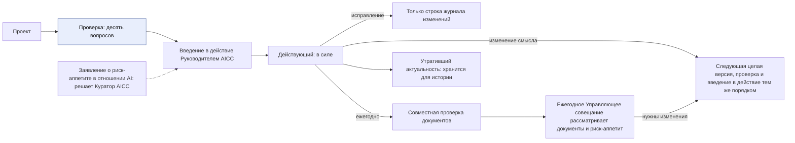

```yaml
source: charter/en/workflows/unit-governance.md
source_sha256: 2464e22016c0b75449e287bf7cd705cfe4a232dead6529ec2bc6df3eec8f715c
translation_status: reviewed
```

# Workflow: Управление подразделением

## 1. Назначение и область применения

Настоящий workflow показывает управление, отчётность и контроль AICC как подразделения Банка и последовательность действий участников. Он отвечает на вопрос о порядке работы подразделения. Он показывает совмещение циклов подразделения и портфеля на Управляющих совещаниях и Еженедельном обзоре, передачу решения на более высокий уровень и содержание каждого Управляющего совещания, действия при наступлении события и последовательности взаимодействия Ролей за месяц, квартал, год и при Инциденте AI.

Правила содержатся в Операционной модели, Модели управления портфелем, Модели жизненного цикла решений, Положении об AICC и Политике применения AI. Настоящий workflow показывает последовательность и назначение и не устанавливает самостоятельных правил. Контрольные процедуры Решения AI — от Категории риска до Исключения и остановки — представлены в workflow «Риски и контроль AI».

## 2. Циклы на Управляющих совещаниях

Контроль подразделения осуществляется в пяти циклах (Операционная модель 6), управление портфелем — в четырёх (Модель управления портфелем 4). Они используют одни и те же Управляющие совещания и Еженедельный обзор и не добавляют совещаний. Стратегический цикл совмещается с циклом определения направления на Ежегодном Управляющем совещании, цикл обзора портфеля — с циклом подтверждения надлежащего функционирования на Ежеквартальном Управляющем совещании, цикл синхронизации портфеля — с циклом контроля на Ежемесячном Управляющем совещании, цикл ведения бэклога — с операционным циклом на Еженедельном обзоре.

Рисунок 1 показывает циклы, лицо, принимающее решения в каждом, передачу установленных рамок вниз и подтверждающих данных вверх между соседними циклами.



Рисунок 1: циклы контроля, лица, принимающие решения, и передаваемые между циклами рамки и подтверждающие данные.

Управляющие совещания не являются тремя отдельными встречами: Ежеквартальное Управляющее совещание включает ежемесячную основу и дополняет её, а Ежегодное Управляющее совещание является Ежемесячным Управляющим совещанием декабря и дополняет его. Каждое Управляющее совещание рассматривает контрольные процедуры включённых в него циклов (Операционная модель 6.1). Следующая таблица определяет содержание каждого Управляющего совещания (Операционная модель 6.5–6.7 и 6.11; Модель управления портфелем 4.2–4.4).

| Управляющее совещание | Включённые циклы | Содержание |
| --- | --- | --- |
| Ежемесячное | Контроль и синхронизация портфеля; контрольные процедуры операционного и событийного циклов | Основа: ход работы, риски и препятствия; выборка Управленческих решений Руководителя AICC и доля признанных надлежащими; события месяца и запущенные ими контрольные процедуры; Приёмки и обзор действующих Решений; открытые Исключения и Недостатки контроля; решения на контрольных точках, срок которых наступил; количество Инициатив в состоянии «В работе» относительно лимита; синхронизация портфеля; Показатели управления, рассматриваемые ежемесячно; Снимок Реестра Итерации |
| Ежеквартальное | Подтверждение надлежащего функционирования и обзор портфеля в дополнение к ежемесячной основе | Решение по каждой Инициативе в состоянии «В работе»; Ежеквартальная проверка рисков и рассмотрение каждого Решения Категории риска 3; пересмотр доступа; сверка Инцидентов AI с управлением инцидентами Банка; статус каждой контрольной процедуры в Матрице контроля и Показатели управления, рассматриваемые ежеквартально; Уровень зрелости каждого Стратегического приоритета; отчёт Комитету Совета директоров; количество Инициатив в состоянии «В работе» относительно лимита и полнота Отчётов о результатах; обзор Внедрённых решений; подтверждение Целей PI и Дорожной карты |
| Ежегодное, в декабре | Определение направления и стратегический цикл в дополнение к ежемесячной основе | Надлежащие назначения; документы и Заявление о риск-аппетите в отношении AI; целевые значения Показателей Уровней зрелости на следующий год; Показатели управления, рассматриваемые ежегодно; Стратегические приоритеты, Инвестиционные бюджеты и Инвестиционные ограничения; ежегодное Предложение стратегии внедрения AI, которое представляет Куратор AICC и по которому принимает решение Банк; Квартальный отчёт PIQ3 как исходный материал |

В месяце с неделей IP (март, июнь и сентябрь) Ежеквартальное Управляющее совещание является также Управляющим совещанием этого месяца; отдельное Ежемесячное Управляющее совещание не проводится. В декабре Ежемесячное Управляющее совещание проводится в первые две недели как Ежегодное, а Ежеквартальное Управляющее совещание недели IP включает только цикл подтверждения надлежащего функционирования и обзор портфеля.

## 3. Передача решения на более высокий уровень

Рисунок 2 показывает выбор уровня решения и его фиксацию (Операционная модель 5).



Рисунок 2: выбор уровня решения и его запись.

## 4. События

Событие вне Календаря вносится в Запись о рисках и проблемах с ответственным и сроком и проходит тот же цикл до закрытия (Операционная модель 6.9, рисунок 6 Операционной модели). Инициировать рассмотрение события может любой. Следующая таблица определяет действия для каждого вида события.

| Событие | Действия | Ссылки |
| --- | --- | --- |
| Инцидент AI | Обрабатывается в управлении инцидентами Банка; Руководитель AICC участвует как заинтересованное лицо, вносит его в Запись о рисках и проблемах с ключом заявки и участвует в последующем разборе | Раздел 6, рисунок 4; Политика применения AI 5 |
| Исключение | Представитель контрольной функции соответствующего направления принимает решение на ограниченный срок; Исключение вносится в Запись о рисках и проблемах и рассматривается ежемесячно до истечения срока | workflow «Риски и контроль AI»; Политика применения AI 6 |
| Приостановление или остановка | Руководитель AICC или Представитель контрольной функции вправе приостановить; Приостановление вносится в Журнал решений; остановка Контрольной функцией окончательна | workflow «Риски и контроль AI»; Операционная модель 5.4 |
| Риск сверх риск-аппетита | Куратор AICC принимает решение с Записью о решении; Комитет Совета директоров уведомляется, не дожидаясь следующего отчёта | Операционная модель 5.4; Положение об AICC 7.2 |
| Изменение Поставщика или регулирования | Поставщик проверяется повторно; Руководитель AICC решает, требует ли изменение новой Проверки или Валидации; Куратор AICC вправе назначить дополнительный пересмотр документов и риск-аппетита | Политика применения AI 4.1; Модель жизненного цикла решений 8.6; Операционная модель 6.5 |
| Выявленное отклонение или Недостаток контроля | Вносится в Запись о рисках и проблемах с ответственным и сроком; Ежемесячное Управляющее совещание рассматривает до закрытия | Операционная модель 8.2 |
| Смена Исполнителя Роли | Руководитель AICC вносит назначение, изменение или освобождение в Запись о назначениях с датой и ссылкой на решение; новый Исполнитель Роли принимает Роль, назначает заместителя, получает доступ и проходит обучение; доступ прежнего Исполнителя Роли удаляется | Операционная модель 4.8, 4.9 |
| Шаг работы, запускающий контрольную процедуру | Соглашение о взаимодействии, business case, Категория риска, Проверка или Валидация, Выпуск, применение для Класса данных, проверка Поставщика, развёртывание или изменение, обмен данными, публикуемый результат или вывод из эксплуатации оставляют собственную Подтверждающую запись; в Запись о рисках и проблемах вопрос вносится только при статусе процедуры «Открыта» или «Недостаток контроля», а Ежемесячное Управляющее совещание рассматривает его среди событий месяца | Операционная модель 6.9, 8.5 |

## 5. Последовательность за месяц, квартал и год

Команды, Руководитель AICC, Куратор AICC, Представители контрольных функций, Комитет Совета директоров и Банк ежемесячно, ежеквартально и ежегодно обмениваются следующим. Рисунок 3 показывает последовательность.



Рисунок 3: последовательность за месяц, квартал и год.

## 6. Последовательность при Инциденте AI

За инцидент отвечает процесс управления инцидентами Банка; Руководитель AICC участвует как заинтересованное лицо (Политика применения AI 5). Рисунок 4 показывает действия участников по порядку.



Рисунок 4: последовательность при Инциденте AI.

## 7. Цепочка отчётности

Отчётность идёт от Команд к Комитету Совета директоров; Контрольные функции находятся рядом с ней и независимы от AICC. Внутренний аудит находится вне цепочки (Операционная модель 2.4, 6.3, 6.10). Рисунок 5 показывает цепочку и участников Управляющего совещания.



Рисунок 5: цепочка отчётности.

## 8. Жизнь документа

Каталог документов 3, 4 и 7 определяет жизнь документа. Рисунок 6 показывает её.



Рисунок 6: жизнь документа.

## 9. Где выполняется работа

Циклы выполняются в Jira и Confluence после Перехода Рабочего состояния (Операционная модель 7.1); до этого Рабочее состояние хранится в Реестре. Корпус Положения содержит эту схему.
