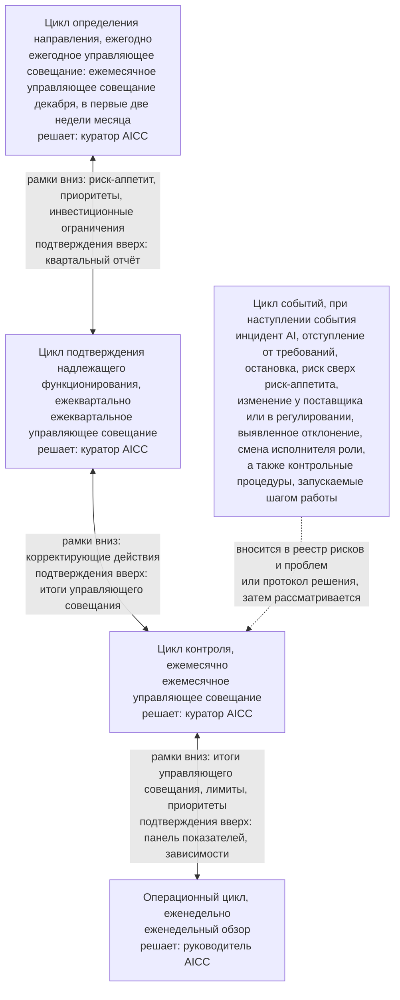
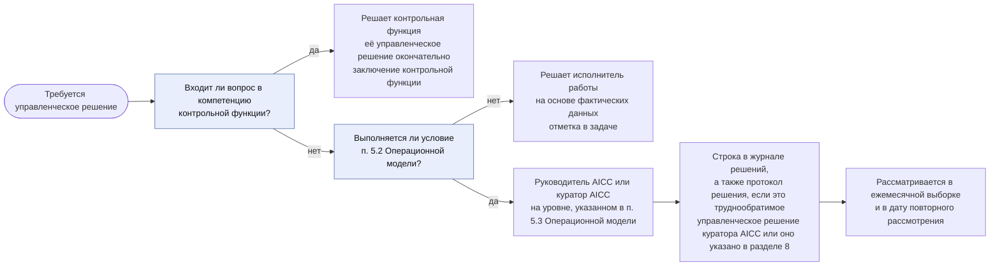
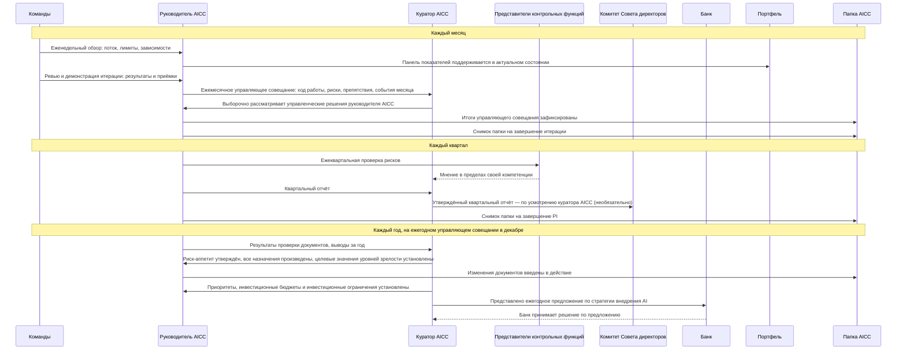
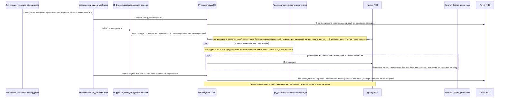
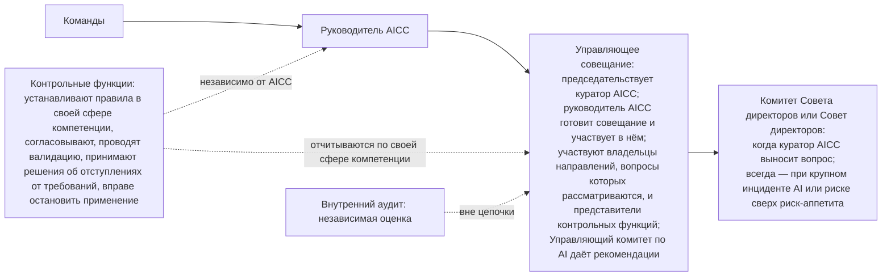
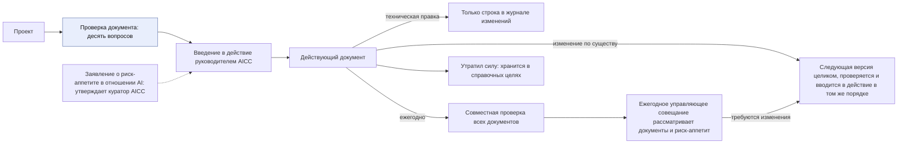

```yaml
source: charter/en/workflows/unit-governance.md
source_sha256: 4c5144c19dcb51072f3afabceb0cdc4cd39ee02209e9cb4f4a04f7e0a731951d
translation_status: reviewed
```

# Workflow «Контроль работы подразделения»

## 1. Назначение и область применения

Настоящий workflow описывает управление AICC как подразделением Банка, его отчётность и контроль за его деятельностью, а также последовательность действий участников. Он отвечает на вопрос, как работает подразделение. В нём показано, как циклы подразделения и портфеля совмещаются на управляющих совещаниях и еженедельном обзоре, каков порядок эскалации управленческих решений и какие вопросы рассматривает каждое управляющее совещание, что происходит при наступлении события, а также последовательность взаимодействия ролей в течение месяца, квартала и года и при инциденте AI.

Правила установлены Операционной моделью, Моделью управления портфелем, Моделью жизненного цикла решений, Положением об AICC и Политикой применения AI. Настоящий workflow показывает последовательность и назначение действий и собственных правил не устанавливает. Контрольные процедуры для решений на основе AI — от категории риска до отступления от требований и остановки — описаны в workflow «Риски и контроль AI».

## 2. Циклы на управляющих совещаниях

Контроль за деятельностью подразделения ведётся в пяти циклах (раздел 6 Операционной модели), управление портфелем — в четырёх (раздел 4 Модели управления портфелем). Все они проводятся на одних и тех же управляющих совещаниях и еженедельном обзоре; дополнительные совещания не вводятся. Стратегический цикл проводится вместе с циклом определения направления на ежегодном управляющем совещании, цикл обзора портфеля — вместе с циклом подтверждения надлежащего функционирования на ежеквартальном управляющем совещании, цикл синхронизации портфеля — вместе с циклом контроля на ежемесячном управляющем совещании, а цикл ведения бэклога — вместе с операционным циклом на еженедельном обзоре.

На рисунке 1 показаны циклы и лицо, принимающее решения в каждом из них, а также то, как между соседними циклами рамки передаются вниз, а подтверждающие данные — вверх.



Рисунок 1 — Циклы контроля, лица, принимающие в них решения, и рамки и подтверждающие данные, передаваемые между циклами

Управляющие совещания — это не три отдельных совещания: ежеквартальное управляющее совещание включает ежемесячную основу и дополняет её, а ежегодное является ежемесячным управляющим совещанием декабря и также дополняет его. На каждом управляющем совещании рассматриваются контрольные процедуры проводимых на нём циклов (п. 6.1 Операционной модели). Вопросы, которые рассматривает каждое управляющее совещание, приведены в следующей таблице (пп. 6.5–6.7 и 6.11 Операционной модели; пп. 4.2–4.4 Модели управления портфелем).

| Управляющее совещание | Проводимые циклы | Рассматриваемые вопросы |
| --- | --- | --- |
| Ежемесячное | Цикл контроля и цикл синхронизации портфеля; контрольные процедуры операционного цикла и цикла событий | Основа: ход работы, риски и препятствия; выборка управленческих решений руководителя AICC и доля решений, признанных надлежащими; события месяца и запущенные ими контрольные процедуры; приёмки и рассмотрение работающих решений; действующие отступления от требований и недостатки контроля; управленческие решения на контрольных точках, срок которых наступил; инициативы в работе в сопоставлении с лимитом; синхронизация портфеля; показатели управления, рассматриваемые ежемесячно; снимок папки на завершение итерации |
| Ежеквартальное | Цикл подтверждения надлежащего функционирования и цикл обзора портфеля — в дополнение к ежемесячной основе | Управленческое решение по каждой инициативе в работе; ежеквартальная проверка рисков и рассмотрение каждого решения категории риска 3; пересмотр прав доступа; сверка инцидентов AI с данными системы управления инцидентами Банка; статус каждой контрольной процедуры в матрице контроля и показатели управления, рассматриваемые ежеквартально; уровень зрелости по каждому стратегическому приоритету; утверждение квартального отчёта и определение того, направлять ли его Комитету Совета директоров или Совету директоров; инициативы в работе в сопоставлении с лимитом и полнота отчётов о результатах; рассмотрение внедрённых решений; подтверждение целей PI и дорожной карты |
| Ежегодное, в декабре | Цикл определения направления и стратегический цикл — в дополнение к ежемесячной основе | Подтверждение того, что все назначения произведены; документы и Заявление о риск-аппетите в отношении AI; целевые значения показателей уровней зрелости на следующий год; показатели управления, рассматриваемые ежегодно; стратегические приоритеты, инвестиционные бюджеты и инвестиционные ограничения; ежегодное предложение по стратегии внедрения AI, которое представляет куратор AICC и по которому решает Банк; квартальный отчёт за PIQ3 как исходные данные |

В месяце, на который приходится неделя IP (март, июнь и сентябрь), ежеквартальное управляющее совещание одновременно служит управляющим совещанием этого месяца, и отдельное ежемесячное управляющее совещание не проводится. В декабре ежемесячное управляющее совещание проводится в первые две недели месяца как ежегодное, а ежеквартальное управляющее совещание недели IP охватывает только цикл подтверждения надлежащего функционирования и цикл обзора портфеля.

## 3. Эскалация управленческих решений

Выбор уровня, на котором принимается управленческое решение, и рабочий документ, который оно оставляет, показаны на рисунке 2 (раздел 5 Операционной модели).



Рисунок 2 — Выбор уровня управленческого решения и его рабочий документ

## 4. События

Событие, не предусмотренное календарём, вносится в реестр рисков и проблем с указанием ответственного и срока и проходит тот же цикл до закрытия (п. 6.9 и рисунок 6 Операционной модели). Сообщить о событии вправе любой работник. Порядок действий по каждому виду событий приведён в следующей таблице.

| Событие | Порядок действий | Ссылка |
| --- | --- | --- |
| Инцидент AI | Обрабатывается в рамках процесса управления инцидентами Банка; руководитель AICC участвует как заинтересованное лицо, вносит инцидент в реестр рисков и проблем с номером обращения, а после устранения инцидента проводит его разбор | Раздел 6, рисунок 4; раздел 5 Политики применения AI |
| Отступление от требований | Решение на ограниченный срок принимает представитель контрольной функции соответствующей сферы компетенции; отступление вносится в реестр рисков и проблем и рассматривается ежемесячно до истечения срока | Workflow «Риски и контроль AI»; раздел 6 Политики применения AI |
| Приостановление или остановка | Приостановить применение вправе руководитель AICC или представитель контрольной функции; приостановление вносится в журнал решений; остановка, принятая контрольной функцией, окончательна | Workflow «Риски и контроль AI»; п. 5.4 Операционной модели |
| Риск сверх риск-аппетита | Решение принимает куратор AICC с оформлением протокола решения; Комитет Совета директоров информируется незамедлительно, не дожидаясь какого-либо отчёта | П. 5.4 Операционной модели; п. 7.2 Положения об AICC |
| Изменение у поставщика или в регулировании | Поставщик проверяется повторно, и руководитель AICC решает, требуется ли в связи с изменением новая проверка или валидация; куратор AICC вправе назначить внеочередной пересмотр документов и риск-аппетита | П. 4.1 Политики применения AI; п. 8.6 Модели жизненного цикла решений; п. 6.5 Операционной модели |
| Выявленное отклонение или недостаток контроля | Вносится в реестр рисков и проблем с указанием ответственного и срока; ежемесячное управляющее совещание рассматривает его до закрытия | П. 8.2 Операционной модели |
| Смена исполнителя роли | Руководитель AICC вносит назначение, изменение или освобождение от роли в реестр назначений с указанием даты и реквизитов управленческого решения; новый исполнитель роли подтверждает согласие исполнять роль, определяет лицо, замещающее его на период отсутствия, получает доступ и проходит обучение; права доступа прежнего исполнителя роли отзываются | Пп. 4.8 и 4.9 Операционной модели |
| Шаг работы, запускающий контрольную процедуру | Соглашение о взаимодействии, бизнес-кейс, категория риска, проверка или валидация, выпуск, использование для класса данных, проверка поставщика, развёртывание или изменение, обмен данными, предоставление результата AI внешним получателям или вывод из эксплуатации оставляют собственный подтверждающий документ; в реестр рисков и проблем такой шаг вносится, только если контрольная процедура находится в статусе «Открыта» или «Недостаток контроля», и тогда ежемесячное управляющее совещание рассматривает его среди событий месяца | Пп. 6.9 и 8.5 Операционной модели |

## 5. Последовательность действий за месяц, квартал и год

Команды, руководитель AICC, куратор AICC, представители контрольных функций и Банк ежемесячно, ежеквартально и ежегодно обмениваются сведениями, показанными на рисунке 3; куратор AICC также вправе направить квартальный отчёт Комитету Совета директоров.



Рисунок 3 — Последовательность действий за месяц, квартал и год

## 6. Последовательность действий при инциденте AI

За инцидент отвечает процесс управления инцидентами Банка; руководитель AICC участвует в нём как заинтересованное лицо (раздел 5 Политики применения AI). Действия участников по порядку показаны на рисунке 4.



Рисунок 4 — Последовательность действий при инциденте AI

## 7. Цепочка отчётности

Отчётность представляется по цепочке от команд до управляющего совещания, на котором её получает куратор AICC. Комитет Совета директоров или Совет директоров получают сведения, когда куратор AICC выносит вопрос на их рассмотрение, и во всех случаях — при крупном инциденте AI и риске, принятом сверх риск-аппетита. Контрольные функции действуют параллельно цепочке, независимо от AICC. Внутренний аудит находится вне цепочки (пп. 2.4, 6.3 и 6.10 Операционной модели). Цепочка и участники управляющего совещания показаны на рисунке 5.



Рисунок 5 — Цепочка отчётности

## 8. Жизненный цикл документа

Жизненный цикл документа установлен разделами 3, 4 и 7 Каталога документов и показан на рисунке 6.



Рисунок 6 — Жизненный цикл документа

## 9. Системы, в которых ведётся процесс

Рабочее состояние циклов ведётся в портфеле; со дня перехода ежедневная работа команд ведётся в Jira и Confluence (п. 7.1 Операционной модели). В папке AICC хранятся документы по управлению и подтверждающие документы. Настоящая схема содержится в корпусе.
