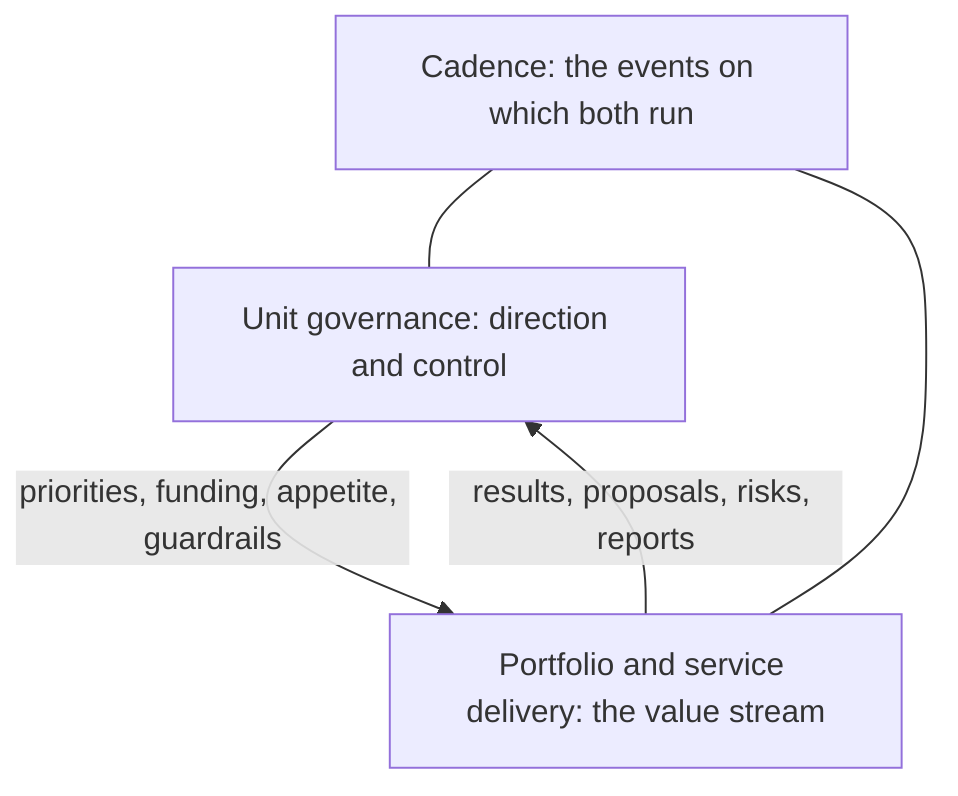

# Workflows

The loops and flows of AICC, as intent and control flow, not as activity detail. They explain how the unit operates. The rules are in
the documents of the charter, and the workflows state no rule of their own.

| Workflow | Intent | SAFe equivalent |
| --- | --- | --- |
| [Unit governance](unit-governance.md) | The control loop of AICC as a unit: mandate, planning, reporting, decisions, controls, and assurance, on yearly, quarterly, monthly, and weekly horizons and on events | Lean governance and the portfolio funding and control |
| [Portfolio and service delivery](service-delivery.md) | The value stream from a business need to a retired solution: scoping, business case, service definition, features, backlog, execution, deployment, operation, and life cycle | The portfolio Kanban, the execution of a Program Increment, and the continuous delivery pipeline |
| [Cadence](cadence.md) | The events of the loops by week, IT, and PI, without dates | The cadence of iterations and Program Increments |

Figure 1 shows how the workflows relate.

Figure 1: the workflows.

The workflows run in Jira and Confluence. The charter holds the schema, and the Registry and the Portfolio hold the static records
that an auditor may ask for.
