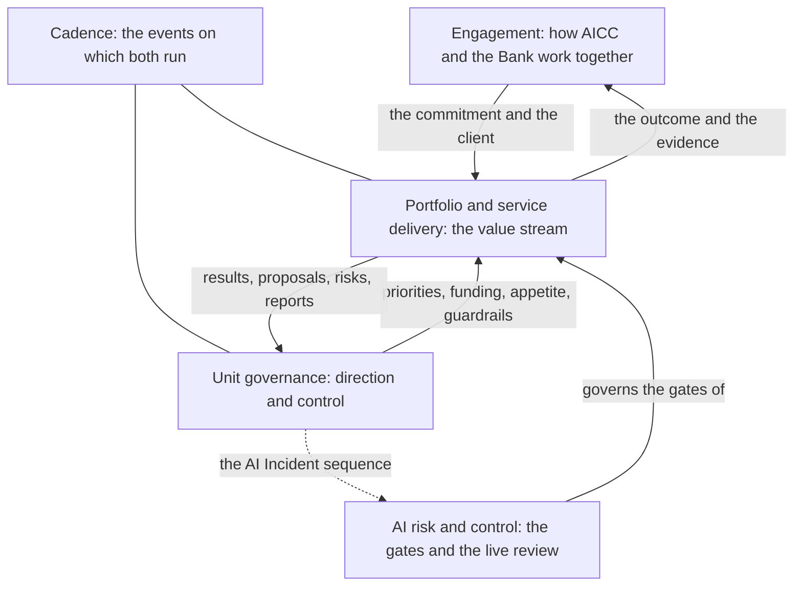

# Workflows

The loops and flows of AICC, as intent and control flow, not as activity detail. They explain how the unit operates. The rules are in the documents of the charter, and the workflows state no rule of their own.

| Workflow | Intent | Read when |
| --- | --- | --- |
| [Engagement](engagement.md) | The top-level workflow between AICC and the rest of the Bank: how AICC works as an internal consulting unit, from the first contact to the follow-on, with its Service Agreement, Outcome Report, and support levels | A function brings a need to AICC, or you lead an Engagement, and you want the steps from the first contact to the follow-on and what AICC commits to |
| [Portfolio and service delivery](service-delivery.md) | The value stream from a business need to a retired solution: the portfolio Kanban (funnel, review, analysis, backlog, MVP, and the decision after it), the Capabilities and Features, execution, deployment, operation, and the life cycle with its change, retirement, and measures | You work on an Initiative or a Solution and want to know the state it is in, who decides the next step, and what follows |
| [AI risk and control](ai-risk-control.md) | How a Solution, a provider, and a use of AI pass the controls of the AI Policy, from the Risk Tier to the gates before use, the live review, and the Exception, suspension, and stop | You define, check, validate, release, or review a Solution, or you decide an Exception, a suspension, or a stop |
| [Cadence](cadence.md) | The events of the loops by week, Iteration, and PI, without dates | You plan the week, the Iteration, or the quarter and want to know which event is held, and what it decides |
| [Collaboration tooling](collaboration-tooling.md) | The tools and the portals that AICC uses, for what, and in which workflows | You need to know which tool holds what, and who keeps it |
| [Unit governance](unit-governance.md) | The control of AICC as a unit: the loops on the Steerings and what each Steering carries, how a decision escalates, the events, a month, a quarter, and a year in sequence, an AI Incident, the reporting chain, and the life of a document | You prepare or attend a Steering, decide at a level, handle an event, or report to the Board Committee |

Figure 1 shows how the workflows relate.

Figure 1: the workflows.

The workflows will run in Jira and Confluence from the cutover of the working state (Operating Model 7.1). The charter holds the schema.
