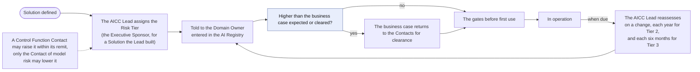
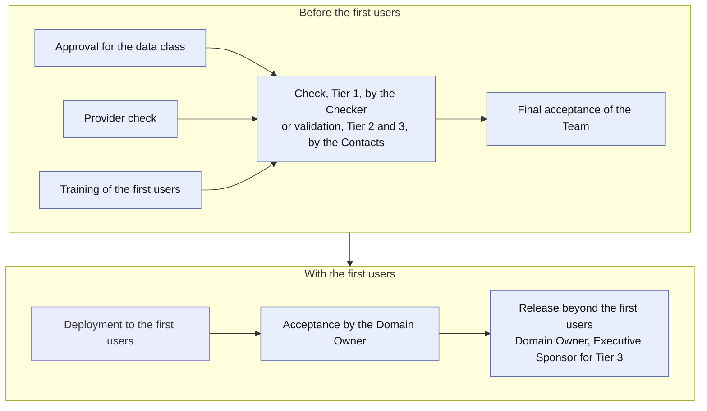
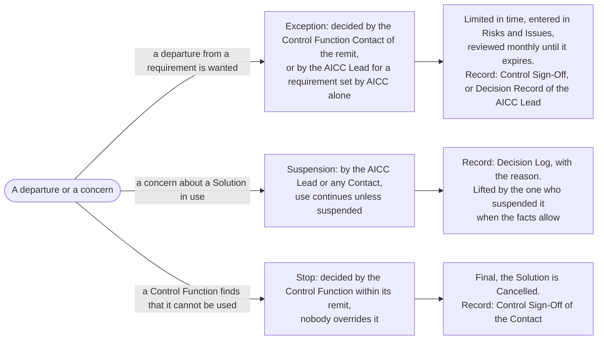

# AI risk and control workflow

## 1. Intent and scope

This workflow shows how a Solution, a provider, and a use of AI pass the controls of the AI Policy: from the Risk Tier that is assigned when the Solution is defined, through the gates before first use, to the live review in operation, and to the Exception, the suspension, and the stop. It answers the question "how does AICC keep the use of AI within the appetite of the Bank?". It shows the gates that the service delivery workflow passes, and that workflow carries the flow of the work, and the AI Incident is in sequence in the unit governance workflow.

The rules are in the AI Policy, the Operating Model, the Solution Lifecycle Model, and the AICC Charter. This workflow shows the flow and the intent, and states no rule of its own.

## 2. The Risk Tier

The Risk Tier of a Solution sets the checks that it needs. The AICC Lead assigns it when the Solution is defined, from the attributes of the AI Policy 3.1 (the class of data, the influence of the AI on a decision, whether the output reaches or affects a customer, and the degree of autonomy), and tells the Domain Owner. For a Solution that the AICC Lead built, the Executive Sponsor assigns it. A Control Function Contact may raise it within its remit, and only the Contact of model risk may lower it (AI Policy 3.2). A Risk Tier that is higher than the business case expected, or than the Control Function Contacts cleared, returns the business case to them for clearance (Portfolio Management Model 6.4).

The Risk Tier is reassessed on a change, each year for a Risk Tier 2 Solution, and each six months for a Risk Tier 3 Solution (AI Policy 3.3). A validation is valid until the date in the AI Registry (AI Policy 3.4). Figure 1 shows the assignment and the reassessment.

Figure 1: the assignment and the reassessment of the Risk Tier.

A Solution in a category that the law applicable to the Bank treats as high risk is at least Risk Tier 2. The person who checks a Risk Tier 1 Solution, and the Control Function Contacts at the validation, confirm the Risk Tier and ask whether the Solution is in such a category (AI Policy 3.2).

## 3. The gates before first use

A Solution reaches its first users through the gates of Figure 2. Data of a class for which no Solution is approved is not used with AI at any point, including discovery, until the Domain Owner has obtained the approvals that the rules of the Bank require (AI Policy 2.2). No deployment to real users or data comes before the check or the validation (Solution Lifecycle Model 7.1).

Figure 2: the gates before first use.

The following table states who decides each gate and what record it leaves.

| Gate | Who decides | Record left |
| --- | --- | --- |
| Approval for a data class | The Domain Owner; the AICC Lead for use in AICC; the Executive Sponsor for a Solution that the AICC Lead built (AI Policy 2.1) | The AI Registry entry, with who approved and when |
| Provider check | The Control Function Contacts of information security, data protection, and legal; the Contact of information security alone for a Risk Tier 1 Solution or a provider already checked (AI Policy 4.1) | The Control Sign-Off; repeated at each reassessment and on a change of terms or model |
| Training of the first users | The AICC Lead sets the training and notes when it is complete, without the names (AI Policy 2.1, 3.5) | The AI Registry entry |
| Check, Risk Tier 1 | The Checker, a person other than the builder (AI Policy 3.3; Operating Model 4.6) | The AI Registry entry for the check |
| Validation, Risk Tier 2 and 3 | The Control Function Contacts of model risk and of information security, and of each other remit concerned; it includes a security test against attacks on AI, and relies on the evidence that the Platform Owner keeps (AI Policy 3.3; Solution Lifecycle Model 7.2) | The Control Sign-Off, with the date until which it is valid and the changes that require a new one |
| Final acceptance of the Team | The AICC Lead, before the first deployment to the first users (Solution Lifecycle Model 7.3(b)) | The release block of the Solution Definition |
| Acceptance by the requester | The Domain Owner; the Executive Sponsor where the item spans Domains, is enabling work of AICC, or has no Domain, or where the AICC Lead is the Domain Owner, on the judgment of the working Solution with the first users (Solution Lifecycle Model 7.3(c)) | The release block of the Solution Definition |
| Release beyond the first users | The Domain Owner for Risk Tier 1 and 2, or the Executive Sponsor where the AICC Lead is the Domain Owner; the Executive Sponsor for Risk Tier 3 (AI Policy 3.3; Operating Model 4.4(d)) | The release block of the Solution Definition, the Acceptance Checklist, and a Decision Record for Risk Tier 3 |

## 4. In operation

A Solution in use stays under control through the review and the triggers in the following table.

| Trigger | What follows | Who decides |
| --- | --- | --- |
| Each Iteration Review and Demo | The monitoring, the incidents, the use, and the notices of the providers are reviewed, and the review is noted in the Solution Definition (AI Policy 3.5; Solution Lifecycle Model 8.4) | The Domain Owner; the Executive Sponsor for a Service across Domains |
| A significant change: of model, provider, data class, degree of autonomy, or any attribute of the Risk Tier | The decision on a new check or validation is entered in the Decision Log, and the change is released as the gates state (Solution Lifecycle Model 8.6) | The AICC Lead decides on the new check; the Domain Owner, or the Executive Sponsor for Risk Tier 3, releases |
| A change that raises the Risk Tier, or that the check or the validation named as requiring a new one | The Solution returns to Discovery for the checks that the change touches (AI Policy 3.4) | The AICC Lead reassesses the Risk Tier (AI Policy 3.5) |
| The Risk Tier rises to 3 | The Solution is not used beyond its first users until the Executive Sponsor releases it (AI Policy 3.4) | The Executive Sponsor |
| The date in the AI Registry for a reassessment or a validation arrives | The Risk Tier is reassessed, and the Solution is validated again where the validation has expired (AI Policy 3.3, 3.4) | The AICC Lead reassesses; the Control Function Contacts validate |

## 5. Exception, suspension, and stop

Figure 3 shows the three ways in which use is limited or departed from, who decides each, and what it leaves on record.

Figure 3: the Exception, the suspension, and the stop.

An Exception is not a bypass of a control (AI Policy 6.1). A disagreement with a validation or a stop goes to the head of that Control Function, and the Executive Sponsor may raise it with executive management and may not set a validation or a stop aside (Operating Model 5.4).

## 6. Single decisions of the Executive Sponsor

Two uses of AI are decided by the Executive Sponsor each time, and each leaves a Decision Record. The following table states them.

| Use | What the Executive Sponsor decides | Record |
| --- | --- | --- |
| Output published to investors, lenders, regulators, or the Board | The Executive Sponsor approves the AI output before it is issued, for each edition, and may name a delegate in the Appointments Record (AI Policy 2.4) | A Decision Record of the approval of each edition, entered in the Decision Log |
| A Data Sharing Arrangement outside the Bank | The Executive Sponsor decides after consulting the Control Function Contacts of data protection, legal, compliance, and information security; the arrangement states the parties, the data, the legal basis, the controls, and the end date (AICC Charter 3.3) | A Decision Record, entered in the Decision Log |

## 7. An AI Incident

An AI Incident is handled in the incident management of the Bank, and the AICC Lead is a stakeholder (AI Policy 5). The sequence of who does what is in the [Unit governance workflow](unit-governance.md), section 6, Figure 4. After the incident, the AICC Lead reassesses the Risk Tier of the Solution (AI Policy 5.8), which returns the Solution to Figure 1.

## 8. Situations

| Situation | What happens |
| --- | --- |
| A Control Function Contact raises the Risk Tier of a Solution in use | The higher Risk Tier applies, the AICC Lead updates the AI Registry, the checks that the change touches are made again, and a Solution whose Risk Tier becomes 3 is not used beyond its first users until the Executive Sponsor releases it (AI Policy 3.2, 3.4) |
| A provider changes its terms or its model | The provider is checked again (AI Policy 4.1), and the AICC Lead decides whether the change needs a new check or validation and enters the decision in the Decision Log (Solution Lifecycle Model 8.6) |
| A Domain wants to use a class of data for which no Solution is approved | The data is not used with AI at any point, including discovery, until the Domain Owner has obtained the approvals that the rules of the Bank require (AI Policy 2.2) |
| The AICC Lead built the Solution | The AICC Lead does not check, validate, or release it; the Executive Sponsor approves its Solution Definition, assigns its Risk Tier, approves its use for a data class; the Executive Sponsor also gives the business acceptance and the release where the AICC Lead is the Domain Owner, and otherwise the Domain Owner does (Operating Model 4.4(d), 4.6) |
| A Risk Tier 1 Solution turns out to be in a category that the law treats as high risk | The Solution is at least Risk Tier 2, and the Control Function Contacts validate it in place of the check (AI Policy 3.2, 3.5) |

## 9. Where it runs

From the cutover of the working state (Operating Model 7.1), the Solution Definitions and the work items run in Jira and Confluence, and until then the Registry holds the working state. The AI Registry, the Control Sign-Offs, and the Decision Records are kept in the Registry. The charter holds this schema.
