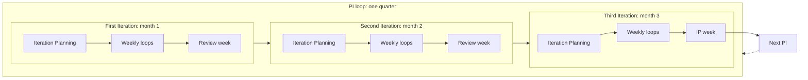
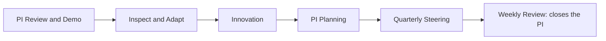
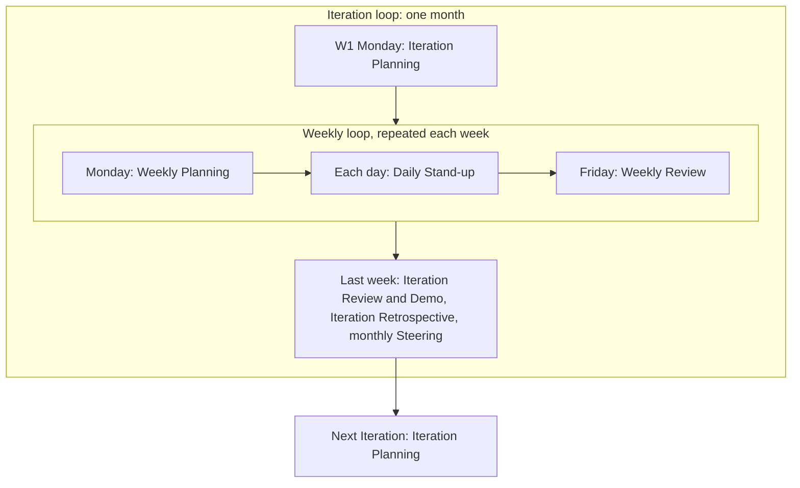
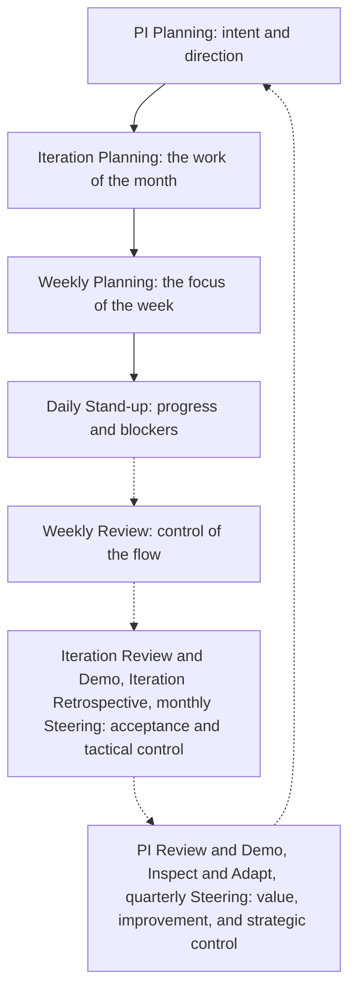

# Cadence

The general flow of AICC for a PI, its Iterations, and their weeks. It has no dates. It is the template and the guidance for the dated calendar of events that is built later for a rolling two quarters, from the real days in the Calendar. It assumes a clean calendar: Monday and Friday are the planning and review days, and nothing is blocked or gray. The Calendar records what is not clean, and its rules move events to the day before.

The Cadence holds the control flow only: the loops, the events, and the control of each loop. What is done inside each event is described in the other workflows. The short forms and the events are defined in the vocabulary at the end of this workflow.

## 1. Every week

Every week starts with planning and ends with review, as in Kanban. The Daily Stand-up is held each working day, and is not marked on the cadence.

| Day | Event |
| --- | --- |
| Monday | Weekly Planning |
| Each working day | Daily Stand-up (assumed; not marked) |
| Friday | Weekly Review |

## 2. Every Iteration

An Iteration is one calendar month. It is four or five whole weeks, and its last week is the review week, except in the third Iteration of a PI, where the IP week takes its place. A five-week Iteration has one more working week in the middle.

| Week of the Iteration | Events in addition to the weekly events |
| --- | --- |
| W1 | Monday: Iteration Planning, in place of the Weekly Planning |
| Middle weeks (W2 and W3 in a four-week Iteration; W2 to W4 in a five-week one) | Backlog Refinement, within the Weekly Planning and the Weekly Review |
| Last week (W4 or W5): the review week | Iteration Review and Demo, then Iteration Retrospective; the monthly Steering, on a day set when the outside calendars are known, during the week |

## 3. Every PI

A PI is a quarter of three Iterations. The same flow repeats in each, and the last week of the third Iteration is the IP week.

| PI | First Iteration | Second Iteration | Third Iteration |
| --- | --- | --- | --- |
| PIQ1 | I01 | I02 | I03, ending in the IP week |
| PIQ2 | I04 | I05 | I06, ending in the IP week |
| PIQ3 | I07 | I08 | I09, ending in the IP week |
| PIQ4 | I10 | I11 | I12, ending in the IP week |

| Iteration of the PI | What is special |
| --- | --- |
| First | Iteration Planning starts from the intent and direction set at the PI Planning |
| Second | Nothing in addition to the Iteration flow |
| Third | The last week is the IP week in place of the review week |

## 4. The IP week

The last week of the third Iteration. It holds the events of the PI, in this order. It also holds the Iteration Review and Demo and the Iteration Retrospective of the third Iteration, inside the PI Review and Demo and Inspect and Adapt.

| Day | Event |
| --- | --- |
| Monday | PI Review and Demo, with the Iteration Review and Demo of the third Iteration |
| Tuesday | Inspect and Adapt, with the Iteration Retrospective of the third Iteration |
| Wednesday | Innovation |
| Thursday | PI Planning |
| Friday | Quarterly Steering, then the Weekly Review that closes the PI |

## 5. The loops

The cadence has two levels of loops, the PI loop and the Iteration loops inside it, and inside every Iteration the weekly loop. Each loop starts with planning and ends with review, and each review feeds the planning of the next loop. On the events of these loops the control loops of the Operating Model 6 and the portfolio loops of the Portfolio Management Model 4 also run: the Weekly Review carries the operating loop and the backlog care loop, the monthly Steering carries the control loop and the portfolio sync, the quarterly Steering carries the assurance loop and the portfolio review, and the first quarterly Steering of the year carries the direction loop and the strategic loop.

Figure 1 shows the PI loop with the three Iteration loops inside it. The last week of the third Iteration is the IP week, in which the PI ends and the next one is planned.

Figure 1: the PI loop and the Iteration loops.

Figure 2 shows the IP week, the end of the PI loop and the start of the next one.

Figure 2: the IP week.

Figure 3 shows an Iteration loop and the weekly loop inside it. The review week ends the Iteration, and the next Iteration starts with its planning.

Figure 3: the Iteration loop and the weekly loop.

Figure 4 shows how planning flows down and review flows up. Each review controls its loop and feeds the planning above it.

Figure 4: planning down and control up.

## 6. The controls through the loops

Each loop has a control, and each control is an event that already exists. The following table lists them from the shortest loop to the longest.

| Control | Event | What it controls | Record kept current |
| --- | --- | --- | --- |
| Progress and blockers | Daily Stand-up | The work of the day | The Iteration Backlog |
| Flow and Dependencies | Weekly Review | The Program Kanban, the Limits on Work in Progress, the Dependencies | The Program Kanban, the Program Board, the Dashboard |
| Acceptance | Iteration Review and Demo | What is done, as the product owner sees it | The Program Backlog |
| Way of working | Iteration Retrospective | How the Team works | The next Iteration Backlog |
| Portfolio sync and control | Steering, monthly | The gate decisions that are due, the funnel and the free capacity, the Active Initiatives against the limit, progress, risks, and blockers, a sample of the Decisions of the AICC Lead, the open Exceptions, and the deficiencies | The Decision Log, the Steering Summary, the Portfolio Backlog, the Risks and Issues |
| Value | PI Review and Demo | The value achieved against the PI Objectives, and the data for the Quarterly Report | The PI Objectives, the Quarterly Report |
| Improvement | Inspect and Adapt | The main problems of the PI | The Program Backlog |
| Intent and direction | PI Planning | What the next PI aims at | The Roadmap, the Program Board |
| Portfolio review and assurance | Steering, quarterly | The decision for each Active Initiative to continue, pivot, defer, or reject, the quarterly risk check with the Control Function Contacts, the Maturity Level, and the report to the Board Committee | The Decision Log, the Quarterly Report, the Registry Snapshot |
| Strategy and direction | Steering, first quarterly of the year | The Strategic Priorities, the Envelopes, the Guardrails, the documents, and the appetite | The Priorities, the Decision Records |

## 7. Rules

The rules for events that move or are missed, and for the Weekly Review, are in the Solution Lifecycle Model 6.5. Nothing in the Cadence is approved by anyone.

## 8. The dated calendar of events

The dated calendar of events is built from this flow for a rolling two quarters: the current PI and the next. It records under each event its week (for example 2026-PIQ4 I10W1) and its actual date, taken from the Calendar, and the day it moved from when the Calendar rules moved it. It is built at the PI Planning for the next two quarters and is revised in the Weekly Review. It is not built yet.

## 9. Light mode

While the Team has up to three people, the Solution Lifecycle Model 6.6 applies. The following table shows which events remain.

| Event | In light mode |
| --- | --- |
| Daily Stand-up | Optional |
| Weekly Planning and Weekly Review | One session each week |
| Backlog Refinement | Optional, within the weekly session |
| Iteration Planning | Held |
| Iteration Review and Demo | Held, with the Iteration Retrospective and the monthly Steering inside it |
| PI Review and Demo | Held, with Inspect and Adapt inside it |
| Innovation | Optional |
| PI Planning | Held |
| Steering, quarterly | Held |

## 10. Vocabulary of the cadence

### 10.1. Short forms and names

The short forms PI and IP, the names PIQ1 to PIQ4, I01 to I12, and W1 to W5, and the terms Loop and Review week are defined in the Vocabulary.

### 10.2. Events and their intent

| Event | Loop | Where in the flow | Takes in | Gives | Intent |
| --- | --- | --- | --- | --- | --- |
| Daily Stand-up | Day | Each working day | The Iteration Backlog | Blockers raised | Share progress, and clear blockers |
| Weekly Planning | Week | Monday | The Iteration Backlog, the Program Board | The focus of the week | Set the focus of the week, and check the Dependencies |
| Weekly Review | Week | Friday | The Program Kanban, the Portfolio Backlog and the funnel, the Program Board, the Iteration Backlog | A reordered Program Backlog, a current Dashboard, the items that reach a gate, notes on what changed | Keep control of the flow, and keep the plan close to what is really happening |
| Backlog Refinement | Iteration | Within the Weekly Planning and the Weekly Review | The Program Backlog | Items ready to be selected | Keep the next items ready, so planning is quick |
| Iteration Planning | Iteration | W1, Monday | The Program Backlog, the Roadmap, the Program Board | The Iteration Backlog and the Iteration goal | Select the work of the month for the intent set at the PI Planning |
| Iteration Review and Demo | Iteration | Review week | The Iteration Backlog, the working Solutions | Acceptances, returned items, feedback | Show what works to the product owners, and take acceptance |
| Iteration Retrospective | Iteration | Review week, after the Iteration Review and Demo | The month of work | Improvements for the next Iteration | Improve the way of working |
| Steering, monthly | Iteration | Review week, on a day fixed with the outside calendars | The Dashboard, the Portfolio Backlog, the risks, the Iteration Review and Demo | Decisions of the Executive Sponsor on the gates that are due, the sample, and the open items; the Steering Summary | Review the portfolio and the control of the unit, and decide |
| PI Review and Demo | PI | IP week, Monday | The Iterations of the PI, the PI Objectives | The value scored, and the data for the Quarterly Report | Show what the PI delivered, and score its value |
| Inspect and Adapt | PI | IP week, Tuesday | The results and the flow of the PI | Improvements in the Program Backlog | Solve the main problems of the PI |
| Innovation | PI | IP week, Wednesday | Free time | New ideas and learning | Time to learn, explore, and recover |
| PI Planning | PI | IP week, Thursday | The Program Backlog, the Quarterly Report, the Program Board | The PI Objectives, the proposed Roadmap, the Dependencies | Set the intent and direction of the next PI |
| Steering, quarterly | PI | IP week, Friday | The Quarterly Report, the PI Objectives | Decisions on each Active Initiative, the quarterly risk check, the Maturity Level, and the report to the Board Committee; in the first Steering of the year, also the Priorities, the Envelopes, and the Guardrails | Assess the past quarter, and decide |
