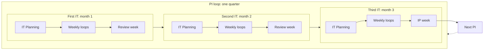
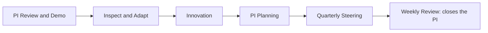
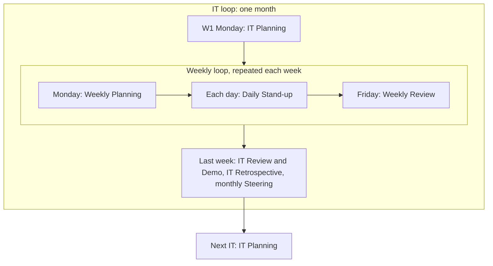
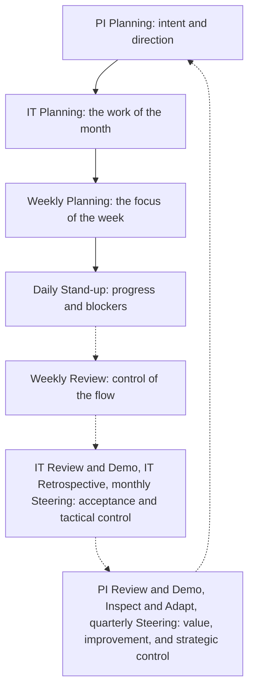

# Cadence

The general flow of AICC for a PI, its ITs, and their weeks. It has no dates. It is the template and the guidance for the dated
calendar of events that is built later for a rolling two quarters, from the real days in the Calendar. It assumes a clean calendar:
Monday and Friday are the planning and review days, and nothing is blocked or gray. The Calendar records what is not clean, and its
rules move events to the day before.

The Cadence holds the control flow only: the loops, the events, and the control of each loop. What is done inside each event is
described in the other workflows. The short forms and the events are defined in the vocabulary
at the end of this Record.

## 1. Every week

Every week starts with planning and ends with review, as in Kanban. The Daily Stand-up is held each working day, and is not marked
on the cadence.

| Day | Event |
| --- | --- |
| Monday | Weekly Planning |
| Each working day | Daily Stand-up (assumed; not marked) |
| Friday | Weekly Review |

## 2. Every IT

An IT is one calendar month. It is four or five whole weeks, and its last week is always the review week. A five-week IT has one
more working week in the middle.

| Week of the IT | Events in addition to the weekly events |
| --- | --- |
| W1 | Monday: IT Planning, in place of the Weekly Planning |
| Middle weeks (W2 and W3 in a four-week IT; W2 to W4 in a five-week one) | Backlog Refinement, within the Weekly Planning and the Weekly Review |
| Last week (W4 or W5): the review week | IT Review and Demo, then IT Retrospective; the monthly Steering, on a day set when the outside calendars are known, during the week |

## 3. Every PI

A PI is a quarter of three ITs. The same flow repeats in each, and the last week of the third IT is the IP week.

| PI | First IT | Second IT | Third IT |
| --- | --- | --- | --- |
| PIQ1 | IT01 | IT02 | IT03, ending in the IP week |
| PIQ2 | IT04 | IT05 | IT06, ending in the IP week |
| PIQ3 | IT07 | IT08 | IT09, ending in the IP week |
| PIQ4 | IT10 | IT11 | IT12, ending in the IP week |

| IT of the PI | What is special |
| --- | --- |
| First | IT Planning starts from the intent and direction set at the PI Planning |
| Second | Nothing in addition to the IT flow |
| Third | The last week is the IP week in place of the review week |

## 4. The IP week

The last week of the third IT. It holds the events of the PI, in this order. It also holds the IT Review and Demo and the IT
Retrospective of the third IT, inside the PI Review and Demo and Inspect and Adapt.

| Day | Event |
| --- | --- |
| Monday | PI Review and Demo, with the IT Review and Demo of the third IT |
| Tuesday | Inspect and Adapt, with the IT Retrospective of the third IT |
| Wednesday | Innovation |
| Thursday | PI Planning |
| Friday | Quarterly Steering, then the Weekly Review that closes the PI |

## 5. The loops

The cadence has two levels of loops, the PI loop and the IT loops inside it, and inside every IT the weekly loop. Each loop starts
with planning and ends with review, and each review feeds the planning of the next loop.

Figure 1 shows the PI loop with the three IT loops inside it. The last week of the third IT is the IP week, in which the PI ends
and the next one is planned.

Figure 1: the PI loop and the IT loops.

Figure 2 shows the IP week, the end of the PI loop and the start of the next one.

Figure 2: the IP week.

Figure 3 shows an IT loop and the weekly loop inside it. The review week ends the IT, and the next IT starts with its planning.

Figure 3: the IT loop and the weekly loop.

Figure 4 shows how planning flows down and review flows up. Each review controls its loop and feeds the planning above it.

Figure 4: planning down and control up.

## 6. The controls through the loops

Each loop has a control, and each control is an event that already exists. The following table lists them from the shortest loop to
the longest.

| Control | Event | What it controls | Record kept current |
| --- | --- | --- | --- |
| Progress and blockers | Daily Stand-up | The work of the day | The IT Backlog |
| Flow and Dependencies | Weekly Review | The Program Kanban, the Limits on Work in Progress, the Dependencies | The Program Kanban, the Dependency Map, the Dashboard |
| Acceptance | IT Review and Demo | What is done, as the product owner sees it | The Program Backlog |
| Way of working | IT Retrospective | How the Team works | The next IT Backlog |
| Tactical decisions and risks | Steering, monthly | Progress, risks, and blockers | The Decision Log, the Risks and Issues |
| Value and the quarterly risk check | PI Review and Demo | The value achieved, and the risks with the Control Function Contacts | The PI Objectives, the Quarterly Report |
| Improvement | Inspect and Adapt | The main problems of the PI | The Program Backlog |
| Intent and direction | PI Planning | What the next PI aims at | The Roadmap, the Dependency Map |
| Strategic decisions | Steering, quarterly | Priorities, funding, and the Maturity Level | The Decision Log, the Priorities |

## 7. Rules

1. The flow is a template. A real week or event moves by the rules of the Calendar: to the working day before a blocked or gray day,
never after, and the IP week to the week before when it is blocked or gray.
2. An event that is missed is not held later. Its intent is covered at the next event, and the Weekly Review notes it.
3. The Weekly Review may be held in writing. Notes are kept only for Decisions and actions, with the Notes Template.
4. Nothing in the Cadence is approved by anyone.

## 8. The dated calendar of events

The dated calendar of events is built from this flow for a rolling two quarters: the current PI and the next. It records under each
event its week (for example 2026-PIQ4 IT10W1) and its actual date, taken from the Calendar, and the day it moved from when the
Calendar rules moved it. It is built at the PI Planning for the next two quarters and is revised in the Weekly Review. It is not
built yet.

## 9. Light mode

While the Team has up to three people, the Operating Model 7.5 applies. The following table shows which events remain.

| Event | In light mode |
| --- | --- |
| Daily Stand-up | Optional |
| Weekly Planning and Weekly Review | One session each week |
| Backlog Refinement | Optional, within the weekly session |
| IT Planning | Held |
| IT Review and Demo | Held, with the IT Retrospective and the monthly Steering inside it |
| PI Review and Demo | Held, with Inspect and Adapt inside it |
| Innovation | Optional |
| PI Planning | Held |
| Steering, quarterly | Held |

## 10. Vocabulary of the cadence

### 10.1. Short forms and names

The short forms PI, IT, and IP, the names PIQ1 to PIQ4, IT01 to IT12, and W1 to W5, and the terms Loop and Review week are defined in the
Vocabulary.

### 10.2. Events and their intent

| Event | Loop | Where in the flow | Takes in | Gives | Intent |
| --- | --- | --- | --- | --- | --- |
| Daily Stand-up | Day | Each working day | The IT Backlog | Blockers raised | Share progress, and clear blockers |
| Weekly Planning | Week | Monday | The IT Backlog, the Dependency Map | The focus of the week | Set the focus of the week, and check the Dependencies |
| Weekly Review | Week | Friday | The Program Kanban, the Dependency Map, the IT Backlog | A reordered Program Backlog, a current Dashboard, notes on what changed | Keep control of the flow, and keep the plan close to what is really happening |
| Backlog Refinement | IT | Within the Weekly Planning and the Weekly Review | The Program Backlog | Items ready to be selected | Keep the next items ready, so planning is quick |
| IT Planning | IT | W1, Monday | The Program Backlog, the Roadmap, the Dependency Map | The IT Backlog and the IT goal | Select the work of the month for the intent set at the PI Planning |
| IT Review and Demo | IT | Review week | The IT Backlog, the working Solutions | Acceptances, returned items, feedback | Show what works to the product owners, and take acceptance |
| IT Retrospective | IT | Review week, after the IT Review and Demo | The month of work | Improvements for the next IT | Improve the way of working |
| Steering, monthly | IT | Review week, on a day fixed with the outside calendars | The Dashboard, the risks, the IT Review and Demo | Decisions of the Executive Sponsor | Review progress, risks, and blockers, and decide |
| PI Review and Demo | PI | IP week, Monday | The ITs of the PI, the PI Objectives | The value scored, the quarterly risk check, the Quarterly Report | Show what the PI delivered, and score its value |
| Inspect and Adapt | PI | IP week, Tuesday | The results and the flow of the PI | Improvements in the Program Backlog | Solve the main problems of the PI |
| Innovation | PI | IP week, Wednesday | Free time | New ideas and learning | Time to learn, explore, and recover |
| PI Planning | PI | IP week, Thursday | The Program Backlog, the Quarterly Report, the Dependency Map | The PI Objectives, the Roadmap, the Dependencies | Set the intent and direction of the next PI |
| Steering, quarterly | PI | IP week, Friday | The Quarterly Report, the PI Objectives | Decisions on priorities and funding, the Maturity Level | Assess the past quarter, and decide the strategic matters |
