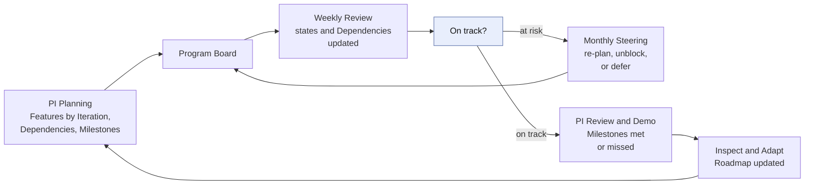
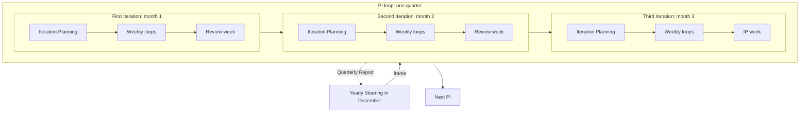
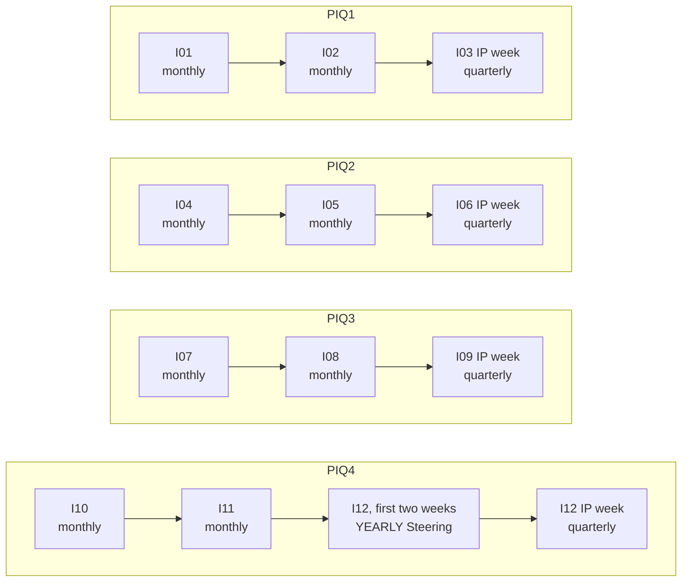
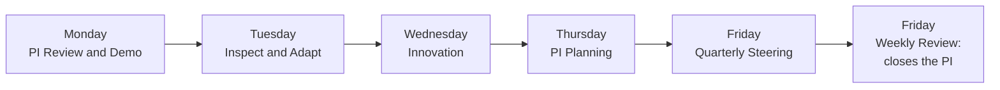
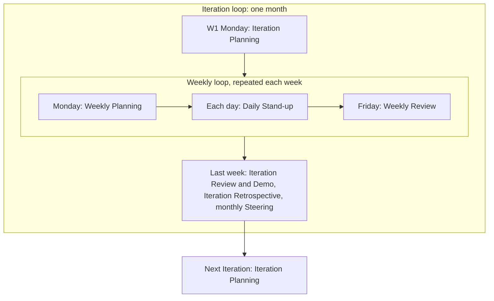
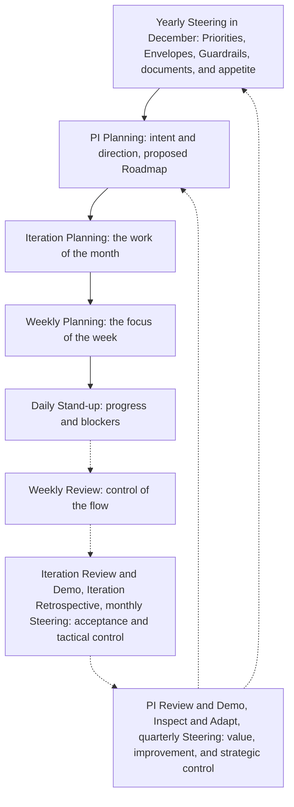

# Cadence

The general flow of AICC for a PI, its Iterations, and their weeks. It has no dates. It is the template and the guidance for the dated calendar of events that is built for a rolling two quarters, from the real days in the Calendar. It assumes a clean calendar: Monday and Friday are the planning and review days, and nothing is blocked or gray. The Calendar records what is not clean, and its rules move events to the day before. The weekdays of the events and the rolling two-quarter planning are the example of this template of the Cadence, which the Vocabulary defines, and the Calendar Record sets the real days.

The Cadence holds the flow only: the loops and the events, with what each event takes in and gives. What is done inside each event is described in the other workflows. The short forms, the names, and the events are defined in the Vocabulary document.

## 1. Every week

Every week starts with planning and ends with review, as in Kanban. The Daily Stand-up is held each working day, and is not marked on the cadence.

| Day | Event |
| --- | --- |
| Monday | Weekly Planning |
| Each working day | Daily Stand-up (assumed; not marked) |
| Friday | Weekly Review |

## 2. Every Iteration

An Iteration is one calendar month. It is four or five whole weeks, and its last week is the review week, except in the third Iteration of a PI, where the IP week takes its place. A five-week Iteration has one more working week in the middle. Backlog Refinement is not a separate event of a week: it is held within the Weekly Planning and the Weekly Review of any week, as the Solution Lifecycle Model 6.3 and 6.6 state.

| Week of the Iteration | Events in addition to the weekly events |
| --- | --- |
| W1 | Monday: Iteration Planning, in place of the Weekly Planning |
| Middle weeks (W2 and W3 in a four-week Iteration; W2 to W4 in a five-week one) | Nothing in addition: the weeks carry the work |
| Last week (W4 or W5): the review week | Iteration Review and Demo, with the review of the live Solutions, then Iteration Retrospective; the monthly Steering, on a day set when the outside calendars are known, during the week |

## 3. Every PI

A PI is a quarter of three Iterations. The same flow repeats in each, and the last week of the third Iteration is the IP week.

| PI | First Iteration | Second Iteration | Third Iteration |
| --- | --- | --- | --- |
| PIQ1 | I01 | I02 | I03, ending in the IP week |
| PIQ2 | I04 | I05 | I06, ending in the IP week |
| PIQ3 | I07 | I08 | I09, ending in the IP week |
| PIQ4 | I10 | I11 | I12, ending in the IP week |

| Iteration of the PI | What is special |
| --- | --- |
| First | Iteration Planning starts from the intent and direction set at the PI Planning |
| Second | Nothing in addition to the Iteration flow |
| Third | The last week is the IP week in place of the review week |

The Program Board is the board of the Dependencies of a PI (Solution Lifecycle Model 4.3). The PI Planning builds it: it places the Features by Iteration, enters the Dependencies, and takes the Milestones from the Roadmap. The Weekly Review keeps it current. A Milestone that is at risk goes to the monthly Steering, where it is re-planned, unblocked, or deferred. The PI Review and Demo shows which Milestones were met or missed, and the Roadmap is updated at Inspect and Adapt. The PI Planning proposes the Roadmap, and the quarterly Steering confirms it. Figure 1 shows the Program Board through a PI.

Figure 1: the Program Board through a PI.

## 4. The IP week

The last week of the third Iteration. It holds the events of the PI, in this order. It also holds the Iteration Review and Demo and the Iteration Retrospective of the third Iteration, inside the PI Review and Demo and Inspect and Adapt.

| Day | Event |
| --- | --- |
| Monday | PI Review and Demo, with the Iteration Review and Demo of the third Iteration |
| Tuesday | Inspect and Adapt, with the Iteration Retrospective of the third Iteration |
| Wednesday | Innovation |
| Thursday | PI Planning |
| Friday | Quarterly Steering, then the Weekly Review that closes the PI |

In the month that holds the IP week (March, June, and September) there is no separate monthly Steering: the quarterly Steering of the Friday is also that month's Steering and carries the control loop of the month (Solution Lifecycle Model 6.7). The exception is December: the monthly Steering of December is held in the first two weeks as the yearly Steering, for the next year, and the quarterly Steering of the IP week carries only the assurance loop and the portfolio review. The Calendar may place the IP week earlier and keep a year-end week free of events (Solution Lifecycle Model 6.1), so that the order of the days above holds in the week where the Calendar places it.

## 5. The loops

The cadence runs on the four loops of the Solution Lifecycle Model 6.1: the PI loop, the Iteration loops inside it, the weekly loop inside every Iteration, and the day loop of the Daily Stand-up. Each loop starts with planning and ends with review, and each review feeds the planning of the next loop. The year is not a fifth loop of the work: the yearly Steering sets the frame of the next year, and the PI loops of that year take it. On the events of these loops the control loops of the Operating Model 6 and the portfolio loops of the Portfolio Management Model 4 also run: the Weekly Review carries the operating loop and the backlog care loop, the monthly Steering carries the control loop and the portfolio sync, the quarterly Steering carries the assurance loop and the portfolio review, and the yearly Steering, which is the monthly Steering of December held in the first two weeks, carries in addition the direction loop and the strategic loop.

Figure 2 shows the PI loop with the three Iteration loops inside it, under the frame that the yearly Steering of December sets. The last week of the third Iteration is the IP week, in which the PI ends and the next one is planned.

Figure 2: the PI loop and the Iteration loops, under the yearly Steering.

Figure 3 shows the Steerings of a year, one row for each PI in sequence. The month that holds the IP week has the quarterly Steering in place of the monthly one, and December has the yearly Steering in its first two weeks in addition to the quarterly Steering of the IP week.

Figure 3: the Steerings of a year.

Figure 4 shows the IP week, the end of the PI loop and the start of the next one.

Figure 4: the IP week.

Figure 5 shows an Iteration loop and the weekly loop inside it. The review week ends the Iteration, and the next Iteration starts with its planning.

Figure 5: the Iteration loop and the weekly loop.

Figure 6 shows how planning flows down and review flows up. Each review controls its loop and feeds the planning above it.

Figure 6: planning down and control up.

## 6. What each event carries

The following table lists the events from the shortest loop to the longest. For each it gives the loop, the place in the flow, what it takes in, what it gives, the measures that are read at it, and its intent. The measures are read as trends and carry no target here (Solution Lifecycle Model 10.1). The yearly Steering is the monthly Steering of December, and it carries what the monthly row carries as well.

| Event | Loop | When | Takes in | Gives | Measures read | Intent |
| --- | --- | --- | --- | --- | --- | --- |
| Daily Stand-up | Day | Each working day | The Iteration Backlog | Blockers raised | None | Share progress, and clear blockers |
| Weekly Planning | Week | Monday | The Iteration Backlog, the Program Board | The focus of the week | None | Set the focus of the week, and check the Dependencies |
| Weekly Review | Week | Friday | The Program Kanban, the Portfolio Backlog and the funnel, the Program Board, the Iteration Backlog | A reordered Program Backlog, a current Dashboard and Program Board, the items that reach a gate | The age of the oldest item in the funnel; work in progress and its age; Waiting items and the days Waiting | Keep control of the flow, and keep the plan close to what is really happening |
| Backlog Refinement | Iteration | Within the Weekly Planning and the Weekly Review | The Program Backlog | Items ready to be selected | The Features that are ready, in Iterations of work ahead | Keep the next items ready, so planning is quick |
| Iteration Planning | Iteration | W1, Monday | The Program Backlog, the Roadmap, the Program Board | The Iteration Backlog and the Iteration goal | The Features that are ready | Select the work of the month for the intent set at the PI Planning |
| Iteration Review and Demo | Iteration | Review week | The Iteration Backlog, the working Solutions, the monitoring and the incidents of the live Solutions | Acceptances of the Features and the Capabilities, returned items, feedback, the note of the review of each live Solution (Solution Lifecycle Model 8.4) | Features accepted against Features selected; accepted first time; change failure rate; availability; incidents and time to restore | Show what works to the product owner, take the acceptance, and review the live Solutions with their Domain Owners |
| Iteration Retrospective | Iteration | Review week, after the Iteration Review and Demo | The month of work | Improvements for the next Iteration Backlog | None | Improve the way of working |
| Steering, monthly | Iteration | Review week, on a day fixed with the outside calendars; in the month that holds the IP week (March, June, September) the quarterly Steering is also that month's Steering; December: first two weeks, as the yearly Steering | The Dashboard, the Portfolio Backlog, the risks, the Iteration Review and Demo | Progress, risks, and blockers reviewed; the gate decisions that are due; the acceptances; a sample of the Decisions of the AICC Lead; the review of the live Solutions; the open Exceptions; the deficiencies; the Steering Summary | Time from a proposal to its approval; Initiatives waiting and Active against the limit | Review the portfolio and the control of the unit, and decide |
| PI Review and Demo | PI | IP week, Monday | The Iterations of the PI, the PI Objectives | The value scored, and the data for the Quarterly Report | PI Objectives achieved as a trend; Dependencies Met by their date | Show what the PI delivered, and score its value |
| Inspect and Adapt | PI | IP week, Tuesday | The results and the flow of the PI | Improvements in the Program Backlog, and the Roadmap updated | None | Solve the main problems of the PI |
| Innovation | PI | IP week, Wednesday | Free time | New ideas and learning | None | Time to learn, explore, and recover |
| PI Planning | PI | IP week, Thursday | The Program Backlog, the draft Quarterly Report, the Program Board | The PI Objectives, the proposed Roadmap, the Program Board, the Dependencies | None | Set the intent and direction of the next PI, and propose the Roadmap |
| Steering, quarterly | PI | IP week, Friday | The Quarterly Report, the PI Objectives, the Registry Snapshot, the Risks and Issues | The decision on each Active Initiative; the review of the Adopted Solutions, the Active Initiatives against the limit, and the completeness of the Outcome Reports; the quarterly risk check, with the reliance on providers and the Risk Tier reassessments that are due; the access review; the reconciliation of the AI Incidents; the Maturity Level; the confirmation of the PI Objectives and the Roadmap; the report to the Board Committee. The Steering that ends PIQ4 sets no Priority, Envelope, Guardrail, document, appetite, or appointment, because the yearly Steering did | The benefit confirmed against the Envelope; the leading indicators of an MVP against the plan | Assess the past quarter, and decide |
| Steering, yearly | Year | The monthly Steering of December, in its first two weeks | The Quarterly Report of PIQ3, the findings of the year to that date | The appointments in order; the documents and the AI Risk Appetite Statement; the Strategic Priorities, the Envelopes, and the Guardrails for the next year; the yearly Proposal of the AI adoption strategy | The benefit against each Envelope | Set the frame of the next year |

## 7. Rules

The rules for events that move or are missed, and for the Weekly Review, are in the Solution Lifecycle Model 6.5. Nothing in the Cadence is approved by anyone.

## 8. The dated calendar of events

The dated calendar of events is built from this flow for a rolling two quarters: the current PI and the next. It records under each event its week (for example 2026-PIQ4 I10W1) and its actual date, taken from the Calendar, and the day it moved from when the Calendar rules moved it. It is built at the PI Planning for the next two quarters and is revised in the Weekly Review.

## 9. Light mode

While the Team has up to three people, the Solution Lifecycle Model 6.6 applies. The following table shows which events remain.

| Event | In light mode |
| --- | --- |
| Daily Stand-up | Optional |
| Weekly Planning and Weekly Review | One session each week |
| Backlog Refinement | Optional, within the weekly session |
| Iteration Planning | Held |
| Iteration Review and Demo | Held, with the Iteration Retrospective and the monthly Steering inside it, and the review of the live Solutions |
| PI Review and Demo | Held, with Inspect and Adapt inside it |
| Innovation | Optional |
| PI Planning | Held |
| Steering, quarterly | Held; in the month that holds the IP week it is also that month's Steering, except in December |

## 10. Vocabulary

The short forms PI and IP, the names PIQ1 to PIQ4, I01 to I12, and W1 to W5, and the terms Loop, Review week, and Cadence are defined in the Vocabulary document.
