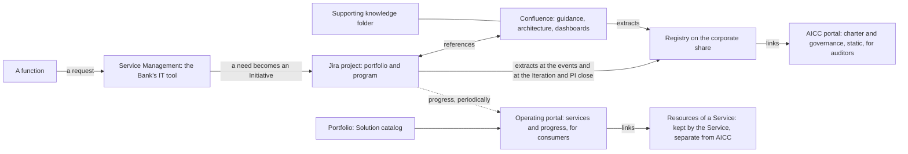

# Collaboration tooling

## 1. Intent and scope

This page lists the tools and the portals that AICC uses, what each is used for, and within which workflows. The charter holds the rules, and the tools hold the work. Each tool adapts to the workflows of the charter, and the charter does not configure the tools. When a tool is deployed, its link is added to the list.

## 2. The tools and the portals

Figure 1 shows how they relate.

Figure 1: the collaboration tooling.

The following table lists them.

| Tool or portal | Used for | Audience | Workflows | Link |
| --- | --- | --- | --- | --- |
| Jira project | Tracking the portfolio and the program: Initiatives, Capabilities (as Epics), and Features on a Kanban, with simple statuses and minimal fields. It is for business and project management, and it holds no code and no data | AICC, partners, and stakeholders | Service delivery; Cadence; Engagement | [ The link of the tool, entered when it is deployed ] |
| Service Management | The Bank's IT tool for requests, support, and onboarding. AICC joins it, so that requests of every kind come through one common entry, from a new need to support, and AICC hosts its own services and support team in it | The whole Bank | Engagement (the contact and the support); Service delivery (operation and support); AI Incident handling | [ The link of the tool, entered when it is deployed ] |
| Confluence | Collaboration: the technical guidance and the ways of working in Jira, the architecture repository of the Solutions and Services, the dashboards of the progress of the PI and the Iteration, and the backlogs by reference to Jira. It is living content with minimal governance | AICC and stakeholders | Service delivery; Cadence; Engagement (drafts of the Service Agreement and the Outcome Report) | [ The link of the tool, entered when it is deployed ] |
| Supporting knowledge folder | Technical guides, working templates, and knowledge material that are not records and not rules | AICC and partners | Service delivery | [ The link of the tool, entered when it is deployed ] |
| Corporate share | The home of the Registry and of the Portfolio documents that the portals link to | AICC; auditors with access | Unit governance | [ The link of the tool, entered when it is deployed ] |
| AICC portal | The charter and the governance with its flows, as a static portal. It links to the evidence records of the Registry on the corporate share | Auditors, the Executive Sponsor, and employees | Unit governance | [ The link of the tool, entered when it is deployed ] |
| Operating portal | A knowledge base of non-sensitive information: the services portfolio and the development efforts, the scenarios, and the proposals, so that the Bank learns about AI. It is static at first, updated when new content is available and not left stale, and later a CMS with a knowledge-base backend for retrieval and chat | Internal consumers | Engagement; Service delivery | [ The link of the tool, entered when it is deployed ] |
| Resources of a Service | The product resources of a Service, kept by the Service and separate from AICC | The users of the Service | Service delivery (operation) | [ The link of the tool, entered when it is deployed ] |

## 3. Where the rules are

The charter prevails, and Confluence, the supporting folder, and the portals never override it. The rules on the content of the tools, on the keeper of each tool, and on the evidence are in the Operating Model 7. Jira and Confluence hold the working state from the cutover, and they are never an evidence store: the Registry holds the evidence as extracts, and the AICC portal links to them. The Registry and the Portfolio are promoted to the corporate share when they are ready, and the portals link to the documents there and do not embed them.
