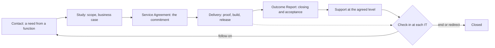

# Engagement workflow

## 1. Intent and scope

This is the top-level workflow of AICC: how AICC and the rest of the Bank work together. AICC works as an internal consulting and innovation lab. A function brings a need, AICC commits to an Engagement in a Service Agreement, delivers an outcome with its evidence, and supports it at the agreed level. The workflow follows a consulting engagement from the first contact to the follow-on, and it sits on top of the other workflows: the service delivery workflow carries the work, and the unit governance workflow controls it.

The rules are in the Business Model, the Operating Model, and the AI Policy. This workflow shows the flow and the intent, and states no rule of its own.

## 2. The engagement lifecycle

An Engagement passes through six steps. Each step ends in a decision or a record, and the function is kept informed throughout.

Figure 1 shows the lifecycle. The Service Agreement is issued at the contact and the study, and amended at the approval.

Figure 1: the engagement lifecycle.

The following table states each step, with its consulting counterpart and where it lives in the other workflows.

| Step | Consulting counterpart | What happens | Decision or record | In the service delivery workflow |
| --- | --- | --- | --- | --- |
| Contact | Lead | A function raises a need, or AICC finds one in its exploration | The item is taken in, or dropped | Funnel: proposed |
| Study | Diagnostic and proposal | AICC scopes the need with the function and writes the business case | The Initiative Brief; the business case is approved | Scoping and Business case: discovery |
| Service Agreement | Statement of work | AICC states what it commits to: the phases, the support level, the capacity, the outcome. It is issued when the study starts and amended when the business case is approved | The Service Agreement, issued by the AICC Lead; the function is notified | Solution Definition; the Initiative is approved |
| Delivery | Delivery of the engagement | AICC proves, builds, and releases the Solution with the function | Check or validation; release; acceptance | Capabilities and Features: approved, active, review |
| Outcome Report | Closing deliverable | AICC reports what was delivered, with the evidence referenced, the capacity used, and who accepted it | The Outcome Report; the acceptance | Accepted, closed |
| Support | Managed service | AICC supports the Solution at the level that the agreement states | Support records and AI Incident handling | Operate, Support |

## 3. The Service Agreement through the Engagement

The Service Agreement is the commitment. It is a working agreement on a best-effort basis, within the capacity and the capability that AICC has available, issued by the AICC Lead when the study starts, with no signature chain. It is amended when the business case is approved, to add the later phases. It is checked in at each IT, and each change is noted in its changes table when the scope is redirected, a Dependency fails, or the capacity changes. The Outcome Report ends it. It has no states of its own: the state of the Engagement is the state of its Initiative.

The Assumptions are the check on the function: they state what AICC relies on, and a failed Assumption re-plans the scope and the dates.

## 4. The support levels

What AICC provides after delivery is chosen for each Engagement. The Solution type follows from it.

| Support level | What AICC does | Solution type |
| --- | --- | --- |
| None | Hands the Solution over, with the Outcome Report | Experiment, or a Product handed over |
| On demand | Answers requests and issues new versions when asked | Product |
| At agreed response targets | Supports to targets that the agreement states | Product |
| Run by AICC | Runs the Solution for its whole life, with its run cost and sunset rule | Service |

## 5. Value, capacity, and knowledge

Each Engagement records the capacity committed in the agreement and the capacity used in the Outcome Report, in days, and the benefit that the function claims and confirms. The Quarterly Report shows them for each Engagement. The figures of the Bank stay in the systems of the Bank, and the records point to them. Every Engagement also leaves its lessons and its reusable assets in the Portfolio, so that the next one starts further on. The Proposals that AICC makes from what it proves feed the AI adoption strategy of the Bank, which the Bank decides.

## 6. Where it runs

From the cutover of the working state (Operating Model 7.1), the Engagement runs in Jira and Confluence: the Initiative and its Capabilities and Features in Jira, the Service Agreement and the Outcome Report drafted in Confluence, and requests and support taken in Service Management. Until then the Registry holds the working state. The charter holds this schema. The Registry always holds the Service Agreement as issued, the Outcome Report as accepted, and the Initiative package, as real documents for audit and for sharing.
