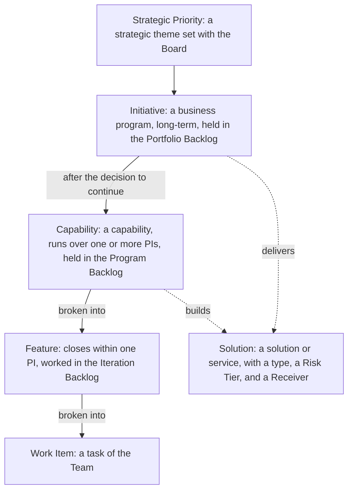
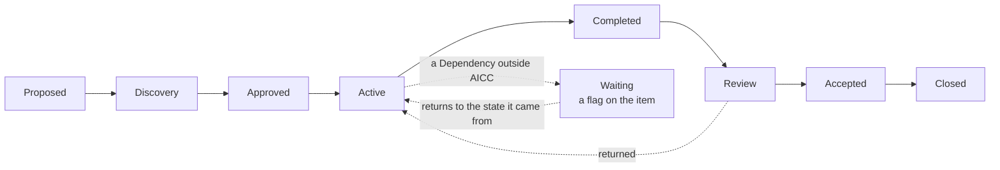
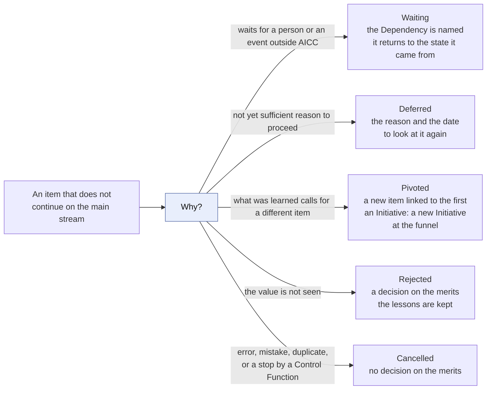
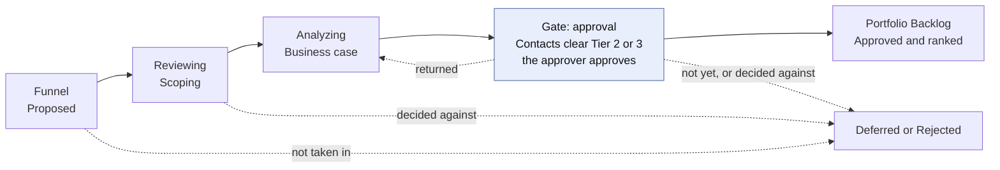
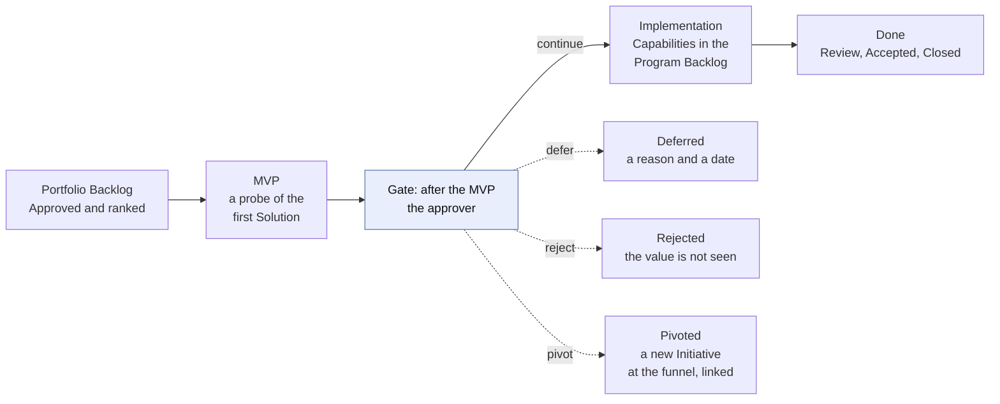
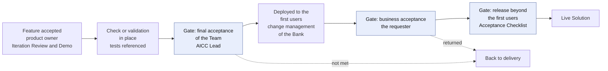
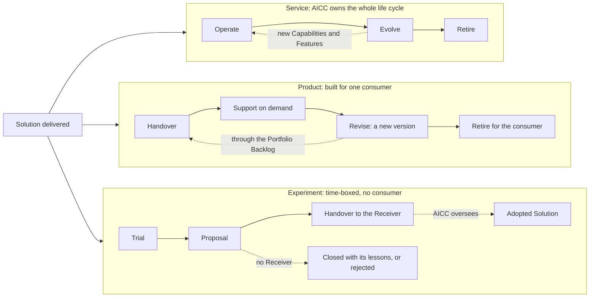
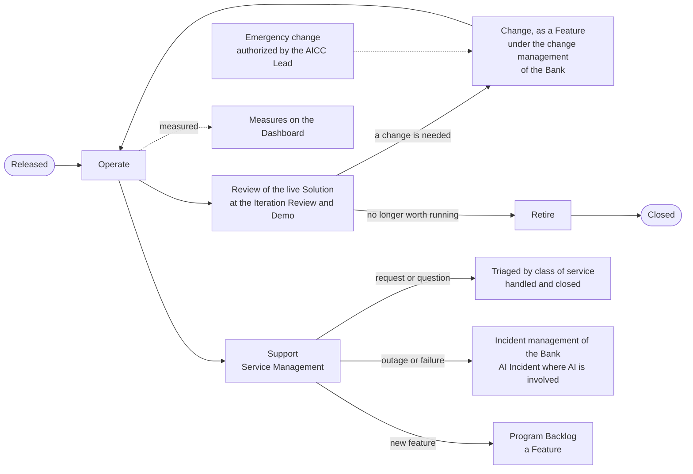

# Portfolio and service delivery workflow

## 1. Intent and scope

This workflow is the value stream of AICC from a business need to a retired solution. It runs from the portfolio Kanban, from the funnel to a ranked backlog and the minimum viable product, through the breakdown into Capabilities and Features and the execution in the Program Increments, to the deployment and the life of the Solution. The portfolio part is the Portfolio Management Model, and the execution and the life cycle are the Solution Lifecycle Model. This workflow shows the whole stream in one view.

AICC is a lab. It defines and tries solutions with the functions, so that the Bank can decide on adoption at scale. Some solutions become services that AICC runs. Some are products built for one consumer. Some are experiments that end in a proposal, which another owner may adopt. AICC also oversees the adoption of solutions that others deliver.

The Engagement workflow sits on top of this one: it states the commitment to the function, and this workflow carries the work. The rules are in the Operating Model, the Portfolio Management Model, the Solution Lifecycle Model, the AI Policy, and the Vocabulary. This workflow shows the flow and the intent, and states no rule of its own. The events are those of the Cadence.

## 2. The levels

The work has six levels. Each level has its own backlog or board, its own stages, and its own horizon.

Figure 1 shows the levels and how each one is broken into the next.

Figure 1: the levels of the work.

The Solution is not a step in the chain: an Initiative delivers it and its Capabilities build it. Enabling work of AICC has a Capability that builds no Solution.

| Level | Backlog or board | Horizon | Closes |
| --- | --- | --- | --- |
| Strategic Priority | Priorities | Years, reviewed yearly | Closed or cancelled by the Executive Sponsor |
| Initiative | Portfolio Backlog and Portfolio Kanban | Long-term | When its outcome is reviewed and accepted |
| Solution | The Portfolio | Per type | When its type ends |
| Capability | Program Backlog and Program Kanban | One or more PIs | When its Features are closed |
| Feature | Program Backlog, then Iteration Backlog | Within one PI | Within its PI, or split |
| Work Item | The Team board | Within the Iteration | With its Feature |

## 3. The states

Every Initiative, Solution, Capability, and Feature has one of thirteen states, defined in the Vocabulary. A Strategic Priority has four (Solution Lifecycle Model 5.1). A Stage is a phase of the work inside the discovery state or the active state.

Figure 2 shows the main stream of an item. Waiting is a state shown as a flag on the item: it is set when a Dependency outside AICC blocks the work in Discovery, Approved, or Active, and the item returns to the state it came from when the Dependency is cleared. A Solution only may go from Active to Closed, when it is retired, handed off, or ended, and from Active back to Discovery when a change raises its Risk Tier. While the Team has up to three people, Completed is skipped, and Accepted and Closed are one step (Solution Lifecycle Model 6.6).

Figure 2: the main stream of an item.

An item may leave the main stream at any gate. Figure 3 shows the routes out. The moves are those of the Solution Lifecycle Model 5.1, which is the only source of them.

Figure 3: the routes out of the main stream.

A Control Function stops a Solution under [AI risk and control](ai-risk-control.md), and the Solution is Cancelled.

## 4. The portfolio flow: from need to Initiative to Capabilities

The portfolio flow takes a need through the portfolio Kanban of the Portfolio Management Model 5, from the funnel to the Capabilities in the Program Backlog. Each gate ends in a decision to approve, return, defer, or reject. The Portfolio Kanban holds the Initiatives. Figures 4 and 5 show the Kanban with its gates and its exits. The Risk Tier, the clearance of the Control Function Contacts, and a stop are in the workflow [AI risk and control](ai-risk-control.md).

Figure 4: the portfolio Kanban from the funnel to the Portfolio Backlog.

Figure 5: the portfolio Kanban from the Portfolio Backlog to Done.

| Step | State and Stage | Intent | Who | Output |
| --- | --- | --- | --- | --- |
| Funnel | Initiative, Proposed | Capture every idea or need from a function, from the discovery work, or from AICC | A function, the discovery work, or AICC proposes; the AICC Lead takes in, defers, or rejects | An entry in the Portfolio Backlog |
| Reviewing | Initiative, Discovery: Scoping | Understand the need and the requirements with the function, and check the fit with the Strategic Priorities, the limit on the Active Initiatives, and the catalog of Solutions | AICC Lead with the Domain Owner | The scope in the Initiative Brief |
| Analyzing | Initiative, Discovery: Business case | State the hypothesis, the outcomes with their leading indicators, the MVP, the cost and value, and the risks, and obtain the clearance of the Control Function Contacts when Risk Tier 2 or 3 is expected. A Risk Tier assigned that is higher than the one cleared returns the business case to the Control Function Contacts (Portfolio Management Model 6.4) | Domain Owner with the AICC Lead; the Executive Sponsor above a guardrail, across Domains, or for enabling work; the Control Function Contacts clear | The Initiative Brief and the Decision Record; the Initiative is approved |
| Portfolio Backlog | Initiative, Approved | Rank the approved Initiatives and take the highest-ranked one that fits into work | AICC Lead | The rank in the Portfolio Backlog |
| MVP | Initiative, Active: MVP | Define the architecture and the Solution Definition of the first Solution, and try it as a probe against the leading indicators | Solution Engineer with the Domain Expert; the Domain Owner approves the Solution Definition, and the AICC Lead assigns the Risk Tier; where the AICC Lead built the Solution, the Executive Sponsor approves the Definition and assigns the Tier (Operating Model 4.4(d)) | The Solution Definition in the Portfolio and the AI Registry entry; the result of the probe |
| Decision after the MVP | Initiative, Active | Continue, pivot, defer, or reject | The approver of the business case | The Decision Log entry and the Decision Record |
| Implementation | Initiative, Active: Implementation | Define the Capabilities and break them into Features, each with acceptance criteria and Dependencies | AICC Lead with the Domain Owner | Capabilities and Features in the Program Backlog, under the Initiative; the Program Board |
| Done | Initiative, Review, Accepted, Closed | Review the outcome against the leading indicators and accept it | Domain Owner, or the Executive Sponsor for enabling work, after the final acceptance of the Team | The acceptance with who and when |

## 5. The execution in the Program Increment

The execution takes the approved Features and builds them, on the loops of the Cadence. The Program Increment states intent and direction, and what is done in an Iteration is decided in that Iteration.

| Step | Event of the Cadence | Intent | Who | Output |
| --- | --- | --- | --- | --- |
| Set the intent | PI Planning | Choose the Capabilities and Features that the PI aims at, with their Dependencies | The Teams and the Domain Owners | The PI Objectives; the Program Board; the proposed Roadmap, confirmed at the quarterly Steering |
| Select the Features | Iteration Planning | Select the Features for the month into the Iteration Backlog | The Team with the product owner | The Iteration Backlog |
| Develop | Weekly loops | Build the minimum solution with the function | Solution Engineer with the Domain Expert | Working increments |
| Verify | Before every deployment | Test every Feature, and the MVP, by a person other than the builder outside production, with the result referenced in the Feature (Solution Lifecycle Model 7.1); and the check for Risk Tier 1, or the validation by the Control Function Contacts for Risk Tier 2 and 3, before the first deployment to real users or data | A person other than the builder; the Checker; the Control Function Contacts | The test result in the Feature; the check, or the Control Sign-Off |
| Deploy | Weekly loops | A Feature is deployed to the environment of use after its test and check. The deployment of the Solution to its first users, and of each significant change, follows the final acceptance of the Team. A deployment to production follows the change management of the Bank: raise the change, enter the change ticket and the test result in the Feature, and use the access process of the Bank (Solution Lifecycle Model 8.3). The first users are trained before use (Solution Lifecycle Model 7.1, AI Policy 2.1) | Solution Engineer; the change management of the Bank approves; the Platform Owner for the platform | A deployed Feature, with its change ticket and test result |
| Demonstrate and accept | Iteration Review and Demo | Show what works, and take the acceptance of each Feature and each Capability (Solution Lifecycle Model 7.3(a)) | Product owner (the AICC Lead while the Team has up to three people) | The acceptance, with who and when |
| Give the final acceptance of the Team | Before the first deployment of a Solution to its first users, and of a significant change | Confirm that the Solution meets the acceptance criteria of its Solution Definition, that its tests are referenced, and that its check or validation is in place (Solution Lifecycle Model 7.3(b)) | AICC Lead | The final acceptance of the Team in the release block of the Solution Definition, with who and when |
| Judge and accept the Solution | When the Solution works for its first users | Judge the Solution against the acceptance criteria, and accept it, return it, or reject it (Solution Lifecycle Model 7.3(c)) | Domain Owner; the Executive Sponsor for an item across Domains, enabling work, or an Experiment with no Domain, and where the AICC Lead is the Domain Owner | The business acceptance in the release block of the Solution Definition; the Outcome Report for an Engagement |
| Release | Before use beyond the first users | Decide that the Solution goes beyond its first users, with the Acceptance Checklist signed where AICC hands the Solution to a Domain (Solution Lifecycle Model 7.1, 7.4) | Domain Owner (the Executive Sponsor where the AICC Lead is the Domain Owner); Executive Sponsor for Risk Tier 3 | The release block of the Solution Definition, and the Acceptance Checklist |
| Control the flow | Weekly Review | Keep the boards, the Limits, and the Dependencies under control | AICC Lead | The Dashboard |

The AICC Lead does not check, validate, release, or give the business acceptance of a Solution that the AICC Lead built (Operating Model 4.4(d)).

Figure 6 shows the order in which a Feature and a Solution are accepted, checked, and released.

Figure 6: the acceptance, the check, the deployment, and the release.

## 6. After delivery: three types of Solution

The offering type of a Solution, set in its definition, decides its life after delivery and who owns it. The Receiver is named in the Solution Definition before the Solution is approved.

Figure 7 shows the three lives.

Figure 7: the life of a Solution by type.

| Type | Owner after delivery | Life | End |
| --- | --- | --- | --- |
| Service | AICC, with a business case that states the run cost and a sunset rule | Operate, Evolve, Retire | Retired or cancelled |
| Product | The consumer owns the version; AICC supports on demand | Handover, Support, Revise, Retire for the consumer; a Product with many consumers or recurring requests becomes a Service through a business case | Retired for the consumer |
| Experiment | None yet; the Executive Sponsor accepts it where it has no Domain, and otherwise the Domain Owner (Solution Lifecycle Model 8.1) | Trial, Proposal, Handover when a Receiver accepts it | Handed off, closed with its lessons without a Receiver, a Proposal, or rejected |

Operation and support answer the requests of the users and the incidents. AICC reassesses the Risk Tier on a change, each year for Risk Tier 2, and each six months for Risk Tier 3 (AI Policy 3.3). The following table points to the clauses that govern the life of a live Solution, and Figure 8 shows how the steps follow each other.

| Step | Intent | Who | Output | Where the rule is |
| --- | --- | --- | --- | --- |
| Operate and support | Run the Solution, answer the requests and the incidents, and review the live Solution at each Iteration Review and Demo | The IT function that operates it; the Domain Owner reviews, and the Executive Sponsor for a Service across Domains | The ticket in Service Management; the note of the review in the Solution Definition | Solution Lifecycle Model 8.4, 8.5 |
| Change | Handle a change to a released Solution as a Feature, and decide whether a significant change needs a new check or validation. An emergency change follows the emergency procedure of the change management of the Bank: the AICC Lead authorizes it, and the Executive Sponsor reviews it within five working days | The Solution Engineer; the change management of the Bank approves; the AICC Lead decides on a new check and authorizes an emergency change | The Feature with its change ticket; the Decision Log entry | Solution Lifecycle Model 8.6 |
| Retire | Remove the access, handle the data, and mark the AI Registry entry before the Solution is closed | The Solution Engineer; the Domain Owner or the Executive Sponsor approves | The approval and the dates in the Solution Definition | Solution Lifecycle Model 8.7 |
| Measures | Read the flow, the quality, and the health of the operation to control and to improve, and not to rank people | The AICC Lead, with the Team | The Dashboard | Solution Lifecycle Model 10 |

Figure 8: the life of a live Solution.

## 7. Oversight of the Adopted Solutions

AICC oversees the Adopted Solutions that others deliver, in the Portfolio, with their state, and reports on what was adopted and what works. The AI adoption strategy is a series of Proposals that AICC shapes from what it learns, and the Bank decides on them. The AICC Lead reviews the Adopted Solutions at each quarterly Steering, and the Quarterly Report records the review (Solution Lifecycle Model 8.2). The owners and the Executive Sponsor decide on a Proposal of a Solution. The AICC Lead prepares the yearly Proposal of the AI adoption strategy, the Executive Sponsor presents it at the yearly Steering, and the Bank decides on it (Operating Model 6.5). This is the mission side of the lab.

## 8. Decisions along the stream

The [Service delivery guide](../guides/service-delivery-guide.md) section 4 lists the decisions along the stream, and the Unit governance workflow shows how a decision moves.

## 9. Where it runs

From the cutover of the working state (Operating Model 7.1) the stream runs in Jira and Confluence, and until then the Registry holds the working state. The charter holds this schema, and the Registry and the Portfolio hold the evidence records. Jira stays clean: a few statuses and one flag, while the exact business state is in a field.

| Business state | Jira status |
| --- | --- |
| Proposed, Discovery | Backlog |
| Approved | Ready |
| Active, Completed, with the Stage in a field | Active |
| Review | Review |
| Accepted, Closed | Done, with the acceptance with who and when in a field |
| Deferred, Pivoted, Rejected, Cancelled | Off the flow of the board, shown by a state field or by a resolution |
| Waiting | A flag on the issue, in the status of the state it came from |
