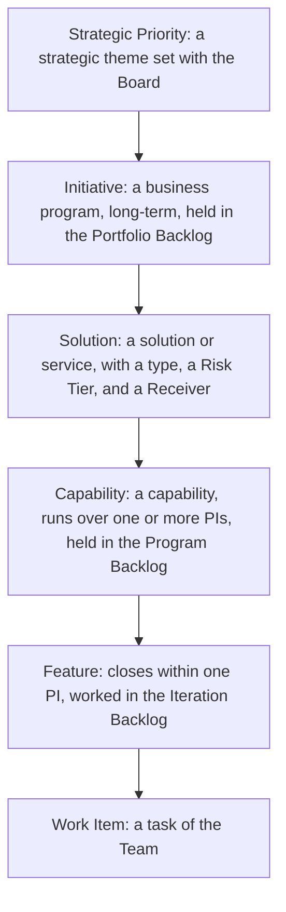
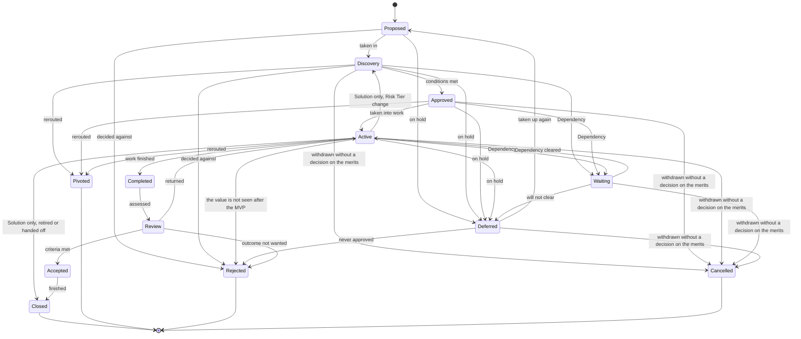
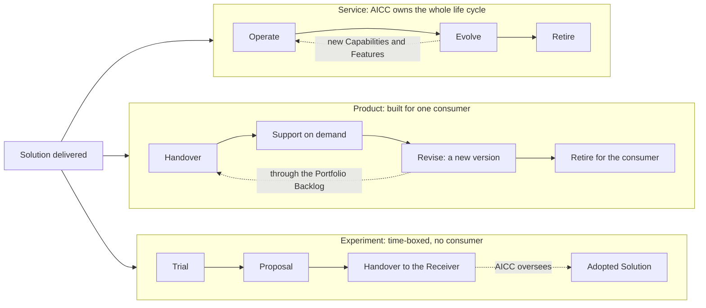

# Portfolio and service delivery workflow

## 1. Intent and scope

This workflow is the value stream of AICC from a business need to a retired solution. It follows the flow of the Scaled Agile Framework: the portfolio Kanban from the funnel to a ranked backlog and the minimum viable product, the breakdown into Capabilities and Features, the execution in the Program Increments, and the continuous delivery pipeline. The portfolio part is the Portfolio Management Model, and the execution and the life cycle are the Solution Lifecycle Model. This workflow shows the whole stream in one view.

AICC is a lab. It defines and tries solutions with the functions, so that the Bank can decide on adoption at scale. Some solutions become services that AICC runs. Some are products built for one consumer. Some are experiments that end in a proposal, which another owner may adopt. AICC also oversees the adoption of solutions that others deliver.

The Engagement workflow sits on top of this one: it states the commitment to the function, and this workflow carries the work. The rules are in the Operating Model, the Portfolio Management Model, the Solution Lifecycle Model, the AI Policy, and the Vocabulary. This workflow shows the flow and the intent, and states no rule of its own. The events are those of the Cadence.

## 2. The levels

The work has six levels. Each level has its own backlog or board, its own stages, and its own horizon.

Figure 1 shows the levels and how each one is broken into the next.

Figure 1: the levels of the work.

| Level | Backlog or board | Horizon | Closes |
| --- | --- | --- | --- |
| Strategic Priority | Priorities | Years, reviewed yearly | Closed or cancelled by the Executive Sponsor |
| Initiative | Portfolio Backlog and Portfolio Kanban | Long-term | When its outcome is reviewed and accepted |
| Solution | The Portfolio | Per type | When its type ends |
| Capability | Program Backlog and Program Kanban | One or more PIs | When its Features are closed |
| Feature | Program Backlog, then Iteration Backlog | Within one PI | Within its PI, or split |
| Work Item | The Team board | Within the Iteration | With its Feature |

## 3. The states

Every item of every level has one of thirteen states, defined in the Vocabulary. A Stage is a phase of the work inside the discovery state or the active state.

Figure 2 shows how an item moves between the states. It follows the transition table of the Solution Lifecycle Model 4.1, which is the only source of the moves. Waiting returns to the state the item came from.

Figure 2: the states of an item.

## 4. The portfolio flow: from need to Initiative to Capabilities

The portfolio flow takes a need through the portfolio Kanban of the Portfolio Management Model 5, from the funnel to the Capabilities in the Program Backlog. Each gate ends in a decision to approve, return, defer, or reject. The Portfolio Kanban holds the Initiatives.

| Step | State and Stage | Intent | Who | Output |
| --- | --- | --- | --- | --- |
| Funnel | Initiative, Proposed | Capture every idea or need from a function, from the discovery work, or from AICC | A function, the discovery work, or AICC proposes; the AICC Lead takes in, defers, or rejects | An entry in the Portfolio Backlog |
| Reviewing | Initiative, Discovery: Scoping | Understand the need and the requirements with the function, and check the fit with the Strategic Priorities, the capacity, and the catalog of Solutions | AICC Lead with the Domain Owner | The scope in the Initiative Brief |
| Analyzing | Initiative, Discovery: Business case | State the hypothesis, the outcomes with their leading indicators, the MVP, the cost and capacity, and the risks, and obtain the clearance of the Control Function Contacts when Risk Tier 2 or 3 is expected | Domain Owner with the AICC Lead; the Executive Sponsor above a guardrail or across Domains; the Control Function Contacts clear | The Initiative Brief and the Decision Record; the Initiative is approved |
| Portfolio Backlog | Initiative, Approved | Rank the approved Initiatives and take the highest-ranked one that fits into work | AICC Lead | The rank in the Portfolio Backlog |
| MVP | Initiative, Active: MVP | Define the architecture and the Solution Definition of the first Solution, and try it as a probe against the leading indicators | Solution Engineer with the Domain Expert; the Domain Owner approves the Solution Definition | The Solution Definition in the Portfolio and the AI Registry entry; the result of the probe |
| Decision after the MVP | Initiative, Active | Continue, pivot, defer, or reject | The approver of the business case | The Decision Log entry |
| Implementation | Initiative, Active: Implementation | Define the Capabilities and break them into Features, each with acceptance criteria and Dependencies | AICC Lead with the Domain Owner | Capabilities and Features in the Program Backlog, under the Initiative; the Dependency Map |
| Done | Initiative, Review, Accepted, Closed | Review the outcome against the leading indicators and accept it | Product owner | The acceptance with who and when |

## 5. The execution in the Program Increment

The execution takes the approved Features and builds them, on the loops of the Cadence. The Program Increment states intent and direction, and what is done in an Iteration is decided in that Iteration.

| Step | Event of the Cadence | Intent | Who | Output |
| --- | --- | --- | --- | --- |
| Set the intent | PI Planning | Choose the Capabilities and Features that the PI aims at, with their Dependencies | The Teams, the Domain Owners, the Executive Sponsor | The PI Objectives; the Roadmap |
| Select the Features | Iteration Planning | Select the Features for the month into the Iteration Backlog | The Team with the product owners | The Iteration Backlog |
| Develop | Weekly loops | Build the minimum solution with the function | Solution Engineer with the Domain Expert | Working increments |
| Verify | Before the first deployment | The check for Risk Tier 1; the validation by the Control Function Contacts for Risk Tier 2 and 3 | The Checker; the Control Function Contacts | The check, or the Control Sign-Off |
| Deploy | Weekly loops | Deploy the first Feature to the function, with training for the users, only after the check or the validation | Solution Engineer; the Platform Owner for the platform | A deployed Feature |
| Release | At the Iteration Review, or when ready | Decide that the Solution goes beyond its first users | Domain Owner; Executive Sponsor for Risk Tier 3 | The release, in the Solution Definition |
| Demonstrate and accept | Iteration Review and Demo | Show what works, and take the acceptance | Product owner | The acceptance, with who and when |
| Control the flow | Weekly Review | Keep the boards, the Limits, and the Dependencies under control | AICC Lead | The Dashboard |

A Feature closes within its Program Increment. A Feature that cannot close is split: the part that is done is a Feature that goes to review, and the rest is a new Feature in the next Program Increment. The original is Pivoted and linked to both. A Feature does not become approved until its Dependencies are known.

## 6. After delivery: three types of Solution

The offering type of a Solution, set in its definition, decides its life after delivery and who owns it. The Receiver is named in the Solution Definition before the Solution is approved.

Figure 3 shows the three lives.

Figure 3: the life of a Solution by type.

| Type | Owner after delivery | Stages | Rule | End |
| --- | --- | --- | --- | --- |
| Service | AICC | Operate, Evolve, Retire | A business case with the run cost and a sunset rule | Retired or cancelled |
| Product | The consumer owns the version; AICC supports on demand | Handover, Support, Revise, Retire for the consumer | A Product with many consumers or recurring requests becomes a Service through a business case | Retired for the consumer |
| Experiment | None yet | Trial, Proposal, Handover | Time-boxed to a stated number of Iterations; the Handover is complete when the Receiver accepts it | Handed off, closed with its lessons, or cancelled |

Operation and support answer the requests of the users and the incidents, with the lane Urgent first. AICC reassesses the Risk Tier on a change and on its date in the AI Registry.

## 7. Oversight of the Adopted Solutions

AICC oversees the Adopted Solutions that others deliver, in the Portfolio, with their state, and reports on what was adopted and what works. The AI adoption strategy is a series of Proposals that AICC shapes from what it learns, and the Bank decides on them. This is the mission side of the lab.

## 8. Decisions along the stream

Who decides what along the stream is in the Operating Model 4.2 and 5.3, in the Solution Lifecycle Model 4 to 7, and in the AI Policy 2 and 3. This workflow states no decider of its own.

## 9. Where it runs

From the cutover of the working state (Operating Model 7.1) the stream runs in Jira and Confluence. The charter holds this schema, and the Registry and the Portfolio hold the records that an auditor may ask for. Jira stays clean: a few statuses, one flag, and one resolution, while the business states are in the charter and a field.

| Business state | Jira status |
| --- | --- |
| Proposed, discovery, deferred | Backlog |
| Approved | Ready |
| Active, with its Stage in a field (waiting is a flag on the issue) | Active |
| Completed, review | Review |
| Accepted, closed, pivoted, rejected, cancelled | Done, with a resolution: Closed (for accepted and closed, the acceptance with who and when in a field), Pivoted, Rejected, or Cancelled |

| In the stream | In Jira and Confluence | Kept in the Registry or the Portfolio |
| --- | --- | --- |
| Initiative, Capability, Feature, Work Item | Initiative above Epic, a Capability as an Epic, a Feature issue type, and a sub-task. The Initiative level needs the edition of Jira that has it | The Initiative Brief; the Program Backlog at the close of the PI |
| The Stage and the exact business state of an item | Fields on the issue, where the five statuses are not enough to tell proposed, discovery, and deferred apart | The state and Stage in the snapshot |
| A Solution | A Confluence page for its Solution Definition, and a label or component on its Capabilities (Epics) | The Solution Definition in the Portfolio |
| Waiting on a Dependency | A link between items and a flag on the issue | The Dependency Map at the close of the PI |
| Lanes | The priority of the issue: Urgent, High, Normal | Not kept |
| Iteration and PI | A Jira sprint for each Iteration, and a field for the PI | The Calendar |
| Solution definitions, notes, forms, and reports | Confluence pages and page templates | The Solution Definition, the decisions, the Control Sign-Offs, the incident records, and the Quarterly Report |
