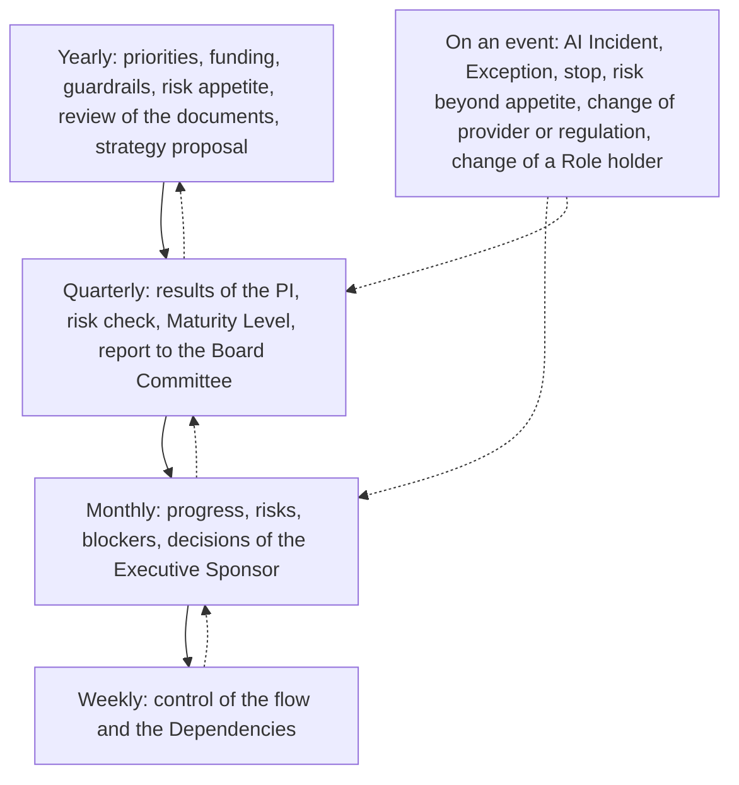
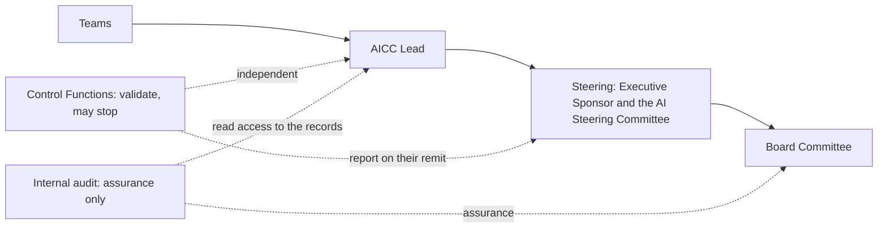
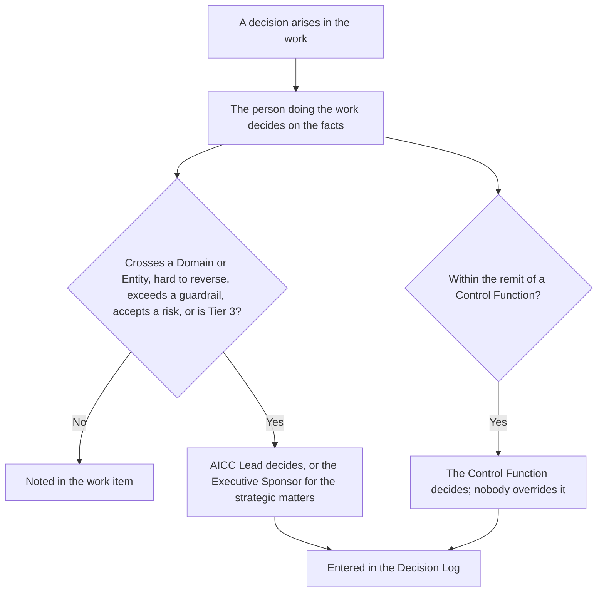
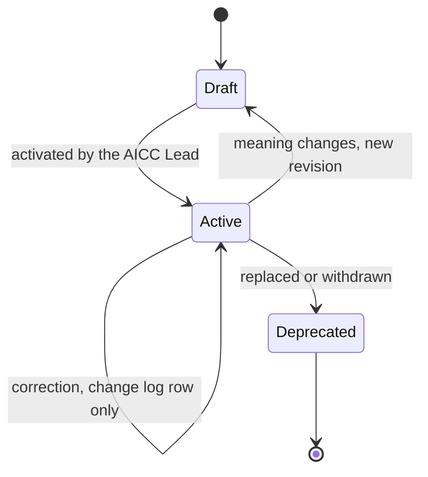

# Unit governance workflow

## 1. Intent and scope

This workflow is the control loop of AICC as an organizational unit: how the unit is directed, how its work is organized and
reported, and how it is controlled. It is the governance and administration that an auditor expects to find in a bank, and the
answer to the question "how does your unit operate?". It covers the mandate, the planning, the reporting, the decisions, the
controls, and the assurance. It does not cover how a solution is delivered, which is in the service delivery workflow.

The rules are in the Operating Model, the AICC Charter, and the AI Policy. This workflow shows the flow and the intent. It states no
rule of its own. The events are those of the Cadence. Each control produces a record, and the guide to the Registry, when it exists, states which.

## 2. The control loop by horizon

The loop runs on four horizons and on events. Each horizon takes the result of the shorter one below it and sets the direction of
the next.

Figure 1 shows the loop. Direction flows down, from the yearly horizon to the weekly one, and control flows up, from the weekly
review to the yearly strategy.

Figure 1: the control loop of the unit.

The following table states each horizon.

| Horizon | Events of the Cadence | What is set or reviewed | Decided by | Record produced |
| --- | --- | --- | --- | --- |
| Yearly | The first quarterly Steering of the year | Strategic Priorities, Investment Envelopes, Guardrails, the Roadmap, the AI Risk Appetite Statement, the documents, and the strategy proposal | Executive Sponsor, with the AICC Lead owning the documents | Decision Log; Priorities; strategy proposal |
| Quarterly | PI Review and Demo, Inspect and Adapt, PI Planning, quarterly Steering | The results of the PI, the quarterly risk check with the Control Function Contacts, the Maturity Level, the next PI | Executive Sponsor | Quarterly Report; report to the Board Committee; PI snapshot; Decision Log |
| Monthly | IT Review and Demo, monthly Steering | Progress, risks, blockers, acceptances | Executive Sponsor for his decisions; product owners for acceptance | Decision Log; Notes |
| Weekly | Weekly Planning, Weekly Review | The flow, the Limits on Work in Progress, the Dependencies | AICC Lead | Dashboard |
| On an event | Not scheduled | An AI Incident, an Exception, a stop, a risk beyond appetite, a change of provider or regulation, a change of a Role holder | As the Operating Model states | Decision Log; Risks and Issues; Appointments |

## 3. The reporting chain

Reporting flows from the Team up to the Board Committee, and the Control Functions and internal audit stand beside it, independent
of it.

Figure 2 shows the reporting chain and the independent lines.

Figure 2: the reporting chain.

## 4. How a decision moves

A decision is taken by the person doing the work, on the facts. It goes up only when one of the conditions of the Operating Model
applies. A Control Function decides within its remit, and nobody overrides it.

Figure 3 shows how a decision moves.

Figure 3: the movement of a decision.

## 5. The controls an auditor can test

Each control is an event that already exists, and each leaves a record. The following table lists them.

| Control | When | Owner | Evidence in the Registry |
| --- | --- | --- | --- |
| The mandate and the appointment of the AICC Lead | When it changes | Executive Sponsor | Appointments |
| Priorities, funding, and guardrails | Yearly, and on change | Executive Sponsor | Priorities; Decision Log |
| The risk appetite and the policy | Yearly, and on an extra review | AICC Lead, with the Executive Sponsor | Decision Log |
| Review of the documents | Yearly, and when the meaning changes | AICC Lead | Document check; Decision Log |
| Monthly review of progress, risks, and blockers | Monthly | Executive Sponsor | Decision Log; Notes |
| Results, risk check, and Maturity Level | Quarterly | Executive Sponsor | Quarterly Report; PI snapshot |
| Report to the Board Committee | Quarterly | AICC Lead prepares; Executive Sponsor approves | Board report |
| Risk Tier assignment | When each Solution is defined | AICC Lead | Solution Definition |
| Validation before the first deployment of Tier 2 or 3 | Before the first deployment | Control Function Contacts | Control Sign-Off |
| Release | Before use beyond the first users | Domain Owner; Executive Sponsor for Tier 3 | Decision Log |
| Acceptance of a deliverable | At the IT Review | Product owner | Deliverable record |
| An AI Incident | When it happens | AICC Lead; Control Function Contacts | Incident record |
| An Exception | When requested | The Control Function concerned | Exception record |
| Output published to the Board or investors | Each issue | Executive Sponsor | Record of the approval |
| Separation of duties and independence | Always | Everyone; checked in the document check | Appointments |
| Access of internal audit to the records | Always | AICC Lead | The Registry itself |

## 6. Separation and independence

| Who | May not |
| --- | --- |
| Anyone | Validate or check work they built |
| The owner of a Solution | Validate it |
| The AICC Lead | Validate a Solution within the remit of a Control Function |
| A Control Function Contact | Be a member of AICC, or build what the Contact reviews |
| Internal audit | Validate, release, or stop; it gives assurance only |
| The Executive Sponsor | Set aside a validation or a stop |

## 7. The life of a document

Documents are changed like software. A change that alters the meaning is a new draft revision that does not replace the active text
until it is activated, and every activation is entered in the Decision Log.

Figure 4 shows the life of a document.

Figure 4: the life of a document.

## 8. Where it runs

The loop runs in the tools of AICC, Confluence for the notes and reports and Jira for the dashboards and the board. The charter
holds this schema. The Registry holds the static record of each outcome that an auditor may ask for, taken when the event happens
or at the close of the PI. Raw material stays in the tools or in the systems of the functions, and the Registry points to it.
