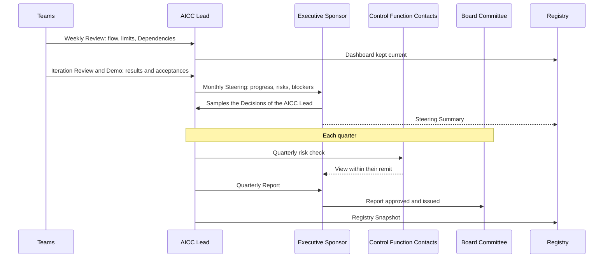
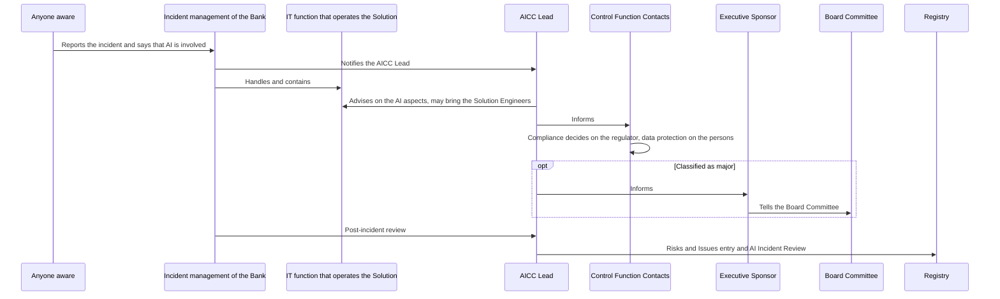
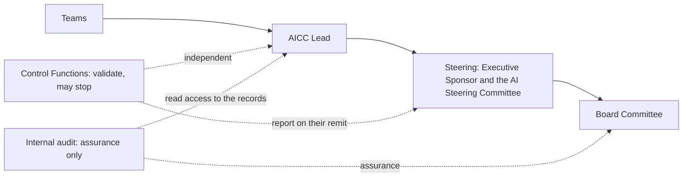
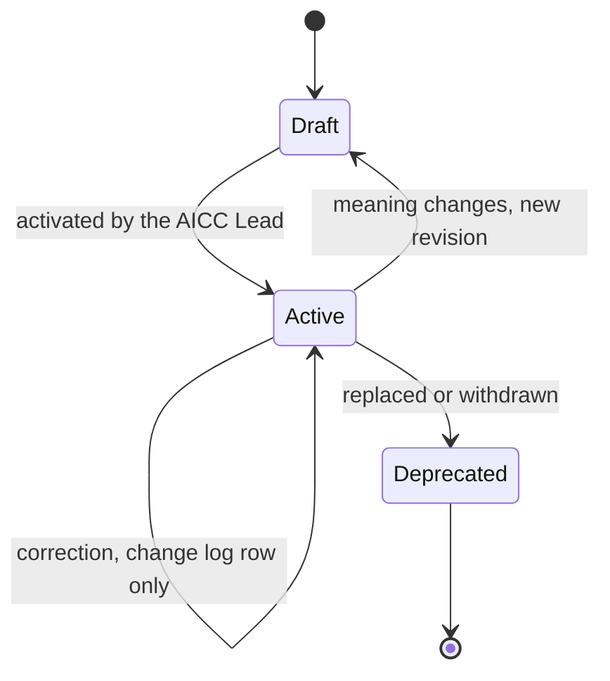

# Unit governance workflow

## 1. Intent and scope

This workflow shows how AICC is directed, reported, and controlled as a unit of the Bank, and who does what in sequence. It answers the question "how does your unit operate?". The loops, the states, and the controls are drawn in the Operating Model, and this workflow does not draw them again. It adds the sequences between the Roles, which show the flow in time.

The rules are in the Operating Model, the Portfolio Management Model, the Solution Lifecycle Model, the AICC Charter, and the AI Policy. This workflow shows the flow and the intent, and states no rule of its own.

## 2. Where each loop is drawn

The control of the unit runs as five loops that apply one control cycle, and the portfolio runs as four loops on the same events. The following table says where each loop and each state machine is drawn.

| Loop | What it answers | Where it is drawn | Controls it carries |
| --- | --- | --- | --- |
| The cycle of a control | Trigger, decision, record, review, and correction | Operating Model, Figure 7 | Every control |
| Decision | Who decides, and how a Decision is logged and sampled | Operating Model, Figure 1 | Not assigned to a loop in the Operating Model |
| Direction, yearly | Who sets the appetite and the policy, reviews the documents, and presents the yearly Proposal, at the yearly Steering | Operating Model, Figure 2 | C-01, C-02, C-03, C-04, C-20 |
| Assurance, quarterly | How the Steering sees that the controls operate, and what it reports | Operating Model, Figure 3 | C-06, C-07, C-11, C-16, C-20, C-24, C-26, C-27, C-28 |
| Control, monthly | How the Steering reviews the sample, the Exceptions, and the deficiencies | Operating Model, Figure 4 | C-05, C-17, C-29, C-32 |
| Operating, weekly | How the AICC Lead keeps the flow under control | Operating Model, Figure 5 | None; the Dashboard is a working record |
| Event | What happens when something goes wrong or changes | Operating Model, Figure 6 | C-01, C-16, C-17, C-19, C-27, C-30, C-31, C-32 |
| The status of a control | Operating, Open, Deficiency, No occurrence yet, or Not yet due | Operating Model, Figure 8 | The Control Matrix |
| The portfolio loops | Strategic, portfolio review, portfolio sync, and backlog care | Portfolio Management Model, Figures 1 to 4 | C-02, C-08, C-09, C-23, C-24 |

## 3. A month and a quarter in sequence

The Teams, the AICC Lead, the Executive Sponsor, the Control Function Contacts, and the Board Committee exchange the following each month and each quarter. Figure 1 shows the sequence.

Figure 1: a month and a quarter in sequence.

## 4. An AI Incident in sequence

The incident is owned by the incident management of the Bank, and the AICC Lead is a stakeholder. Figure 2 shows who does what, in order.

Figure 2: an AI Incident in sequence.

## 5. The reporting chain

Reporting flows from the Teams up to the Board Committee, and the Control Functions and internal audit stand beside it, independent of it. Figure 3 shows the reporting chain and the independent lines.

Figure 3: the reporting chain.

## 6. The life of a document

The Document Catalog 3 and 4 state the life of a document. Figure 4 shows it.

Figure 4: the life of a document.

## 7. Where it runs

The loop will run in Jira and Confluence from the cutover of the working state (Operating Model 7.1): Confluence for the notes and reports, and Jira for the dashboards and the board. Until then the Registry holds the working state. The charter holds this schema. The Registry always holds the evidence record of each outcome that an auditor may ask for, and the raw material stays in the tools or in the systems of the functions.
