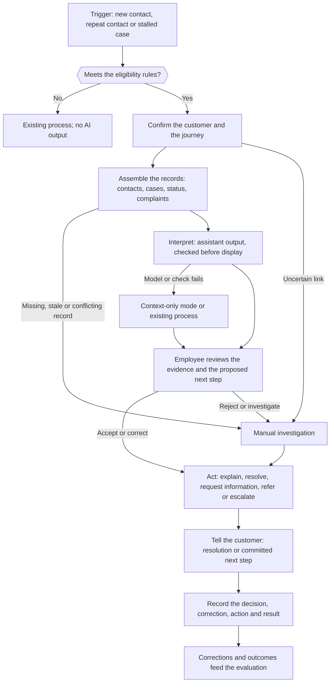

## How the pilot works {#how-it-works-how-the-pilot-works}

This page describes what a service employee gets in the pilot, how one customer case moves through it, what the employee and the assistant may each do, and where the pilot stops. The controls behind each limit, and the evidence that shows they work, are on [Controls and evidence](#controls). The build is on [Technical design](#technical-design), and the decisions on the way to live use are on [Governance and roles](#governance).

### The problem {#how-it-works-the-problem}

A customer contacts the Bank several times about the same issue. Calls, chats, cases, complaints and status changes sit in separate records. The employee rebuilds the history by hand, and may miss the actual blocker, ask again for information the customer already gave, or transfer the customer again.

The pilot tests one answer, for one journey and one service team: give the employee one verified view of the customer's unresolved issue and a suggested next step, and leave every decision and every action with the employee.

### What is built {#how-it-works-what-is-built}

The pilot builds three parts. Their outputs serve only the resolution of service cases and the evaluation of the assistant. What can be reused later is the components and the evaluation sets, not customer data.

| Part | What it does | What it does not do |
| --- | --- | --- |
| Employee workspace | A panel in, or next to, the existing service desktop. It shows the case view below, takes the employee's decision, and carries out the actions the employee clicks, through the existing systems and under the employee's own access. | It has no function that sends a message to a customer, and no open chat with the model. |
| Customer context service | Reads the records the journey needs, links them to the customer and the case, and builds one timeline. Each value carries its source record and the time it was read. It keeps a snapshot of what was shown for each case. | It decides no status. It writes nothing to the Bank's systems. It reads only the fields listed in the context contract for the journey. |
| Assistant | An AI model that the workflow calls with the case snapshot and the approved procedure. It returns structured output: a summary of what happened, the likely blocker, a proposed next step as a code from the approved action list, and draft text for the employee. | It holds no tools. It reads nothing by itself, writes nothing, and acts on nothing. It keeps nothing between cases. |

### What the employee sees for each case {#how-it-works-what-the-employee-sees}

- **Customer request:** the need being handled now.
- **What happened:** a short timeline of earlier contacts and actions, each line with its source record.
- **Verified current state:** the status as the journey system holds it, with the time it was read.
- **Steps:** the completed, pending and failed steps of the case.
- **Likely blocker:** marked as an inference, with the records it rests on.
- **Applicable procedure:** the approved procedure and the section that applies.
- **Proposed next step:** one item from the approved action list for the verified state, or none.
- **Suggested explanation for the customer:** a draft marked "AI-drafted", which the employee may use, change or ignore.
- **Source records:** a reference to each underlying record, and a link where the source system supports one.
- **Employee decision:** accept, correct, reject, investigate, or escalate.

### Where it fits the existing service process {#how-it-works-where-it-fits}

The pilot adds to the existing servicing workflow at fixed points. It replaces no step, and the queue rules and procedures stay with their owners.

| Existing step | Work today | What the pilot adds | Who decides |
| --- | --- | --- | --- |
| Contact intake | identify the customer and capture the reason for the contact | shows related earlier contacts and open cases | the employee |
| Triage and routing | classify the request and choose the queue | proposes the journey and the issue from the records | the employee, under the queue rules of the process function |
| Investigation | search notes and check several systems | one timeline with a source reference on each line | the employee |
| Blocker diagnosis | work out why the issue is still open | completed, pending, failed or missing steps, and the likely blocker marked as an inference | the employee |
| Next-step selection | interpret the procedure and decide what to do | the procedure and the actions permitted for the verified state | the employee, from the list the process function approved |
| Resolution or referral | act, transfer, or escalate | a referral prefilled with the case context | the employee, by clicking the action |
| Customer communication | explain the current state and what happens next | a draft explanation built from the source records | the employee, who speaks in their own words or edits and sends a written reply from the existing channel |
| Closure | enter notes and the resolution code | a draft case note and a structured outcome record | the employee, who saves them |
| Quality and improvement | sample contacts and review complaints | patterns of repeat contact and upstream failure | the process function, in its own improvement list |

The pilot starts when a relevant contact or stalled case is identified. It ends when the customer has a resolution or an explicit next step and the result is recorded. A fix to the upstream process that the pilot reveals goes to the process function's own improvement list, not into the pilot.

### Operational workflow for each customer case {#how-it-works-case-workflow}

1. **Trigger.** A new contact, a repeat contact, or a stalled case arrives in the pilot queue. Fixed eligibility rules (journey, type, state) decide whether the case enters the pilot. A case out of scope follows the existing process, and the workspace shows no AI output for it.
2. **Confirm the customer and the journey.** The context service links the customer, the journey record and the open case through the Bank's identifiers. If the link is uncertain, the case goes to manual investigation.
3. **Assemble the records.** The context service collects contacts, cases, status and complaints. If a required record is missing, older than the freshness limit, or in conflict with another source, the workspace shows what it has, marks the gap, and routes the case to manual investigation. This rule is set in code; it does not depend on the model's own confidence.
4. **Interpret.** The workflow sends the snapshot and the procedure to the assistant. The output is checked before anything is shown (see [What the assistant may and may not do](#how-it-works-assistant-limits)).
5. **Review.** The employee reads the evidence and the proposed next step, and accepts, corrects, rejects, investigates, or escalates.
6. **Act.** The employee explains, resolves, requests missing information, refers, or escalates, through a workspace action or the existing system.
7. **Tell the customer.** The employee gives the resolution or a committed next step.
8. **Record.** The workspace records the decision, any correction, the action and the result in the pilot's own store. Corrections and outcomes feed the evaluation of the assistant.

If the model or a check fails, the workspace shows the linked records without the generated part (the context-only mode), or the employee works the case in the existing process. The existing complaint, correction, escalation and human-service routes stay open throughout.

### What the employee can do {#how-it-works-employee-actions}

The process function of the selected journey (Payments Operations, Disputes Operations, or Onboarding/KYC, where KYC stands for know-your-customer) approves a short action list for each case state. The common list is below; a journey annex may remove actions from it but not add to it.

| Action | What the assistant contributes | What the employee does | Where it is recorded |
| --- | --- | --- | --- |
| Explain the current status and the reason for delay | a draft explanation from the source records | says it, or edits it and sends it from the existing channel | the channel's own record; decision in the pilot store |
| Complete an outstanding internal service step | names the step and the procedure section | performs the step in the existing system under their own access | the existing system |
| Request specific missing information, once | a draft request that lists only what is missing | checks it and sends it from the existing channel | the channel's own record |
| Correct routing or ownership | proposes the queue or owner | changes the routing in the case system | the case system |
| Create a callback or specialist referral with full context | prefills the referral | reviews it and clicks "create"; the workspace calls the existing referral interface under the employee's identity | the referral system |
| Give a committed next step and the expected service state | a draft | states it to the customer | the pilot store |
| Escalate a complaint, suspected fraud, a customer who needs special handling under the Bank's service rules, or another specialist condition | flags the condition when the records show it | escalates through the existing route | the existing route |
| Record the outcome and feedback | a proposed outcome code | confirms or changes it and clicks "record" | the pilot store |

Every write is the employee's action. A write happens only when the employee clicks an action in the workspace or works in an existing system. The workspace code carries out the click under the employee's identity, through the existing interface and its own checks. The assistant only drafts and suggests.

### What the assistant may and may not do {#how-it-works-assistant-limits}

| The assistant | How it is held to that |
| --- | --- |
| May summarize contacts and cases into a timeline | Each statement cites a record in the case snapshot. A statement with no citation, or with a citation the snapshot does not hold, is removed before display. |
| May interpret notes, chats, cases and complaints in Russian, Kyrgyz, or mixed and transliterated text | The evaluation set covers each language mix, and quality is reported for each. A mix whose quality falls below the floor is excluded by the eligibility rules and goes to manual investigation. |
| May identify a likely blocker | It is shown as an inference with its evidence. It is stored apart from the facts, with the model and prompt version and an expiry date, and is never written to a Bank system. |
| May propose the next step | Proposed actions are limited to the codes of the approved action list for the verified state. Any other output is discarded and no step is proposed. |
| May draft an explanation, a request or a case note | The draft is marked "AI-drafted" and waits for the employee. The workspace cannot send it. |
| May not establish identity, status, eligibility, deadlines, permissions, amounts or the outcome of a transaction | The output format has no field for them. Those panels are filled by the context service from the source systems. |
| May not call a system, a tool or a search | The model receives a prepared snapshot and holds no credentials and no network route to the Bank's systems. The workflow code makes every read. |
| May not write, change a state, or move or reverse funds | No write function exists on the model's side. Writes are workspace actions that the employee clicks. |
| May not make or suggest a regulated decision (credit, eligibility, pricing, fraud, anti-money laundering, sanctions, reimbursement or compensation) | Such cases are excluded by the eligibility rules and follow their existing processes. No such action is on the action list. |
| May not use data outside the context contract | The context service drops any field not in the contract before the model is called. |
| May not follow instructions written in customer messages or documents | Customer text is passed as data, apart from the instructions. With no tools, an injected instruction has nothing to act on. The security test at validation covers it. |
| May not run without limit | Each case has limits on time, number of model calls and cost. When one is reached, the workflow stops and the case falls back to the context-only mode. |

### Two phases {#how-it-works-two-phases}

| Phase | Where | Data | Who sees the assistant's output | Ends with |
| --- | --- | --- | --- | --- |
| 1. Experiment in the Lab: historical reconstruction and evaluation | the Lab, on the Bank's infrastructure, isolated from production | read-only extracts of past cases; nothing written back | no service employee; Domain Experts label the locked cases and review the output | the Outcome Report |
| 2. The first Solution: a Service run by the Competence Center, with a sunset rule | production | live reads of the pilot team's cases, within the context contract | the first users: one service team, trained before use, after validation, the Team's final acceptance and the Bank's change management | the business acceptance and the decision after the minimum viable product (MVP) |

### Scope boundary {#how-it-works-scope-boundary}

In scope: one journey; one service team; the recent contact, case, complaint and status history of that journey; an internal employee workspace; and the employee's approval before any customer communication or operational action.

Out of scope:

- a general all-purpose customer profile, an enterprise-wide knowledge base, or analysis of transactions for any other purpose;
- a customer chatbot, customer self-service, or any message that reaches a customer without an employee sending it;
- any action, write or tool held by the assistant;
- regulated decisions, which stay in their existing processes;
- voice transcription: calls enter only as contact records and the notes employees wrote;
- publishing pilot outcomes back into the Bank's systems, which is a later decision for the source owners;
- any use of pilot outputs for marketing, profiling, or a purpose other than service resolution and the evaluation of the assistant.

A model-held write or tool, unreviewed customer output, an external model, a field beyond the context contract, or a second journey would each be a significant change or a new Solution (see [Significant changes](#controls-significant-changes)). Use by more than the first users needs a release decision.

### Assumptions to confirm in discovery {#how-it-works-assumptions}

The design assumes the following. Each is confirmed or replaced by its fallback before the Solution Definition is approved; the IT side is tracked on the [IT readiness checklist](#it-readiness).

| Assumption | If it does not hold |
| --- | --- |
| Records are in Russian, Kyrgyz, or mixed and transliterated text, in shares that the source owner can estimate [source owner's estimate] | the evaluation set is built to match the actual mix; a mix the assistant handles poorly is excluded |
| Call content is available only as notes typed by employees | no change: transcription stays out of the pilot |
| Each source has a read interface | a scheduled read-only extract, with its freshness shown on screen |
| The contact, case and journey systems share a customer key | approved matching rules, with uncertain matches excluded |
| The case system holds a timestamp for each step | the timeline shows the times that exist and marks the gaps |
| A record can be opened by a link | the record reference is shown instead |
| Handling time is measured today [management information report: handling time] | the measure is set up as the first piece of work of the MVP, before first use |
| The service desktop can host a side panel | a separate workspace window under the same sign-on |
