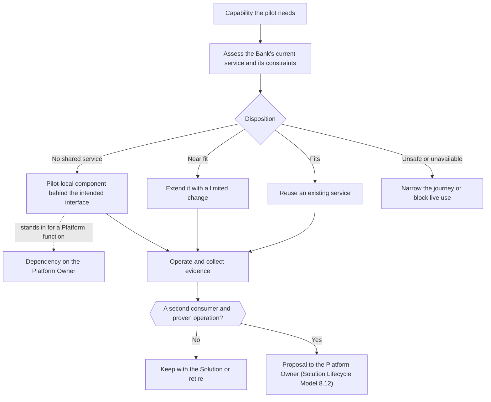

## IT readiness checklist {#it-readiness-page}

This page is the single place for what the pilot asks of IT: the capabilities it needs and the minimum option for each, the technical decisions to record, the Dependencies, and the evidence that the deciders read before the first users see any output. It is a project annex referenced from sections 3 and 6 of the Solution Definition. It approves nothing: each item is evidence for a decision that the corpus already gives to a named Role. The design it serves is on [Technical design](#technical-design).

### How each capability is assessed {#it-readiness-dispositions}

The Bank's current products, maturity and interfaces are not assumed. Each capability gets one recorded disposition:

- **Reuse:** an existing supported service of the Bank meets the need.
- **Extend:** an existing service meets it after a limited change.
- **Pilot-local:** a temporary component behind the intended interface, recorded in section 3 of the Solution Definition; where it stands in for an AI Platform function, it is a Dependency on the Platform Owner, who accepts it for this Solution.
- **Narrow or block:** the journey or the live use is reduced because a safe dependency cannot be supplied.

A component moves to shared use only through a Proposal to the Platform Owner, under the second-consumer rule (Solution Lifecycle Model 8.12).

### Capability table {#it-readiness-capabilities}

Owners are named by Role or function; the names are in the Solution Definition and on the Program Board.

| Capability | Pilot need | Minimum pilot option | Owner | Later |
| --- | --- | --- | --- | --- |
| Employee and workload identity | authorize reads and model calls; attribute every action | dedicated pilot identities and groups under the existing access controls | identity and access management of the Bank | an identity design for AI workloads |
| Read access to the journey's systems | live state of customer, journey, case, contacts and complaints | read-only interface or adapter; a scheduled extract for the Lab where no interface exists | owner of each source system; integration team | reusable read interfaces |
| Customer and journey linkage | join customer, journey object, case and contacts | pre-linked pilot group, with uncertain matches excluded | Solution Engineer, with the source owners | a shared linking service |
| Customer context service and data quality | typed, source-linked context and a reproducible snapshot; stale or mislinked data stopped | a journey-local service with quality checks and quarantine | Solution Engineer | a common context interface |
| Model serving | structured interpretation and drafting | an in-Bank model on existing internal serving, after the provider check | Platform Owner, with infrastructure | scaled in-Bank serving, if justified |
| AI gateway | authenticate, limit and record each model call; model and prompt versions | the gateway of the AI Platform, or one authenticated proxy as a stand-in | Platform Owner | the shared gateway |
| Knowledge retrieval | current journey procedure and approved wording, with citations | one index of approved sources; manual lookup while authority is unresolved | Solution Engineer; the process function owns the content | the knowledge layer of the AI Platform |
| Workflow | the fixed case workflow with limits and fallback | a journey-local workflow; the engine is a Team decision | Solution Engineer | a shared runtime, if a second journey needs it |
| Workspace in the service desktop | show evidence; capture the employee's decision and actions | a separate screen if the desktop cannot be extended; record references instead of links | owner of the service desktop | a reusable employee-assist component |
| Pilot store and existing write interfaces | decisions, feedback and outcomes; referral and case note by the employee | the pilot's own store; existing referral and case interfaces, or the manual route | Solution Engineer; owner of the case system | publishing outcomes to the Bank's systems, if the source owners agree |
| Evaluation harness | replay the locked cases against every change | a harness kept in the repository; the Evaluation set owned by people who did not build | tester other than the builder; Domain Experts | a shared evaluation service |
| Logging and monitoring | logs with the retention the rules require; one trace per case; alert levels | pilot telemetry sent to the existing monitoring and security stores | Platform Owner (PLT-002) | common AI observability |
| Suspension | stop generation or the whole Service without losing the record | a switch in the workflow, tested before first users | Solution Engineer; Platform Owner (PLT-005) | a platform suspension control |
| Environments, runtime and secrets | the Lab, a non-production test environment, production | existing application servers; managed secrets; infrastructure as code | infrastructure and operations of the Bank | supported platform environments |
| Support, incident and change | operate the Service, restore the manual route, approve production changes | the Solution Engineer as operating function; the Bank's incident and change management; a limited support window | IT service management of the Bank | the Receiver's support at Handover |
| Outcome and cost reporting | indicator figures and cost per case | a pilot report with fixed definitions, from the named management-information source | owner of the management-information source | the Bank's regular reporting |

Each IT contribution is asked for as a named owner, an agreed interface or deliverable, a supported environment, a service expectation, a constraint and a fallback; never as an undefined "AI environment" or open access to sources. Information security helps with engineering as a Dependency; its validation is separate and is done by its Control Function Contact.

### Decision record {#it-readiness-decisions}

The decisions below are recorded before the Solution Definition is approved, in this order. This record also serves as the completion rule for a [journey profile](#journey-profiles).

| # | Decision | What is recorded | Where, and who decides |
| --- | --- | --- | --- |
| 1 | Data class and purpose | data classes of each source; the purpose (service resolution and evaluation of the assistant); use in the Lab and with the named first users | Solution Definition and AI Registry; the Domain Owner approves the use of the data class (the Executive Sponsor, while the Competence Center Lead builds), after the source owners' and data protection approvals |
| 2 | Model route and provider check | in-Bank model and its serving; license; for an external model, the provider check and EXT-001 and EXT-002 confirmed | Control Sign-Off of information security, data protection and legal; AI Registry |
| 3 | Journey and mode | the selected journey; phase 1 in the Lab, phase 2 with first users; the last mode in scope is employee-approved communication through an existing channel | Initiative Brief and Solution Definition; the Domain Owner with the Competence Center Lead |
| 4 | Integration per source | interface, adapter, extract or unavailable; owner, freshness and supported use | Solution Definition section 3; a Dependency per source |
| 5 | Identity and linkage | identifiers and matching rules; quarantine of uncertain matches | Solution Definition section 3 |
| 6 | Data and knowledge boundary | allowed fields and sources, exclusions, retention and access; knowledge sources with owner and review date | Solution Definition section 3; AI Registry |
| 7 | State interpretation and action list | recognized states, blockers, exceptions, permitted customer-facing wording, and the approved action list | approved by the journey's process function as a Dependency; written as acceptance criteria |
| 8 | Functions and authority | read services only for the workflow; employee actions and their interfaces; the prohibited list | Solution Definition section 7 (Conditions of use); AI Registry "AI agents and permissions: none" |
| 9 | Capability dispositions | reuse, extend, pilot-local, or narrow or block for every row of the capability table | Solution Definition section 3; Dependencies on the Program Board |
| 10 | Environments and service position | environments, network zone, workload estimate, support window, suspension path | Solution Definition; the Platform Owner and infrastructure as Dependencies |
| 11 | Evidence position | Evaluation set coverage, comparison design, monitoring sample, required trace | Experiment block of the Solution Definition; the measurement annex of the [Initiative Brief](#charter) |
| 12 | Continuing ownership | the Receiver: an IT function of the Bank, to be asked; the run cost and sunset rule of the Service | Solution Definition header and section 7 |

The workflow engine and other product and framework choices are Team decisions in the Decision Log. They must meet the contracts of the technical design and stay replaceable.

### Dependencies {#it-readiness-dependencies}

Each row is a Dependency on the Program Board, with its owner, the Iteration in which it is needed, and its status (Open, Met, At risk). A Dependency with no committed owner keeps the item Waiting or narrows the scope. If the Bank's own IT demand process must also run, it is one more Dependency, not a separate route.

| Dependency | What is required | Owner |
| --- | --- | --- |
| Customer identity | a customer identifier used across the selected records, or an approved matching rule | owner of the customer master or CRM |
| Contact history | written contact records (chat, messages, notes); voice is out of the pilot | owner of the contact platforms |
| Case and workflow system | case type, status, owner, steps, timestamps where recorded, and resolution code | owner of the journey system |
| Complaints | complaint linkage and escalation state where relevant | complaints function |
| Service knowledge | approved procedure, product rules, routing and escalation conditions, and the action list | the journey's process function and the knowledge owners |
| Employee access | single sign-on, role entitlement, audit, and the service desktop or a separate screen | identity and access management; owner of the service desktop |
| Customer communication | the existing channel and its communication record | channel owner and Customer Service |
| The Lab | environment record, read-only extracts, logging, the in-Bank model | Competence Center Lead; Platform Owner |
| Model hosting and provider check | an in-Bank model route checked as a provider; approval for the data class | Platform Owner; information security, data protection and legal |
| Outcome reporting | repeat contact, resolution, handling effort, handoff, complaint and customer feedback measures | owner of the management-information source |

### Evidence before first users {#it-readiness-evidence}

The evidence on architecture, data, controls, operability and quality is read by the decisions below; it is not a separate approval. Each decision belongs to the Role named; this page only lists what that Role reads.

| Before | Evidence | Decided by |
| --- | --- | --- |
| Approval of the Solution Definition (Experiment) | selected journey profile completed; decisions 1 to 12 recorded; capability dispositions, temporary components and owners listed; journey logic kept apart from shared capabilities; Risk Tier assigned; AI Registry entry made; compliance confirms the applicable law | Domain Owner (the Executive Sponsor, while the Competence Center Lead builds) |
| Lab data (phase 1) | use of the data class approved; environment record (LAB-001, LAB-002); each extract with its owner and class (LAB-003); personal data minimized and assessed (LAB-004); the in-Bank model checked as a provider, and any cloud environment too (LAB-005); licenses recorded (ARC-006) | Domain Owner or Executive Sponsor; data protection, information security and legal Contacts |
| Reading the result of phase 1 | Evaluation set with grounding, drift and bias checks (LAB-006); tests run by a person other than the builder; context-only and GenAI compared on the locked cases; the Outcome Report (LAB-007) | Competence Center Lead prepares; Domain Owner reviews |
| Approval of the Solution Definition (Service) | run cost and sunset rule in the business case; Receiver to be asked; first users named; Risk Tier, AI Registry entry and applicable law confirmed for the Service | Domain Owner (the Executive Sponsor, while the Competence Center Lead builds) |
| Validation | sources, linkage and status meanings confirmed; allowed fields, exclusions and freshness tested; prohibited data, decisions and functions blocked; security test (prompt injection, cross-customer access, exfiltration, open components); bias and error tests; logs and evidence kept by the Platform Owner | Control Function Contacts of model risk, information security, data protection, compliance and legal, each by Control Sign-Off |
| Team final acceptance | acceptance criteria met; no critical error, as the profile defines it, found in the Evaluation set (any found blocks first use until corrected and retested); workflow, correction, escalation and outcome capture work end to end; operating readiness below | Competence Center Lead |
| First deployment to production | Dependencies Met; change ticket and test result; logging and monitoring on (PLT-002), with the alert levels and who watches them (ARC-008); suspension tested (PLT-005); manual route tested; incident path in the Bank's incident management; the Solution Engineer named as operating function | the Bank's change management |
| First users see output | training complete; disclosure of AI-drafted explanations in place, in the form compliance decided | Domain Owner |

The release block of the Solution Definition records the operating readiness for the first users in one row, with a reference to this checklist. Release beyond the first users needs the Acceptance Checklist, signed in its IT and Platform Owner rows; that comes after the decision after the MVP and is outside this checklist.

### Capacity observations from the pilot {#it-readiness-capacity}

Before any commitment to hardware for scale, the pilot gives infrastructure and operations its measured request rate, text volume per case, concurrency, latency, storage, retention and availability. Serving capacity depends on model size and compression, context length, text generated, concurrent cases, the latency target, the availability design and growth reserve. One serving node may support work in the Lab; live use normally needs failure isolation and spare capacity. Fast links between graphics processors are needed only if the chosen model or load spans several of them.

### After the pilot {#it-readiness-after}

What happens to the pilot's components is described in [Later, outside this pilot](#technical-design-later): reuse through a Package Definition, promotion through a Proposal to the Platform Owner under the second-consumer rule, and Handover of the Service to an IT function as Receiver.
