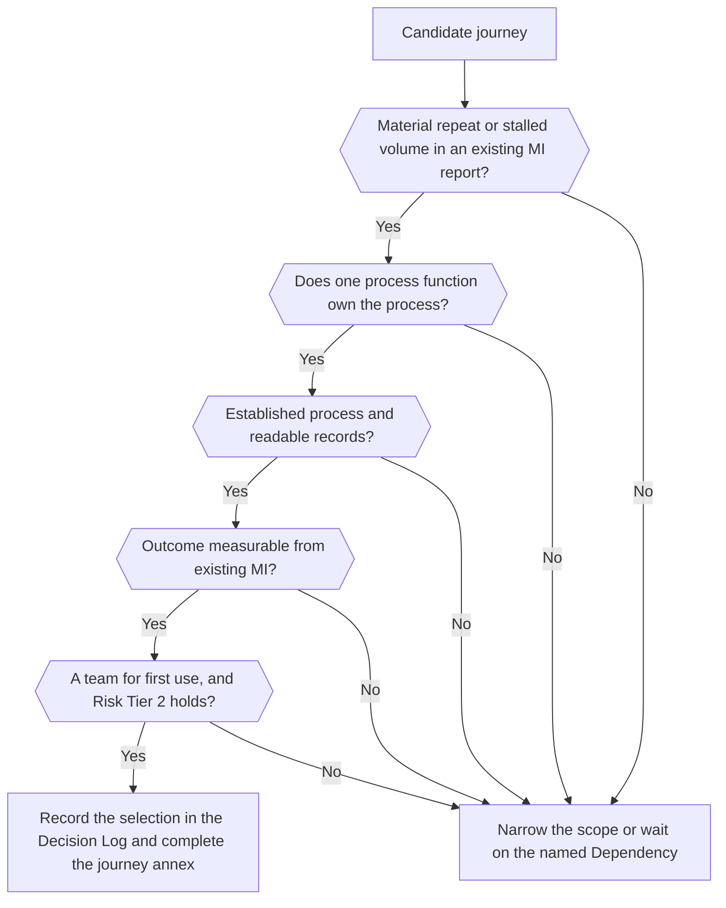

## Journey options and selection {#journeys-journey-options-and-selection}

The pilot serves one customer journey, one servicing queue and one service team. Three journeys are candidates. At Scoping (Reviewing, Discovery: Scoping), the Competence Center Lead and the Domain Owner, the Head of Customer Service, select one by the rule below. Each candidate has a one-page annex with only what is specific to it. What is common to all three (delivery commitments, ownership, the approval record, risk coverage) is on the [Initiative Brief](#charter), [Governance and roles](#governance) and [Controls and evidence](#controls) pages; the technical side is on [Journey technical profiles](#journey-profiles).

Status: INI-013 (Proposed; Portfolio Funnel). No journey is selected yet.

### The three candidates {#journeys-the-three-candidates}

No volume is published here: each is a reference to its management information (MI) source, checked at Scoping.

| Journey | Customer problem | Outcome to test | Process function (Dependency) | What makes it harder | Expected volume |
| --- | --- | --- | --- | --- | --- |
| [Payment Issue Resolution](#journey-payment) | The customer contacts the Bank again because a failed, pending or reversed payment, and who owns it, are unclear | Fewer repeat contacts; faster confirmed resolution | Payments Operations | Lower. The status must come from the payment system for the chosen payment type | [MI report: monthly payment contacts by payment type]; likely the highest of the three |
| [Card Dispute Progress Support](#journey-dispute) | The customer cannot see the progress of a card dispute, the evidence still needed, or the next step | Fewer avoidable status contacts; fewer repeated evidence requests | Disputes Operations | Medium. Card-scheme rules and legal deadlines; a wrong deadline can cost the customer a right | [MI report: open disputes and status contacts per month, by dispute type]; likely low for one team |
| [Onboarding/KYC Progress Support](#journey-kyc) | An application stalls across document, verification and review steps, and the customer is asked for the same information more than once | Fewer repeated information requests; shorter time to a valid next step | Onboarding/KYC | Medium to high. A strict boundary around financial-crime information; compliance may raise the Risk Tier | [MI report: stalled applications per month, by segment and onboarding path]; depends on the path |

Two other journeys are not proposed for the first pilot. Loan application status turns on the credit decision, which the pilot excludes, and on several lending teams. Complaint resolution has its own response rules and remediation decisions, and its problem is the quality of the resolution rather than a scattered case history. Either can come later as a new need at the Funnel.

### Selection rule {#journeys-selection-rule}

Select the journey that meets all seven conditions. If two do, prefer the one whose volume can support an outcome claim within the time-box (each annex, "Expected volume").

1. **Volume:** repeat-contact or stalled-case volume is material, shown by an existing MI report.
2. **One process function:** one function owns the underlying process and acts as a Dependency. It approves the action list, the outcome definitions and the reading of past cases, and supplies Domain Experts. If it also claims part of the benefit, the Initiative has a second Domain (see [Governance and roles](#governance)).
3. **A stable process:** the resolution process is established, so the assistant explains a process and does not define one.
4. **Readable records:** case state, contacts and prior communications can be read through a read interface or an approved extract, linked by a shared customer key, with case timestamps. Each is an assumption to confirm at Scoping.
5. **A measurable outcome:** the leading indicators can be measured from existing MI, without AI, so that the baseline is taken during Discovery: Business case.
6. **A team for first use:** one service team in Customer Service can work as first users, with its time listed in Service Agreement Part B.
7. **Risk Tier 2 holds:** the journey adds nothing that would raise the expected Risk Tier above 2.

If no candidate meets the rule, the scope is narrowed (fewer states, one payment or dispute type), or the Initiative waits on the named Dependency that blocks it.

### How the selected journey enters the Initiative Brief {#journeys-how-the-selected-journey-enters-the-initiative-brief}

The selection is the scoped gate. The Competence Center Lead, with the Domain Owner, records it in the Decision Log, and the Brief names the journey in its scope and in the Solution expected. The selected annex is completed and kept with the Brief in the Initiative's folder in the Portfolio as "Initiative Brief: journey annex"; the two others remain options on this page. Each section of the annex then has one home.

| Annex section | Where it goes | Who completes or approves it |
| --- | --- | --- |
| Scope and exclusions | Brief section 3; later the scope of the Solution Definition | Competence Center Lead with the Domain Owner; the Domain Owner approves the Brief |
| Process function and what it approves | Brief section 5 as a Dependency, on the Program Board with the Iteration it is needed by; its approvals become acceptance criteria of the Solution Definition | The head of the process function approves; the Competence Center Lead records each approval as a Dependency met |
| Control remits the journey adds | Brief section 5: the Control Function Contacts who clear the business case | Each Contact concerned, by a Control Sign-Off |
| Baseline measures | Brief section 2 (the journey indicator) and the measurement annex on the [Initiative Brief](#charter) page | The owner of each source takes the baseline; the Domain Owner states the targets |
| Quality and control-limit criteria | Acceptance criteria and alert levels of the Solution Definition (see [Controls and evidence](#controls)) | The Domain Owner approves the Solution Definition, or the Executive Sponsor if the Competence Center Lead built the Solution |
| Stop conditions | Conditions of use and alert levels of the Solution Definition; the facts of the decision after the MVP | The Competence Center Lead or a Control Function Contact suspends; the approver of the Brief decides after the MVP |
| Expected volume | The measurement annex: whether the repeat-contact indicator carries a target or is read as directional evidence, as stated in the Decision Record that approves the Brief | The source owner supplies the volume; the approver of the Brief accepts the claim it supports |

After approval, a change of payment type, dispute type, segment, onboarding path or queue is an amendment of the Brief with a Decision Record. Another journey is not added to this pilot: it is a new need at the Funnel, which can reuse this pilot's components and evaluation sets.
