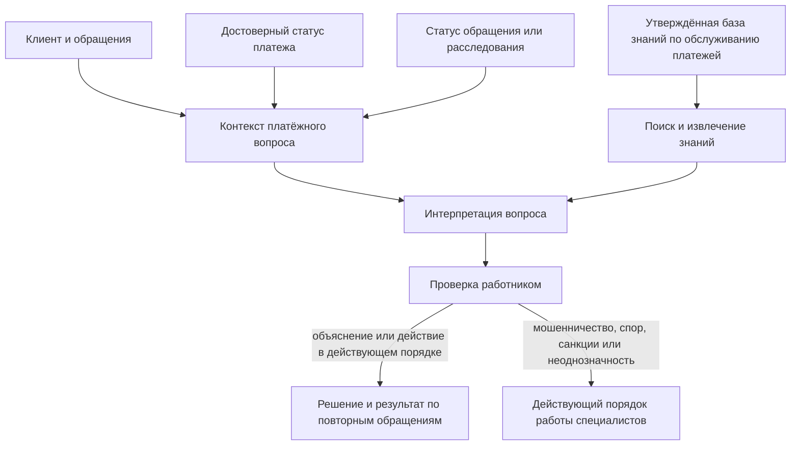
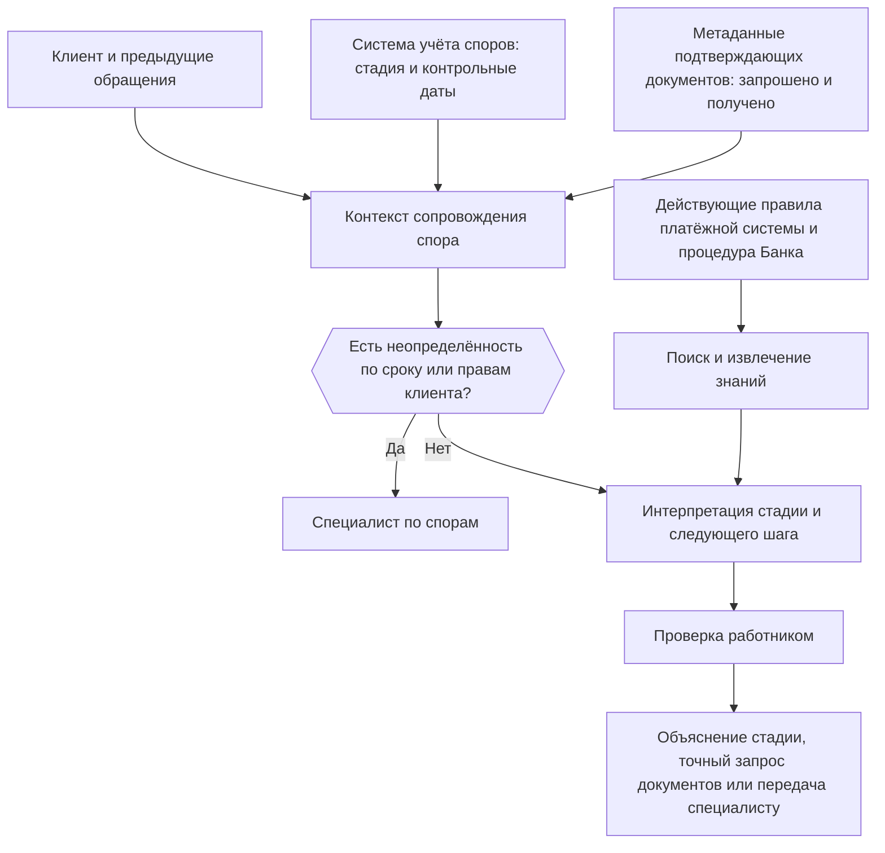
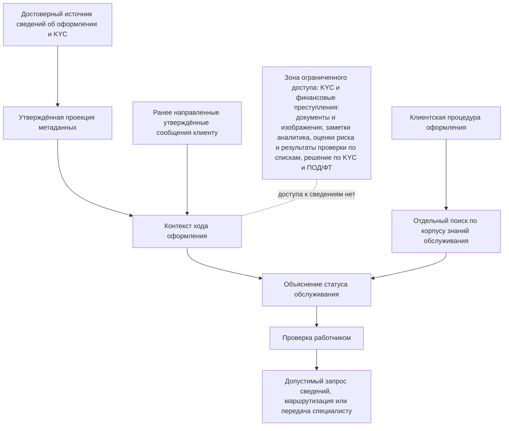

```yaml
source: portfolio/en/projects/service-resolution/journey-profiles.md
source_sha256: 476ec346dcfd02208a6a7a549176b71b5fe3730d66fcfb2e2773b7217c3c320c
translation_status: reviewed
```

---
key: "journey-profiles"
label: "Профили маршрутов"
section: "Техническая часть"
---

## Технические профили клиентских маршрутов {#journey-profiles-page}

### Назначение {#journey-profiles-purpose}

Три клиентских маршрута, рассматриваемые для пилота, используют общий [технический проект](#technical-design), но различаются банковскими системами, границами доступа к информации, базой знаний, функциями, критическими рисками и тестами. На странице показаны эти различия, чтобы можно было выбрать один клиентский маршрут и подготовить для него описание решения. Реализуется только клиентский маршрут, выбранный при одобрении бизнес-кейса; каждый клиентский маршрут, к которому перейдут позднее, является отдельным решением со своим описанием решения, категорией риска, записью в реестре AI-решений и валидацией.

В каждом профиле указано:

- какие источники и сервисы Банка и какие достоверные сведения необходимы;
- как эти сведения используются сервисами на основе правил и генеративным AI;
- какие знания и функции разрешены;
- какие сведения и решения остаются за пределами workflow;
- как сужается клиентский маршрут, если источник или сервис недоступен;
- какие критерии приёмки и тесты применяются до окончательной приёмки командой.

Наименования систем, ответственные, интерфейсы, объёмы и ожидаемые уровни обслуживания определяются в ходе проработки и указываются в описании решения, а не на этой странице.

### Три клиентских маршрута в сравнении {#journey-profiles-side-by-side}

Факторы риска приведены в соответствии с пунктом 3.1 Политики применения AI. Руководитель Центра Компетенций присваивает категорию риска при определении решения (пока решение создаёт руководитель Центра Компетенций, её присваивает куратор Центра Компетенций); представитель любой контрольной функции вправе повысить категорию риска, а понизить её вправе только представитель контрольной функции по модельному риску.

| Фактор риска | Решение вопросов по платежам | Сопровождение споров по картам | Сопровождение оформления и KYC |
| --- | --- | --- | --- |
| Классы данных | персональные данные клиентов; конфиденциальные данные обслуживания (контакты, обращения, жалобы); статус и идентификаторы платежа | персональные данные клиентов; конфиденциальные данные обслуживания; реквизиты операции по карте; стадия спора, сроки и метаданные подтверждающих документов | персональные данные клиентов; конфиденциальные данные обслуживания; только утверждённые метаданные оформления (отметка о завершении процедур KYC, вид и статус документа, код причины, очередь) |
| Влияние на принятие решений | используется работником при объяснении ситуации и выборе следующего шага | используется работником при объяснении, запросе подтверждающих документов или направлении к специалисту | используется работником при объяснении, запросе сведений или маршрутизации обращения |
| Доведение результата до клиента | только после проверки работником — словами работника или в виде отредактированного черновика, отправленного через действующий канал | < | < |
| Степень автономности | ассистент без инструментов; любая запись — действие работника | < | < |
| Ожидаемая категория риска | 2 | 2 | 2, если представитель контрольной функции по комплаенсу не повысит её с учётом рисков, связанных с финансовыми преступлениями, или отнесения решения к высокорисковой категории |
| Основания для повышения | любая запись, выполняемая моделью; доведение результата до клиента без проверки работником; внешний поставщик, если представитель контрольной функции повышает категорию по этой причине | то же, что для платежей; кроме того, любой результат, способный повлиять на срок или право клиента | то же, что для платежей; кроме того, любой путь поступления сведений ограниченного доступа, связанных с финансовыми преступлениями |
| Готовность к применению в промышленной среде | наиболее высокая: достоверный статус однозначен и порядок обслуживания отработан, если система платежей доступна для чтения | средняя: зависит от достоверных данных о стадии и сроках и от контролируемой базы знаний по спорам | наиболее низкая: применение генеративного AI в промышленной среде блокируется до появления утверждённой проекции метаданных |

До одобрения описания решения по профилю IT-функция и подразделение — владелец процесса клиентского маршрута фиксируют решения в [перечне технических решений](#it-readiness-decisions) контрольного листа готовности IT: источники, связывание записей, способ интеграции, контракт контекста, интерпретация состояний, база знаний, функции, оценочный набор и эксплуатационные зависимости. Если достоверный источник, безопасную границу доступа к информации или поддерживаемый интерфейс для работы с рабочими данными обеспечить невозможно, клиентский маршрут остаётся в лабораторной среде или сужается до состояний, которые можно поддержать. Использовать генеративный AI для восполнения отсутствующего достоверного источника не допускается.

---

### Решение вопросов по платежам {#journey-profiles-payment}

**Вариант клиентского маршрута:** [Решение вопросов по платежам](#journey-payment)

#### Техническая задача и границы {#journey-profiles-payment-intent}

Поддержка одного вида внутренних розничных платежей в состояниях «отклонён», «в обработке» и «возвращён», по которому Банк может получить достоверный статус и для которого есть отработанный порядок обслуживания. Непризнанные клиентом платежи, мошенничество, споры и чарджбэки, приостановление операций в связи с санкциями или в целях противодействия отмыванию денег и финансированию терроризма, неясности в трансграничных и корреспондентских расчётах, решения о возмещении и перемещение денежных средств остаются за рамками профиля.



#### Необходимые источники и сервисы Банка и их использование {#journey-profiles-payment-capabilities}

| Необходимый источник или сервис | Использование в профиле | Если он недоступен или ненадёжен |
| --- | --- | --- |
| Источник сведений о клиентах и контактах | определение запроса клиента и связанных с ним контактов | работа ограничивается связанными историческими обращениями либо работа с рабочими данными прекращается, если связыванию записей нельзя доверять |
| Достоверный источник сведений о платежах | получение идентификатора, вида и отметок времени платежа и его достоверного состояния («отклонён», «в обработке», «возвращён») | неподдерживаемое состояние или вид платежа исключается; состояние никогда не выводится из заметок по контактам |
| Система обработки обращений или расследований | получение сведений об ответственном, выполненном и ожидающем шаге и итоге | отображается только номер обращения; работник вносит записи в действующем ручном порядке |
| Учёт жалоб и эскалаций | выявление поданной официальной жалобы или уже начатой работы специалиста | возможная жалоба до каких-либо рекомендаций клиенту направляется на рассмотрение в действующем порядке |
| База знаний по обслуживанию платежей | опора на источники при объяснении состояния, ожидаемого порядка действий и допустимого действия | результат ограничивается подтверждёнными фактами и ручным поиском процедур, пока корпус знаний не утверждён |
| Отчётность о результатах | выявление повторных контактов, продвижения, повторного открытия обращений, жалоб и трудозатрат на обработку | проводится только тестирование качества; выгода для клиентов не заявляется, пока нет подтверждённых данных о результатах |

#### Распределение функций {#journey-profiles-payment-allocation}

| Функция | Реализация |
| --- | --- |
| На основе правил | связывание клиента, платежа и обращения; достоверный статус; соответствие критериям отбора; сопоставление кодов состояний; актуальность; фильтрация допустимых действий |
| Генеративный AI | интерпретация истории контактов; краткая хронология; вероятное препятствие; объяснение с опорой на процедуру; черновик следующего шага |
| Поиск и извлечение знаний | действующие указания по состояниям платежей, порядок обслуживания, формулировки для клиентов, правила направления к специалистам и эскалации |
| Чтение в рамках workflow | состояние платежа, обращения и контактов; применимая процедура; допустимые действия |
| Действия работника | фиксация решения и результата; сохранение заметки по обращению; создание направления к специалисту, если это поддерживает действующий интерфейс |
| Критические запреты (условия применения) | изменение состояния, перемещение денежных средств, решение по мошенничеству или спору, возмещение, интерпретация регулируемой блокировки, любое сообщение клиенту без участия работника |

#### Критерии приёмки и охват тестирования по клиентскому маршруту {#journey-profiles-payment-tests}

- Записи о платеже, клиенте, контактах и обращении связываются правильно либо помещаются на карантин.
- Отображаемое состояние платежа всегда берётся из достоверного источника и сопровождается признаком актуальности.
- Каждому поддерживаемому состоянию соответствуют объяснение и набор действий, одобренные подразделением платёжных операций.
- Противоречивый статус, отсутствие ответственного за расследование, признаки мошенничества или спора и исключённые виды платежей направляются в соответствующий ручной порядок или к специалисту.
- При оценке в лабораторной среде и с первыми пользователями отдельно измеряются точность определения состояния, точность выбора действия, доля объяснений без опоры на источники, исправления работниками и повторные контакты.

---

### Сопровождение споров по картам {#journey-profiles-dispute}

**Вариант клиентского маршрута:** [Сопровождение споров по картам](#journey-dispute)

#### Техническая задача и границы {#journey-profiles-dispute-intent}

Поддержка одного вида споров и одной очереди обслуживания: объяснение достоверной стадии спора, выполненных действий, состояния подтверждающих документов, ответственного, применимого срока и допустимого следующего шага обслуживания. Вынесение решения по спору, установление факта мошенничества, определение права на возмещение, само возмещение, правовая интерпретация и любое изменение обязательств, установленных правилами платёжной системы или законом, остаются за рамками профиля.



#### Необходимые источники и сервисы Банка и их использование {#journey-profiles-dispute-capabilities}

| Необходимый источник или сервис | Использование в профиле | Если он недоступен или ненадёжен |
| --- | --- | --- |
| Основная система учёта споров | получение идентификатора, вида, стадии, ключевых этапов, ответственного и достоверных данных о сроках спора | состояния без достоверных сведений о стадии или сроке исключаются; обработка специалистом сохраняется |
| Реквизиты операции | связывание спора с нужной операцией по карте без вывода о мошенничестве | неоднозначное связывание помещается на карантин и направляется на сверку в действующем порядке |
| Метаданные подтверждающих документов | отображение вида документа, сведений о его запросе и получении и статуса его проверки без лишнего содержания документов | профиль ограничивается объяснением стадии и статуса; черновики запросов документов по неполным метаданным не готовятся |
| Учёт сообщений клиенту | выявление уже направленных уведомлений и обязательных сообщений по обслуживанию | перед любым сообщением клиенту работник сверяется с системой учёта споров |
| Действующая база знаний по спорам | извлечение применимой внутренней процедуры обслуживания, согласованной с правилами платёжной системы | подготовка черновиков следующего шага остаётся в лабораторной среде, пока не обеспечен контроль статуса источников и дат их введения в действие |
| Мониторинг результатов и сроков | измерение числа контактов по статусу, повторных запросов документов, передач между исполнителями, жалоб и случаев пропуска сроков | управленческое решение ограничивается выводами о качестве и процессе; выгода для клиентов не заявляется |

#### Распределение функций {#journey-profiles-dispute-allocation}

| Функция | Реализация |
| --- | --- |
| На основе правил | связывание спора, клиента и операции; достоверная стадия; срок из источника или его расчёт; статус подтверждающих документов; правила обязательных уведомлений и допустимых действий |
| Генеративный AI | сводка предыдущих контактов; объяснение статуса; выявление повторных или противоречивых запросов документов; черновик следующего шага с опорой на процедуру |
| Поиск и извлечение знаний | действующая процедура обслуживания споров, указания по подтверждающим документам, обязательные сообщения клиенту и условия эскалации |
| Чтение в рамках workflow | состояние спора, подтверждающих документов и сообщений клиенту; применимая процедура; допустимые действия |
| Действия работника | фиксация решения и результата; отправка запроса документов по черновику, проверенному работником; создание направления к специалисту, если это поддерживается |
| Критические запреты (условия применения) | вынесение решения по спору, вывод о мошенничестве, определение права на возмещение, возмещение, изменение срока, правовая интерпретация, любые действия, ослабляющие права клиента |

#### Критерии приёмки и охват тестирования по клиентскому маршруту {#journey-profiles-dispute-tests}

- Спор, операция, клиент и контакты связываются правильно либо запись помещается на карантин.
- Стадия, статус подтверждающих документов, ответственный и срок берутся из достоверного источника, актуальны и воспроизводимы.
- Ни одна сгенерированная интерпретация не изменяет срок, право клиента, состояние рассмотрения спора или решение о возмещении.
- Любая неясность в отношении срока, правила платёжной системы или подтверждающих документов приводит к передаче обращения специалисту до сообщения клиенту.
- Оценочный набор охватывает все типовые стадии, состояния подтверждающих документов, граничные случаи по срокам, условия предварительного уведомления и существенные нестандартные ситуации выбранного вида споров.

---

### Сопровождение оформления и KYC {#journey-profiles-kyc}

**Вариант клиентского маршрута:** [Сопровождение оформления и KYC](#journey-kyc)

#### Техническая задача и границы {#journey-profiles-kyc-intent}

Поддержка одного сегмента клиентов и одного порядка оформления с использованием утверждённой проекции метаданных обслуживания клиента. Объясняются только установленное состояние обслуживания, недостающие сведения, которые допускается запрашивать, ответственная очередь и утверждённый следующий шаг. Решению запрещается получать или выводить причины ограниченного доступа, связанные с финансовыми преступлениями.



#### Необходимые источники и сервисы Банка и их использование {#journey-profiles-kyc-capabilities}

| Необходимый источник или сервис | Использование в профиле | Если он недоступен или ненадёжен |
| --- | --- | --- |
| Достоверный источник сведений об оформлении и KYC | предоставление идентификатора заявки и достоверного состояния обслуживания клиента | только анализ исторических данных в лабораторной среде; состояние никогда не выводится из заметок работников или содержания документов |
| Утверждённая проекция метаданных | предоставление только отметки о завершении процедур, вида и статуса документа, утверждённого кода причины, ответственной очереди и безопасных отметок времени | применение генеративного AI в промышленной среде блокируется до появления проекции или равнозначного сервиса, ограниченного утверждёнными полями |
| Справочник кодов причин для клиентов | перевод допустимого состояния обслуживания в единообразные утверждённые формулировки | отображается только статус, объяснение поручается обученному специалисту |
| Ранее направленные утверждённые сообщения | предотвращение повторных или противоречивых запросов клиенту | если прежние сообщения невозможно безопасно прочитать, работник сверяет их вручную |
| Корпус знаний по обслуживанию | предоставление процедуры оформления, предназначенной для общения с клиентом, отдельно от политики KYC и аналитических сведений ограниченного доступа | черновики ограничиваются фактами о статусе со ссылками на источники и полученными вручную указаниями специалиста |
| Отчётность о результатах и по группам клиентов | измерение повторных запросов, продвижения, отказов от оформления, жалоб и существенных различий в обработке | выводы ограничиваются качеством, пока не накоплено достаточно данных о результатах и по группам клиентов |

#### Распределение функций {#journey-profiles-kyc-allocation}

| Функция | Реализация |
| --- | --- |
| На основе правил | связывание заявки и клиента; проекция только утверждённых полей; состояние завершения процедур; статус документа; утверждённый код причины; правила очередей и допустимых действий |
| Генеративный AI | сводка истории утверждённых сообщений; безопасное объяснение состояния обслуживания; объединение допустимых запросов сведений; черновик следующего шага |
| Поиск и извлечение знаний | процедура оформления, предназначенная для общения с клиентом, допустимые указания по документам, маршрутизация и эскалация; сведения ограниченного доступа, связанные с финансовыми преступлениями, хранятся отдельно |
| Чтение в рамках workflow | утверждённая проекция метаданных и ранее направленные сообщения; применимая процедура; допустимые действия |
| Действия работника | фиксация решения и результата; отправка допустимого запроса сведений по черновику, проверенному работником; маршрутизация обращения или направление к специалисту |
| Критические запреты (условия применения) | документы и изображения, заметки аналитиков, скоринговые оценки риска, срабатывания скрининга, сведения о подозрительных операциях, одобрение или отказ, изменение уровня риска клиента, обход меры контроля, причины ограниченного доступа |

#### Критерии приёмки и охват тестирования по клиентскому маршруту {#journey-profiles-kyc-tests}

- Архитектурные тесты подтверждают, что у исключённых полей и сведений ограниченного доступа нет пути в контекст, поиск, запросы к модели, трассировки и результаты, показываемые работнику.
- Отображаемые состояние обслуживания, допустимый код причины, статус документа и очередь берутся из утверждённой проекции и сопровождаются ссылкой на источник и признаком актуальности.
- Решение не может выводить, раскрывать или подразумевать регулируемую причину задержки, одобрения или отказа.
- Несогласованное состояние, отсутствие допустимой причины, признак того, что клиенту нужна дополнительная помощь, возможное дискриминационное отношение или подозрение, связанное с финансовыми преступлениями, приводят к передаче обращения специалисту.
- Оценочный набор охватывает типовые состояния оформления, повторные запросы, отсутствие кодов причин, попытки внедрения сведений ограниченного доступа и результаты для значимых групп клиентов.

---

### Повторное использование на других клиентских маршрутах {#journey-profiles-reuse}

Общие компоненты остаются неизменными: контроль идентификации и цели, контракт сервиса контекста, поиск и извлечение знаний, фиксированный workflow, шлюз AI и структурированный результат, рабочее место, оценка и регистрация событий. Каждый клиентский маршрут заменяет собственный слой: адаптеры источников и разрешённые поля, сопоставление состояний, корпус знаний, функции, которые он сохраняет из общего перечня, критические ошибки, оценочный набор и показатели результатов. Второму клиентскому маршруту следует использовать общие интерфейсы и заменять только собственный слой; если для повторного использования приходится копировать или обходить общие компоненты, общий проект ещё не подтверждён. Позднее общие компоненты оформляются описанием пакета (см. [В дальнейшем, за рамками пилота](#technical-design-later)).
