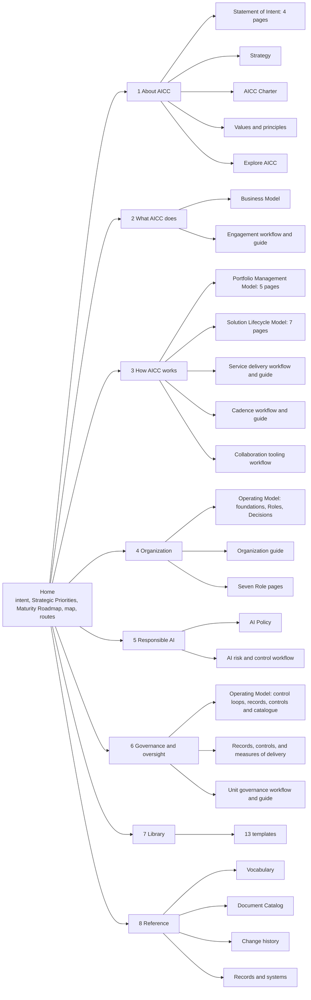
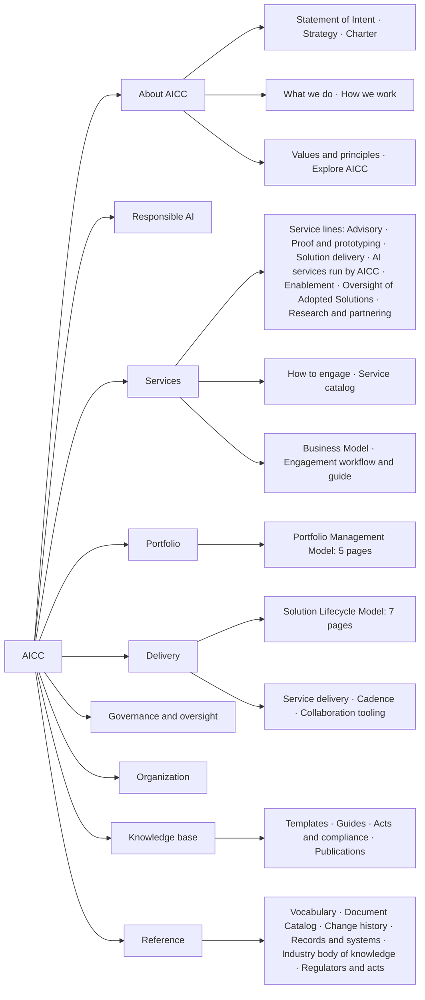

# Portal site structure: scaffolding

Working design for the structure of the AICC charter site. It positions the existing charter content and defines no content of its own. The charter folder stays the only source of the text, and this page is the plan for where each piece appears. The machine-readable form is `sitemap.json`, the table of all pages is `inventory.md`, the outline of each page is in `pages/`, and the folder is described in the README. The reasons for the placement are in `content-fit.md`. It is explanatory and is not a document of the charter.

## 1. What kind of site this is

The site is a static knowledge base and the department site of AICC. It states what AICC is, what it does, how it works, how it is organized, how it uses AI responsibly, and how it is governed. Internal audit and other reviewers use it as a reference, and they are served by a reading route and not by the organizing principle. The live matters stay in other systems: the Registry holds the records, Jira holds the working state, Confluence holds the working documents, and Service Management holds requests and incidents. The site names those systems and does not reproduce their content.

## 2. How site structures are drawn

Designers build a site structure from a small set of artifacts, in this order. Each artifact answers one question, and this folder supplies the first six.

| Artifact | Question it answers | Where it is here |
| --- | --- | --- |
| Content inventory | What content exists, and where is its source? | inventory.md |
| Sitemap | Which pages exist, and under what? | Section 3 and sitemap.json |
| Navigation model | How does a reader move between pages? | Section 4 |
| Page types | What are the kinds of page, and what is on each? | Section 5 |
| Wireframes | How is a page laid out, in low fidelity? | Section 6 |
| User flows | By what path does a reader reach an answer? | reading-routes.md |
| Visual design | How do the pages look? | The existing O!Bank tokens and UI kit of the portal foundation |

The next artifact to produce is a clickable low-fidelity prototype of the home page, one section landing page, and one document page, reviewed before the build.

## 3. Sitemap

The site has a home page, eight sections, and 73 pages in the scaffold, and the build adds one generated page for each of the 32 controls. A section is a grouping for navigation. A document has one canonical page, or one canonical page for each part when it is split, and a second section that needs it shows a view of that page or links to it. Figure 1 shows the sections, the documents, and the number of their pages.



Figure 1: the sitemap, with the pages that sit under each section.

Three documents serve more than one section. The Operating Model supplies Organization (foundations, Roles, Decisions) and Governance and oversight (control loops, records and evidence, controls). The Solution Lifecycle Model supplies How AICC works (sections 1 to 8) and Governance and oversight (sections 9 and 10). The Statement of Intent supplies About AICC and is featured on the home page. Responsible AI links the AICC Charter 5 (the AI Risk Appetite Statement) and the Solution Lifecycle Model 7 (the gates before use). About AICC links "also stated in" for Business Model 2 and Operating Model 2.

## 4. Navigation model

| Element | Content | Rule |
| --- | --- | --- |
| Global navigation | The eight sections, in the order of the sitemap | Visible on every page, with the current section marked |
| Section page | A short introduction, then the list of its pages with one line each | The introduction is authored, and the list is generated |
| Breadcrumb | Home, section, page | On every page below the home page |
| Document parts | For a split document, the list of its parts with the current part marked | At the head of every part |
| In-page outline | The headings of the page, down to the clause level | Fixed beside the text on a wide screen and folded above the text on a narrow one |
| Previous and next | The neighbours in the reading order of the section | At the foot of every page |
| Companion | The workflow and the guide of the same subject | At the head of both pages |
| Cross-reference | A reference such as Operating Model 6.6 | A link to that clause, produced by the build |
| Defined term | A term of the Vocabulary | A link to its entry |
| Clause permalink | The number of the clause | Stable address of the form page/#6-6, identical in every language |
| Search | All pages of the language | In the header on every page |
| Footer | The baseline revision, the date, the owner of the charter, and the Records and systems link | On every page |

## 5. Page types

| Type | Used for | Elements from top to bottom |
| --- | --- | --- |
| Home | The entry | Intent in two sentences; the Strategic Priorities and the Maturity Roadmap; the map of AICC; the eight sections; the reading routes; the baseline stamp |
| Section | The grouping | Introduction; the pages of the section with one line each; the related sections |
| Document | A document, or a part of one | Title; purpose; revision, date, and owner; the parts of the document; outline; the clauses with permalinks and a cited-by line; related pages; change history; previous and next |
| Workflow | The six workflows | Title and purpose; the companion guide; the diagram with its text version and clause links; the steps table; the actors; the situations; the templates that it uses; previous and next |
| Guide | The five guides | Title and purpose; the companion workflow; the diagrams; the tables; the rule source; previous and next |
| Template | The 13 templates | Title; when it is used; where the record is kept; the form with a copy button; the clause that requires it; the workflows that use it |
| Role | The seven Roles | Purpose; responsibilities; authority; reporting line; the decisions of the Role; the RACI row; where the Holder is recorded; where the Role is cited |
| Catalogue | The controls | A filterable list of the 32 controls; one page for each with the rule clause, the owner, the timing, the evidence record, the template, the objective, the type, and the test |
| Reference | Vocabulary, Document Catalog, change history | The list or table, an index, and links to the pages that use each item |
| Records and systems | The boundary with the live systems | One table: record, template, system of record, control that it evidences, who keeps it |

## 6. Wireframes (low fidelity)

The home page:

```text
+----------------------------------------------------------------------+
| O!Bank | AI Competence Center      [Search........]   EN | RU   (o)   |
| 1 About  2 What AICC does  3 How it works  4 Organization  5 Resp. AI |
| 6 Governance  7 Library  8 Reference                                  |
+----------------------------------------------------------------------+
|  The AI Competence Center explores, trials, and proves the use of AI  |
|  with the functions of the Bank, and shapes the adoption of AI.       |
|                                                                      |
|  Strategic Priorities (7)              Maturity Roadmap (levels)      |
|                                                                      |
|  [ Map of AICC: what it does -> how it works -> how it is safeguarded ]|
|                                                                      |
|  About AICC        What AICC does      How AICC works                 |
|  one line          one line            one line                       |
|  Organization      Responsible AI      Governance and oversight       |
|  one line          one line            one line                       |
|                                                                      |
|  Reading routes: Orientation | Executive | Function | Delivery | Review|
+----------------------------------------------------------------------+
| Baseline revision 1.0, 2026-10-02 | Owner | Records and systems      |
+----------------------------------------------------------------------+
```

A part of a document:

```text
+----------------------------------------------------------------------+
| header and global navigation                                          |
| Home > Organization > Operating Model: Roles                          |
+----------------------------------------------------------------------+
| Operating Model                                    Rev 1.0 | 2026-10-02|
| Parts: Foundations | [Roles] | Decisions        Owner: AICC Lead      |
|                                                                      |
| On this page         | 4.2  The Roles and their decisions   [link]   |
|  4.1 ...             |      text of the clause...                    |
|  4.2 ...             |      Cited by: Service delivery workflow, C-22|
|                      | 4.3  ...                                      |
+----------------------------------------------------------------------+
| Related pages | Change history | < Previous            Next >         |
+----------------------------------------------------------------------+
```

A workflow page:

```text
+----------------------------------------------------------------------+
| Home > How AICC works > Service delivery workflow                     |
| Purpose: one sentence.                       Companion: Service guide |
| [ Diagram ]  Read as text: step 1 ... step 2 ...  (clause links)      |
| Steps: who | when | record | clause                                   |
| Situations table                                                      |
| Uses: Initiative Brief | Solution Definition | Acceptance Checklist   |
+----------------------------------------------------------------------+
```

## 7. Reading routes

The routes are listed on the Overview and the home page. Each is a short sequence of pages and states a purpose. They are formal reading orders and not task cards. The sequences, by page identifier, are in `reading-routes.md`.

## 8. What has to be written for the site

The charter text is complete. The site needs only the following short authored items, none of which restates a rule.

| Item | Length | Note |
| --- | --- | --- |
| Home introduction | Two sentences | From the Summary of intent and the Mission |
| Eight section introductions | Three to five lines each | State what the section covers and what is kept elsewhere |
| The map of AICC | One diagram and a text version | Connects what AICC does, how it works, and how it is safeguarded |
| About AICC | One page, a summary of AICC | What it is, the goal, the strategy, the approach, the authority, the safeguards, with links to the deep pages |
| Values and principles | One page | The values and the principles of adoption, application, work, and delivery, each with what it applies to |
| Reading routes | The five routes | Based on the routes of the charter README |
| Records and systems | One table | Built from the Operating Model 7 and the Registry README |
| Explore AICC | An introduction | The rest is generated from the charter README; the last page of About AICC |

## 9. Open points

1. The label of each section, and whether Organization and Governance and oversight stay separate, since both draw on the Operating Model.
2. Whether the Role pages are in the first version.
3. Whether the control catalogue links to the live status in the Control Matrix, which is kept in the Registry.
4. Whether the Records and systems page names the systems by name and address, which depends on where Jira and Confluence are installed.
5. Whether the five-line summaries are authored or taken from the purpose clause.
6. The language of the first release: the charter text is in English.

## 10. The structure in use: AICC as a consulting organization (adopted 2026-10-02)

The site was first built on the sitemap of section 3. After the About section was settled, the review of What AICC does found that the offer of AICC is not visible in one place: the services sat scattered in the Business Model 4, the Solution Lifecycle Model 8, the Engagement guide, and the Statement of Intent 10, and the navigation read as an index of documents and not as the site of a services organization. The following structure replaced it on 2026-10-02 and is the one the site is built from. `make_pages.py` writes it; `make_pages.py --previous` writes the first structure to `previous/` for the record. The new pages are authored in `portal/content/` as first editions for review.

### 10.1. The model

AICC presents itself as the internal consulting and innovation lab of the Bank: a research and consulting organization across strategy, programs, solutions, and ways of working, and a small delivery unit that proves and builds and relies on the platform teams and IT to scale. The pattern follows how consulting houses and internal AI centers present themselves: the service lines in one place, the method apart from the offer, the products that the unit runs as a catalog, a visible front door, enablement, and governance.

### 10.2. The sections

| Order | Section | Address | Holds | Change |
| --- | --- | --- | --- | --- |
| 1 | About AICC | /about/ | Statement of Intent (four pages), Strategy, Charter, What we do, How we work, Values and principles, Explore AICC | two one-page summaries move in |
| 2 | Responsible AI | /responsible-ai/ | AI Policy, AI risk and control workflow | moves up, before the offer |
| 3 | Services | /services/ | The service lines (seven pages), How to engage, the Service catalog, Business Model, Engagement workflow and guide | new; replaces What AICC does |
| 4 | Portfolio | /portfolio/ | Portfolio Management Model (five pages) | split out of How AICC works |
| 5 | Delivery | /delivery/ | Solution Lifecycle Model (seven pages), Service delivery workflow and guide, Cadence workflow and guide, Collaboration tooling workflow | the rest of How AICC works |
| 6 | Governance and oversight | /governance/ | as in section 3 | moves down, under Delivery |
| 7 | Organization | /organization/ | as in section 3 | moves down; see decision 4 |
| 8 | Knowledge base | /knowledge-base/ | The 13 templates, the list of the guides, Acts and compliance, Publications | replaces Library; three pages added |
| 9 | Reference | /reference/ | Vocabulary, Document Catalog, change history, Records and systems, Industry body of knowledge, Regulators and acts | two pages added |



The order places what AICC stands for and the rules of use first, the offer and the method next, the control of the unit after the method, and the knowledge last.

### 10.3. The Services section page

The section page is the core of the refactoring, and it is authored for the site. It has five parts.

1. The lead: AICC as the internal consulting and innovation lab of the Bank; what it researches, advises on, proves, builds, runs, and teaches; and that it relies on the platform teams and IT to scale.
2. The service lines as cards, each opening a one-page description: what it is, what the client receives, the typical shape, what it leads to, the templates used, who decides, and the governing clauses. The lines are Advisory; Proof and prototyping; Solution delivery; AI services run by AICC; Enablement; Oversight of Adopted Solutions; Research and partnering.
3. How to engage: the front door in six steps (contact, study, Service Agreement, delivery, Outcome Report, support), the statement that the function commits to nothing and that AICC works on a best-effort basis within its capability, and the links to the Engagement workflow and guide and to the Initiative Brief, the Service Agreement, and the Outcome Report.
4. Service levels: none, on demand, agreed response targets, run by AICC, and the Solution type that each gives (Engagement guide 6).
5. What AICC does not do: the limits of the AICC Charter 3.2, stated plainly, with the note that AICC does not deliver at scale.

The text of the service lines synthesizes the Business Model 4, the Solution Lifecycle Model 8, and the Statement of Intent 10, and every card links the governing clause. It restates no rule.

### 10.4. The two one-pagers of About AICC

What we do and How we work are summaries of one page each: the first states the offer in one line per service line and what AICC is not; the second states the engagement model and the method in brief, and links to Services, Portfolio, and Delivery. They replace the role that the section pages What AICC does and How AICC works play today.

### 10.5. Decisions taken at the build, open for review

1. **The Service catalog on the site.** Built: `services/catalog` is generated from `portfolio/solutions/*.md` at each build and dated (identifier, title, type, state, Initiative, Domain, receiver). It is the one page of dynamic content on the site, and it states that the Portfolio prevails.
2. **Research and partnering as a service line.** Built as a page that states on its face that the line is stated on the site and not yet in the Business Model, and that it becomes a commitment when the Business Model states it. A clause for the Business Model 4 is proposed.
3. **The names** Services, Portfolio, Delivery are used.
4. **Organization.** The order given for the navigation did not name it. It stays a section after Governance and oversight in this record; the alternative is to fold it into Governance and oversight as "Governance and organization", since both draw on the Operating Model.
5. **The new knowledge pages.** Acts and compliance, Publications, Industry body of knowledge, and Regulators and acts hold content that the charter does not state. They are authored for the site and curated: the acts and the regulators with the Control Function Contacts, the publications and the body of knowledge by the AICC Lead. The split between the two acts pages: Reference lists the bodies and the texts; the Knowledge base states what each requires and how AICC complies. Each page starts as a curated list and grows with use.

### 10.6. Effect on the build

The identifiers and addresses under `what-aicc-does/`, `how-aicc-works/`, and `library/` changed to `services/`, `portfolio/`, `delivery/`, and `knowledge-base/`. The build holds them in `portal/content/authored.json` (routes, the map of the home page, the links of the About page, the section introductions), in `portal/tools/build.py`, and in the sitemap. The published addresses changed, so the publication of this structure is a new baseline of the site, not a correction. The authored pages are first editions: the service lines synthesize the charter; Acts and compliance, Regulators and acts, and the Industry body of knowledge are curated lists to be verified with the Control Function Contacts; Publications starts with the charter and two empty tables.

## 11. The service catalog: the lines and the packages (recorded 2026-10-02)

The Services section states AICC as its clients see it. The service lines were first cut by the phases of an Engagement (advisory, proof, delivery, run, enablement, oversight, research), which describes how AICC works and not what a function can ask for. They were re-cut on 2026-10-02 as nine promises to a function, each with what the function receives, how the work runs, the reusable package that remains, whether it is run-rate or a program, who decides, and the governing clauses. The phases and the three types of Solution moved to the page How to engage, where they belong.

### 11.1. The nine lines

| # | Line | The promise | Mode | Charter backing |
| --- | --- | --- | --- | --- |
| 1 | Strategy and governance office | What AICC built for itself, built for any unit: strategy, charter, operating and governance model, process set, portal and repository, developed with AI and maintained with it; AICC as the strategy office and the governance office of the function, which keeps the ownership | Program | Business Model 2.4 and 4; a clause proposed |
| 2 | Normative documents and processes | Policies, procedures, regulations, instructions, runbooks, and process descriptions drafted, aligned, and maintained with AI for HR, legal, accounting, compliance, operations, technology, and any function, in the style of the Bank and in one voice; the function states the rule, AICC states it well | Run-rate and program | Business Model 4; a clause proposed |
| 3 | Knowledge services | The corpus of a function, and the state and regulator documents it works with, as a governed knowledge base it can ask, with citations, source governance, and access by data class; cross-unit where functions share a corpus | Program | Statement of Intent 5.3, 9.5, 10.2; AI Policy 2 and 3 |
| 4 | Workplace automation | Routing, forms, reports, consolidation, and documents from templates, done by assistants under human validation, in the tools the function uses; the catalog of automations | Run-rate | Statement of Intent 9.4; AI Policy 2 and 3 |
| 5 | Information and decision support | ETL and consolidation, dashboards, analytical and research tooling, and the factual base for decisions, with lineage to governed sources | Run-rate and program | Statement of Intent 9.3 and 10.2; Business Model 6 |
| 6 | Content and document engines | Public, investor, and management material generated from governed data and templates, pre-filled for people to finish; the engine drafts, a person approves and publishes | Program | Statement of Intent 9.3; Operating Model 4.2 |
| 7 | Enablement at the workplace | Training by role, coaching at the desk, Domain Experts, prompt and skill libraries per line of work, clinics, communities of practice | Run-rate | Business Model 4.4; Statement of Intent 10.1 |
| 8 | Assurance and governance support | Risk Tier, AI Registry entry, provider assessment, evaluation and testing before use, the Acceptance Checklist prepared, oversight of Adopted Solutions; AICC helps a function comply and does not replace the Control Functions | Run-rate | AI Policy 2 to 4; Business Model 2.3 |
| 9 | Watch, research, and partnering | Regulatory and technology watch with digests for the functions concerned, trials, relations with other organizations and providers | Run-rate and program | Business Model 2.3 and 2.4; Statement of Intent 10.5; a clause proposed |

### 11.2. The packages

Every Engagement leaves a package: a method, a kit, an engine, or a catalog entry that the next function takes in days where the first took weeks. The packages are the centre of the catalog and the way a small unit serves the whole Bank without headcount. The Service catalog page lists them beside the Solutions, with the service line, the status (available, in preparation, planned), and who uses them. The list is kept in `portal/content/services/packages.md`. At the baseline the available packages are the ones proven on AICC itself: the charter method and templates, the governance catalogue, and the portal generator.

### 11.3. Further offers within the lines

Recorded for the build-up of the lines: a readiness and source audit of a function (what documents, systems, and owners it has, and what that allows); bilingual document work across Kyrgyz, Russian, and English; meeting-to-record assistants that draft minutes, decision records, and actions for approval; AI-assisted consistency review of long document sets; a regulatory watch that digests the circulars of the National Bank and other bodies for compliance and legal; process mapping from a function's own artifacts to find the automation points; and pilot-to-platform packaging, where AICC prepares a proven prototype for IT to run.

### 11.4. What holds

Run-rate work comes through the front door and is done in days to one Iteration within the limit on the Active Initiatives; programs start with a study and a business case and go through the Portfolio. AICC does not charge the functions; the Domain pays the run, the licenses, and the provider costs from its Envelope. AICC builds and proves; the platform teams and the IT functions run at scale; the Control Functions validate and may stop. Lines 1, 2, and 9 need one clause in the Business Model 4 to be charter-backed; until then the pages say so.

### 11.5. The work-in-progress collection

The service ideas that feed the lines and the catalog are collected in the wiki, with source, line, mode, and status: [service ideas](../wiki/research/services/service-ideas.md). The four concept portals kept in the repository (the Financial Services framework, Cloud LAB, STS, and CSR) were read on 2026-10-02 for services, constructs, and Portfolio candidates: [portal findings](../wiki/research/services/portal-findings.md). The convergence of the collection into the Services pages, the Portfolio, and a possible Lab page is pending.

## 12. Two sides of the services: the static framework and the live instance (recorded 2026-10-02)

The services of AICC have two sides, as the charter and the Registry do. The static portal holds the framework: the service lines as directions along which AICC provides services, with examples that illustrate them; the model of a service of AICC (what a service is composed of, its life after go-live, its operations, its records); the form of the catalog and of a package; and how the lines run through the Portfolio and the delivery organization. It holds no live list of services, projects, or packages with their status. The live instance, the Initiatives in flight, the Solutions and Services in operation, the packages available, the health of each Service, belongs to a live portal fed from the Registry, the Portfolio, Jira, and Service Management, to be designed after the framework is defined. The static side comes first, because the live side instantiates it.

Consequences for the site: the Service catalog page becomes the template of the catalog (the entry form, the types, the states, the fields of a package) with illustrative examples, and the live list moves to the Portfolio folder as the instance; the service-line pages keep their offers as examples, not commitments; the Portfolio section gains the framework page of how the lines enter the funnel (run-rate lane and program lane, screening, business case); the Delivery section gains the life of a Service after go-live, the Experiment workflow, and the operations run-book of a Service as framework pages; and the templates gain a Package Definition, which is a change to the charter from the baseline when adopted.

### 12.1. Built on 2026-10-02

The static side is built. Services: the nine lines grouped in three families (advise and found; build and run; enable and assure), each line page with a section of examples that illustrate the line and are not commitments; the page The service model (composition, life, operation, records, catalog); the page Service catalog: the form (the two kinds of entry, their fields, their states, one illustration of each), which replaces the generated live list; the live list moved to the Portfolio folder as the instance (`portfolio/solutions/`, `portfolio/packages.md`). Portfolio: the page The service lines in the Portfolio (the two lanes, the lines by lane, screening at the front door, the Portfolio at a glance). Delivery: the pages The Experiment workflow: the Lab, The life of a Service (seven states with question, signals, action, gate), and Service operations (the practices, the classes of service, the health signals, sizing for a small unit). Knowledge base: the Package Definition as a draft template. About: What we do and How we work updated to the families, the lanes, the Lab, and the life of a Service. The pages that refine the charter say so on their face and are proposed for the Portfolio Management Model 5, the Solution Lifecycle Model 7 and 8, the Business Model 4, and the templates; they become rules only by a decision record from the baseline.

### 11.6. Re-cut into areas and categories (2026-10-03)

The nine lines in three families were re-cut into fifteen categories in four areas, so that the directions are concrete and separable: a category is one kind of service a function asks for, and an area is the posture of AICC toward it.

| Area | Categories |
| --- | --- |
| Advise and formulate | Strategy and governance; Normatives and processes; Research and exploration; Business cases and scenarios |
| Build and run | Knowledge services; Workplace automation; Analytics and decision support; Content management; Platforms |
| Enablement | Training and knowledge sharing; Adoption and lifecycle management |
| Assurance | Policies, controls, criteria; Assessments and evaluations; Risk tiering; Oversight |

The mapping from the lines: Strategy and governance office became Strategy and governance; Normative documents and processes became Normatives and processes; Watch, research, and partnering became Research and exploration; the study and the scenario work of the former Advisory and of the Financial Services scenario card became Business cases and scenarios; Information and decision support became Analytics and decision support; Content and document engines became Content management, with the templates, editions, versions, and languages added; Platforms is new and holds the shared engines and environments of AICC, the requirements on the AI Platform, and the hand-over to the teams that run at scale; Enablement at the workplace became Training and knowledge sharing, and the Domain Experts, the adoption plans, and the life of a Solution after delivery became Adoption and lifecycle management; Assurance and governance support was split into Policies, controls, criteria; Assessments and evaluations; Risk tiering; and Oversight. The tables of the site show area and category without a mode column; the mode is stated on each category page. The ids under `services/` and the page The service categories in the Portfolio changed accordingly.

## 13. Responsible AI as a short course (2026-10-03)

The Responsible AI section was rebuilt as knowledge for the reader of the Bank and not as a pointer to the rules. It holds a short course in seven parts, authored for the site from the published frameworks and the charter: Understanding AI today (from rules to machine learning to generative AI to agents, how each is built, what it is good at, how it fails, who is accountable, with banking examples); The opportunities (what changed, where the value appears in a bank, what the evidence says, where the Bank looks first); AI in fintech and digital banking (the landscape, where fintech uses AI and the risk beside each, what is particular to a digital bank in the region, what the financial supervisors watch, what the Bank takes from it); The risks and challenges (the risks machine learning always carried, the risks generative AI added, the risks agents compound, the challenges that are not about the technology); What responsible AI means (the sources, OECD, UNESCO, NIST AI RMF and its generative profile, ISO/IEC 42001, the EU AI Act as amended in 2026, the Council of Europe convention; the seven principles converged and their match to the Principles of Application of the Statement of Intent; the practices across the life cycle; the misunderstandings); How the Bank applies it (the risk appetite, the Risk Tiers as the AI Policy states them, the rules of use, the gates before use, providers, incidents, exceptions, who does what); and AI terms explained. The AI Policy and the AI risk and control workflow follow as the rules. The section page shows the course as seven numbered steps and the rules below. The course is explanatory, states that the AI Policy prevails, and is reviewed with the Control Function Contacts before it is relied on for training.

## 14. The regulation pages of the Reference section (2026-10-03)

Every regulator, act, standard, and framework that the site mentions has its own page under Reference, at `/reference/regulations/<slug>/`, twenty-five at the first edition: for the Kyrgyz Republic (the National Bank; the Law on Personal Information and its authorized body; the ministry of digital development and the acts of digitalization; the financial intelligence body and the anti-money-laundering legislation), Kazakhstan (the Law on AI and the national concept; the Law on Personal Data; the National Bank and the financial market agency; the Astana International Financial Centre), the Russian Federation (the personal data law; the national AI strategy and the experimental regimes; the Bank of Russia on AI; the AI code of ethics), the European Union (the AI Act; the GDPR; DORA and the EBA), the United States (model risk and consumer guidance; federal and state AI policy; NIST), and the global bodies (OECD; UNESCO; the Council of Europe; the G7 process; ISO/IEC; OWASP; the financial standard-setters). Each page has the same six parts: identity; what it sets; whom it reaches; relevance to the Bank; how the charter relates to it; related pages; and each states that it is for orientation and quotes no provision. The pages are listed on the index Regulators and acts and on the Reference section page by jurisdiction, and they are not in the left navigation. The course pages, the Acts and compliance page, and the Industry body of knowledge link to them where they name an instrument, and position the Bank's expectations against them without extracts or section references. The pages are authored from general knowledge and are verified with the Control Function Contacts of compliance and legal before they are relied on.

## 15. The Portfolio as a short course (2026-10-03)

The Portfolio section was rebuilt in the pattern of Responsible AI: the section page opens on the first part of a course of seven, read by tab, and the Portfolio Management Model follows as the rule. The parts: The Portfolio (what it is, a commercial decision body and a control loop; one picture end to end; the principles; the lean portfolio management practice it follows, with its three dimensions mapped to the Bank's loops); Strategy and investment (the Strategic Priorities, the Envelopes, the Guardrails, who decides what, how the frame is renewed); The flow: the portfolio Kanban (the seven steps, the four outcomes at a gate, discovery and the MVP, the limit on the Active Initiatives, the states); The lanes and the front door (the former page The service categories in the Portfolio); The business case and the MVP (the Initiative Brief and its five questions, the clearance, the ranking, the decision after the MVP); The loops and the governance (the four loops, their nesting, the Portfolio as a control loop, the forums); Roles, measures, and records. The course is grounded clause by clause in the Portfolio Management Model, the Charter, and the Statement of Intent, and it names the lean portfolio management practice of the industry in general terms, with a reference page under Reference that names the Scaled Agile Framework as its codification; the charter itself names none of that vocabulary, by design.

## 16. Delivery as a short course (2026-10-03)

The Delivery section was rebuilt in the pattern of Responsible AI and the Portfolio: the section page opens on the first part of a course of ten, read by tab, and the Solution Lifecycle Model follows as the rule, with the workflows, the guides, and the pages The Experiment workflow, The life of a Service, and Service operations as the detail, and a reference page Delivery measures: definitions and formulas. The parts: Delivery (one picture of the stream and the loops; the principles; the lean-agile practice of delivering at scale, named in general terms); The flow of value (the levels and their contracts, how work enters, the Team, the Stages a Feature travels as the Bank's form of the continuous delivery pipeline); Backlogs, boards, and Kanbans (definition of ready and done, the four boards, limits, the Program Board, the Roadmap and the Dashboard); The cadence (the units, a quarter drawn, why a fixed cadence, light mode); Events and rituals (every event with purpose, who, input, output, record; the Steerings as interfaces; the IP week in order); The loops of delivery (the control loop at each level drawn; the exploration, build, and release loops; the feedback loops); Quality, verification, and release (the gates drawn in two rows; the three acceptances; deployment separated from release; built-in quality); Life-cycle management (the types; the operating loop and the change loop drawn; support; retirement; Adopted Solutions); Measures and tracking (what each loop reads; flow, quality, service health, value); Roles and records (the roles and their separations; the records; where each step is controlled). The course is grounded clause by clause in the Solution Lifecycle Model 2 to 10, the Cadence and Service delivery workflows and guides, the AI Policy, and the Operating Model; the industry practice is recorded in the Industry body of knowledge, which names the Scaled Agile Framework as its codification, while the course and the charter do not.

## 17. Workflows and guides as tabbed sets, the heavy ones split (2026-10-03)

A workflow and its guide now form one set with one entry in the navigation and tabs above the text, as How to engage already did; and the heavy ones are split at their top-level sections into parts of 600 to 1,800 words, the same rule as for the long documents. The sets: Service delivery (the workflow in four parts, the guide in two); Cadence (the workflow in four parts, the guide in one); Unit governance (the workflow in two parts, the guide in two); and the single documents with tabs, the AI risk and control workflow in two parts and the Organization guide in three. The engagement workflow and guide stay single inside How to engage, and the Collaboration tooling workflow stays single. The first part of each keeps the former address; the clause numbers and the permanent links do not change. The generator's `split_doc` now takes the type, the series, and the tabs, so that a document, a workflow, or a guide is split the same way, and the parts of a workflow and of its guide can share one series.

## 18. Governance as a short course, and the label (2026-10-03)

The section Governance and oversight is labelled Governance in the navigation and on its pages, and it opens on the first part of a course of seven: Governance (one picture; what it is for; the practice of internal control and assurance, in general terms); Decisions and escalation (the four levels, the four conditions on which a decision rises, the stop right of the Control Functions, disagreement, conflict, the Decision Log); The control loops (the five loops drawn, the event loop, one cadence read three ways); The Steerings and the bodies (the bodies, what each Steering carries for governance, the reporting chain); Controls and the control catalogue (what a control is, the catalogue by loop, the life of a control, deficiencies and findings); Records, evidence, and assurance (three kinds of record, what makes a record evidence, how the Registry is kept, the three lines drawn, what an auditor finds); Measures and reporting (the measures of governance, what each loop reads, the Quarterly Report, the Measures of the Maturity Levels). The rule follows: the Operating Model's control loops, records and evidence, and control catalogue with its thirty-two control pages, the records and controls of the Solution Lifecycle Model, and the Unit governance set. The course states only how the unit is controlled; what the Portfolio decides and how delivery works stay in their own courses, which it names and does not repeat.

## 19. Organization as a short course (2026-10-03)

The Organization section opens on a course of six parts: Organization (a joint team by Roles; one picture of mandate, team, Domains, and the functions beside; what the design is for; the practice of a small internal unit in a regulated organization); The place of AICC in the Bank (mandate and reporting line, what AICC is and is not, whom it works with); The Roles (the seven in one line each, Hats, the rules of separation, the limits accepted while small); Who does what (the responsibility pattern by family of activity, with the full matrix left to the guide); People and appointments (who appoints whom, joining, changing, leaving, the state at the baseline); How the organization grows (light mode, the steps out of it, the shape as it scales). The rule follows: the Operating Model's Foundations, Roles, and Decisions; the Organization guide in three tabs; the Roles index and the seven Role pages. Decisions and escalation stay in the Governance course and are not repeated.
