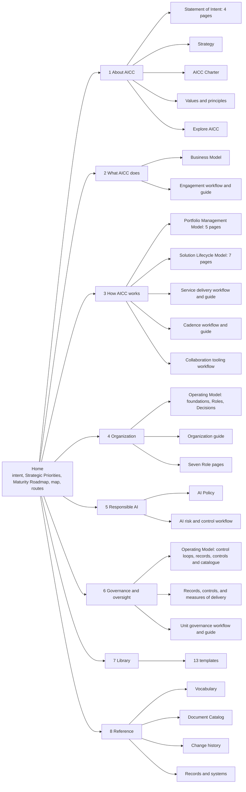
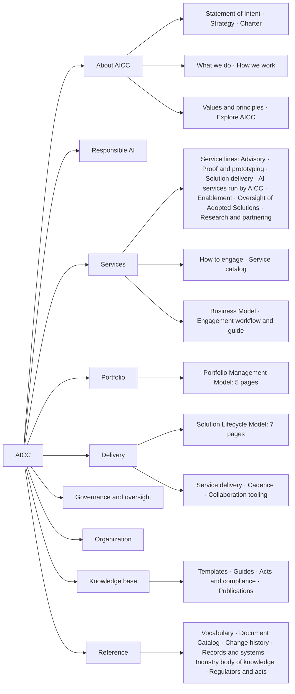

# Portal site structure: scaffolding

Working design for the structure of the AICC charter site. It positions the existing charter content and defines no content of its own. The charter folder stays the only source of the text, and this page is the plan for where each piece appears. The machine-readable form is `sitemap.json`, the table of all pages is `inventory.md`, the outline of each page is in `pages/`, and the folder is described in the README. The reasons for the placement are in `content-fit.md`. It is explanatory and is not a document of the charter.

## 1. What kind of site this is

The site is a static knowledge base and the department site of AICC. It states what AICC is, what it does, how it works, how it is organized, how it uses AI responsibly, and how it is governed. Internal audit and other reviewers use it as a reference, and they are served by a reading route and not by the organizing principle. The live matters stay in other systems: the Registry holds the records, Jira holds the working state, Confluence holds the working documents, and Service Management holds requests and incidents. The site names those systems and does not reproduce their content.

## 2. How site structures are drawn

Designers build a site structure from a small set of artifacts, in this order. Each artifact answers one question, and this folder supplies the first six.

| Artifact | Question it answers | Where it is here |
| --- | --- | --- |
| Content inventory | What content exists, and where is its source? | inventory.md |
| Sitemap | Which pages exist, and under what? | Section 3 and sitemap.json |
| Navigation model | How does a reader move between pages? | Section 4 |
| Page types | What are the kinds of page, and what is on each? | Section 5 |
| Wireframes | How is a page laid out, in low fidelity? | Section 6 |
| User flows | By what path does a reader reach an answer? | reading-routes.md |
| Visual design | How do the pages look? | The existing O!Bank tokens and UI kit of the portal foundation |

The next artifact to produce is a clickable low-fidelity prototype of the home page, one section landing page, and one document page, reviewed before the build.

## 3. Sitemap

The site has a home page, eight sections, and 73 pages in the scaffold, and the build adds one generated page for each of the 32 controls. A section is a grouping for navigation. A document has one canonical page, or one canonical page for each part when it is split, and a second section that needs it shows a view of that page or links to it. Figure 1 shows the sections, the documents, and the number of their pages.



Figure 1: the sitemap, with the pages that sit under each section.

Three documents serve more than one section. The Operating Model supplies Organization (foundations, Roles, Decisions) and Governance and oversight (control loops, records and evidence, controls). The Solution Lifecycle Model supplies How AICC works (sections 1 to 8) and Governance and oversight (sections 9 and 10). The Statement of Intent supplies About AICC and is featured on the home page. Responsible AI links the AICC Charter 5 (the AI Risk Appetite Statement) and the Solution Lifecycle Model 7 (the gates before use). About AICC links "also stated in" for Business Model 2 and Operating Model 2.

## 4. Navigation model

| Element | Content | Rule |
| --- | --- | --- |
| Global navigation | The eight sections, in the order of the sitemap | Visible on every page, with the current section marked |
| Section page | A short introduction, then the list of its pages with one line each | The introduction is authored, and the list is generated |
| Breadcrumb | Home, section, page | On every page below the home page |
| Document parts | For a split document, the list of its parts with the current part marked | At the head of every part |
| In-page outline | The headings of the page, down to the clause level | Fixed beside the text on a wide screen and folded above the text on a narrow one |
| Previous and next | The neighbours in the reading order of the section | At the foot of every page |
| Companion | The workflow and the guide of the same subject | At the head of both pages |
| Cross-reference | A reference such as Operating Model 6.6 | A link to that clause, produced by the build |
| Defined term | A term of the Vocabulary | A link to its entry |
| Clause permalink | The number of the clause | Stable address of the form page/#6-6, identical in every language |
| Search | All pages of the language | In the header on every page |
| Footer | The baseline revision, the date, the owner of the charter, and the Records and systems link | On every page |

## 5. Page types

| Type | Used for | Elements from top to bottom |
| --- | --- | --- |
| Home | The entry | Intent in two sentences; the Strategic Priorities and the Maturity Roadmap; the map of AICC; the eight sections; the reading routes; the baseline stamp |
| Section | The grouping | Introduction; the pages of the section with one line each; the related sections |
| Document | A document, or a part of one | Title; purpose; revision, date, and owner; the parts of the document; outline; the clauses with permalinks and a cited-by line; related pages; change history; previous and next |
| Workflow | The six workflows | Title and purpose; the companion guide; the diagram with its text version and clause links; the steps table; the actors; the situations; the templates that it uses; previous and next |
| Guide | The five guides | Title and purpose; the companion workflow; the diagrams; the tables; the rule source; previous and next |
| Template | The 13 templates | Title; when it is used; where the record is kept; the form with a copy button; the clause that requires it; the workflows that use it |
| Role | The seven Roles | Purpose; responsibilities; authority; reporting line; the decisions of the Role; the RACI row; where the Holder is recorded; where the Role is cited |
| Catalogue | The controls | A filterable list of the 32 controls; one page for each with the rule clause, the owner, the timing, the evidence record, the template, the objective, the type, and the test |
| Reference | Vocabulary, Document Catalog, change history | The list or table, an index, and links to the pages that use each item |
| Records and systems | The boundary with the live systems | One table: record, template, system of record, control that it evidences, who keeps it |

## 6. Wireframes (low fidelity)

The home page:

```text
+----------------------------------------------------------------------+
| O!Bank | AI Competence Center      [Search........]   EN | RU   (o)   |
| 1 About  2 What AICC does  3 How it works  4 Organization  5 Resp. AI |
| 6 Governance  7 Library  8 Reference                                  |
+----------------------------------------------------------------------+
|  The AI Competence Center explores, trials, and proves the use of AI  |
|  with the functions of the Bank, and shapes the adoption of AI.       |
|                                                                      |
|  Strategic Priorities (7)              Maturity Roadmap (levels)      |
|                                                                      |
|  [ Map of AICC: what it does -> how it works -> how it is safeguarded ]|
|                                                                      |
|  About AICC        What AICC does      How AICC works                 |
|  one line          one line            one line                       |
|  Organization      Responsible AI      Governance and oversight       |
|  one line          one line            one line                       |
|                                                                      |
|  Reading routes: Orientation | Executive | Function | Delivery | Review|
+----------------------------------------------------------------------+
| Baseline revision 1.0, 2026-10-02 | Owner | Records and systems      |
+----------------------------------------------------------------------+
```

A part of a document:

```text
+----------------------------------------------------------------------+
| header and global navigation                                          |
| Home > Organization > Operating Model: Roles                          |
+----------------------------------------------------------------------+
| Operating Model                                    Rev 1.0 | 2026-10-02|
| Parts: Foundations | [Roles] | Decisions        Owner: AICC Lead      |
|                                                                      |
| On this page         | 4.2  The Roles and their decisions   [link]   |
|  4.1 ...             |      text of the clause...                    |
|  4.2 ...             |      Cited by: Service delivery workflow, C-22|
|                      | 4.3  ...                                      |
+----------------------------------------------------------------------+
| Related pages | Change history | < Previous            Next >         |
+----------------------------------------------------------------------+
```

A workflow page:

```text
+----------------------------------------------------------------------+
| Home > How AICC works > Service delivery workflow                     |
| Purpose: one sentence.                       Companion: Service guide |
| [ Diagram ]  Read as text: step 1 ... step 2 ...  (clause links)      |
| Steps: who | when | record | clause                                   |
| Situations table                                                      |
| Uses: Initiative Brief | Solution Definition | Acceptance Checklist   |
+----------------------------------------------------------------------+
```

## 7. Reading routes

The routes are listed on the Overview and the home page. Each is a short sequence of pages and states a purpose. They are formal reading orders and not task cards. The sequences, by page identifier, are in `reading-routes.md`.

## 8. What has to be written for the site

The charter text is complete. The site needs only the following short authored items, none of which restates a rule.

| Item | Length | Note |
| --- | --- | --- |
| Home introduction | Two sentences | From the Summary of intent and the Mission |
| Eight section introductions | Three to five lines each | State what the section covers and what is kept elsewhere |
| The map of AICC | One diagram and a text version | Connects what AICC does, how it works, and how it is safeguarded |
| About AICC | One page, a summary of AICC | What it is, the goal, the strategy, the approach, the authority, the safeguards, with links to the deep pages |
| Values and principles | One page | The values and the principles of adoption, application, work, and delivery, each with what it applies to |
| Reading routes | The five routes | Based on the routes of the charter README |
| Records and systems | One table | Built from the Operating Model 7 and the Registry README |
| Explore AICC | An introduction | The rest is generated from the charter README; the last page of About AICC |

## 9. Open points

1. The label of each section, and whether Organization and Governance and oversight stay separate, since both draw on the Operating Model.
2. Whether the Role pages are in the first version.
3. Whether the control catalogue links to the live status in the Control Matrix, which is kept in the Registry.
4. Whether the Records and systems page names the systems by name and address, which depends on where Jira and Confluence are installed.
5. Whether the five-line summaries are authored or taken from the purpose clause.
6. The language of the first release: the charter text is in English.

## 10. The structure in use: AICC as a consulting organization (adopted 2026-10-02)

The site was first built on the sitemap of section 3. After the About section was settled, the review of What AICC does found that the offer of AICC is not visible in one place: the services sat scattered in the Business Model 4, the Solution Lifecycle Model 8, the Engagement guide, and the Statement of Intent 10, and the navigation read as an index of documents and not as the site of a services organization. The following structure replaced it on 2026-10-02 and is the one the site is built from. `make_pages.py` writes it; `make_pages.py --previous` writes the first structure to `previous/` for the record. The new pages are authored in `portal/content/` as first editions for review.

### 10.1. The model

AICC presents itself as the internal consulting and innovation lab of the Bank: a research and consulting organization across strategy, programs, solutions, and ways of working, and a small delivery unit that proves and builds and relies on the platform teams and IT to scale. The pattern follows how consulting houses and internal AI centers present themselves: the service lines in one place, the method apart from the offer, the products that the unit runs as a catalog, a visible front door, enablement, and governance.

### 10.2. The sections

| Order | Section | Address | Holds | Change |
| --- | --- | --- | --- | --- |
| 1 | About AICC | /about/ | Statement of Intent (four pages), Strategy, Charter, What we do, How we work, Values and principles, Explore AICC | two one-page summaries move in |
| 2 | Responsible AI | /responsible-ai/ | AI Policy, AI risk and control workflow | moves up, before the offer |
| 3 | Services | /services/ | The service lines (seven pages), How to engage, the Service catalog, Business Model, Engagement workflow and guide | new; replaces What AICC does |
| 4 | Portfolio | /portfolio/ | Portfolio Management Model (five pages) | split out of How AICC works |
| 5 | Delivery | /delivery/ | Solution Lifecycle Model (seven pages), Service delivery workflow and guide, Cadence workflow and guide, Collaboration tooling workflow | the rest of How AICC works |
| 6 | Governance and oversight | /governance/ | as in section 3 | moves down, under Delivery |
| 7 | Organization | /organization/ | as in section 3 | moves down; see decision 4 |
| 8 | Knowledge base | /knowledge-base/ | The 13 templates, the list of the guides, Acts and compliance, Publications | replaces Library; three pages added |
| 9 | Reference | /reference/ | Vocabulary, Document Catalog, change history, Records and systems, Industry body of knowledge, Regulators and acts | two pages added |



The order places what AICC stands for and the rules of use first, the offer and the method next, the control of the unit after the method, and the knowledge last.

### 10.3. The Services section page

The section page is the core of the refactoring, and it is authored for the site. It has five parts.

1. The lead: AICC as the internal consulting and innovation lab of the Bank; what it researches, advises on, proves, builds, runs, and teaches; and that it relies on the platform teams and IT to scale.
2. The service lines as cards, each opening a one-page description: what it is, what the client receives, the typical shape, what it leads to, the templates used, who decides, and the governing clauses. The lines are Advisory; Proof and prototyping; Solution delivery; AI services run by AICC; Enablement; Oversight of Adopted Solutions; Research and partnering.
3. How to engage: the front door in six steps (contact, study, Service Agreement, delivery, Outcome Report, support), the statement that the function commits to nothing and that AICC works on a best-effort basis within its capability, and the links to the Engagement workflow and guide and to the Initiative Brief, the Service Agreement, and the Outcome Report.
4. Service levels: none, on demand, agreed response targets, run by AICC, and the Solution type that each gives (Engagement guide 6).
5. What AICC does not do: the limits of the AICC Charter 3.2, stated plainly, with the note that AICC does not deliver at scale.

The text of the service lines synthesizes the Business Model 4, the Solution Lifecycle Model 8, and the Statement of Intent 10, and every card links the governing clause. It restates no rule.

### 10.4. The two one-pagers of About AICC

What we do and How we work are summaries of one page each: the first states the offer in one line per service line and what AICC is not; the second states the engagement model and the method in brief, and links to Services, Portfolio, and Delivery. They replace the role that the section pages What AICC does and How AICC works play today.

### 10.5. Decisions taken at the build, open for review

1. **The Service catalog on the site.** Built: `services/catalog` is generated from `portfolio/solutions/*.md` at each build and dated (identifier, title, type, state, Initiative, Domain, receiver). It is the one page of dynamic content on the site, and it states that the Portfolio prevails.
2. **Research and partnering as a service line.** Built as a page that states on its face that the line is stated on the site and not yet in the Business Model, and that it becomes a commitment when the Business Model states it. A clause for the Business Model 4 is proposed.
3. **The names** Services, Portfolio, Delivery are used.
4. **Organization.** The order given for the navigation did not name it. It stays a section after Governance and oversight in this record; the alternative is to fold it into Governance and oversight as "Governance and organization", since both draw on the Operating Model.
5. **The new knowledge pages.** Acts and compliance, Publications, Industry body of knowledge, and Regulators and acts hold content that the charter does not state. They are authored for the site and curated: the acts and the regulators with the Control Function Contacts, the publications and the body of knowledge by the AICC Lead. The split between the two acts pages: Reference lists the bodies and the texts; the Knowledge base states what each requires and how AICC complies. Each page starts as a curated list and grows with use.

### 10.6. Effect on the build

The identifiers and addresses under `what-aicc-does/`, `how-aicc-works/`, and `library/` changed to `services/`, `portfolio/`, `delivery/`, and `knowledge-base/`. The build holds them in `portal/content/authored.json` (routes, the map of the home page, the links of the About page, the section introductions), in `portal/tools/build.py`, and in the sitemap. The published addresses changed, so the publication of this structure is a new baseline of the site, not a correction. The authored pages are first editions: the service lines synthesize the charter; Acts and compliance, Regulators and acts, and the Industry body of knowledge are curated lists to be verified with the Control Function Contacts; Publications starts with the charter and two empty tables.
