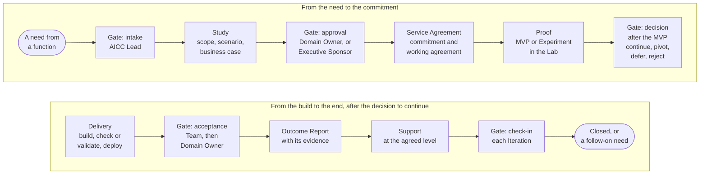

# How we work

AICC works as a consulting unit works. A function brings a need; AICC takes it in, studies it, commits to it, proves it, builds it, and supports it, and each step leaves a record and a decision that the function can see. The Portfolio decides what AICC works on. Delivery builds it in small steps on a common cadence, with quality and control inside the flow rather than after it.

## 1. The engagement flow

1.1. Figure 1 shows the flow of an Engagement from the first contact to its end, with the gate at each step and the person who decides at it.

Figure 1: the flow of an Engagement, with its gates.

1.2. AICC commits in a Service Agreement, on a best-effort basis within the capability that it has; the function commits to nothing, and what AICC relies on from the function is written as an Assumption. Either side may end or redirect the Engagement at the end of an Iteration. The page How to engage states the steps, the commitment, and the service levels in full.

## 2. Two lanes through one Portfolio

2.1. Run-rate work is small and repeatable: a document, an automation, a view, a training, an assessment. It is taken in at the Weekly Review and done in days to one Iteration, within the Limits on Work in Progress of the Team.

2.2. A program is an Initiative: a charter pack, a knowledge base, an engine, a trial. It has a business case and an MVP, and it is decided through the four portfolio loops within the limit on the Active Initiatives.

2.3. Both lanes enter through the same front door and leave the same records; the lane decides the depth of the study and the number of gates, not the standard.

## 3. Delivery on a cadence

3.1. The work runs in Program Increments of one quarter and Iterations of one month, on fixed dates. The Team selects the Features at Iteration Planning, builds within the Limits on Work in Progress, and shows the result at the Iteration Review and Demo, where the product owner accepts each Feature.

3.2. Before a Solution reaches its users, three acceptances are given in order: a person other than its builder checks or validates it, in proportion to its Risk Tier; the AICC Lead gives the final acceptance of the Team; the Domain Owner accepts the working Solution as the requester. Release beyond the first users is a separate decision.

3.3. An Experiment runs in the Lab, on read-only extracts, for a stated number of Iterations, and ends in a decision: promote, hand over, or shelve with its lessons.

## 4. After delivery

4.1. A Product is handed over to its consumer and supported on demand. A Service that AICC runs lives through seven states after its release, is operated under the practices of service operations, and is read on four signals at each review: service levels, incidents, adoption, cost. Every Solution has a Risk Tier, an entry in the AI Registry, and an owner.

## 5. How the unit is controlled

5.1. AICC is controlled through five control loops and a catalogue of controls. The AICC Lead reports each quarter in the Quarterly Report, the Executive Sponsor issues it to the Board Committee, the Control Functions validate and may stop, and internal audit gives independent assurance.

## 6. Where to read on

6.1. The Services section states the service model and how to engage. The Portfolio section states how the categories enter the funnel and how Initiatives are decided. The Delivery section states how Solutions are built, how an Experiment runs, and how a Service lives and is operated. Governance and oversight states how the unit is controlled.
