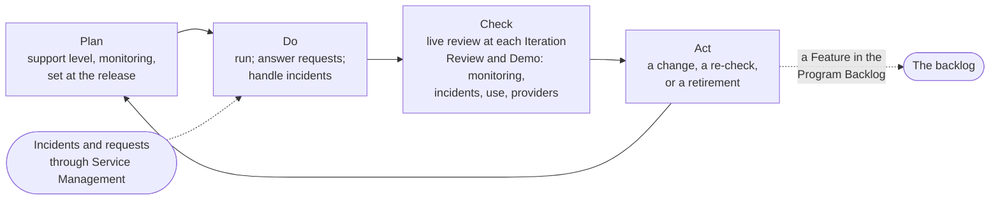
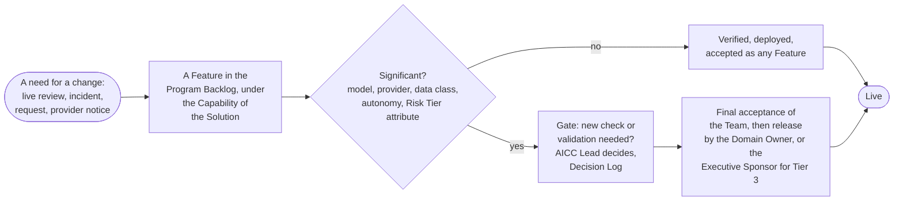

# Life-cycle management

Delivery does not end at release. A Solution is delivered when its first deployment is released, and from then on it has a life of its own, set by its type, with an owner, a support level, a review at each Iteration, changes that are verified as any Feature is, and a retirement that is as deliberate as its release. This part states the life after release and the loops that run through it; three pages of this section go deeper: The life of a Service, Service operations, and The Experiment workflow.

## 1. The three types

| Type | Owner after delivery | Stages after delivery | End |
| --- | --- | --- | --- |
| Service | AICC, for the whole life, with a business case that states the run cost and a sunset rule; the Domain Owner accepts and reviews it, the Executive Sponsor for a Service across Domains | Operate, Evolve, Retire; new features come as Capabilities and Features | Retired, or cancelled |
| Product | The consumer owns the version delivered; AICC supports it on demand | Handover, Support, Revise through the Portfolio Backlog, Retire for that consumer; a Product with many consumers or recurring requests becomes a Service through a business case | Retired for that consumer |
| Experiment | None yet: time-boxed to a stated number of Iterations, ending in a Proposal; accepted by the Executive Sponsor when it has no Domain | Trial, Proposal, Handover | Accepted with its lessons and closed, a Proposal made, or rejected; when a Receiver accepts the Handover, closed and overseen as an Adopted Solution |

1.1. The phases of an Engagement map onto the life: the study is the discovery of the Initiative, the proof is the Experiment or the first Features of the Solution, delivery is the active state of the Capabilities and Features, and support is the life of the Solution after delivery.

## 2. The operating loop

2.1. The IT function that operates a Solution runs it; for a Service that AICC runs, the Solution Engineer acts as that function. The operation is a loop. The plan sets the support level of the Service Agreement and the monitoring at the release. The do runs the Solution, answers the requests, and handles the incidents. The check is the review by the Domain Owner, or the Executive Sponsor for a Service across Domains, of the monitoring, the incidents, the use, and the notices of the providers at each Iteration Review and Demo, noted in the Solution Definition. The act raises a change, a re-check, or a retirement into the backlog.

Figure 1: the operating loop of a live Solution.

## 3. Support

3.1. Requests and incidents about a Solution come to the queue of AICC in Service Management. A request is triaged by its class of service, Urgent, High priority, or Normal, handled, and closed; the response targets of the Service Agreement are targets and not guarantees. Every outage or failure is raised in the incident management of the Bank, and an AI Incident is handled there with the AICC Lead as a stakeholder and reviewed afterwards. A request for a new feature enters the Program Backlog. A Product is supported on demand, a Service at the agreed response targets. The practices behind this, sized to a small unit, are stated on Service operations.

## 4. Change

4.1. A change to a released Solution is a Feature, and it is verified and deployed as any Feature is. A change of model, provider, data class, degree of autonomy, or any attribute of the Risk Tier is significant: the AICC Lead decides whether it requires a new check or validation, enters the decision in the Decision Log, and the change is released by the Domain Owner, or by the Executive Sponsor for Risk Tier 3, after the final acceptance of the Team. Any other change is accepted as a Feature. An emergency change follows the emergency procedure of the change management of the Bank. A change that raises the Risk Tier returns the Solution to Discovery for the checks that the change touches.

Figure 2: the loop of a change to a released Solution.

## 5. Retirement

5.1. Before a Solution is Closed as retired, the Solution Engineer removes the access and the credentials, the data and the logs are kept or deleted under the retention rules of the Bank, and the AI Registry entry is marked retired. The Domain Owner, or the Executive Sponsor for a Service across Domains, approves the retirement, entered in the Solution Definition. The same steps apply before a Solution that had real users or data is Cancelled. A Service that the Bank should run at scale is not scaled by AICC; it goes through transition to a platform team or an IT function, with a Proposal and the acceptance of the receiving team, as The life of a Service states.

## 6. Adopted Solutions

6.1. AICC oversees and reports on the Adopted Solutions that others deliver, in the Portfolio, as a Solution Definition marked as adopted with its Receiver as owner, with the Risk Tier when known. The owners and the Executive Sponsor decide on a Proposal of a Solution; the Bank decides on a Proposal of the AI adoption strategy, which AICC shapes from what it proves.

## 7. Rule source

Solution Lifecycle Model 8; AI Policy 3.4 and 5; Business Model 4.2; Operating Model 4.2 and 4.4.
