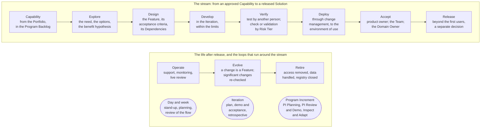

# Delivery

Delivery is how an approved idea becomes a working Solution in the hands of a function, and how that Solution is kept, changed, and retired. AICC delivers in small steps on a fixed cadence, with the work visible and limited, with quality built into the flow rather than inspected at the end, and with a decision and a record at each step. This course explains the method in ten parts, as a reader new to agile delivery at scale would need it; the Solution Lifecycle Model is the rule and prevails.

## 1. One picture

1.1. Figure 1 shows delivery end to end: the stream a Feature travels, from the Capability that the Portfolio approved to a Solution in use, and the loops that run around it.

Figure 1: delivery end to end, the stream and the loops.

## 2. What delivery is for

2.1. The Portfolio decides what is worth doing; delivery makes it real without betraying the decision. Its job is to turn a hypothesis into working software and working practice in a function, to learn early whether the hypothesis holds, to keep the Bank safe while doing so, and to do it at a rhythm the functions can plan around. For a unit of a few people, the method matters more than for a large one: the cadence, the limits, and the gates are what let three people deliver without heroics and without surprises.

2.2. The principles of the Solution Lifecycle Model state it in eight lines: make work visible, limit work in progress, and pull; deliver in small steps, probe, measure, then scale; put value first; plan on a cadence, where the plan of a quarter states intent and not a promise; build quality in; decide where the facts are; make dependencies visible and manage them as work; improve continuously.

## 3. The industry practice it follows

3.1. The method is the lean-agile practice of delivering at scale, adapted to a small unit in a bank. Its elements, in general terms: work is organized in levels, from the large business item to the small deliverable, each worded as a hypothesis with acceptance criteria; a cadence of fixed-length increments and iterations synchronizes planning, delivery, and review; a Kanban at each level makes the work visible and limits it; a program board makes dependencies and milestones visible across the increment; a pipeline of exploration, integration, deployment, and release on demand carries each item from idea to user, with deployment and release separated so that the Bank decides when value is switched on; quality is built in at every step by tests, reviews, and definitions of done; events at each level plan, demonstrate, and improve; and flow is measured rather than effort. The practice is recorded in the [Industry body of knowledge](../reference/industry-body-of-knowledge.md).

3.2. Where the Bank's model differs from the common form, it is because of scale and regulation: one Team rather than many, a month-long Iteration rather than two weeks, an Innovation and Planning week that also hosts the quarterly Steering, light mode while the Team has up to three people, and the check or validation by a person other than the builder, in proportion to the Risk Tier, written into the Verify step.

## 4. How to read this course

4.1. Part 2 follows the flow of value: the levels of the work and the stream a Feature travels. Part 3 states the backlogs, the boards, and the Kanbans. Part 4 states the cadence of Program Increments, Iterations, weeks, and days. Part 5 states the events and rituals, one by one. Part 6 draws the loops: the control loop at each level, and the exploration, build, release, and feedback loops that run through them. Part 7 states quality, verification, and release. Part 8 states life-cycle management after release. Part 9 states how delivery is measured and tracked. Part 10 states the roles and the records. The Solution Lifecycle Model follows as the rule, and the workflows and guides show the cadence and the service delivery in flows and tables.
