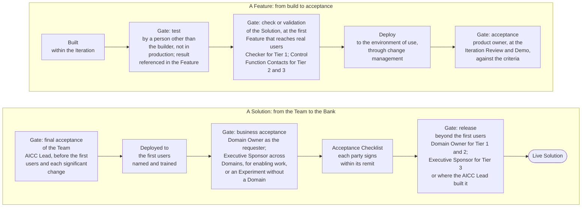

# Quality, verification, and release

Quality is built into the flow of delivery, not inspected at its end. Every Feature is tested by a person other than its builder before it is deployed; every Solution is checked or validated in proportion to its Risk Tier before it reaches real users or data; acceptance is given at three levels, each against written criteria; and release beyond the first users is a separate decision, with a signed checklist. This part states the gates in order and the reasoning behind each.

## 1. The gates in order

Figure 1: the gates of quality, acceptance, and release.

## 2. The gates, in brief

2.1. Every Feature, and the MVP, is tested by a person other than its builder, in an environment that is not production, before it is deployed; the result is referenced in the Feature. The check for Risk Tier 1 and the validation by the Control Function Contacts for Risk Tier 2 and 3 attach to the Solution and are taken at the first Feature that reaches real users or data; for Risk Tier 2 and 3 the validation includes a security test against the attacks specific to AI. AICC does not validate its own work.

2.2. Acceptance is given at three levels, each against written criteria and noted with who and when: the product owner accepts each Feature and Capability at the Iteration Review and Demo; the AICC Lead gives the final acceptance of the Team before a Solution is put in front of its first users and before each significant change; the requester, the Domain Owner, judges the working Solution deployed to its first users. Three questions, each asked by the person entitled to answer it: does the Feature do what we wrote; is the Solution safe and complete enough to put in front of people; does it solve the problem the function brought.

2.3. Deployment and release are different acts. A Feature is deployed to its environment of use after its test and its check or validation, through the change management of the Bank. Release beyond the first users is a separate decision, by the Domain Owner for Risk Tier 1 and 2 and by the Executive Sponsor for Risk Tier 3 or where the AICC Lead built it, taken when the Acceptance Checklist is signed by each party within its remit; an item not met stops the release. Features flow at the pace of the Team; the Bank switches value on at the pace of its judgment.

2.4. Behind the gates stand the practices that make them pass: criteria written before the work, small Features, integration as the work goes, a definition of done that includes the test, the deployment, and the record, and the measures of quality read at the Weekly Review and the Iteration Review and Demo. A failing measure is a problem for Inspect and Adapt, not a reason to add a gate. The Solution Lifecycle Model 7 states the gates in full, with the limit accepted while the Team is small and its compensating controls; the Service delivery guide states who decides at each.

## 3. Rule source

Solution Lifecycle Model 7 and 8.3; AI Policy 3; Operating Model 4.4; the Acceptance Checklist and Control Sign-Off templates; the Service delivery workflow and guide.
