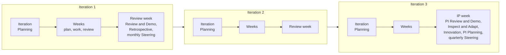

# The cadence: Program Increments and Iterations

Delivery runs on a fixed rhythm. A Program Increment is one quarter; it holds three Iterations of one calendar month each; the last week of the third Iteration is the Innovation and Planning week; every week starts with planning and ends with review; every working day starts with a stand-up. The dates are fixed in advance in the Calendar Record, and the plan of a quarter states intent and direction, not a promise of scope. This part states the cadence and why a fixed rhythm is the opposite of rigidity.

## 1. The units of the cadence

| Unit | Length | Holds | Named |
| --- | --- | --- | --- |
| Program Increment (PI) | One quarter | Three Iterations; the IP week in the last week of the third | PIQ1 to PIQ4 of a year |
| Iteration | One calendar month of four or five whole weeks | The weeks; the review week last, except where the IP week takes its place | I01 to I12 |
| IP week | The last week of the third Iteration | PI Review and Demo, Inspect and Adapt, Innovation, PI Planning, the quarterly Steering | The IP week of PIQn |
| Week | Monday to Friday | Weekly Planning on Monday, the work, Weekly Review on Friday | W1 to W5 of an Iteration |
| Day | A working day | The Daily Stand-up and the work | |

1.1. The Calendar Record may place the IP week earlier and keep a year-end week free of events. An event that falls on a blocked or gray day moves to the working day before it, never after; when moved events meet, the larger keeps the day. Innovation is optional and is dropped first when days are lost. An event that is missed is not held later; its intent is covered at the next event.

## 2. A quarter in sequence

2.1. Figure 1 shows a Program Increment: three Iterations, each with its planning, its working weeks, and its review week, and the IP week that closes the quarter and opens the next.

Figure 1: a Program Increment in sequence.

## 3. Why a fixed cadence

3.1. A fixed cadence does three things that a plan cannot. It synchronizes: everyone knows when the next planning, demo, and review fall, so the functions, the Control Functions, and the Steering can plan their part without being asked each time. It bounds the batch: an Iteration can hold only so much, so the work is cut into pieces that finish, and a Feature closes within one Program Increment by rule. And it makes learning regular: every month ends with a demonstration and a retrospective, every quarter with a review and an improvement, so that the method corrects itself on a schedule rather than after a failure.

3.2. The cadence is fixed; the content is not. The PI Objectives state what the quarter aims at and are scored for the value they delivered, but they are not a promise of scope, and the Iteration Backlog is selected month by month from a ranked backlog that changes. That is the distinction between planning on a cadence and committing to a plan.

## 4. Light mode

4.1. While the AICC Team has up to three people, AICC runs in light mode: the Weekly Planning and the Weekly Review are one session; the Iteration Retrospective and the monthly Steering are held in the Iteration Review and Demo; Inspect and Adapt is held in the PI Review and Demo; the Daily Stand-up, Backlog Refinement, and Innovation are optional; Work Items are not tracked in the charter; and the AICC Lead is the product owner. Everything else stays as stated, so that the method grows without changing when the Team does.

## 5. The cadence and the control of the unit

5.1. The loops of delivery run on the same events as the control loops of the Operating Model and the portfolio loops, and add no meeting. The Weekly Review is also the operating loop and the backlog care loop; the monthly Steering takes the results of the Iteration Review and Demo; the quarterly Steering takes the results of the PI Review and Demo; the yearly Steering is the monthly Steering of December. One calendar serves delivery, the Portfolio, and the governance of the unit.

## 6. Rule source

Solution Lifecycle Model 6.1, 6.5, 6.6, and 6.7; the Cadence workflow and guide; the Calendar Record.
