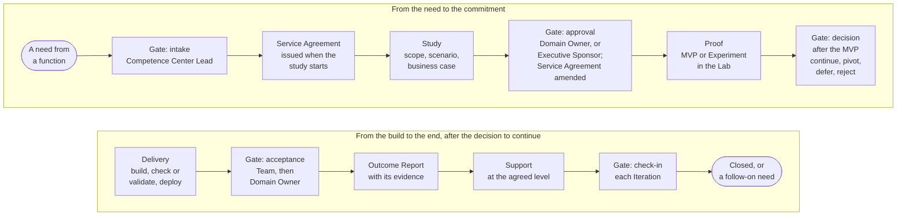

# How we work

The Competence Center works as a consulting unit works. A function brings a need; The Competence Center takes it in, studies it, commits to it, proves it, builds it, and supports it, and each step leaves a record and a decision that the function can see. The Portfolio decides what the Competence Center works on. Delivery builds it in small steps on a common cadence, with quality and control inside the flow rather than after it.

## 1. The engagement flow

1.1. Figure 1 shows the flow of an Engagement from the first contact to its end, with the gate at each step and the person who decides at it.

Figure 1: the flow of an Engagement, with its gates.

1.2. The Competence Center commits in a Service Agreement, on a best-effort basis within the capability that it has; the function commits to nothing, and what the Competence Center relies on from the function is written as an Assumption. Either side may end or redirect the Engagement at the end of an Iteration. The page How to engage states the steps, the commitment, and the support levels in full.

## 2. Two modes through one Portfolio

2.1. Run-rate work is a small, repeatable request of a function that is done within one Iteration: a document, an automation, a view, a training, an assessment. It is a Feature under the Standing Initiative of its service area, taken in by the Competence Center Lead at the Weekly Review within the Limits on Work in Progress once the Domain Owner has approved the use for its data class, and supported on demand only. It needs no Initiative Brief, Service Agreement, or Outcome Report of its own (Business Model 4.7 to 4.9).

2.2. Any other work is an Initiative: a charter pack, a knowledge base, an engine, a trial. It has a business case and an MVP, and it is decided through the four portfolio loops within the limit on the Active Initiatives.

2.3. Both modes enter through the same intake and leave the records that the work requires; the mode sets the depth of the study and the number of gates, not the standard of the work.

## 3. Delivery on a cadence

3.1. The work runs in Program Increments of one quarter and Iterations of one month, on fixed dates. The Team selects the Features at Iteration Planning, builds within the Limits on Work in Progress, and shows the result at the Iteration Review and Demo, where the product owner accepts each Feature.

3.2. A Solution is checked or validated in proportion to its Risk Tier, then accepted by the product owner, the Competence Center Lead, and the Domain Owner (Solution Lifecycle Model 7.3): the product owner accepts each Feature, the Competence Center Lead gives the final acceptance of the Team before the first users, and the Domain Owner accepts the working Solution as the requester. The check or the validation is not an acceptance, and release beyond the first users is a separate decision.

3.3. An Experiment runs in the Lab, on read-only extracts, for a stated number of Iterations, and at the end of its time-box goes to review: it is accepted with its lessons and closed, a Proposal is made, or it is rejected (Solution Lifecycle Model 8.1, 8.13).

## 4. After delivery

4.1. A Product is handed over to its consumer and supported on demand. A Service that the Competence Center runs passes through the service steps from Admitted to Handed over or Retired after its release, is operated under the practices of service operations, and is read on four signals at each review: service levels, incidents, use, cost (Solution Lifecycle Model 8.4, 8.8). Every Solution has a Risk Tier, an entry in the AI Registry, and an owner.

## 5. How the unit is controlled

5.1. The Competence Center is controlled through five control loops and a catalog of controls. The Competence Center reports to the Executive Sponsor: the Competence Center Lead reports each quarter in the Quarterly Report, and the Executive Sponsor may bring it, or a Proposal at the scale of the Bank, to the Board Committee or the Board. The Control Functions validate and may stop, and internal audit gives independent assurance.

## 6. Where to read on

6.1. The Services section states the service model and how to engage. The Portfolio section states how the categories enter the funnel and how Initiatives are decided. The Delivery section states how Solutions are built, how an Experiment runs, and how a Service lives and is operated. The Governance section states how the unit is controlled.
