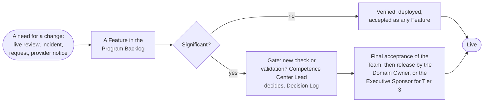

# Life-cycle management

Delivery does not end at release. A Solution is delivered when its first deployment is released, and from then on it has a life of its own, set by its type, with an owner, a support level, a review at each Iteration, changes that are verified as any Feature is, and a retirement that is as deliberate as its release. This part states the life after release in brief; three pages of this section go deeper.

## 1. The three types

| Type | Owner after delivery | Stages after delivery | End |
| --- | --- | --- | --- |
| Service | Competence Center, for the whole life, with a business case that states the run cost and a sunset rule; the Domain Owner accepts and reviews it, the Executive Sponsor for a Service across Domains | Operate, Evolve, Retire, refined by the service steps; new features come as Capabilities and Features | Retired, handed over to an IT function of the Bank, or cancelled |
| Product | The consumer owns the version delivered; The Competence Center supports it on demand | Handover, Support, Revise through the Portfolio Backlog, Retire for that consumer; a Product with a second consumer or recurring requests gives rise to a Service, a new Solution with its own business case | Retired for that consumer |
| Experiment | None yet: time-boxed to a stated number of Iterations, ending in a Proposal; accepted by the Executive Sponsor when it has no Domain | Trial, Proposal, Handover | Accepted with its lessons and closed, a Proposal made, or rejected; when a Receiver accepts the Handover, closed and overseen as an Adopted Solution |

1.1. The phases of an Engagement map onto the life: the study is the discovery of the Initiative, the proof is the Experiment or the first Features of the Solution, delivery is the active state of the Capabilities and Features, and support is the life of the Solution after delivery.

## 2. Operation, support, and change

2.1. The operation of a live Solution is a loop: the support level and the monitoring are set at the release; the Solution runs, answers requests, and handles incidents; the Domain Owner reviews its monitoring, incidents, use, and provider notices at each Iteration Review and Demo; and the review raises a change, a re-check, or a retirement into the backlog. Requests and incidents come through Service Management by class of service, an outage goes to the incident management of the Bank, and an AI Incident is reviewed afterwards. A change to a released Solution is a Feature, verified and deployed as any Feature is; a significant change, of model, provider, data class, autonomy, or any attribute of the Risk Tier, is re-checked where the Competence Center Lead decides and released as the first deployment was.

Figure 1: the loop of a change to a released Solution.

## 3. Retirement and Handover

3.1. Before a Solution is Closed as retired, access and credentials are removed, data and logs are kept or deleted under the retention rules of the Bank, the AI Registry entry is marked retired, and the Domain Owner, or the Executive Sponsor for a Service across Domains, approves. A Service the Bank should run at scale is not scaled by the Competence Center: it is handed over to an IT function of the Bank on a Proposal that names the Receiver, and it is Closed as handed off when the Receiver accepts the Handover (Solution Lifecycle Model 8.11).

## 4. Where the detail is

4.1. Three pages of this section state the life after release in depth: The life of a Service, the seven service steps a Service passes through with the question, the signals, the action, and the gate of each; Service operations, the practices of request, incident, problem, change, knowledge, service levels, run cost, and suppliers sized to a small unit, with the classes of service and the four signals; and The Experiment workflow, the six steps of the Trial and the rules of the Lab in which an Experiment runs. The Solution Lifecycle Model 8 is the rule for all three.

## 5. Rule source

Solution Lifecycle Model 8; AI Policy 3.4 and 5; Business Model 4.2; Operating Model 4.2 and 4.4.
