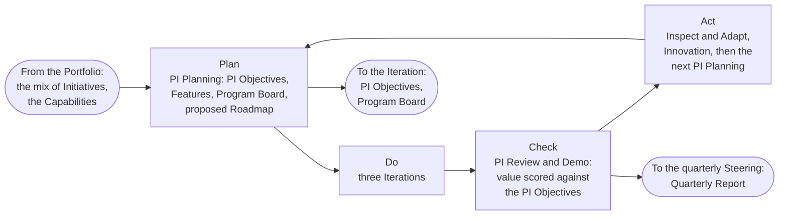
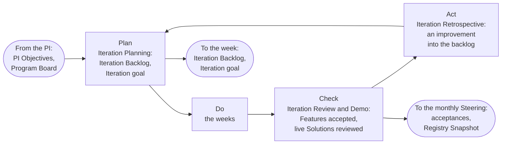
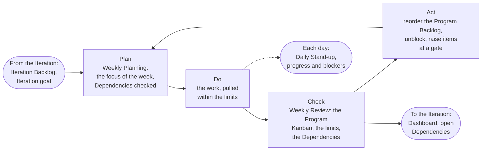
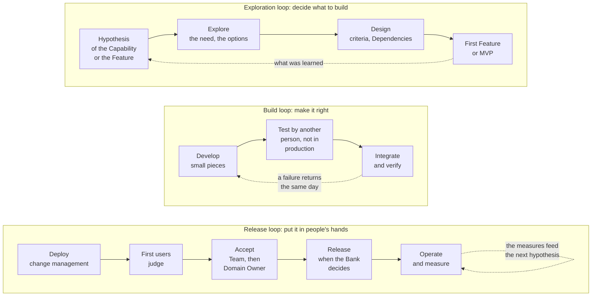
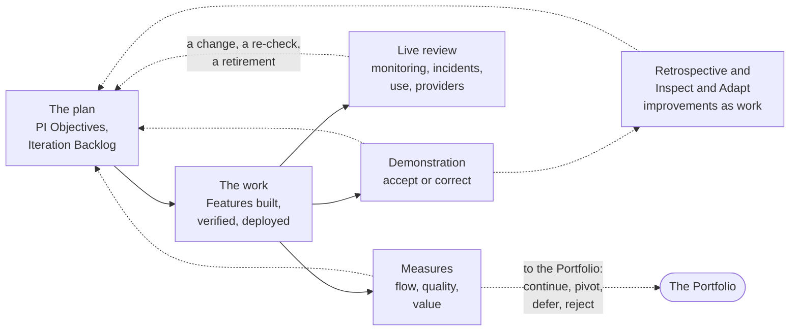

# The loops of delivery

Delivery is a set of loops inside loops. At each level of the cadence there is a control loop that plans, does, checks, and acts; through those levels run the loops of the work itself, exploration, build, release, and operation; and around all of them run the feedback loops that bring what is learned back into the plan. This part draws them.

## 1. The control loop at each level

1.1. Each level of the cadence is a plan, do, check, act cycle. A loop takes its frame from the loop above and returns its evidence to it: the Program Increment hands the Iteration its objectives and its board, the Iteration hands the week its backlog and its goal, the week hands the day its focus; and the day returns its blockers, the week its Dashboard and Dependencies, the Iteration its acceptances and Registry Snapshot, the Program Increment its Quarterly Report.

Figure 1: the Program Increment loop, quarterly.

Figure 2: the Iteration loop, monthly.

Figure 3: the week loop, with the day inside it.

## 2. The loops of the work

2.1. Through the levels run three loops of the work itself, which the industry calls the continuous delivery pipeline. The exploration loop decides what to build: a hypothesis, the exploration of the need and the options, the design of the Feature with its criteria, and the first Feature or the MVP that tests the hypothesis, with what is learned feeding the next hypothesis. The build loop makes it: develop in small pieces, test by a person other than the builder, integrate, verify, with every failure returning to the builder the same day. The release loop puts it in the hands of people: deploy through change management, let the first users judge, accept, release beyond the first users when the Bank decides, operate, and measure, with the measures feeding the next exploration.

Figure 4: the three loops of the work.

2.2. The separation of deploy from release is the device that makes this safe. A Feature can be deployed to its environment of use, judged by its first users, and held there until the Domain Owner, or the Executive Sponsor for Risk Tier 3 or where the Competence Center Lead is the Domain Owner, decides to release it beyond them. Value is switched on by a business decision, not by the end of a build.

## 3. The feedback loops

3.1. Four feedback loops bring what is learned back into the plan, each on its own cadence. The demonstration, at each Iteration Review and Demo and each PI Review and Demo, shows working software to the people who asked for it and takes their acceptance or their correction. The retrospective and Inspect and Adapt turn the problems of the month and the quarter into improvement items that enter the backlog as work. The live review, at each Iteration Review and Demo, reads the monitoring, the incidents, the use, and the provider notices of every live Solution, and raises a change, a re-check, or a retirement. And the measures, read at each loop, show whether the flow is steady and the value arriving, and feed the next planning and the Portfolio.

Figure 5: the feedback loops.

## 4. Why loops rather than a plan

4.1. A plan assumes that what was known at the start stays true; a loop arranges to find out early that it did not. A wrong hypothesis costs an Iteration, a failing build a day, a drifting Solution a review. The cadence is what makes the loops cheap.

## 5. Rule source

Solution Lifecycle Model 2, 6, 7, and 8; Portfolio Management Model 7; the Cadence and Service delivery workflows and guides.
