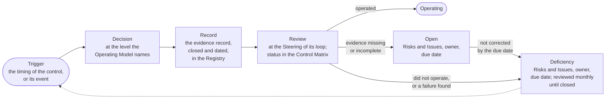

# Controls and the control catalog

A control is a rule the unit follows anyway, written so that an auditor can test it: an objective, the rule and its clause, an owner, a timing, the evidence record it leaves, and the way it is tested. The Competence Center has thirty-two, each with a reference, carried by the five control loops and kept in a catalog; their status at any date is in the Control Matrix of the Registry. This part explains what a control is, how the catalog is built, and how a control lives.

## 1. What a control is

1.1. Each control is a rule of the Operating Model, the Solution Lifecycle Model, the AI Policy, or the Business Model, or an event of the control loop, and it leaves an evidence record. It has a reference, C-01 to C-32; a title and an objective; the rule, with the clause that states it; an owner, the Role accountable for it; a timing, when it operates; an evidence record and, where one applies, a template; a type; and a test, the way an auditor or the Competence Center Lead confirms it operated. The controls are not added to the work; they are the work, named.

## 2. The catalog by loop

| Loop | Controls it carries | What they cover, in short |
| --- | --- | --- |
| Direction, yearly | C-01, C-03, C-04, C-20, C-22; and C-02 in the strategic loop, which the yearly Steering also carries | The activation and review of the documents; the AI Risk Appetite Statement; the appointments and the separation of duties; the Strategic Priorities, the Envelopes, and the Guardrails; the Proposal to the Bank |
| Assurance, quarterly | C-06, C-07, C-11, C-16, C-20, C-24, C-25, C-26, C-27, C-28 | The Quarterly Report, and its submission to the Board Committee or the Board where the Executive Sponsor decides; the quarterly risk check; the Risk Tier reassessments; the validations; the access review and the access of internal audit; the reconciliation of the AI Incidents; the Registry Snapshot |
| Control, monthly | C-05, C-17, C-29, C-32 | The sample of Decisions; the deficiencies; the acceptances; the live review of the Solutions |
| Operating, weekly | C-23; the Dashboard is a working record | The intake of Engagements and the limit on work in progress; the flow, the limits, the Dependencies |
| Event | C-01, C-08, C-09, C-10, C-12, C-13, C-14, C-15, C-16, C-17, C-18, C-19, C-21, C-22, C-27, C-28, C-30, C-31, C-32 | An AI Incident; an Exception; a stop or a suspension; a risk beyond appetite; a finding; a change of Holder; a change of provider or regulation; and the controls that a step of the work triggers: an Engagement taken in, a business case, a Risk Tier, a check or a validation, a release, a use for a data class, a provider, a deployment or a change, a sharing of data, a published output, a retirement |

2.1. Every control is carried by at least one loop and reviewed at the Steering of that loop, and a control that only the operating loop or the event loop carries is reviewed at the monthly Steering (Operating Model 6.1). The page Controls, under the rule, lists all thirty-two with their rule, owner, timing, evidence, template, objective, type, and test, with a page for each, and the Unit governance guide states how each is tested. The references are stable: a control is cited by its reference in the documents, in the Control Matrix, in a finding, and in this site.

## 3. The life of a control

3.1. Each control follows one cycle: a trigger, which is its timing or its event; a decision at the level the Operating Model names; a record, the evidence it leaves; and a review, at the Steering of its loop. The Control Matrix gives each control one of five statuses at a date: Operating, when it operated and left its evidence; Open, when it is due and its evidence is missing or incomplete, with an item in the Risks and Issues Record; Deficiency, when it did not operate, its evidence shows a failure, or it was Open and was not corrected by its due date; No occurrence yet, when its event has not happened; and Not yet due, when its first timing has not come.

Figure 1: the cycle of a control, an Open control, and a deficiency.

## 4. Deficiencies and findings

4.1. A control that is Open or in Deficiency, and each finding of an audit or a supervisor, enters the Risks and Issues Record with an owner and a due date, and the monthly Steering reviews it until it is closed; an overdue deficiency is decided at once. A deficiency is not a failure of governance; it is governance working. What would be a failure is a deficiency nobody recorded.

## 5. Rule source

Operating Model 6.1 and 8; the Control Matrix of the Registry; the Unit governance guide 7; the Control Sign-Off and Acceptance Checklist templates.
