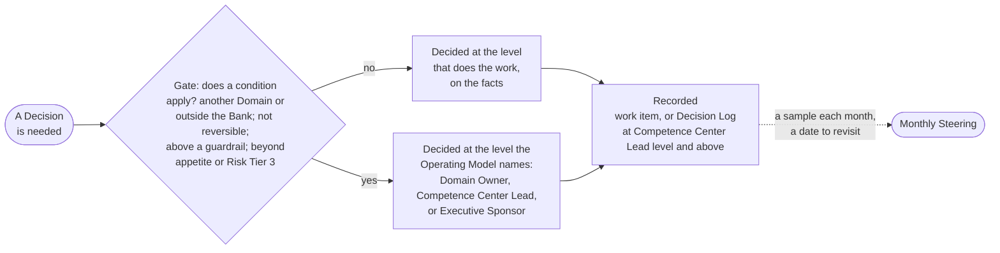

# Decisions and escalation

A Decision is taken by the person who does the work, on the facts, at the moment it is needed. It rises to a higher level only when one of four conditions applies, and it is recorded so that others can find it. This part states the levels, the conditions, the stop right of the Control Functions, and how a decision is kept.

## 1. The four levels

| Level | Who decides | Examples |
| --- | --- | --- |
| Team | The Solution Engineer with the Domain Expert and the Domain Owner; the product owner for the acceptance of a Feature or a Capability | Design, build, the order of pulling work within the ranking, the acceptance of a Feature or a Capability |
| Domain Owner | The Domain Owner | The business case and the decision after the MVP within one Domain and below a guardrail; a Solution Definition; the acceptance of a Solution; its retirement |
| Competence Center Lead | The Competence Center Lead | Taking an item into discovery, deferring or rejecting it at triage; pulling an Initiative and the limit on the Active Initiatives; the rank of the backlogs; the final acceptance of the Team; the Risk Tier; whether a change needs a new check; standards, Templates, and questions between Domains |
| Executive Sponsor | The Executive Sponsor, after asking the AI Steering Committee | The Strategic Priorities, the funding, the mix of Initiatives; a business case above a guardrail or across Domains and the decision after its MVP; the release of a Risk Tier 3 Solution; a risk beyond appetite; the retirement of a Service across Domains |

## 2. When a decision rises

2.1. A Decision goes to a higher level only when at least one condition is true: it affects another Domain, reaches outside the Bank, or sets a standard for others; it cannot be reversed without significant cost or harm; it exceeds an Investment Guardrail or changes a Strategic Priority; or it accepts a risk beyond the AI Risk Appetite Statement or concerns a Risk Tier 3 Solution. The level is then the one the Operating Model names for the matter. Everything else is decided where the facts are, and the monthly Steering reads a sample afterwards.

Figure 1: the movement of a Decision.

## 3. The Control Functions decide within their remit

3.1. A Control Function decides within its remit, and its validation or its stop is final for that remit; nobody overrides it. A disagreement goes to the head of that Control Function; the Executive Sponsor may raise it with executive management and does not set a validation or a stop aside. A risk beyond the AI Risk Appetite Statement may be accepted only by the Executive Sponsor, who tells the Board Committee without waiting for any report. The person who suspended a Solution lifts the suspension when the facts allow. These are the Control Functions of the Bank at work inside the unit's own decisions.

## 4. Disagreement, conflict, and record

4.1. Where the people concerned do not agree, the person who holds the decision decides after hearing them, and the others support the Decision; a dissent may be noted in the Decision Log. A person with a conflict of interest declares it and does not decide; the next level decides. A Decision at the Competence Center Lead level or above, and any Decision that others will need to find later, is entered in the Decision Log as one line: the date, the Decision, the facts, who decided, and when to revisit. A Decision of the Executive Sponsor that is hard to reverse, and the Decisions that the Operating Model 8 names as evidenced by a Decision Record, also have one. A Decision of the Team is noted in the work item.

## 5. Why it is built this way

5.1. Decision rights written down are what let a small unit move quickly without losing control: the Team does not wait for a committee to design, the Domain Owner does not wait for the Executive Sponsor to approve a business case within its guardrail, and the Executive Sponsor is not asked to decide what the facts have already decided. The four conditions, the stop right, and the Decision Log are the whole escalation model, and they are the same whether the matter is a Feature or a Strategic Priority.

## 6. Rule source

Operating Model 4.2, 4.4, and 5; Portfolio Management Model 6.3; AI Policy 3 and 6; the Unit governance workflow 3 and guide 4.
