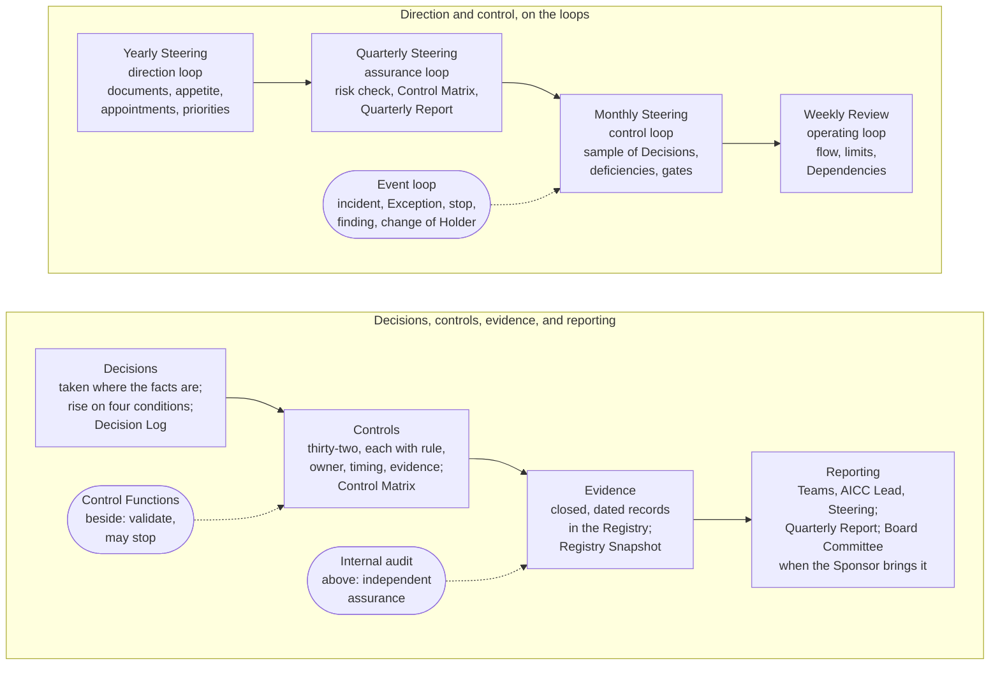

# Governance

Governance is how AICC is directed, controlled, reported, and assured as a unit of the Bank: who decides what and when a decision rises, the loops on which the unit plans, acts, checks, and corrects, the controls an auditor can test and the evidence each leaves, and the chain of reporting to the Executive Sponsor, which reaches the Board when the Executive Sponsor brings a matter to it. This course explains it in seven parts; the Operating Model is the rule and prevails.

## 1. One picture

1.1. Figure 1 shows governance as one system: decisions taken where the facts are and rising only on stated conditions; five control loops on the Steerings and the Weekly Review; controls that leave evidence in the Registry; and reporting from the Teams through the AICC Lead to the Steering, which the Executive Sponsor chairs and from which the Executive Sponsor may bring a matter to the Board Committee or the Board, with the Control Functions beside it and internal audit above it.

Figure 1: the governance of the unit as one system.

## 2. What governance is for

2.1. A small unit with a wide mandate needs governance that is light enough to run every week and strong enough to satisfy a supervisor and an auditor. The Operating Model answers with three principles: decide where the facts are, so that the person closest to the work decides, on evidence, and a decision rises only when a stated condition applies; keep decisions reversible where possible and take reversible decisions quickly; and keep only the process and the records that someone uses, and remove the rest. The controls are rules the unit follows anyway, written so that they can be tested; the evidence is what the work leaves behind, closed and dated; and the forums are the Steerings and the Weekly Review that the Portfolio and delivery already use. Governance adds no meeting and no second record. What the Portfolio decides and how delivery works are stated in their own courses; this one states only how the unit is controlled.

## 3. The industry practice it follows

3.1. The model follows the common practice of internal control and assurance in a bank, in general terms: three lines: a first line that owns the risks of its work; the Control Functions, independent, which set the rules of their remit, validate, and may stop; and internal audit, which gives independent assurance; control objectives with owners, timing, and evidence; a management system that plans, operates, checks, and improves on a cycle; decision rights written down, with escalation on stated conditions; and reporting to management that can reach the board, with major incidents and risks beyond appetite reported to it without delay. For AI it follows the management-system standard and the risk framework recorded in the Industry body of knowledge, and the expectations of the financial standard-setters on model risk, third parties, and resilience.

## 4. How to read this course

4.1. Part 2 states the decision rights and how a decision escalates. Part 3 states the five control loops. Part 4 states the Steerings and the bodies. Part 5 states the controls and the control catalog. Part 6 states the records, the evidence, and the assurance. Part 7 states what governance measures and reports. The Operating Model follows as the rule, with its control loops, its records and evidence, and its control catalog; the Unit governance workflow and guide show the loops, the events, and the sequences step by step, and state how each control is tested.
