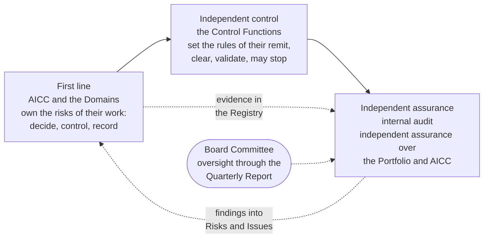

# Records, evidence, and assurance

Governance is only as good as what it can show. AICC keeps three kinds of record, keeps the evidence in one place that is not rewritten, and submits the whole to independent assurance. This part states what is recorded where, what makes a record evidence, how the Registry is kept, and how the three lines of the Bank apply to the unit.

## 1. Three kinds of record

| Kind | What it is | Examples | Where |
| --- | --- | --- | --- |
| Working state | The live state of the work, current by use | The backlogs, the boards, the Roadmap, the Calendar, the Program Board, the Dashboard, the Teams, the Program Increment folder | The Registry until the cutover, then Jira and Confluence |
| Living records | Records that are current by nature and kept up to date | The Priorities, the Standards, the Risks and Issues, the AI Registry, the Appointments; the Solution Definitions in the Portfolio | The Registry; the Portfolio |
| Evidence records | A closed and dated extract, taken when an event happens, stating what happened, who decided or acted, on which facts, and where the live item is | Decision Records, Control Sign-Offs, Acceptance Checklists, Outcome Reports, Steering Summaries, Quarterly Reports, AI Incident Reviews, Registry Snapshots | The Registry, always |

1.1. Jira, Confluence, and Service Management are not an evidence store. The Registry Snapshot at the close of each Iteration and Program Increment records the state, the Risk Tier, and the release of every Solution, which makes the Snapshot the evidence of the Solution Definitions.

## 2. What makes a record evidence

2.1. A record is evidence when it is closed, dated, and traceable: it states what happened, who decided or acted, on which facts, and where the live item is, and it is not rewritten afterwards. A closed record is corrected only by a new dated entry that refers to it. A figure of the Bank stays in its source system, and the record points to it; the Registry holds no data of the Bank, no code, and personal data only as the retention and classification rules allow.

## 3. How the Registry is kept

3.1. The Registry is a repository with a protected main branch and restricted visibility, and its history is not rewritten. Only the AICC Lead and the named deputy merge to the main branch. Whoever does the work keeps the Record, and the AICC Lead is accountable for all of them. Each Record is kept for the period the retention rules of the Bank require for its type. The closed records are promoted to the corporate share, where the AICC portal links to them; internal audit has read access to the Registry and, read only, to Jira, Confluence, and Service Management. Every tool has a keeper named in the Appointments Record, and the collaboration tooling workflow lists what each tool is used for.

## 4. The three lines, applied to the unit

Figure 1: the three lines and the unit.

4.1. AICC and the Domains are the first line: they own the risks of their work, decide, control, and record. The Control Functions stand independent of AICC: they set the rules of their remit, clear business cases, validate Solutions, decide Exceptions, and may stop; AICC is not a Control Function and does not validate its own work. Internal audit gives independent assurance over the Portfolio and over AICC, with read access to everything, and its findings enter the Risks and Issues Record like any deficiency. The Board Committee oversees through the Quarterly Report.

## 5. What an auditor finds

5.1. For any control, the reference leads to its rule in a document, its evidence record in the Registry, its status in the Control Matrix, and the Steering Summary that reviewed it. For any Solution, the Solution Definition leads to its Risk Tier, its check or validation, its acceptances, its release, and its live reviews. For any decision at the AICC Lead level or above, the Decision Log leads to the facts and the date to revisit. The page Records and systems states where each record is kept and which control it evidences.

## 6. Rule source

Operating Model 6.10, 7, and 8.2; Statement of Intent 7.3 and 12.4; AICC Charter 7.2; the collaboration tooling workflow; the Unit governance guide 5 and 6.
