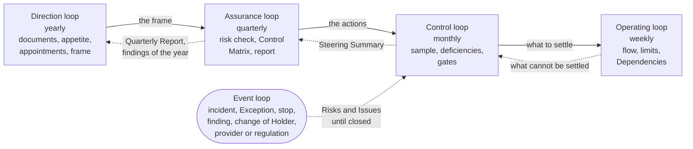

# The control loops

The control of the Competence Center as a unit runs on five loops, each a plan, do, check, act cycle with its own cadence and forum. Four run on the calendar, from the year to the week; the fifth runs when an event happens. A loop takes its frame from the loop above and returns its evidence to it, and all five use the events the Portfolio and delivery already hold. This part states them and draws them.

## 1. The five loops

| Loop | Cadence and forum | Plans | Checks | Acts | Decider | Records |
| --- | --- | --- | --- | --- | --- | --- |
| Direction | Yearly, at the yearly Steering in December, for the next year | The frame of the year: the appointments in order, the AI Risk Appetite Statement and the policy, and the targets of the Measures of the Maturity Levels; the Strategic Priorities, the Envelopes, and the Guardrails are set at the same Steering in the strategic loop of the Portfolio | The findings of the year, the Quarterly Report of the third quarter, the documents against the findings | Renews or adjusts the frame; the Competence Center Lead activates the changes | Executive Sponsor; the Competence Center Lead owns the documents | Decision Records, Appointments, Proposal |
| Assurance | Quarterly, at the quarterly Steering | The evidence collected: Registry Snapshot, Control Matrix, Risks and Issues | The quarterly risk check: open Risks and Issues, open Exceptions, Risk Tier reassessments due, each Risk Tier 3 Solution, reliance on providers and the Platform Owner, the access review, the reconciliation of the AI Incidents, the status of each control and the governance measures, the Maturity Level | Decides the actions; a risk beyond appetite only with the Board Committee told; approves the Quarterly Report and decides whether to bring it to the Board Committee or the Board | Executive Sponsor | Quarterly Report, Registry Snapshot |
| Control | Monthly, at the monthly Steering | The agenda: progress, risks, blockers, the acceptances, the events of the month, and the sample | A sample of at least three Decisions of the Competence Center Lead, chosen by the Executive Sponsor, with the share found in order; the events of the month and the controls they triggered; the open Exceptions until they expire; the live reviews of the Iteration; the deficiencies and findings until they are closed | Closes or escalates each item; decides at once on an expired Exception and an overdue deficiency; records the Decisions and the actions in the Steering Summary | Executive Sponsor; the Domain Owner for the acceptance of a Solution | Steering Summary, Decision Log |
| Operating | Weekly, at the Weekly Review | The flow, the Limits on Work in Progress, the Dependencies | The Dashboard and the boards | Adjusts the work, updates the Registry, raises what cannot be settled | Competence Center Lead | Dashboard, Portfolio Backlog |
| Event | When an event happens | The item enters the Risks and Issues with an owner and a due date | Handled where the governing section says; reviewed at the monthly Steering until closed | Closed with its lessons | As the Operating Model states for the event | Risks and Issues, Decision Record, and the evidence record of each control |

## 2. The loops drawn

2.1. Figure 1 shows the four loops of the calendar nested, with the frame going down and the evidence coming up, and the event loop entering the monthly Steering.

Figure 1: the five control loops.

## 3. The events the event loop catches

3.1. An event that is not on the calendar enters the Risks and Issues Record with an owner and a due date and runs the same cycle until it is closed: an AI Incident and an Exception under the AI Policy; a stop or a suspension and a risk beyond the appetite; a change of provider or of regulation; a finding of an audit or a supervisor; a change of a Holder of a Role. An AI Incident is handled in the incident management of the Bank with the Competence Center Lead as a stakeholder, and the record points to its ticket; an Exception is decided by the Control Function concerned; a stop is final. The event loop also carries the controls that a step of the work triggers, such as an Engagement taken in, a business case, a Risk Tier, a check or a validation, a release, a provider, a deployment, or a retirement; each leaves its own evidence record, enters the Risks and Issues Record only when it is Open or in Deficiency, and is reviewed at the monthly Steering among the events of the month (Operating Model 6.9).

## 4. One cadence, three readings

4.1. The control loops of the unit, the portfolio loops, and the loops of delivery run on the same Steerings and the same Weekly Review and add no meeting; the Portfolio and Delivery courses state the other two readings of the same calendar.

## 5. Rule source

Operating Model 6; Portfolio Management Model 4; Solution Lifecycle Model 6.7; the Unit governance workflow 2 and guide 3.
