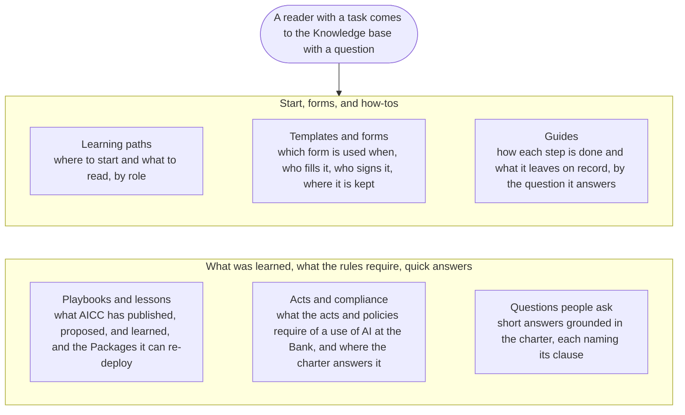

# Knowledge base

The Knowledge base is the working knowledge of AICC: what to read first, which form to use when, how each step is done, what has been learned, and what the rules require of a use of AI at the Bank. It is organized by the question a reader brings, and the artifacts, the templates, the guides, the playbooks, sit behind the questions. Nothing here is a rule; the documents of the charter are the rule, and the live records are in the Registry.

## 1. How to navigate the Knowledge base

Figure 1: the shelves of the Knowledge base.

## 2. If you need

| If you need | Go to |
| --- | --- |
| To learn what AICC is and how it works, in the right order for your role | Learning paths |
| The form for a business case, a commitment, a decision, an acceptance, a report | Templates and forms |
| To know how an Engagement, a delivery step, an event, or a control is done, and what it leaves on record | Guides |
| What AICC has published, proposed, and learned, and the Packages it can re-deploy | Playbooks and lessons |
| What an act or a policy of the Bank requires when AI is used, and where the charter answers it | Acts and compliance |
| A quick answer to a common question | Questions people ask |
| The meaning of a term | The Vocabulary, in Reference |
| Where a record is kept | Records and systems, in Reference |

## 3. How the Knowledge base is kept

3.1. The templates are part of the charter, and each is activated, with each change to it, by an entry in the Decision Log (Document Catalog 4.1). The guides sit beside their workflows and are maintained with them. The learning paths, the playbooks, the acts page, and the questions are authored for the site, state no rule, and are kept by the AICC Lead, with the Control Function Contacts of compliance and legal for the acts; each states its edition, and a page that no longer serves a reader is removed (Document Catalog 5.4).
