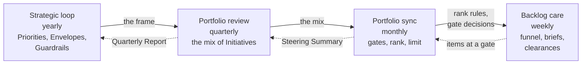
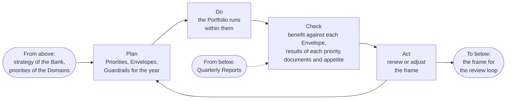
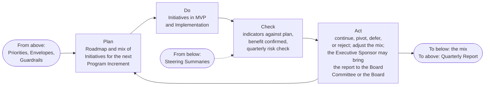
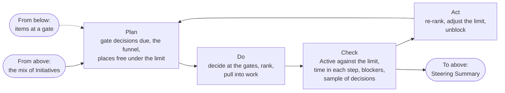
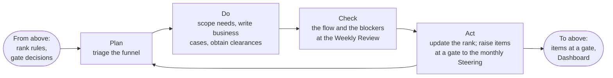

# The loops and the governance

The Portfolio is governed by four loops, each a plan, do, check, act cycle with its own cadence and forum. A loop takes its frame from the loop above it and returns its evidence to it, so that the strategy that the Executive Sponsor sets with the Board reaches the week's work in three steps, and the week's evidence reaches the Executive Sponsor at the yearly Steering in three; from there the Executive Sponsor may bring it to the Board Committee or the Board. The loops use the events that already exist and add no meeting. This part explains them and the governance they carry.

## 1. The four loops

| Loop | Cadence and forum | Plans | Checks | Acts | Decider | Record |
| --- | --- | --- | --- | --- | --- | --- |
| Strategic | Yearly, at the yearly Steering in December | The Strategic Priorities, the Envelopes, the Guardrails | The benefit against each Envelope, the results of each priority, the documents and the risk appetite | Renews or adjusts the frame | Executive Sponsor, the AI Steering Committee advising | Priorities, Decision Records |
| Portfolio review | Quarterly, at the quarterly Steering | The Roadmap and the mix of Initiatives for the next Program Increment within the Envelopes | For each Active Initiative, the leading indicators against the plan, the benefit the Domain Owner confirms, the quarterly risk check | Continues, pivots, defers, or rejects each; adjusts the mix; the Executive Sponsor approves the Quarterly Report and may bring it to the Board Committee or the Board | The approver of each Initiative (Domain Owner or Executive Sponsor); the Executive Sponsor for the mix | Quarterly Report, Registry Snapshot, Decision Log |
| Portfolio sync | Monthly, at the monthly Steering | The agenda: gate decisions due, the funnel, the places free under the limit | The flow: Active against the limit, time in each step, blockers, a sample of the Competence Center Lead's decisions | Decides at the gates, ranks, pulls into work, re-ranks, adjusts the limit, unblocks | The approver of each Initiative at the gates; the Executive Sponsor chairs; the Competence Center Lead runs it, ranks, and pulls | Steering Summary, Portfolio Backlog |
| Backlog care | Weekly, at the Weekly Review | The triage of the funnel | The flow and the blockers | Scopes needs, writes business cases, obtains clearances, updates the rank, raises items at a gate to the monthly Steering | Competence Center Lead | Dashboard, Initiative Briefs |

## 2. How the loops nest

2.1. Figure 1 shows the frame going down and the evidence coming up.

Figure 1: the four loops, the frame going down and the evidence coming up.

## 3. Each loop drawn

3.1. Each loop is a plan, do, check, act cycle. Figures 2 to 5 draw them in the same form: what comes in from above, the four steps, and what goes down and up.

Figure 2: the strategic loop, yearly, at the yearly Steering.

Figure 3: the portfolio review loop, quarterly, at the quarterly Steering.

Figure 4: the portfolio sync loop, monthly, at the monthly Steering, run by the Competence Center Lead.

Figure 5: the backlog care loop, weekly, at the Weekly Review, run by the Competence Center Lead.

## 4. The Portfolio as a control loop

4.1. The loops run on the same events as the control loops of the Operating Model, which govern the unit while these govern the Initiatives: the strategic loop runs at the yearly Steering beside the direction loop, the portfolio review at the quarterly Steering beside the assurance loop, the portfolio sync at the monthly Steering beside the control loop, and the backlog care at the Weekly Review beside the operating loop (Operating Model 6.1). They use the same Decision Log and the same Registry Snapshot. This is what makes the Portfolio governable by a small unit: one cadence, one set of forums, one set of records, read for two purposes.

4.2. The governance it carries is continuous and light. The business case and its clearances are the control at the start; the gates and the Decision Log are the control through the flow; the quarterly review with its risk check and its confirmed benefit is the control on continuation; the Quarterly Report, which the Executive Sponsor approves and may bring to the Board Committee or the Board, is the control on the whole. Nothing waits for an annual review to be stopped, and nothing is started on a committee's say-so without a case and a probe.

## 5. The forums

5.1. The monthly Steering is the working body of the Portfolio: the gate decisions due, the funnel, the places free under the limit, and a sample of at least three Decisions of the Competence Center Lead, chosen by the Executive Sponsor. The quarterly Steering is the review body: each Active Initiative in turn, the Competence Center Lead showing its indicators, the Domain Owner confirming its benefit, the approver deciding, and the result entered in the Quarterly Report, which the Executive Sponsor approves and may bring to the Board Committee or the Board. The yearly Steering, the December one, is the strategy body. The AI Steering Committee, the heads of the business, technology, risk, and compliance functions the Executive Sponsor names, advises at each and decides nothing.

## 6. Rule source

Portfolio Management Model 4; Operating Model 6; Solution Lifecycle Model 6; the Unit governance and Cadence workflows and guides.
