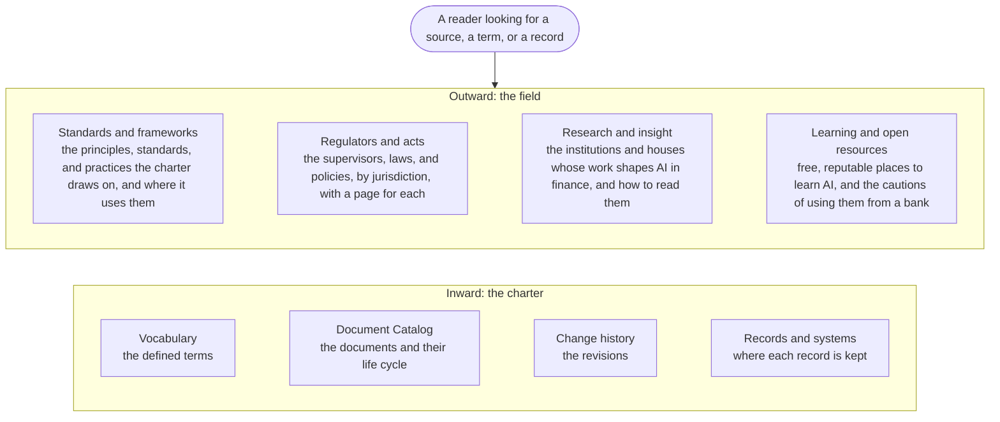

# Reference

The Reference is where the site points outward and inward: outward to the bodies that govern AI, the standards and frameworks the charter draws on, the research that shapes the field, and the open resources from which people learn; inward to the vocabulary, the catalog, the history, and the records of the charter. It is a curated map, not a search engine: each entry says what the source is, why it matters to the Bank, how to take it, and for what. Nothing here binds the Bank; the charter's own documents are the rule, and the Control Function Contacts confirm what applies.

## 1. How to navigate the Reference

Figure 1: the shelves of the Reference.

## 2. How to take an external source

2.1. Four habits apply to every source listed here. Read a source for what it is: a law binds, a standard is a yardstick, a framework is a method, a consulting house sells, a vendor promotes, a researcher proposes. Prefer the primary text: the regulator's own page over a summary of it, the standard over a blog about it. Note the date: the field moves each quarter, and a two-year-old article on generative AI is history. And ask what the Bank's own rule says before adopting what a source recommends; where they differ, the charter prevails until it is changed by a decision.

## 3. Using external resources safely

3.1. The resources listed are public and reputable, and they are used within the rules of the Bank for the use of its systems and its information. No data of the Bank, no customer or employee data, and no internal document is entered into an external site, tool, form, or model, whatever the resource; reading is free, feeding is not. Registration with a work address is made only where the rules of the Bank allow it. Material from a vendor or a consulting house is read as that party's view. A source behind a paywall is listed for awareness and is procured only through the procurement rules of the Bank. A listing is not an endorsement, and a model or a service found through a resource enters the Bank only through the provider check of the AI Policy. The AICC Lead keeps the lists and removes what goes stale.

## 4. The categories

| Category | What it holds | Go to |
| --- | --- | --- |
| Standards and frameworks | The principles governments agreed, the management and risk standards, the security list, the practices of portfolio, delivery, service, and control that the charter is built on | Standards and frameworks |
| Regulators and acts | The supervisors and the laws of the Kyrgyz Republic, Kazakhstan, the Russian Federation, the European Union, the United States, and the global bodies | Regulators and acts |
| Research and insight | The institutions whose reports shape AI in finance, the consulting houses, the academic observatories, the fintech press | Research and insight |
| Learning and open resources | Courses, newsletters, open-model and paper repositories, security and incident knowledge bases, with the cautions of a bank | Learning and open resources |
| The charter's own references | Vocabulary, Document Catalog, Change history, Records and systems | The pages below in this section |
