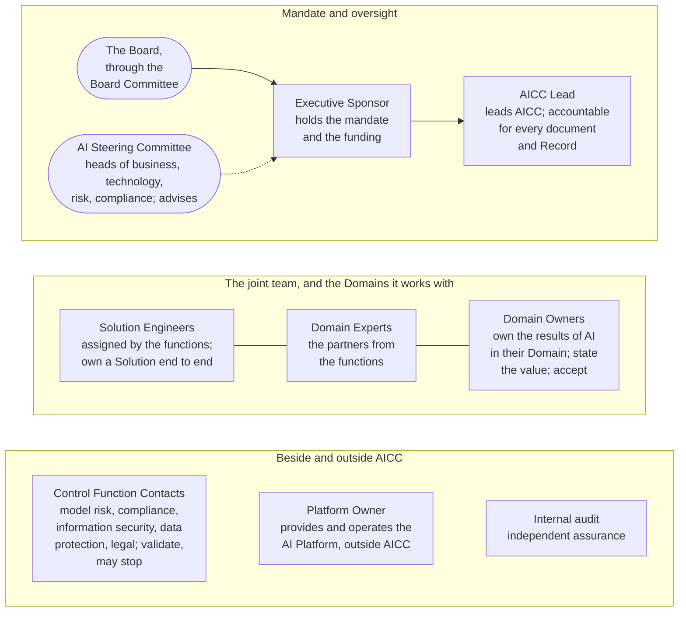

# Organization

AICC is a joint team: led by the AICC Lead, formed of the people whom the functions of the Bank assign to it, working together with the Domains, under the mandate of the Executive Sponsor, beside the Control Functions and the Platform Owner, and overseen by the Board Committee. It is organized by Roles, not by persons: the charter names what each Role does and decides, and the Appointments Record names who holds it. This course explains the organization in six parts; the Operating Model is the rule and prevails.

## 1. One picture

Figure 1: the organization of AICC.

## 2. What the organization is for

2.1. The design answers three constraints at once. AICC is small, so one person may hold several Roles, within written rules of separation, and the method does not change when the Team grows. AICC has no administrative line over the people assigned to it or over the partners from the functions, so it works by mandate, by agreement, and by the value it shows, not by command. And AICC is not a Control Function, so the people who validate, stop, and assure stand outside it and keep their own accountability. Roles rather than persons is what makes this stable: the charter stays the same when a person changes, and the Appointments Record carries the change.

## 3. The industry practice it follows

3.1. The model follows the common practice of a small internal unit in a regulated organization: a sponsor who holds the mandate and the budget; a lead accountable for the method and the records; delivery people assigned from the functions with the consent of their line; business owners in the functions who state the value and accept the result; independent control functions in the second line; a platform run outside the unit; and roles defined by responsibility with a record of who holds them, deputies, and conflicts declared. The responsibility matrix of the Organization guide is the usual form.

## 4. How to read this course

4.1. Part 2 states the place of AICC in the Bank. Part 3 states the seven Roles. Part 4 states who does what along the work. Part 5 states how people are appointed, change, and leave. Part 6 states how the organization grows from light mode. The Operating Model follows as the rule, with the Roles and the Decisions; the Organization guide holds the profiles, the full responsibility matrix, and the people records; the Role pages state each Role in full.
