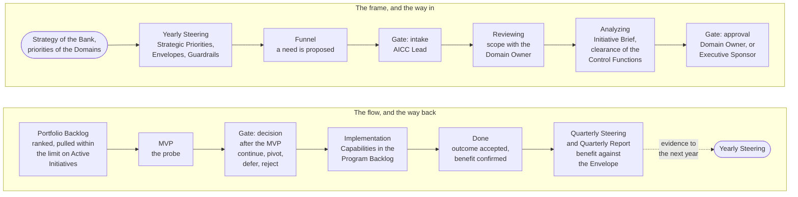

# The Portfolio

The Portfolio is where the Bank decides what AICC works on. It is two things at once: a commercial decision body, which takes in business needs, funds them against the Strategic Priorities, and continues, pivots, defers, or rejects them on evidence; and a control loop, which runs on a fixed cadence, keeps the work in progress low, and returns what it learns to the strategy that framed it. This course explains how it works, in eight parts; the Portfolio Management Model is the rule and prevails.

## 1. One picture

1.1. Figure 1 shows the Portfolio end to end: the frame set once a year, the flow of an Initiative through the portfolio Kanban, and the evidence that returns to the frame.

Figure 1: the Portfolio end to end.

## 2. What the Portfolio is for

2.1. A bank has more good ideas for AI than people to deliver them, and more risk in each than its size suggests. The Portfolio exists to choose: to put a small unit's capacity where the strategy says the value is, to try before investing, to stop what does not work, and to show the Board where the money went and what came back. It is the mechanism by which the Statement of Intent becomes a ranked list of work, and by which the results of the work change the next year's frame.

2.2. Three principles follow from the Portfolio Management Model. Funding goes to Strategic Priorities and to the Teams, not to projects one by one, so that a decision to start is a decision about priority and capacity, not a budget negotiation. Every Initiative is a hypothesis with a business case and is probed as an MVP before the decision to continue, so that the Bank invests in what works and learns from what does not. And the number of Active Initiatives is limited, so that the flow stays steady and the few things in progress finish.

## 3. The industry practice it follows

3.1. The model follows lean portfolio management as the industry defines it, in three dimensions that interlock. Strategy and investment funding: strategic themes, envelopes per theme, and guardrails that let local decisions be taken within agreed bounds. Portfolio operations: a portfolio Kanban with limits on work in progress, a regular sync, and the flow of large items from idea to done. Governance: lightweight and continuous, through the business case, the gates, the measures, and the review, rather than through a committee at the start and an audit at the end. In the Bank's model, the strategic loop with its Envelopes and Guardrails is the first dimension; the portfolio sync and the backlog care with the Kanban are the second; the portfolio review with the clearances of the Control Functions and the measures is the third. The practice is recorded in the [Industry body of knowledge](../reference/industry-body-of-knowledge.md) and on its own [reference page](../reference/regulations/lean-portfolio-management.md).

## 4. How to read this course

4.1. Part 2 states the frame: the Strategic Priorities, the Investment Envelopes, and the Investment Guardrails, and who decides what. Part 3 follows an Initiative through the portfolio Kanban. Part 4 states the two lanes and the front door. Part 5 opens the business case and the MVP. Part 6 states the four loops and the governance. Part 7 states how the Portfolio is measured and tracked: objectives and key results for each Initiative, the flow measures of lean practice, and what each loop reads. Part 8 states the roles and the records. The Portfolio Management Model follows as the rule.
