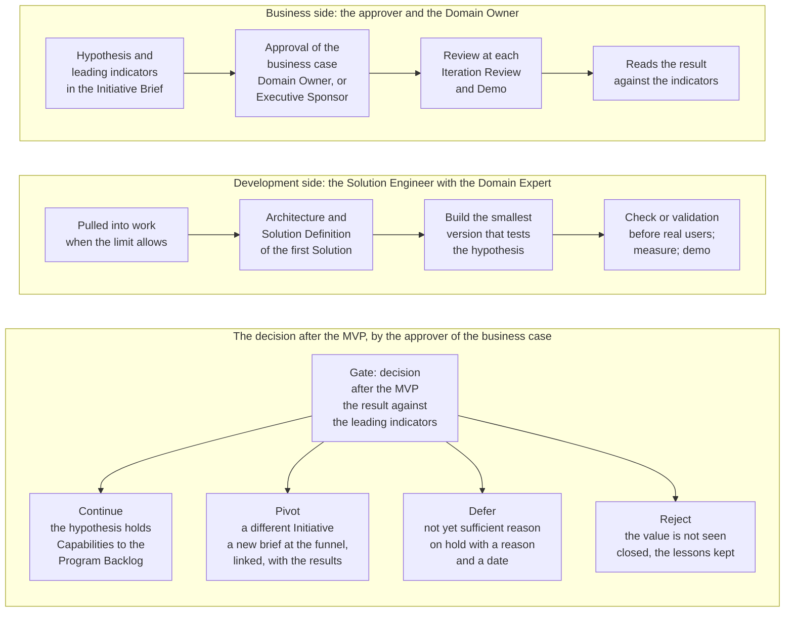

# The business case and the MVP

Two devices carry the commercial judgment of the Portfolio: the one-page business case, which states why an Initiative is worth doing and how the Bank will know, and the MVP, which tests it at the least cost before the Bank commits. This part explains both, and the ranking that decides which approved Initiative goes first.

## 1. The Initiative Brief, a lean business case

1.1. Every Initiative is written in a one-page Initiative Brief: a hypothesis, the business outcomes with their leading indicators, the scope and the minimum viable product, the cost and the value, the risks and the expected Risk Tier, and the decision. A figure of the Bank stays in its source system, and the brief points to it. One page is a discipline, not a shortcut: it forces the question, the measure, and the cost into the open before anyone builds.

1.2. The brief is approved when it answers five questions.

| Question | What the brief must show |
| --- | --- |
| Why is the change needed? | It fits a Strategic Priority, and the hypothesis states the value for a named function |
| What is the best option? | The outcomes have leading indicators with their source system, baseline, and target, and the MVP tests the hypothesis at the least cost |
| Can it be afforded? | The cost is within the Envelope of the Strategic Priority |
| Can it be bought and delivered? | The dependencies and the providers are named, the expected Risk Tier is stated, and the Control Function Contacts have cleared it |
| Can it be run well? | The Domain Owner, or the Executive Sponsor for enabling work, is named and committed, and the acceptance on delivery is stated |

1.3. The five questions are the ones a finance committee asks of any investment, scaled to one page. They are also the ones an auditor asks afterwards, which is why the brief and its clearances are kept.

## 2. The clearance of the Control Functions

2.1. For an Initiative that expects Risk Tier 2 or 3, the Control Function Contacts concerned clear the business case within their remit before it is approved, and a Contact who does not clear it may stop it. The clearance is a Control Sign-Off referenced in the brief. A Risk Tier later assigned that is higher than the one cleared returns the brief to them. The clearance is early by design: the cheapest moment to find that a use of AI is not acceptable is before it is built.

## 3. The ranking

3.1. The approved Initiatives in the Portfolio Backlog are ranked by weighted shortest job first: the sum of the scores of value, urgency, and risk reduction or opportunity, each from one to five, divided by the score of effort, from one to five. The Domain Owner states the value; the AICC Lead scores the other terms and ranks; the AICC Lead may depart from the rank for a stated reason, and records it. The method favors small, valuable, urgent work, which is what a small unit should do first, and it makes the order of the backlog a reasoned record rather than a preference.

## 4. The MVP and the decision after it

4.1. The MVP has two sides that run together. The business side belongs to the approver of the business case and the Domain Owner: they own the hypothesis, the leading indicators, and the judgment at the end. The development side belongs to the Solution Engineer with the Domain Expert: they define the architecture and the Solution Definition of the first Solution and build the smallest version that can test the hypothesis, within the Limits on Work in Progress, with the scope narrow by rule. The two sides meet at each Iteration Review and Demo and at the decision. Figure 1 draws them.

Figure 1: the MVP, its business side and its development side, and the four routes after it.

4.2. At the end of the MVP the approver of the business case compares the result with the leading indicators of the brief and takes one of four decisions.

| Decision | When | What follows |
| --- | --- | --- |
| Continue | The hypothesis holds: the indicators move as the brief said, the Domain Owner sees the value | The Capabilities of the Initiative are defined and entered in the Program Backlog under the Initiative, and the Initiative goes to Implementation; the quarterly review keeps asking the same question |
| Pivot | What was learned calls for a different Initiative: the need is real, the approach or the scope was wrong | The Initiative is closed as Pivoted; a new Initiative with a full brief enters the funnel, linked to the first, carrying the results of the MVP, and goes through the whole cycle again |
| Defer | There is not yet sufficient reason to proceed: the timing, a dependency, a priority higher elsewhere | The Initiative is on hold as Deferred, with the reason and the date to look again, and returns to the funnel when it is taken up |
| Reject | The value is not seen: the indicators did not move, or the cost or the risk outweighs the benefit | The Initiative is Rejected and its lessons are kept in the Portfolio Backlog; the capacity is released to the next ranked Initiative |

4.3. The decision is entered in the Decision Log with a Decision Record, and the result of the probe stays with the Solution Definition. After a continue, the quarterly review asks the same question of each Active Initiative on its indicators and its confirmed benefit, and an Initiative whose indicators do not hold is deferred or rejected. The MVP is therefore not a one-time gate but the first of a series: the Portfolio keeps asking whether the money should keep flowing.

4.4. Two rules keep the probe honest. The scope of the first Solution is narrow by rule, so that the MVP tests the hypothesis and does not become the delivery by another name. And the check or validation before any real user applies to the MVP as to any Solution, in proportion to its Risk Tier, so that a probe never reaches people or data without a person other than its builder having looked at it.

## 5. Rule source

Portfolio Management Model 6 and 7; the Initiative Brief and Decision Record templates; AI Policy 3.2.
