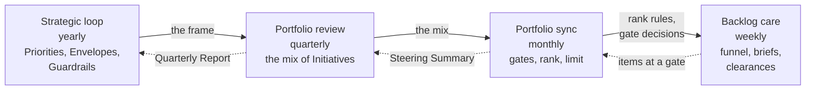

# The loops and the governance

The Portfolio is governed by four loops, each a plan, do, check, act cycle with its own cadence and forum. A loop takes its frame from the loop above it and returns its evidence to it, so that a decision of the Board about strategy reaches the week's work in three steps, and the week's evidence reaches the Board in three. The loops use the events that already exist and add no meeting. This part explains them and the governance they carry.

## 1. The four loops

| Loop | Cadence and forum | Plans | Checks | Acts | Decider | Record |
| --- | --- | --- | --- | --- | --- | --- |
| Strategic | Yearly, at the yearly Steering in December | The Strategic Priorities, the Envelopes, the Guardrails | The benefit against each Envelope, the results of each priority, the documents and the risk appetite | Renews or adjusts the frame | Executive Sponsor, the AI Steering Committee advising | Priorities, Decision Records |
| Portfolio review | Quarterly, at the quarterly Steering | The Roadmap and the mix of Initiatives for the next Program Increment within the Envelopes | For each Active Initiative, the leading indicators against the plan, the benefit the Domain Owner confirms, the quarterly risk check | Continues, pivots, defers, or rejects each; adjusts the mix; reports to the Board Committee | Executive Sponsor | Quarterly Report, Registry Snapshot, Decision Log |
| Portfolio sync | Monthly, at the monthly Steering | The agenda: gate decisions due, the funnel, the places free under the limit | The flow: Active against the limit, time in each step, blockers, a sample of the AICC Lead's decisions | Decides at the gates, ranks, pulls into work, re-ranks, adjusts the limit, unblocks | Executive Sponsor; the AICC Lead runs it | Steering Summary, Portfolio Backlog |
| Backlog care | Weekly, at the Weekly Review | The triage of the funnel | The flow and the blockers | Scopes needs, writes business cases, obtains clearances, updates the rank, raises items at a gate to the monthly Steering | AICC Lead | Dashboard, Initiative Briefs |

## 2. How the loops nest

2.1. Figure 1 shows the frame going down and the evidence coming up.

Figure 1: the four loops, the frame going down and the evidence coming up.

## 3. The Portfolio as a control loop

3.1. The loops are the Portfolio's half of the control loops of the Operating Model: the strategic loop is also the direction loop of the unit, the portfolio review is also the assurance loop, the portfolio sync is also the control loop, and the backlog care is also the operating loop. They run on the same Steerings and the same Weekly Review, with the same Decision Log and the same Registry Snapshot. This is what makes the Portfolio governable by a small unit: one cadence, one set of forums, one set of records, read for two purposes.

3.2. The governance it carries is continuous and light. The business case and its clearances are the control at the start; the gates and the Decision Log are the control through the flow; the quarterly review with its risk check and its confirmed benefit is the control on continuation; the Quarterly Report to the Board Committee is the control on the whole. Nothing waits for an annual review to be stopped, and nothing is started on a committee's say-so without a case and a probe.

## 4. The forums

4.1. The monthly Steering is the working body of the Portfolio: the gate decisions due, the funnel, the places free under the limit, and a sample of the decisions taken since the last one. The quarterly Steering is the review body: each Active Initiative in turn, the AICC Lead showing its indicators, the Domain Owner confirming its benefit, the approver deciding, and the result entered in the Quarterly Report that the Executive Sponsor issues to the Board Committee. The yearly Steering, the December one, is the strategy body. The AI Steering Committee, the heads of the business, technology, risk, and compliance functions the Executive Sponsor names, advises at each and decides nothing.

## 5. Rule source

Portfolio Management Model 4; Operating Model 6; Solution Lifecycle Model 6; the Unit governance and Cadence workflows and guides.
