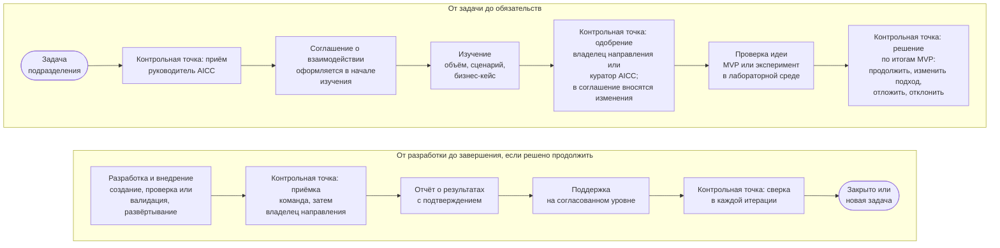

```yaml
source: portal/content/en/about/how-we-work.md
source_sha256: 8a7025fbdc0e8532779472f41e9cb5160922544709e7d6e769e183fc1acf4fb3
translation_status: reviewed
```

# Как мы работаем

Мы работаем так же, как консультанты. Подразделение приходит с задачей, а мы принимаем её, изучаем, берём на себя обязательства, проверяем идею на минимально жизнеспособном продукте (MVP), разрабатываем решение и поддерживаем его. После каждого шага остаются запись и управленческое решение, которые видит подразделение. Над чем работать AICC, решается в портфеле. Решения создаются короткими шагами в едином ритме, а качество и контроль — часть работы, а не этап после неё.

## 1. Ход взаимодействия с заказчиком

1.1. На рисунке 1 показан ход взаимодействия с заказчиком от первого обращения до завершения: контрольные точки на каждом шаге и кто в них принимает решение.



Рисунок 1: ход взаимодействия с заказчиком и его контрольные точки.

1.2. AICC фиксирует свои обязательства в соглашении о взаимодействии и выполняет их в меру имеющихся возможностей. Подразделение-заказчик обязательств на себя не берёт: то, на что AICC рассчитывает с его стороны, записывается как допущение. Любая сторона может в конце итерации завершить взаимодействие или перенаправить его. Подробно шаги, обязательства и уровни поддержки описаны на странице «Порядок взаимодействия с AICC».

## 2. Два режима работы в едином портфеле

2.1. Текущие работы — это небольшие повторяющиеся запросы подразделения, которые укладываются в одну итерацию: документ, автоматизация, представление данных, обучение, оценка. Такая работа оформляется как Feature в составе постоянной инициативы своего направления услуг. Руководитель AICC берёт её в работу на еженедельном обзоре в пределах WIP-лимитов, когда владелец направления одобрил такое применение для соответствующего класса данных. Поддержка — только по запросу. Отдельный паспорт инициативы, соглашение о взаимодействии и отчёт о результатах для неё не нужны (пп. 4.7–4.9 Бизнес-модели).

2.2. Любая другая работа — это инициатива: комплект нормативных документов, база знаний, программный компонент, испытание. Для инициативы готовят бизнес-кейс и MVP, а решения по ней принимаются в четырёх циклах управления портфелем в пределах лимита инициатив в работе.

2.3. Оба режима начинаются с одного и того же приёма обращений и оставляют те записи, которых требует работа. От режима зависят глубина изучения и число контрольных точек, но не требования к качеству.

## 3. Разработка и внедрение в едином ритме

3.1. Работа ведётся по программным инкрементам (PI) длиной в квартал и итерациям длиной в месяц, с фиксированными датами. На планировании итерации команда выбирает Features, разрабатывает их в пределах WIP-лимитов и показывает результат на ревью и демонстрации итерации, где владелец продукта принимает каждую Feature.

3.2. Решение проходит проверку или валидацию в объёме, который соответствует его категории риска. Затем решение принимают владелец продукта, руководитель AICC и владелец направления (п. 7.3 Модели жизненного цикла решений): владелец продукта принимает каждую Feature, руководитель AICC до допуска первых пользователей проводит окончательную приёмку от имени команды, а владелец направления как заказчик принимает работающее решение. Проверка и валидация — ещё не приёмка. Выпуск за пределы круга первых пользователей — отдельное управленческое решение.

3.3. Эксперимент идёт в лабораторной среде на выгрузках данных только для чтения и длится установленное число итераций. Когда отведённое время (тайм-бокс) истекает, эксперимент рассматривают и выбирают один из исходов: принять его, зафиксировать выводы и закрыть; оформить предложение; отклонить (пп. 8.1 и 8.13 Модели жизненного цикла решений).

## 4. После внедрения

4.1. Продукт передаётся потребителю, а AICC поддерживает его по запросу. Сервис, который эксплуатирует AICC, после выпуска проходит шаги обслуживания от «Допущен» до «Передан» или «Выведен из эксплуатации». Работа сервиса строится по принятым практикам эксплуатации, и на каждом рассмотрении оцениваются четыре его сигнала: уровень обслуживания, инциденты, использование и затраты (пп. 8.4 и 8.8 Модели жизненного цикла решений). У каждого решения есть категория риска, запись в реестре AI и владелец.

## 5. Как контролируется AICC

5.1. Контроль за работой AICC строится на пяти циклах управления и каталоге контрольных процедур. AICC подотчётен куратору AICC: руководитель AICC отчитывается перед ним в квартальном отчёте, а куратор AICC вправе вынести этот отчёт или предложение масштаба Банка на рассмотрение Комитета Совета директоров или Совета директоров. Контрольные функции проводят валидацию и вправе остановить работу, а внутренний аудит даёт независимую оценку.

## 6. Что читать дальше

6.1. Как устроено обслуживание и как начать работу с AICC, описано в разделе «Услуги». Как категории работ попадают в воронку и как принимаются решения по инициативам — в разделе «Портфель решений». Как создаются решения, как проходит эксперимент, как живёт и эксплуатируется сервис — в разделе «Разработка и внедрение». Как контролируется подразделение — в разделе «Контроль и подотчётность».
