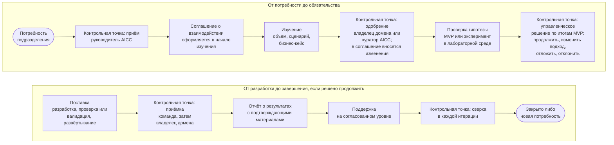

```yaml
source: portal/content/en/about/how-we-work.md
source_sha256: 8a7025fbdc0e8532779472f41e9cb5160922544709e7d6e769e183fc1acf4fb3
translation_status: reviewed
```

# Как мы работаем

AICC работает так же, как консультационное подразделение. Подразделение обращается с потребностью; AICC принимает её, изучает, принимает на себя обязательства, проверяет гипотезу на MVP, разрабатывает решение и поддерживает его. Каждый шаг оставляет запись и управленческое решение, которые видит подразделение. Над чем работает AICC, определяется при управлении портфелем. Разработка ведётся небольшими шагами в едином ритме работы; качество и контроль встроены в поток работ, а не следуют за ним.

## 1. Ход взаимодействия с заказчиком

1.1. На рисунке 1 показан ход взаимодействия с заказчиком от первого обращения до завершения: контрольная точка на каждом шаге и лицо, которое принимает в ней решение.



Рисунок 1: ход взаимодействия с заказчиком и его контрольные точки.

1.2. AICC принимает обязательства в соглашении о взаимодействии и исполняет их с приложением усилий в разумных пределах, исходя из имеющихся у него возможностей. Подразделение-заказчик обязательств не принимает; то, на что AICC рассчитывает со стороны подразделения, фиксируется как допущение. Каждая сторона вправе по окончании итерации завершить взаимодействие с заказчиком или изменить его направление. Шаги, обязательства и уровни поддержки полностью изложены на странице «Порядок взаимодействия с AICC».

## 2. Два режима работы в едином портфеле

2.1. Текущие работы — небольшие повторяющиеся запросы подразделения, которые выполняются в пределах одной итерации: документ, автоматизация, представление данных, обучение, оценка. Такая работа оформляется как Feature в составе постоянной инициативы своего направления услуг. Руководитель AICC принимает её в работу на еженедельном обзоре в пределах WIP-лимитов после того, как владелец домена одобрил применение для соответствующего класса данных. Поддержка оказывается только по запросу. Отдельные паспорт инициативы, соглашение о взаимодействии и отчёт о результатах для неё не оформляются (пп. 4.7–4.9 Бизнес-модели).

2.2. Любая другая работа оформляется как инициатива: комплект нормативных документов, база знаний, программный компонент, испытание. Для неё готовятся бизнес-кейс и MVP, а решения по ней принимаются в четырёх циклах управления портфелем в пределах лимита инициатив в работе.

2.3. Оба режима начинаются с единого приёма обращений и оставляют записи, которых требует работа. Режим определяет глубину изучения и число контрольных точек, но не требования к качеству работы.

## 3. Поставка в едином ритме работы

3.1. Работа ведётся по программным инкрементам (PI) продолжительностью в квартал и итерациям продолжительностью в месяц, с фиксированными датами. На планировании итерации команда отбирает Features, разрабатывает их в пределах WIP-лимитов и показывает результат на ревью и демонстрации итерации, где владелец продукта принимает каждую Feature.

3.2. Решение проходит проверку или валидацию в объёме, соответствующем его категории риска, после чего его принимают владелец продукта, руководитель AICC и владелец домена (п. 7.3 Модели жизненного цикла решений): владелец продукта принимает каждую Feature, руководитель AICC проводит окончательную приёмку от имени команды до допуска первых пользователей, а владелец домена как заказчик принимает работающее решение. Проверка и валидация не являются приёмкой. Выпуск для пользователей за пределами круга первых пользователей — отдельное управленческое решение.

3.3. Эксперимент проводится в лабораторной среде на выгрузках с доступом только для чтения в течение установленного числа итераций. По истечении тайм-бокса он выносится на рассмотрение: эксперимент принимают, фиксируют выводы по его итогам и закрывают, оформляют предложение либо эксперимент отклоняют (пп. 8.1 и 8.13 Модели жизненного цикла решений).

## 4. После поставки

4.1. Продукт передаётся потребителю, и AICC поддерживает его по запросу. Сервис, который эксплуатирует AICC, после выпуска проходит шаги обслуживания от «Допущен» до «Передан» или «Выведен из эксплуатации». Он эксплуатируется в соответствии с практиками эксплуатации сервисов, и на каждом рассмотрении оцениваются четыре его сигнала: уровень обслуживания, инциденты, использование и затраты (пп. 8.4 и 8.8 Модели жизненного цикла решений). У каждого решения есть категория риска, запись в реестре AI и владелец.

## 5. Контроль за деятельностью подразделения

5.1. Деятельность AICC контролируется посредством пяти циклов управления и каталога контрольных процедур. AICC подотчётен куратору AICC: руководитель AICC ежеквартально представляет квартальный отчёт, а куратор AICC вправе вынести этот отчёт или предложение масштаба Банка на рассмотрение Комитета Совета директоров или Совета директоров. Контрольные функции проводят валидацию и вправе остановить работу, а внутренний аудит проводит независимую оценку.

## 6. Разделы для дальнейшего изучения

6.1. Модель обслуживания и порядок взаимодействия описаны в разделе «Услуги». Как категории работ поступают в воронку и как принимаются решения по инициативам, описано в разделе «Портфель». Как создаются решения, как проводится эксперимент, как работает и эксплуатируется сервис, описано в разделе «Поставка». Как контролируется деятельность подразделения, описано в разделе «Управление».
