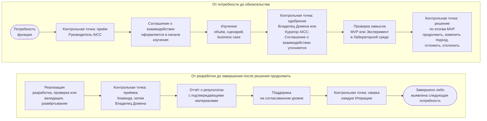

```yaml
source: portal/content/en/about/how-we-work.md
source_sha256: 305ffdcca41ad9d48f5658795f88d3b531c93a7fbadca30893e440d49d78eced
translation_status: reviewed
```

# Как мы работаем

AICC работает как консультационное подразделение. Функция обращается с потребностью; AICC принимает её, изучает, принимает обязательства, проверяет замысел, разрабатывает результат и обеспечивает поддержку. На каждом шаге остаются запись и решение, доступные функции. Портфель определяет, над чем работает AICC. Реализация ведётся небольшими шагами в едином ритме; обеспечение качества и контроль встроены в процесс работы.

## 1. Процесс взаимодействия

1.1. На рисунке 1 показан процесс Взаимодействия с заказчиком от первого обращения до завершения с контрольной точкой на каждом шаге и лицом, принимающим в ней решение.



Рисунок 1: процесс Взаимодействия с заказчиком и его контрольные точки.

1.2. AICC принимает обязательства в Соглашении о взаимодействии с приложением максимально возможных усилий в пределах доступных ему возможностей; функция не принимает обязательств, а условия со стороны функции, на которые рассчитывает AICC, записываются как Допущения. Любая сторона может завершить Взаимодействие с заказчиком или изменить его направление по окончании Итерации. На странице «Как взаимодействовать с AICC» полностью изложены шаги, обязательства и уровни поддержки.

## 2. Два режима работы в одном Портфеле

2.1. Текущие работы — это небольшой повторяющийся запрос функции, выполняемый в пределах одной Итерации: документ, автоматизация, представление данных, обучение, оценка. Он оформляется как Функциональность в рамках Постоянной инициативы соответствующего направления услуг. Руководитель AICC принимает его на Еженедельном обзоре в пределах WIP limits после одобрения Владельцем Домена использования для соответствующего класса данных. Поддержка предоставляется только по запросу. Отдельные Паспорт инициативы, Соглашение о взаимодействии и Отчёт о результатах не требуются (Бизнес-модель 4.7–4.9).

2.2. Любая иная работа является Инициативой: комплект нормативных документов, база знаний, программный механизм, пробное применение. Для неё определяются business case и MVP, а решения принимаются в рамках четырёх циклов управления портфелем с соблюдением лимита Инициатив в состоянии «В работе».

2.3. Оба режима проходят через единый приём запросов и оставляют записи, необходимые для данной работы; режим определяет глубину изучения и число контрольных точек, но не стандарт выполнения работы.

## 3. Реализация в едином ритме

3.1. Работа ведётся в Программных инкрементах продолжительностью один квартал и Итерациях продолжительностью один месяц с фиксированными датами. Команда выбирает Функциональности на Планировании Итерации, разрабатывает их в пределах WIP limits и демонстрирует результат на Обзоре и демонстрации Итерации, где владелец продукта принимает каждую Функциональность.

3.2. Решение проходит проверку или валидацию соразмерно своей Категории риска, затем его принимают владелец продукта, Руководитель AICC и Владелец Домена (Модель жизненного цикла решений 7.3): владелец продукта принимает каждую Функциональность, Руководитель AICC даёт окончательную приёмку от Команды перед допуском первых пользователей, а Владелец Домена принимает работающее Решение как заказчик. Проверка или валидация не является приёмкой; выпуск для более широкого круга пользователей — отдельное решение.

3.3. Эксперимент проводится в Лабораторной среде на выгрузках только для чтения в течение заданного числа Итераций. По истечении установленного срока он выносится на рассмотрение: его принимают вместе с извлечёнными уроками и закрывают, оформляют Предложение либо отклоняют (Модель жизненного цикла решений 8.1, 8.13).

## 4. После реализации

4.1. Продукт передаётся своему потребителю и поддерживается по запросу. Сервис, эксплуатируемый AICC, после выпуска проходит шаги от «Допущен» до «Передан» или «Выведен из эксплуатации». Его эксплуатация ведётся в соответствии с установленными практиками; при каждом обзоре рассматриваются четыре сигнала: уровни обслуживания, инциденты, использование и затраты (Модель жизненного цикла решений 8.4, 8.8). Для каждого Решения определены Категория риска, запись в Реестре AI и владелец.

## 5. Как осуществляется контроль подразделения

5.1. Контроль AICC осуществляется через пять контрольных циклов и каталог контрольных процедур. Руководитель AICC отчитывается каждый квартал посредством Квартального отчёта; Куратор AICC представляет его Комитету Совета директоров; Контрольные функции проводят Валидацию и вправе остановить работу; внутренний аудит даёт независимую оценку с предоставлением уверенности.

## 6. Где читать далее

6.1. Раздел «Услуги» описывает модель услуг и порядок взаимодействия. Раздел «Портфель» описывает, как категории работ попадают в воронку и как принимаются решения по Инициативам. Раздел «Поставка» описывает разработку Решений, проведение Экспериментов, жизненный цикл и эксплуатацию Сервиса. Раздел «Управление и надзор» описывает контроль подразделения.
