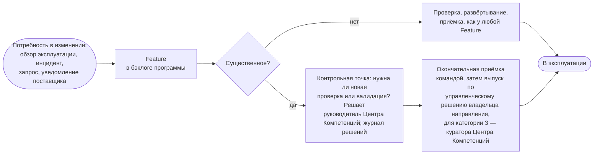

```yaml
source: portal/content/en/delivery/life-cycle-management.md
source_sha256: b1539ce1c7c5cc22ac613b00dc0287ea6116a40128a0935a075e306ef2f07184
translation_status: reviewed
```

# Управление жизненным циклом

Работа над решением не заканчивается выпуском. Разработка и внедрение решения считаются завершёнными, когда выпущено его первое развёртывание, и с этого момента у решения своя жизнь, которая зависит от его типа: у него есть ответственный, уровень поддержки, обзор на каждой итерации, изменения, которые проверяются так же, как любая Feature, и вывод из эксплуатации, столь же продуманный, как выпуск. В этой части кратко описана жизнь решения после выпуска; подробнее её раскрывают три страницы этого раздела.

## 1. Три типа решений

| Тип | Кто отвечает на этапе пост-внедрения | Стадии пост-внедрения | Завершение |
| --- | --- | --- | --- |
| Сервис | Центр Компетенций — на протяжении всего жизненного цикла, на основании бизнес-кейса, в котором указаны эксплуатационные затраты и правило вывода из эксплуатации; приёмку и обзор проводит владелец направления, а для сервиса, охватывающего несколько направлений, — куратор Центра Компетенций | «Эксплуатация», «Развитие», «Вывод из эксплуатации» с детализацией по шагам обслуживания; новая функциональность поступает в виде Capabilities и Features | Выведен из эксплуатации, передан IT-функции Банка или отменён |
| Продукт | Переданная версия принадлежит потребителю; Центр Компетенций поддерживает её по запросу | «Передача», «Поддержка», «Пересмотр» через бэклог портфеля, «Вывод из эксплуатации» для данного потребителя; если у продукта появляется второй потребитель или запросы повторяются, на его основе создаётся сервис — новое решение с собственным бизнес-кейсом | Выведен из эксплуатации для данного потребителя |
| Эксперимент | Пока нет: эксперимент ограничен по времени установленным числом итераций и завершается предложением; если направления нет, приёмку проводит куратор Центра Компетенций | «Испытание», «Предложение», «Передача» | Принят с извлечёнными уроками и закрыт, оформлено предложение или отклонён; если получатель принимает передачу, эксперимент закрывается, а Центр Компетенций контролирует его как внедрённое решение |

1.1. Фазы взаимодействия с заказчиком соотносятся с жизненным циклом так: изучение соответствует проработке инициативы, подтверждение осуществимости — эксперименту или первым Features решения, разработка — нахождению Capabilities и Features в работе, поддержка — жизни решения на этапе пост-внедрения.

## 2. Эксплуатация, поддержка и изменение

2.1. Эксплуатация действующего решения — это цикл. Уровень поддержки и мониторинг устанавливаются при выпуске; решение работает, по нему обрабатываются запросы и инциденты; на каждом ревью и демонстрации итерации владелец направления рассматривает данные мониторинга, инциденты, использование и уведомления поставщиков; по итогам обзора в бэклог вносится изменение, повторная проверка или вывод из эксплуатации. Запросы и инциденты поступают через систему Service Management по классам обслуживания; сбой, при котором решение недоступно, регистрируется в системе управления инцидентами Банка, а инцидент AI после его устранения разбирается. Изменение выпущенного решения оформляется как Feature, проверяется и развёртывается так же, как любая Feature. Существенное изменение — модели, поставщика, класса данных, степени автономности или любого фактора риска, определяющего категорию риска, — проходит повторную проверку, если так решит руководитель Центра Компетенций, и выпускается в том же порядке, что и первое развёртывание.



Рисунок 1: цикл изменения выпущенного решения.

## 3. Вывод из эксплуатации и передача

3.1. Прежде чем решение будет закрыто как выведенное из эксплуатации, отзываются права доступа и блокируются учётные записи пользователей, данные и журналы сохраняются или удаляются в соответствии с правилами хранения Банка, запись в реестре AI-решений отмечается как выведенная из эксплуатации, а владелец направления — для сервиса, охватывающего несколько направлений, куратор Центра Компетенций — одобряет вывод. Сервис, который целесообразно эксплуатировать силами Банка в масштабе Банка, Центр Компетенций не масштабирует: сервис передаётся IT-функции Банка на основании предложения, в котором назван получатель, и закрывается как переданный, когда получатель принимает передачу (п. 8.11 Модели жизненного цикла решений).

## 4. Подробное описание

4.1. Жизнь решения после выпуска подробно описана на трёх страницах этого раздела: «Жизненный цикл сервиса» — семь шагов обслуживания, которые проходит сервис, с вопросом, сигналами, действием и контрольной точкой для каждого шага; «Эксплуатация сервисов» — практики работы с запросами, инцидентами, проблемами, изменениями, знаниями, уровнями обслуживания, эксплуатационными затратами и поставщиками в масштабе небольшого подразделения, с классами обслуживания и четырьмя сигналами; «Workflow эксперимента» — шесть шагов испытания и правила лабораторной среды, в которой проводится эксперимент. Правила для всех трёх страниц установлены разделом 8 Модели жизненного цикла решений.

## 5. Источник правил

Раздел 8 Модели жизненного цикла решений; пункт 3.4 и раздел 5 Политики применения AI; пункт 4.2 Бизнес-модели; пункты 4.2 и 4.4 Операционной модели.
