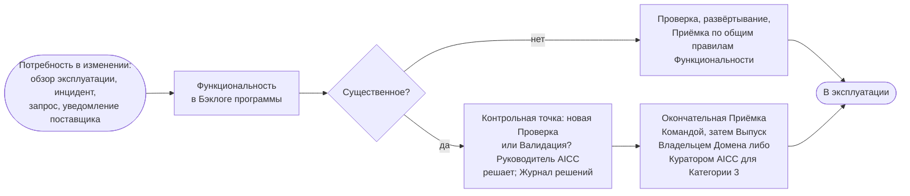

```yaml
source: portal/content/en/delivery/life-cycle-management.md
source_sha256: 9ab9027f007035cb15ae485f9586ce2ce5a3cb9ce1e4d5ef1b403aae5007e2ba
translation_status: reviewed
```

# Управление жизненным циклом

Поставка не заканчивается Выпуском. Решение считается поставленным при Выпуске первого развёртывания; далее оно имеет собственный жизненный цикл в соответствии с типом: владельца, уровень поддержки, обзор на каждой Итерации, изменения с проверкой по правилам Функциональности и вывод из эксплуатации, столь же осознанный, как Выпуск. Эта часть кратко описывает жизнь после Выпуска; три страницы раздела раскрывают её подробнее.

## 1. Три типа

| Тип | Владелец после поставки | Стадии после поставки | Завершение |
| --- | --- | --- | --- |
| Сервис | AICC на протяжении всего жизненного цикла, с business case, указывающим затраты на эксплуатацию и Правило вывода из эксплуатации; Приёмку и обзор проводит Владелец Домена, а для Сервиса нескольких Доменов — Куратор AICC | Эксплуатация, Развитие, Вывод из эксплуатации с детализацией в Шаги обслуживания; новые возможности поступают как Функциональные возможности и Функциональности | Выведен из эксплуатации, передан IT-функции Банка либо отменён |
| Продукт | Потребитель владеет поставленной версией; AICC поддерживает её по запросу | Передача, Поддержка, Пересмотр через Бэклог портфеля, Вывод из эксплуатации у данного потребителя; второй потребитель или повторяющиеся запросы приводят к созданию Сервиса — нового Решения с собственным business case | Выведен из эксплуатации у данного потребителя |
| Эксперимент | Пока отсутствует: ограничен указанным числом Итераций, завершается Предложением; при отсутствии Домена Приёмку осуществляет Куратор AICC | Испытание, Предложение, Передача | Принят с уроками и закрыт, оформлено Предложение либо отклонён; после Приёмки Передачи Получателем закрыт и находится под надзором как Внедрённое решение |

1.1. Фазы Взаимодействия с заказчиком соотносятся с жизненным циклом: изучение — Проработка Инициативы; подтверждение осуществимости — Эксперимент или первые Функциональности Решения; поставка — состояние «В работе» Функциональных возможностей и Функциональностей; поддержка — жизнь Решения после поставки.

## 2. Эксплуатация, поддержка и изменение

2.1. Эксплуатация действующего Решения — цикл: уровень поддержки и мониторинг устанавливаются при Выпуске; Решение работает, обслуживает запросы и инциденты; Владелец Домена рассматривает мониторинг, инциденты, использование и уведомления поставщиков на каждом Обзоре и демонстрации Итерации; обзор инициирует изменение, повторную Проверку или вывод из эксплуатации через бэклог. Запросы и инциденты поступают через Service Management по Классам обслуживания; недоступность передаётся в управление инцидентами Банка, а Инцидент AI затем разбирается. Изменение выпущенного Решения является Функциональностью и проверяется и развёртывается по общим правилам. Существенное изменение модели, поставщика, класса данных, автономности или любого признака Категории риска повторно проверяется по решению Руководителя AICC и выпускается в порядке первого развёртывания.



Рисунок 1: цикл изменения выпущенного Решения.

## 3. Вывод из эксплуатации и Передача

3.1. До закрытия Решения как выведенного из эксплуатации удаляются доступ и учётные данные, данные и журналы сохраняются или удаляются по правилам хранения Банка, запись Реестра AI отмечается как выведенная из эксплуатации; Владелец Домена, а для Сервиса нескольких Доменов — Куратор AICC, одобряет закрытие. Сервис, который Банк должен эксплуатировать в масштабе, не масштабируется силами AICC: он передаётся IT-функции Банка по Предложению с указанным Получателем и закрывается как переданный после Приёмки Передачи Получателем (Модель жизненного цикла решений 8.11).

## 4. Где приведены подробности

4.1. Три страницы этого раздела подробно описывают жизнь после Выпуска: «Жизненный цикл Сервиса» — семь Шагов обслуживания с вопросом, сигналами, действием и условием перехода для каждого; «Эксплуатация Сервисов» — практики запросов, инцидентов, проблем, изменений, знаний, уровней обслуживания, затрат на эксплуатацию и поставщиков в масштабе небольшого подразделения, с Классами обслуживания и Четырьмя сигналами; «Workflow Эксперимента» — шесть шагов Испытания и правила Лабораторной среды. Правила для всех трёх устанавливает Модель жизненного цикла решений, раздел 8.

## 5. Источник правил

Модель жизненного цикла решений, раздел 8; Политика применения AI 3.4 и раздел 5; Бизнес-модель 4.2; Операционная модель 4.2 и 4.4.
