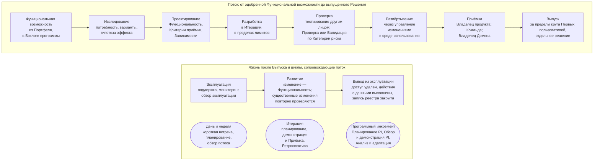

```yaml
source: portal/content/en/delivery/overview.md
source_sha256: 93149def7548b8ccc062e481c59f310e1d1f4b96eeb4e5cba676f454a775f59c
translation_status: reviewed
```

# Поставка

Поставка — это превращение одобренной идеи в работающее Решение для функции, а затем его поддержание, изменение и вывод из эксплуатации. AICC поставляет небольшими шагами в фиксированном ритме: работа видима и ограничена, качество обеспечивается по ходу потока, на каждом шаге есть решение и запись. Курс объясняет метод в десяти частях для читателя, впервые знакомящегося с гибкой поставкой в масштабе; Модель жизненного цикла решений устанавливает правила и имеет приоритет.

## 1. Общая схема

1.1. Рисунок 1 показывает поставку Решения от начала до конца: от одобренной Портфелем Функциональной возможности до используемого Решения и сопровождающих его циклов.



Рисунок 1: поставка от начала до конца, поток и циклы.

1.2. Текущие работы следуют порядку Модели жизненного цикла решений 3.1 и 5.2: Функциональность находится непосредственно в составе одобренной Постоянной инициативы и допускается на Еженедельном обзоре в пределах лимитов текущей Итерации. В ней фиксируются заказчик, Критерии приёмки, Зависимости, поставка и Приёмка Владельцем продукта. Для результата в виде документа или обучения сохраняются свидетельства поставки и Приёмки; контрольные точки Решения, Валидации, Выпуска и изменения производственной среды применяются, когда работа включает Решение или развёртывание в производственной среде.

## 2. Для чего нужна поставка

2.1. Портфель определяет, что стоит делать; поставка реализует это, сохраняя смысл решения. Её задача — превратить гипотезу в работающее программное обеспечение и практику функции, рано проверить гипотезу, обеспечить безопасность Банка и действовать в ритме, который функции могут учитывать в планах. Для подразделения из нескольких человек метод важнее, чем для крупного: ритм, лимиты и контрольные точки позволяют трём сотрудникам поставлять результаты без чрезвычайных усилий и неожиданностей.

2.2. Принципы Модели жизненного цикла решений выражают это в восьми положениях: делать работу видимой, ограничивать незавершённую работу и принимать её по мере освобождения ресурсов; поставлять небольшими шагами, испытывать, измерять и затем масштабировать; ставить ценность на первое место; планировать в ритме, где квартальный план выражает намерение, а не обещание; обеспечивать качество в процессе; принимать решения там, где известны факты; делать Зависимости видимыми и управлять ими как работой; непрерывно улучшать.

## 3. Отраслевая практика

3.1. Метод представляет бережливую и гибкую практику поставки в масштабе, адаптированную к небольшому подразделению банка: уровни работы в форме гипотез с Критериями приёмки; фиксированный ритм, синхронизирующий планирование, поставку и обзор; Канбаны с лимитами; доска Зависимостей; последовательность от исследования до Выпуска по запросу с разделением Развёртывания и Выпуска; встроенное качество; мероприятия планирования, демонстрации и улучшения; измерение потока вместо трудозатрат. Практика описана в [Отраслевой базе знаний](../reference/industry-body-of-knowledge.md).

3.2. Отличия модели Банка от распространённой формы обусловлены масштабом и регулированием: одна Команда вместо нескольких, месячная Итерация вместо двухнедельной, Неделя инноваций и планирования, включающая Ежеквартальное Управляющее совещание, Облегчённый режим при численности Команды не более трёх человек, Проверка или Валидация лицом, не являющимся разработчиком, соразмерно Категории риска в составе шага «Проверка».

## 4. Как читать курс

4.1. Курс даёт обзор: каждая часть кратко раскрывает один аспект метода и показывает его на схеме. Подробности приведены на следующих страницах раздела: Модель жизненного цикла решений устанавливает правила; Схемы процессов и Руководства по поставке услуг и ритму работы пошагово описывают потоки, мероприятия и записи; «Схема процесса Эксперимента», «Жизненный цикл Сервиса» и «Эксплуатация Сервисов» подробно раскрывают жизнь Решения; «Показатели поставки» приводит определение и формулу каждого показателя.
