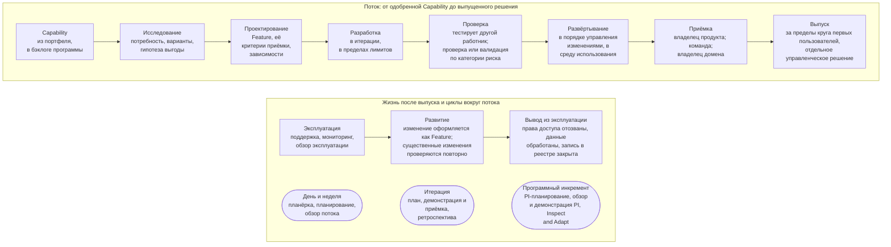

```yaml
source: portal/content/en/delivery/overview.md
source_sha256: 93149def7548b8ccc062e481c59f310e1d1f4b96eeb4e5cba676f454a775f59c
translation_status: reviewed
```

# Поставка

Поставка — это путь, по которому одобренная идея становится работающим решением в распоряжении подразделения, а затем это решение сопровождается, изменяется и выводится из эксплуатации. AICC разрабатывает и внедряет решения небольшими шагами в фиксированном ритме: работа видна всем и ограничена лимитами, качество встроено в процесс, а не контролируется в конце, а каждый шаг завершается управленческим решением и записью. Курс излагает метод в десяти частях — так, как его нужно объяснить читателю, который впервые знакомится с гибкой разработкой в масштабе. Правила устанавливает Модель жизненного цикла решений; при расхождении применяется она.

## 1. Общая схема

1.1. На рисунке 1 показана поставка решения от начала до конца: от Capability, одобренной в портфеле, до используемого решения, а также циклы, которые сопровождают этот поток.



Рисунок 1: поставка от начала до конца — поток и циклы.

1.2. Текущие работы проходят по маршруту, установленному пунктами 3.1 и 5.2 Модели жизненного цикла решений: Feature находится непосредственно в составе одобренной постоянной инициативы и допускается в работу на еженедельном обзоре в пределах лимитов текущей итерации. В Feature фиксируются заказчик, критерии приёмки, зависимости, передача результата и приёмка владельцем продукта. Для результата в виде документа или обучения сохраняются подтверждающие материалы о передаче и приёмке; контрольные точки решения, валидации, выпуска и изменения промышленной среды применяются, если работа включает решение или развёртывание в промышленной среде.

## 2. Назначение поставки

2.1. Что стоит делать, определяется при управлении портфелем; поставка воплощает это, не отступая от принятого управленческого решения. Её задача — превратить гипотезу в работающее программное обеспечение и работающую практику подразделения, как можно раньше выяснить, подтверждается ли гипотеза, сохранить при этом безопасность Банка и работать в ритме, под который подразделения могут планировать свою работу. Для подразделения из нескольких человек метод важнее, чем для крупного: именно ритм, лимиты и контрольные точки позволяют трём работникам выполнять работу без авралов и без неожиданностей.

2.2. В Модели жизненного цикла решений это выражено восемью принципами: визуализировать работу, ограничивать объём незавершённой работы и брать новую работу по мере освобождения; работать небольшими шагами — проверять гипотезу, измерять результат и только затем масштабировать; ставить ценность на первое место; планировать в установленном ритме, причём квартальный план фиксирует намерения, а не обязательство по объёму; встраивать качество в процесс; принимать управленческие решения там, где известны факты; визуализировать зависимости и управлять ими как работой; непрерывно совершенствоваться.

## 3. Отраслевая практика

3.1. Метод представляет собой бережливую гибкую практику разработки в масштабе, адаптированную к небольшому подразделению банка: работа разделена на уровни, и каждый элемент сформулирован как гипотеза с критериями приёмки; фиксированный ритм синхронизирует планирование, выполнение работы и обзор; используются канбан-доски с лимитами и доска зависимостей; конвейер ведёт от исследования до выпуска по требованию, причём развёртывание и выпуск разделены; качество встроено в процесс; мероприятия служат планированию, демонстрации и улучшению; измеряется поток, а не трудозатраты. Практика описана в [отраслевой базе знаний](../reference/industry-body-of-knowledge.md).

3.2. Отличия модели Банка от распространённой формы объясняются масштабом и регулированием: одна команда вместо нескольких; итерация длиной в месяц вместо двух недель; неделя инноваций и планирования, на которую приходится и ежеквартальное управляющее совещание; облегчённый режим, пока в команде не более трёх человек; проверка или валидация лицом, не участвовавшим в разработке, соразмерно категории риска — она включена в стадию «Проверка».

## 4. Структура курса

4.1. Курс даёт общий обзор: каждая часть в нескольких строках и на одном рисунке описывает один аспект метода. Подробности приведены на следующих страницах раздела. Правила устанавливает Модель жизненного цикла решений; workflows и руководства по поставке услуг и ритму работы пошагово показывают потоки, мероприятия и записи; страницы «Workflow эксперимента», «Жизненный цикл сервиса» и «Эксплуатация сервисов» подробно описывают жизнь решения; страница «Показатели поставки» приводит определение и формулу каждого показателя.
