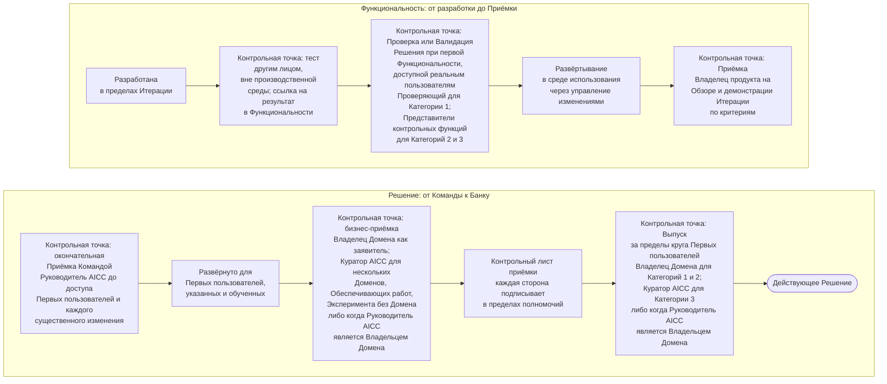

```yaml
source: portal/content/en/delivery/quality-verification-and-release.md
source_sha256: 222e832ad4b7510b4d0bc95cceb2d7692d9f125581305d913abb08917b505cbf
translation_status: reviewed
```

# Качество, Проверка и Выпуск

Качество обеспечивается на протяжении потока поставки. Каждую Функциональность до развёртывания тестирует лицо, не являющееся разработчиком; каждое Решение до доступа к реальным пользователям или данным проходит Проверку или Валидацию соразмерно Категории риска; Приёмка проводится на трёх уровнях по письменным критериям; Выпуск за пределы круга Первых пользователей — отдельное решение с подписанным контрольным листом. Эта часть описывает контрольные точки по порядку и основания каждой.

## 1. Последовательность контрольных точек



Рисунок 1: контрольные точки качества, Приёмки и Выпуска.

## 2. Контрольные точки кратко

2.1. Каждая Функциональность и MVP до развёртывания тестируются лицом, не являющимся разработчиком, вне производственной среды; ссылка на результат помещается в Функциональность. Проверка для Категории риска 1 и Валидация Представителями контрольных функций для Категорий риска 2 и 3 относятся к Решению и выполняются при первой Функциональности, достигающей реальных пользователей или данных. Для Категорий риска 2 и 3 Валидация включает проверку безопасности в отношении специфических атак на ИИ. AICC не проводит Валидацию собственной работы.

2.2. Приёмка проводится на трёх уровнях по письменным критериям с указанием лица и даты: Владелец продукта принимает каждую Функциональность и Функциональную возможность на Обзоре и демонстрации Итерации; Руководитель AICC проводит окончательную Приёмку Командой до предоставления Решения Первым пользователям и перед каждым существенным изменением; заявитель — Владелец Домена либо Куратор AICC, когда Руководитель AICC является Владельцем Домена, — оценивает работающее Решение, развёрнутое для Первых пользователей. Три вопроса задаются лицам, уполномоченным на них ответить: выполняет ли Функциональность записанные требования; достаточно ли безопасно и полно Решение для предоставления людям; решает ли оно задачу, с которой обратилась функция.

2.3. Развёртывание и Выпуск — разные действия. Функциональность развёртывается в среде использования после тестирования и Проверки или Валидации через управление изменениями Банка. Выпуск за пределы круга Первых пользователей — отдельное решение Владельца Домена для Категорий риска 1 и 2, Куратора AICC для Категории риска 3 либо когда Руководитель AICC является Владельцем Домена. Решение принимается после подписания Контрольного листа приёмки каждой стороной в пределах полномочий; невыполненный пункт останавливает Выпуск. Функциональности движутся в темпе Команды; Банк вводит ценность в использование в темпе принятия своих решений.

2.4. Прохождение контрольных точек обеспечивают практики: критерии до начала работы, небольшие Функциональности, интеграция по ходу работы, Критерии завершённости с тестом, развёртыванием и записью, показатели качества на Еженедельном обзоре и Обзоре и демонстрации Итерации. Неудовлетворительный показатель — проблема для Анализа и адаптации, а не основание добавлять контрольную точку. Модель жизненного цикла решений, раздел 7, полностью устанавливает контрольные точки, Принятое ограничение для небольшой Команды и компенсирующие контрольные процедуры; Руководство по поставке услуг указывает, кто принимает решение на каждой точке.

## 3. Источник правил

Модель жизненного цикла решений, раздел 7 и пункт 8.3; Политика применения искусственного интеллекта, раздел 3; Операционная модель 4.4; шаблоны Контрольного листа приёмки и Заключения контрольной функции; Схема процесса и Руководство по поставке услуг.
